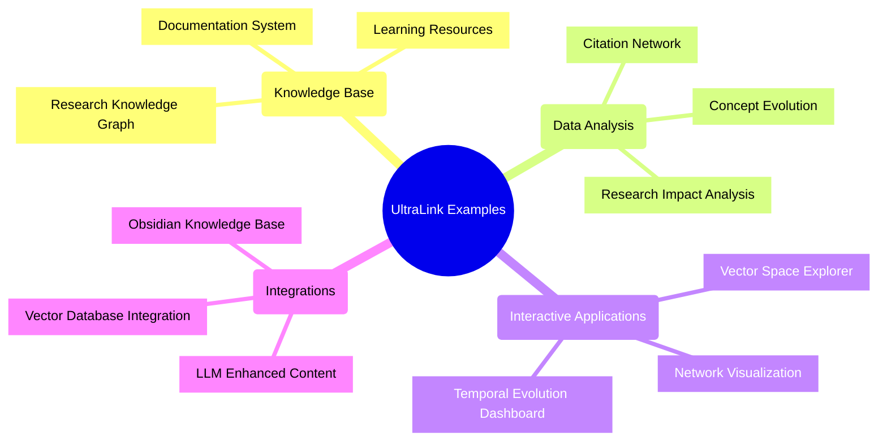

# UltraLink Examples Gallery 🖼️

This document showcases a variety of examples demonstrating how UltraLink can be used in different scenarios. Each example includes visual previews, code samples, and explanations.

## Quick Overview



## Research Knowledge Graph

A comprehensive knowledge graph for research teams, tracking papers, findings, researchers, and concepts.


### Features

- Tracks papers, researchers, findings, and concepts
- Vector embeddings for semantic relationships
- Temporal evolution of research themes
- Impact analysis for publications
- LLM-generated insights

### Code Example

```javascript
const { UltraLink } = require('ultralink');

// Create research knowledge graph
const researchKG = new UltraLink();

// Add researchers
researchKG.addEntity('alice-chen', 'researcher', {
  name: 'Alice Chen',
  expertise: ['machine-learning', 'computer-vision'],
  affiliation: 'University of Technology'
});

// Add publications
researchKG.addEntity('paper-2023', 'publication', {
  title: 'Advanced Vector Representations in Computer Vision',
  authors: ['alice-chen', 'bob-smith'],
  year: 2023,
  keywords: ['computer-vision', 'vector-embeddings', 'transformer']
});

// Add research concepts
researchKG.addEntity('vector-embeddings', 'concept', {
  name: 'Vector Embeddings',
  description: 'Numerical representations of semantic meaning in vector space'
});

// Create relationships
researchKG.addLink('paper-2023', 'vector-embeddings', 'introduces', {
  importance: 0.95,
  context: 'novel methodology'
});

researchKG.addLink('alice-chen', 'paper-2023', 'authored', {
  contribution: 'lead author',
  year: 2023
});

// Generate vector embeddings
await researchKG.generateVectors({
  entities: ['paper-2023', 'vector-embeddings'],
  model: 'text-embedding-ada-002'
});

// Create interactive dashboard
await researchKG.createDashboard({
  container: '#research-dashboard',
  views: ['network', 'vector', 'impact', 'temporal']
});
```

### Visualization Examples

#### Network View


#### Vector Space


#### Impact Analysis


## Documentation System

An interconnected documentation system with rich relationships, vector search, and interactive exploration.


### Features

- Interconnected documentation pages
- Semantic search capabilities
- Prerequisite relationships
- Interactive exploration
- Automatic relationship suggestions

### Code Example

```javascript
const { UltraLink } = require('ultralink');

// Create documentation system
const docs = new UltraLink();

// Add documentation pages
docs.addEntity('getting-started', 'doc-page', {
  title: 'Getting Started',
  content: 'Welcome to UltraLink! This guide will help you get started...',
  level: 'beginner'
});

docs.addEntity('advanced-features', 'doc-page', {
  title: 'Advanced Features',
  content: 'This guide covers advanced features of UltraLink...',
  level: 'advanced'
});

docs.addEntity('api-reference', 'doc-page', {
  title: 'API Reference',
  content: 'Complete API documentation for UltraLink...',
  level: 'reference'
});

// Add relationships
docs.addLink('getting-started', 'advanced-features', 'prerequisite_for', {
  importance: 1.0
});

docs.addLink('advanced-features', 'api-reference', 'references', {
  count: 12,
  context: 'usage examples'
});

// Generate vectors for similarity search
await docs.generateVectors();

// Create search interface
const searchResults = docs.searchByVector('How do I use advanced features?', {
  limit: 5,
  minSimilarity: 0.7
});

// Export to Obsidian knowledge base
await docs.toObsidian({
  directory: './docs-knowledge-base',
  includeRelationships: true,
  includeBacklinks: true
});
```

### Visualization Examples

#### Documentation Map


#### Learning Path


## Research Impact Analysis

Analyze and visualize the impact of research publications, citations, and influence.


### Features

- Citation network analysis
- Impact metrics calculation
- Research influence visualization
- Temporal impact tracking
- Key paper identification

### Code Example

```javascript
const { UltraLink } = require('ultralink');

// Create research impact system
const impact = new UltraLink();

// Import publication data
await impact.importData('./publications.json', {
  typeMapping: {
    paper: 'publication',
    author: 'researcher',
    venue: 'conference'
  }
});

// Generate citation network
impact.addLink('paper-001', 'paper-002', 'cites', {
  context: 'methodology',
  importance: 0.8
});

impact.addLink('paper-001', 'paper-003', 'cites', {
  context: 'results',
  importance: 0.9
});

// Calculate impact metrics
const impactResults = impact.calculateImpact({
  metrics: ['citation_count', 'h_index', 'influence_score'],
  scope: 'all',
  normalize: true
});

// Visualize impact over time
const timelineViz = impact.createTimeline({
  entity: 'researcher-001',
  metric: 'cumulative_citations',
  timeRange: ['2018', '2023'],
  granularity: 'month'
});

// Create interactive dashboard
const dashboard = impact.createDashboard({
  container: '#impact-dashboard',
  views: ['citation-network', 'impact-metrics', 'temporal-evolution']
});
```

### Visualization Examples

#### Citation Network


#### Impact Metrics


#### Temporal Evolution


## Vector Space Explorer

An interactive tool for exploring entity relationships in vector space.


### Features

- 2D/3D vector space visualization
- Interactive clustering
- Similarity search
- Dimensionality reduction
- Interactive filtering and selection

### Code Example

```javascript
const { UltraLink } = require('ultralink');

// Create vector space explorer
const vectorExplorer = new UltraLink();

// Import entities with vector embeddings
await vectorExplorer.importVectors('./vector-data.json');

// Alternatively, generate vectors
await vectorExplorer.generateVectors({
  model: 'text-embedding-ada-002',
  batchSize: 32
});

// Create interactive vector visualization
const vectorViz = vectorExplorer.createVectorVisualization({
  container: '#vector-space',
  dimensions: 3,  // 2D or 3D
  reduction: 'umap',  // or 'tsne', 'pca'
  interactive: true,
  clustering: {
    algorithm: 'kmeans',
    numberOfClusters: 5,
    interactive: true
  },
  colors: {
    scheme: 'category10',
    by: 'cluster'  // or 'type', 'custom'
  },
  controls: {
    selection: true,
    zoom: true,
    rotation: true,
    filter: true
  }
});

// Add selection handler
vectorViz.on('selection', (selectedEntities) => {
  console.log('Selected entities:', selectedEntities);
  updateDetailsPanel(selectedEntities);
});

// Run similarity search
const similar = vectorExplorer.findSimilar('entity-001', {
  minSimilarity: 0.8,
  maxResults: 10
});
```

### Visualization Examples

#### 2D Vector Space


#### 3D Vector Space


#### Clustering


## LLM Enhanced Knowledge Base

A knowledge base enhanced with LLM-generated insights, summaries, and relationship suggestions.


### Features

- LLM-generated summaries
- Relationship suggestions
- Content enrichment
- Impact assessment
- Contextual metadata

### Code Example

```javascript
const { UltraLink } = require('ultralink');

// Create an LLM-enhanced knowledge base
const knowledgeBase = new UltraLink({
  llmIntegration: true,
  llmProvider: 'openai',
  apiKey: process.env.OPENAI_API_KEY
});

// Add content
knowledgeBase.addEntity('article-001', 'article', {
  title: 'Understanding Vector Databases',
  content: 'Vector databases are specialized databases designed to store...'
});

// Generate LLM insights
const insights = await knowledgeBase.generateInsights('article-001', {
  aspects: ['key_points', 'implications', 'related_topics'],
  model: 'gpt-4',
  depth: 'comprehensive'
});

// Add insights to entity
knowledgeBase.updateEntity('article-001', {
  llm_insights: insights
});

// Extract and suggest relationships
const relationships = await knowledgeBase.extractRelationships('article-001', {
  types: ['mentions', 'compares', 'contrasts', 'builds_upon'],
  confidence: 0.7,
  bidirectional: true
});

// Review and add suggested relationships
for (const rel of relationships) {
  if (rel.confidence > 0.85) {
    knowledgeBase.addLink(rel.source, rel.target, rel.type, {
      confidence: rel.confidence,
      llm_generated: true,
      context: rel.context
    });
  }
}

// Create enhanced visualization
const enhancedViz = knowledgeBase.createVisualization({
  container: '#enhanced-kb',
  enhancedNodes: true,
  insightDisplay: 'tooltip',
  confidenceVisualization: true
});
```

### Visualization Examples

#### Enhanced Network


#### Insight Detail


## Temporal Evolution Tracking

Track and visualize how knowledge, concepts, and relationships evolve over time.


### Features

- Version history tracking
- Change visualization
- Evolution metrics
- Time-based filtering
- Animated transitions

### Code Example

```javascript
const { UltraLink } = require('ultralink');

// Create temporal tracking system
const temporal = new UltraLink({
  temporalTracking: true,
  versionStrategy: 'semantic'
});

// Initial version
temporal.addEntity('machine-learning', 'concept', {
  name: 'Machine Learning',
  description: 'A field of AI focused on algorithms that learn from data'
});

// Create initial version
temporal.createVersion('v1.0.0', {
  description: 'Initial concept definitions'
});

// Update entity in new version
temporal.updateEntity('machine-learning', {
  description: 'A field of AI focused on algorithms that learn from data and improve with experience',
  sub_fields: ['supervised', 'unsupervised', 'reinforcement']
});

// Create updated version
temporal.createVersion('v1.1.0', {
  description: 'Expanded definitions and sub-fields'
});

// Add relationships in new version
temporal.addLink('machine-learning', 'deep-learning', 'includes', {
  importance: 0.9,
  context: 'modern techniques'
});

// Create major update version
temporal.createVersion('v2.0.0', {
  description: 'Added relationships between concepts'
});

// Visualize evolution
const evolutionViz = temporal.createTemporalVisualization({
  container: '#evolution-viz',
  startVersion: 'v1.0.0',
  endVersion: 'v2.0.0',
  animation: true,
  controls: {
    playback: true,
    versionSelection: true,
    diffHighlighting: true
  }
});

// Compare versions
const diff = temporal.compareVersions('v1.0.0', 'v2.0.0', {
  detailed: true,
  includeAdditions: true,
  includeModifications: true,
  includeRemovals: true
});
```

### Visualization Examples

#### Timeline View


#### Version Comparison


#### Evolution Metrics


## Obsidian Knowledge Base Export

Export UltraLink data to an Obsidian-compatible knowledge base with rich backlinks and metadata.


### Features

- Markdown file generation
- Relationship as backlinks
- YAML frontmatter for metadata
- Vector embeddings as properties
- Graph view compatibility

### Code Example

```javascript
const { UltraLink } = require('ultralink');

// Create knowledge base
const kb = new UltraLink();

// Add content
kb.addEntity('concept-maps', 'concept', {
  name: 'Concept Maps',
  description: 'Graphical tools for organizing and representing knowledge',
  related_terms: ['knowledge graphs', 'mind maps', 'cognitive maps']
});

kb.addEntity('knowledge-graphs', 'concept', {
  name: 'Knowledge Graphs',
  description: 'A knowledge base that uses a graph-structured data model to integrate data',
  applications: ['semantic search', 'question answering', 'recommendation systems']
});

// Add relationships
kb.addLink('concept-maps', 'knowledge-graphs', 'related_to', {
  strength: 0.85,
  context: 'knowledge representation'
});

// Generate vector embeddings
await kb.generateVectors();

// Export to Obsidian
await kb.toObsidian({
  directory: './obsidian-vault',
  options: {
    frontmatter: true,
    backlinks: true,
    foldersFromTypes: true,
    includeLinkAttributes: true,
    includeVectors: true,
    graphData: true,
    templates: {
      concept: 'templates/concept-template.md'
    }
  }
});
```

### Visualization Examples

#### Obsidian Graph View


#### Obsidian Note with Metadata


## Interactive Dashboard Builder

Create customized, interactive dashboards for exploring and analyzing UltraLink data.


### Features

- Multiple visualization types
- Customizable layouts
- Interactive filtering
- Coordinated views
- Export and sharing

### Code Example

```javascript
const { UltraLink } = require('ultralink');

// Create UltraLink instance with data
const ultralink = new UltraLink();
await ultralink.importData('./research-data.json');

// Create dashboard
const dashboard = ultralink.createDashboard({
  container: '#dashboard-container',
  title: 'Research Insights Dashboard',
  layout: 'grid',  // or 'flex', 'custom'
  theme: 'light',  // or 'dark', 'custom'
  responsive: true
});

// Add network visualization
dashboard.addVisualization({
  id: 'network',
  type: 'network',
  title: 'Research Network',
  position: { row: 1, col: 1, width: 2, height: 2 },
  options: {
    layout: 'force-directed',
    nodeSize: node => node.attributes.impact * 5 || 5,
    nodeColor: node => colorByType(node.type),
    interactions: ['hover', 'click', 'zoom', 'pan']
  }
});

// Add vector space visualization
dashboard.addVisualization({
  id: 'vector-space',
  type: 'vector-space',
  title: 'Concept Space',
  position: { row: 1, col: 3, width: 2, height: 2 },
  options: {
    dimensions: 3,
    reduction: 'tsne',
    clustering: true,
    interactive: true
  }
});

// Add timeline visualization
dashboard.addVisualization({
  id: 'timeline',
  type: 'timeline',
  title: 'Research Evolution',
  position: { row: 3, col: 1, width: 4, height: 1 },
  options: {
    timeRange: ['2018', '2023'],
    events: true,
    metrics: ['publications', 'citations']
  }
});

// Add control panel
dashboard.addControl({
  id: 'filters',
  type: 'filter-panel',
  position: { row: 4, col: 1, width: 4, height: 1 },
  filters: [
    { id: 'type', label: 'Entity Type', type: 'select', options: ['all', 'researcher', 'publication', 'concept'] },
    { id: 'year', label: 'Year Range', type: 'range', min: 2018, max: 2023 },
    { id: 'impact', label: 'Min Impact', type: 'slider', min: 0, max: 10, step: 0.1 }
  ]
});

// Add coordination between views
dashboard.coordinateViews([
  { source: 'network', target: 'vector-space', type: 'selection' },
  { source: 'filters', target: 'network', type: 'filter' },
  { source: 'filters', target: 'vector-space', type: 'filter' },
  { source: 'filters', target: 'timeline', type: 'filter' }
]);

// Initialize dashboard
dashboard.initialize();
```

### Visualization Examples

#### Multi-view Dashboard


#### Interactive Filtering


## Further Examples

Explore more examples in the [examples directory](./examples/):

- **Academic Research Management**: Track research projects, publications, and collaborations
- **Technical Documentation System**: Interconnected technical documentation with dependencies and prerequisites
- **Learning Path Generator**: Create personalized learning paths based on prerequisites and goals
- **Content Recommendation System**: Recommend related content based on vector similarity
- **Knowledge Discovery Tool**: Discover hidden connections and patterns in knowledge bases
- **Collaborative Research Platform**: Platform for collaborative research with shared knowledge graphs

## How to Run Examples

1. Clone the repository:
   ```bash
   git clone https://github.com/ultralink/examples.git
   cd ultralink-examples
   ```

2. Install dependencies:
   ```bash
   npm install
   ```

3. Run an example:
   ```bash
   npm run example:research-knowledge-graph
   ```

4. View the output:
   - Open generated HTML files in your browser
   - Explore generated data files
   - Check exported formats

## Creating Your Own Examples

Use these templates as starting points for creating your own UltraLink applications:

1. [Basic Example Template](./examples/templates/basic.js)
2. [Advanced Example Template](./examples/templates/advanced.js)
3. [Dashboard Example Template](./examples/templates/dashboard.js)
4. [Full Application Template](./examples/templates/application.js)

Documentation for all examples is available in the [examples documentation](./examples/README.md). 