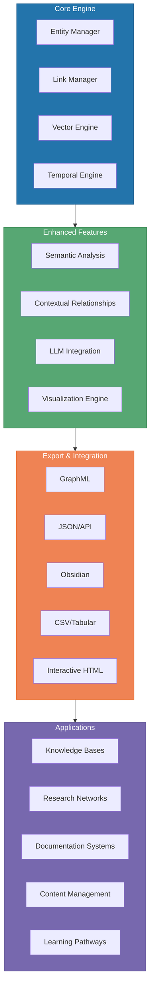
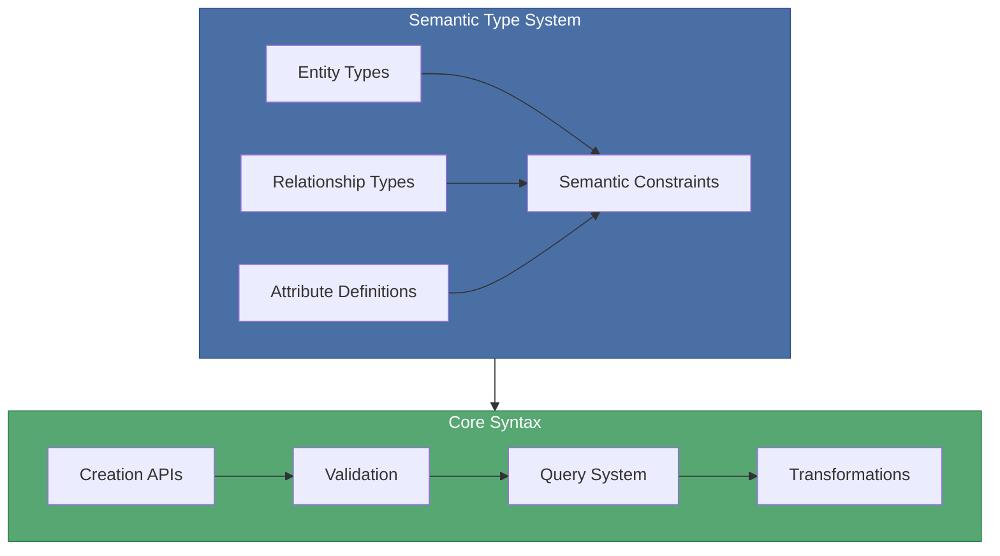
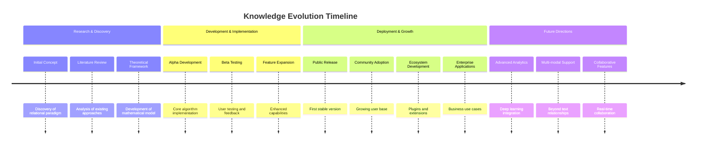
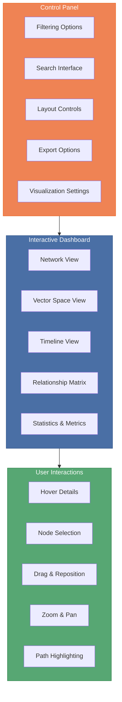
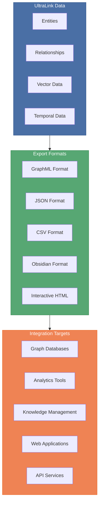
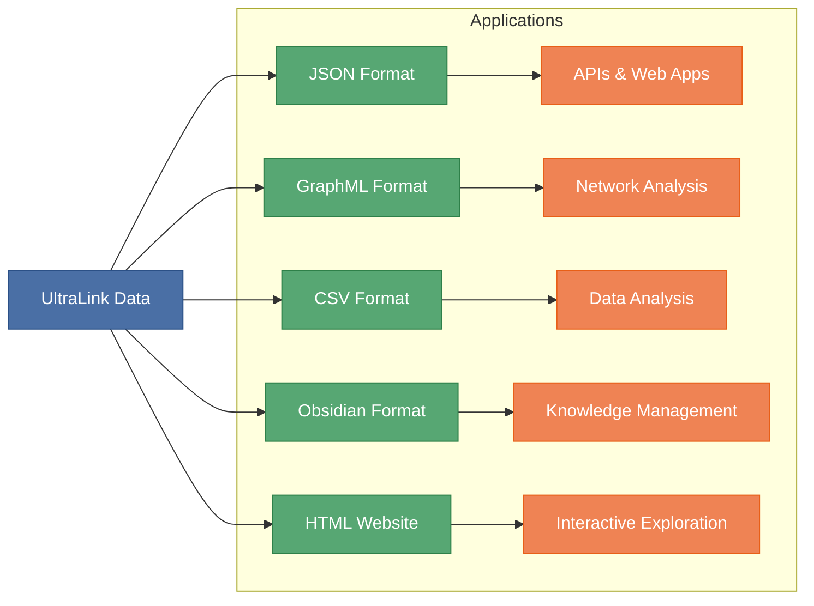

# UltraLink 🔗

<div align="center">

[](LICENSE)
[](https://www.npmjs.com/package/ultralink)
[](https://github.com/ultralink/ultralink/actions)
[](https://codecov.io/gh/ultralink/ultralink)
[](https://docs.ultralink.dev)
[](https://discord.gg/ultralink)
[](https://twitter.com/ultralinkjs)

**Beyond Hypertext: The Next Generation of Relational Content**

</div>

## 🌟 Overview

UltraLink is a revolutionary framework for managing and visualizing rich relational content with context, meaning, and evolution over time. Going beyond traditional hypertext, UltraLink enhances connections with vector embeddings, semantic understanding, temporal awareness, and interactive exploration capabilities.



## 📋 API Usage Guide

> **Important Notice**: Please refer to our comprehensive [API Usage Guide](docs/API_USAGE.md) for the correct method names and parameter orders. Some examples in the older documentation may use deprecated method names like `createEntity` and `createLink` instead of the current methods `addEntity` and `addLink`.

Key methods to be aware of:
- Use `addEntity(id, type, attributes)` to create entities
- Use `addLink(sourceId, targetId, type, attributes)` to create relationships
- Use `toJSON()`, `toCSV()`, etc. for exports (not `exportAll()`)

For a complete overview of the correct API usage, see the [API Usage Guide](docs/API_USAGE.md).

## 📚 Documentation Resources

UltraLink comes with comprehensive documentation to help you get the most out of the package:

- [API Usage Guide](docs/API_USAGE.md) - Detailed examples and patterns for using the API
- [API Structure](docs/API_STRUCTURE.md) - Visual diagrams of the API architecture
- [Visualization Guide](docs/VISUALIZATION_GUIDE.md) - How to create and customize visualizations
- [Export Formats](docs/EXPORT_FORMATS.md) - Detailed information about all export formats
- [Testing Guide](docs/TESTING.md) - How to run and extend the test suite

For installation instructions, see the [Installation Guide](INSTALLATION.md).

## �� Table of Contents

- [🌟 Overview](#-overview)
- [🚀 Key Features](#-key-features)
- [🏁 Getting Started](#-getting-started)
- [🏗️ Architecture](#-architecture)
- [🌈 Use Cases](#-use-cases)
- [📊 Interactive Dashboard](#-interactive-dashboard)
- [📲 Installation Methods](#-installation-methods)
- [💻 API Examples](#-api-examples)
- [⚙️ Configuration](#-configuration)
- [🧩 Integrations](#-integrations)
- [🔍 Advanced Features](#-advanced-features)
- [📚 Documentation](#-documentation)
- [🤝 Community & Support](#-community--support)
- [🛣️ Roadmap](#-roadmap)
- [📄 Export Formats](#-export-formats)
- [🧪 Testing & Rendering](#-testing--rendering)
- [📝 Changelog](CHANGELOG.md)
- [🔒 Security](docs/security/security.md)
- [⚙️ Installation](INSTALLATION.md)
- [🤔 FAQ](#-faq)
- [📄 License](#-license)
- [🌟 Acknowledgements](#-acknowledgements)

## 🚀 Key Features

### 📈 Beyond Simple Links
Enhance your relationships with rich context, metadata, and semantic understanding:

```mermaid
graph LR
    subgraph Relationship["Enriched Relationships"]
        direction TB
        Link1["references (0.92)"]
        Link2["contradicts (0.75)"]
        Link3["expands (0.88)"]
        Link4["supports (0.67)"]
        
        Metadata1["Created: 2023-06-15"]
        Metadata2["Author: J. Smith"]
        Metadata3["Confidence: High"]
        Metadata4["Context: Research"]
        
        Link1 --- Metadata1
        Link1 --- Metadata2
        Link2 --- Metadata3
        Link3 --- Metadata4
    end
    
    A[Entity A] -- Link1 --> B[Entity B]
    B -- Link2 --> C[Entity C]
    C -- Link3 --> D[Entity D]
    D -- Link4 --> A
    
    classDef entity fill:#4a6fa5,stroke:#2b5086,color:white
    classDef linkStyle fill:#57a773,stroke:#2e8049,color:white
    classDef metaStyle fill:#c1cefe,stroke:#9ab0fc,color:black
    
    class A,B,C,D entity
    class Link1,Link2,Link3,Link4 linkStyle
    class Metadata1,Metadata2,Metadata3,Metadata4 metaStyle
```

### 🛠️ Rich Semantic Model
UltraLink's advanced entity-relationship model provides a flexible yet powerful foundation:



UltraLink's semantic model gives you:

- **Type System**: Define entity and relationship types with validation rules
- **Rich Relationships**: Multi-dimensional connections with their own attributes
- **Semantic Validation**: Ensure knowledge integrity with automatic validation
- **Inheritance**: Support for type hierarchies and relationship inheritance
- **Inference Rules**: Derive new knowledge through semantic inference

### 🧠 Vector-based Understanding
Transform content into vector space for semantic understanding and discovery:

```mermaid
graph TD
    subgraph "Vector Space Representation"
        direction LR
        Vector["Vector Engine"]
        Embedding["Embedding Generation"]
        Clustering["Semantic Clustering"]
        Similarity["Similarity Analysis"]
        
        Vector --> Embedding
        Embedding --> Clustering
        Embedding --> Similarity
    end
    
    subgraph "Vector Applications"
        Search["Semantic Search"]
        Discovery["Content Discovery"]
        Recommendations["Recommendations"]
        Relations["Automatic Relations"]
        
        Search --> Discovery
        Discovery --> Recommendations
        Recommendations --> Relations
    end
    
    "Vector Space Representation" --> "Vector Applications"
    
    classDef blue fill:#4a6fa5,stroke:#2b5086,color:white
    classDef green fill:#57a773,stroke:#2e8049,color:white
    
    class "Vector Space Representation" blue
    class "Vector Applications" green
```

### ⏱️ Temporal Evolution
Track how knowledge, relationships, and concepts evolve over time:



### 🎨 Interactive Exploration
Explore and understand complex relationships through interactive dashboards:



### 🔄 Export & Integration
Export to multiple formats for integration with various tools and systems:



## 📄 Export Formats

UltraLink supports multiple export and rendering formats for different use cases:



Each format serves different needs:

- **JSON**: Universal data exchange format for API integration and web applications
- **GraphML**: XML-based graph format for visualization in tools like Gephi and Cytoscape
- **CSV**: Tabular format for spreadsheet analysis and database import/export
- **Obsidian**: Markdown files with wiki-links for knowledge management
- **HTML Website**: Self-contained interactive website for sharing and exploration

For complete details on all export formats, examples, and best practices, see [RENDERING_TARGETS.md](RENDERING_TARGETS.md).

## 🧪 Testing & Rendering

UltraLink includes a comprehensive test suite that verifies functionality and generates example outputs for all supported rendering formats.

### Running Tests

```bash
# Run the full test suite (excluding performance tests by default)
npm test

# Run all tests including performance tests
npm run test:all

# Run only performance tests
npm run test:performance

# View all test command options
npm run test:help

# Run specific test categories
npm run test:unit        # Unit tests only
npm run test:integration # Integration tests only
npm run test:e2e         # End-to-end tests only

# Generate all system-specific renderings
npm run test:systems

# Generate specific export format renderings
npm run test:html-website
npm run test:full-blob

# Generate all export formats for all systems
npm run test:exports
```

### Output Structure

When you run the tests, all rendering outputs are organized by system and format in the `output/` directory:

```
output/
├── systems/
│   ├── desert-ecosystem/
│   │   ├── DesertEcosystem.json
│   │   ├── DesertEcosystem.graphml
│   │   ├── csv/
│   │   │   ├── entities.csv
│   │   │   └── relationships.csv
│   │   ├── obsidian/
│   │   │   ├── saguaro.md
│   │   │   ├── kangaroo-rat.md
│   │   │   └── ...
│   │   ├── website/
│   │   │   ├── index.html
│   │   │   ├── saguaro.html
│   │   │   └── ...
│   │   └── full-blob/
│   │       ├── DesertEcosystem-full.json
│   │       └── DesertEcosystem-full-compressed.blob
│   └── research-team/
│       ├── ResearchTeam.json
│       ├── ResearchTeam.graphml
│       ├── csv/
│       │   ├── entities.csv
│       │   └── relationships.csv
│       ├── obsidian/
│       │   ├── alice.md
│       │   ├── bob.md
│       │   └── ...
│       ├── website/
│       │   ├── index.html
│       │   ├── alice.html
│       │   └── ...
│       └── full-blob/
│           ├── ResearchTeam-full.json
│           └── ResearchTeam-full-compressed.blob
```

### Custom Rendering

You can also render systems programmatically using the UltraLink API:

```javascript
const { UltraLink } = require('ultralink');
const fs = require('fs');
const path = require('path');

// Create a dataset
const ultralink = new UltraLink();
// Add entities and relationships...

// Generate all formats
const json = ultralink.toJSON({ pretty: true });
const graphml = ultralink.toGraphML({ includeAllAttributes: true });
const csv = ultralink.toCSV();
const obsidian = ultralink.toObsidian({ backlinks: true });
const htmlWebsite = ultralink.toHTMLWebsite({
  title: 'My Data Visualization',
  description: 'Interactive exploration of my data'
});
const fullBlob = ultralink.toFullBlob({ compress: true });

// Save outputs
const outputDir = path.join(__dirname, 'output');
fs.mkdirSync(outputDir, { recursive: true });

fs.writeFileSync(path.join(outputDir, 'data.json'), JSON.stringify(json, null, 2));
fs.writeFileSync(path.join(outputDir, 'data.graphml'), graphml);
fs.writeFileSync(path.join(outputDir, 'entities.csv'), csv.entities);
fs.writeFileSync(path.join(outputDir, 'relationships.csv'), csv.relationships);

// Save multi-file outputs
const obsidianDir = path.join(outputDir, 'obsidian');
fs.mkdirSync(obsidianDir, { recursive: true });
Object.entries(obsidian).forEach(([filename, content]) => {
  fs.writeFileSync(path.join(obsidianDir, `${filename}.md`), content);
});

const websiteDir = path.join(outputDir, 'website');
fs.mkdirSync(websiteDir, { recursive: true });
Object.entries(htmlWebsite).forEach(([filename, content]) => {
  fs.writeFileSync(path.join(websiteDir, filename), content);
});
```

## 🤔 FAQ

### General Questions

**Q: What makes UltraLink different from traditional hypertext?**  
A: UltraLink enhances traditional hypertext with semantic understanding, vector relationships, temporal evolution, and rich metadata. Instead of simple one-way links, UltraLink provides a comprehensive framework for modeling complex relationships with context and meaning.

**Q: Is UltraLink suitable for large-scale applications?**  
A: Yes, UltraLink is designed to scale through optimized data structures, flexible storage options, and integration with vector databases. Enterprise features for large-scale deployments are on our roadmap.

### Technical Questions

**Q: Does UltraLink require external services for vector embeddings?**  
A: UltraLink includes built-in embedding capabilities with the option to connect to external services like OpenAI or Hugging Face for enhanced performance.

**Q: Can I use UltraLink with existing data?**  
A: Yes, UltraLink provides import capabilities for various formats including CSV, JSON, GraphML, and Markdown files with link structures.

**Q: How customizable is the visualization engine?**  
A: The visualization engine is highly customizable with options for layouts, colors, node sizing, filtering, and interaction modes. Custom visualization components can also be developed.

## 📄 License

UltraLink is licensed under the [MIT License](LICENSE).

## 🌟 Acknowledgements

- Our amazing [contributors](CONTRIBUTORS.md)
- The incredible open-source community
- Research foundations in vector embeddings, graph theory, and knowledge management
- Open-source libraries that make UltraLink possible:
  - [D3.js](https://d3js.org/) for visualization
  - [TensorFlow.js](https://www.tensorflow.org/js) for vector operations
  - [GraphLib](https://github.com/dagrejs/graphlib) for graph algorithms

## 🤔 FAQ

### General Questions

**Q: What makes UltraLink different from traditional hypertext?**  
A: UltraLink enhances traditional hypertext with semantic understanding, vector relationships, temporal evolution, and rich metadata. Instead of simple one-way links, UltraLink provides a comprehensive framework for modeling complex relationships with context and meaning.

**Q: Is UltraLink suitable for large-scale applications?**  
A: Yes, UltraLink is designed to scale through optimized data structures, flexible storage options, and integration with vector databases. Enterprise features for large-scale deployments are on our roadmap.

### Technical Questions

**Q: Does UltraLink require external services for vector embeddings?**  
A: UltraLink includes built-in embedding capabilities with the option to connect to external services like OpenAI or Hugging Face for enhanced performance.

**Q: Can I use UltraLink with existing data?**  
A: Yes, UltraLink provides import capabilities for various formats including CSV, JSON, GraphML, and Markdown files with link structures.

**Q: How customizable is the visualization engine?**  
A: The visualization engine is highly customizable with options for layouts, colors, node sizing, filtering, and interaction modes. Custom visualization components can also be developed.

## 📄 License

UltraLink is licensed under the [MIT License](LICENSE).

## 🌟 Acknowledgements

- Our amazing [contributors](CONTRIBUTORS.md)
- The incredible open-source community
- Research foundations in vector embeddings, graph theory, and knowledge management
- Open-source libraries that make UltraLink possible:
  - [D3.js](https://d3js.org/) for visualization
  - [TensorFlow.js](https://www.tensorflow.org/js) for vector operations
  - [GraphLib](https://github.com/dagrejs/graphlib) for graph algorithms

## Resources and Documentation

- [📝 Documentation](docs/README.md)
- [📖 API Reference](docs/api/README.md)
- [🔗 Syntax & Semantics](docs/core-features/syntax-and-semantics.md)
- [📊 Examples](docs/examples/README.md)
- [🚀 Getting Started](docs/getting-started/README.md)
- [🔒 Security](docs/security/security.md)

## 📝 Recent Updates

### Visualization Improvements

We've significantly enhanced the visualization module with the following improvements:

- **Enhanced SVG Output**: Added style tags and improved node/edge rendering for better appearance
- **D3.js Integration**: Fixed HTML output for more reliable interactive visualizations
- **Cytoscape.js Support**: Improved HTML generation for complex network visualizations
- **Environment Compatibility**: Better support for both browser and Node.js environments
- **Error Handling**: Added graceful fallbacks for visualization generation
- **Layout Options**: Multiple layout algorithms: force-directed, grid, and radial

Check out the [Visualization Guide](examples/visualization-guide.md) and the [Visualization Example](examples/visualization-example.js) for more details.