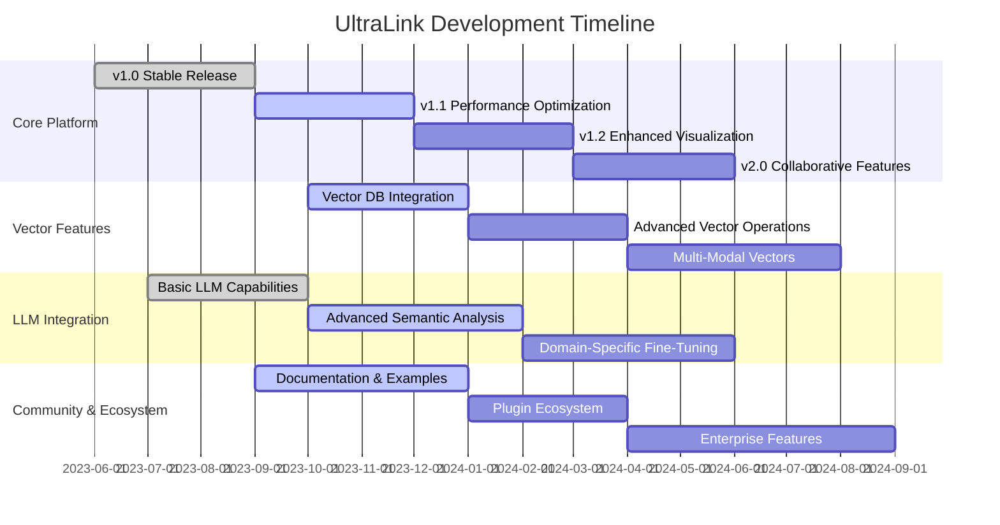
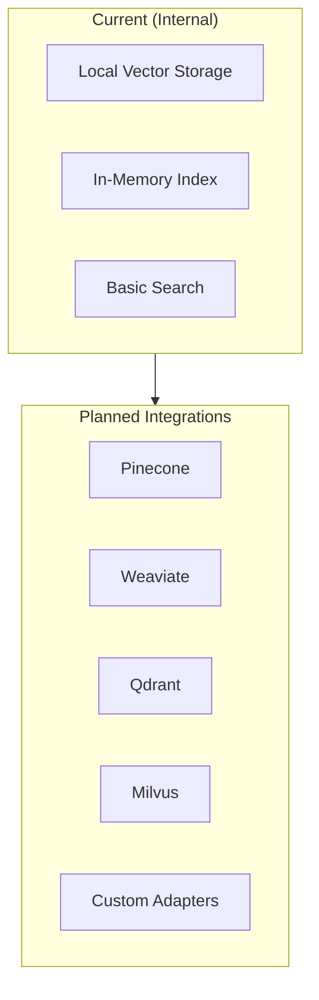
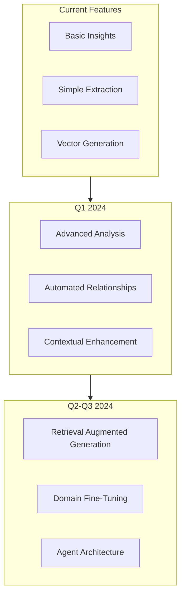

# UltraLink Development Roadmap 🗺️

This document outlines the development roadmap for UltraLink, including planned features, improvements, and strategic directions. The roadmap is organized by release milestones and priority areas.

## Vision

Our vision is to make UltraLink the definitive framework for managing and visualizing rich, contextual, relational content across multiple domains and use cases.

## Current Release (v1.0.x)

Our current stable version includes:

- ✅ Core entity and relationship management
- ✅ Basic vector embedding support
- ✅ Multiple export formats (JSON, CSV, GraphML, Obsidian)
- ✅ Initial visualization capabilities
- ✅ Documentation and examples

## Upcoming Releases

### v1.1: Performance & Optimization (Q4 2023)

Focus: Enhanced performance, scalability, and optimization.

#### Core Enhancements

- [ ] **Optimized Data Structures** - More efficient storage and retrieval
   - Custom adjacency list implementation for large graphs
   - Compressed storage options for vectors
   - Memory usage optimizations

- [ ] **Improved Indexing** - Better performance for large datasets
   - Multi-level indexing strategy
   - Customizable indexing policies
   - Background indexing for large imports

- [ ] **Query Optimization** - Faster retrieval and filtering
   - Query planner and optimizer
   - Predicate pushdown
   - Batch query processing

#### Vector Enhancements

- [ ] **Vector Compression** - Support for more efficient storage
   - Product quantization
   - Scalar quantization
   - Dimensionality reduction options

- [ ] **Optimized Similarity Search** - Faster nearest neighbor search
   - Approximate nearest neighbors (ANN)
   - HNSW index support
   - Optimized distance calculations

#### Visualization Performance

- [ ] **WebGL Rendering Improvements** - Better performance for large visualizations
   - Optimized graph rendering
   - Level-of-detail rendering
   - Clustering and virtualization

- [ ] **Progressive Loading** - Better experience with large datasets
   - Viewport-based loading
   - Importance-based prioritization
   - Background loading with visual feedback

### v1.2: Enhanced Visualization (Q1 2024)

Focus: Richer, more interactive, and insightful visualizations.

#### New Visualization Types

- [ ] **Hierarchical Visualizations** - Better representation of hierarchical data
   - Treemap visualization
   - Sunburst diagrams
   - Dendrograms

- [ ] **Temporal Visualizations** - Enhanced time-based visualizations
   - Interactive timelines
   - State transition diagrams
   - Evolution animations

- [ ] **Matrix Visualizations** - Alternative view of relationships
   - Adjacency matrix view
   - Sorted and clustered matrices
   - Heatmap representations

#### Interactive Features

- [ ] **Advanced Filtering & Selection** - More powerful interaction
   - Complex filtering expressions
   - Cross-filtering between views
   - Selection history and management

- [ ] **Annotation & Collaboration** - Add context directly in visualizations
   - Visual annotations
   - Comment threads
   - Shareable views

#### Dashboard Improvements

- [ ] **Custom Dashboard Builder** - Create personalized dashboards
   - Drag-and-drop interface
   - Layout templates
   - Widget library

- [ ] **Dashboard Templates** - Pre-configured dashboards for common use cases
   - Research dashboard
   - Documentation dashboard
   - Project management dashboard

### v2.0: Collaboration & Real-time (Q2 2024)

Focus: Multi-user collaboration and real-time capabilities.

#### Collaborative Editing

- [ ] **Multi-user Editing** - Simultaneous editing capabilities
   - Real-time synchronization
   - Conflict resolution
   - Presence awareness

- [ ] **Access Control** - Fine-grained permissions system
   - Role-based access control
   - Entity-level permissions
   - Attribute-level permissions

- [ ] **Change Tracking** - Enhanced audit and history
   - Comprehensive audit logs
   - Change attribution
   - Versioning and rollback

#### Real-time Features

- [ ] **Live Updates** - Real-time data synchronization
   - WebSocket integration
   - Event-based updates
   - Optimistic UI updates

- [ ] **Collaborative Visualization** - Shared exploration
   - Shared viewport
   - Collaborative filtering
   - Annotation sharing

#### Multi-device Support

- [ ] **Responsive Frameworks** - Better mobile and tablet support
   - Touch-optimized interactions
   - Responsive visualizations
   - Mobile-specific views

- [ ] **Progressive Web App** - Offline capabilities
   - Offline data access
   - Background synchronization
   - Local-first architecture

## Integration Roadmap

### Vector Database Integration

#### Initial Integrations (Q1 2024)

- [ ] **Pinecone Integration** - Cloud-native vector database
   - Native client support
   - Query translation
   - Bulk operations

- [ ] **Weaviate Integration** - Knowledge graph vector database
   - Schema mapping
   - GraphQL support
   - Cross-references

#### Additional Integrations (Q2-Q3 2024)

- [ ] **Qdrant Integration** - Open-source vector database
   - Vector search capabilities
   - Filtering support
   - Payload integration

- [ ] **Milvus Integration** - Scalable vector database
   - High-performance search
   - Hybrid search capabilities
   - Cloud deployment support

- [ ] **Custom Vector DB Adapter** - Framework for custom integrations
   - Adapter interface
   - Plugin architecture
   - Configuration framework

### LLM Feature Roadmap

#### Enhanced LLM Integration (Q1 2024)

- [ ] **Advanced Content Analysis** - Deeper understanding of content
   - Semantic role labeling
   - Entity disambiguation
   - Domain-specific extraction

- [ ] **Relationship Inference** - Automatic relationship discovery
   - Implicit relationship extraction
   - Confidence scoring
   - Human-in-the-loop validation

- [ ] **Content Enrichment** - Add context and metadata automatically
   - Summary generation
   - Key point extraction
   - Related concept suggestion

#### Advanced LLM Features (Q2-Q3 2024)

- [ ] **Retrieval Augmented Generation** - Context-aware generation
   - Knowledge graph-based retrieval
   - Context-aware prompting
   - Fact-checked generation

- [ ] **Domain-Specific Training** - Specialized models
   - Custom fine-tuning pipelines
   - Domain adaptation
   - Evaluation frameworks

- [ ] **LLM Agent Framework** - Autonomous operations
   - Task-based agents
   - Multi-agent cooperation
   - Human-in-the-loop oversight

## Enterprise Features

### Security & Compliance (Q2-Q3 2024)

- [ ] **Enterprise Authentication** - Advanced authentication options
   - SSO integration (SAML, OIDC)
   - Multi-factor authentication
   - Directory integration

- [ ] **Advanced Authorization** - Fine-grained access control
   - RBAC and ABAC models
   - Permission management
   - Attribute-based filtering

- [ ] **Audit & Compliance** - Enterprise governance
   - Comprehensive audit logs
   - Compliance reporting
   - Data lineage tracking

### Deployment Options (Q3-Q4 2024)

- [ ] **Containerization** - Docker and Kubernetes support
   - Docker images
   - Helm charts
   - Deployment guides

- [ ] **Cloud Deployment** - Major cloud platform support
   - AWS deployment guides
   - Azure deployment guides
   - GCP deployment guides

- [ ] **Enterprise Scalability** - Support for large deployments
   - Horizontal scaling
   - High availability
   - Disaster recovery

## Community & Ecosystem

### Plugin System (Q1-Q2 2024)

- [ ] **Plugin Architecture** - Extensibility framework
   - Plugin registry
   - Lifecycle management
   - Versioning support

- [ ] **Core Plugins** - First-party extensions
   - Advanced visualization plugins
   - Import/export plugins
   - Integration plugins

- [ ] **Community Plugins** - Third-party ecosystem
   - Plugin marketplace
   - Submission guidelines
   - Security review process

### Developer Experience (Ongoing)

- [ ] **Improved Documentation** - Comprehensive guides
   - Interactive tutorials
   - API reference
   - Best practices

- [ ] **Development Tools** - Better developer support
   - CLI tools
   - Dev server
   - Testing utilities

- [ ] **Example Applications** - Showcases and templates
   - Domain-specific examples
   - Starter templates
   - Case studies

## Feedback & Prioritization

This roadmap is dynamic and we value community input to help prioritize features. Please share your feedback:

- 💬 [GitHub Discussions](https://github.com/docxology/ultralink/discussions/categories/roadmap)
- 🐞 [Feature Requests](https://github.com/docxology/ultralink/issues/new?template=feature_request.md)
- 📧 [Email Feedback](mailto:daniel@activeinference.institute)
