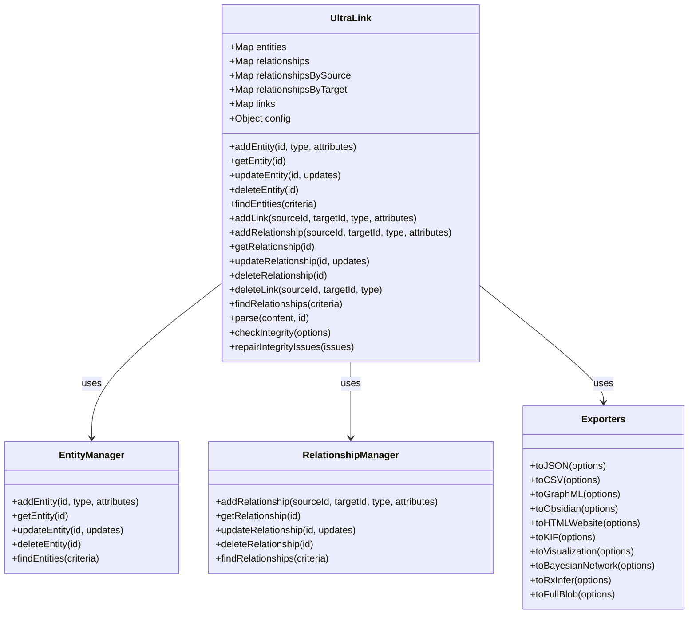
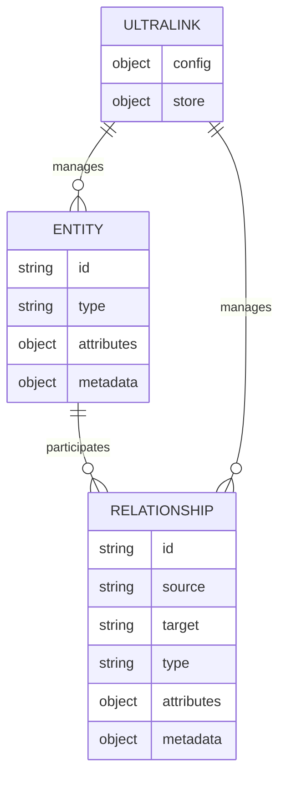
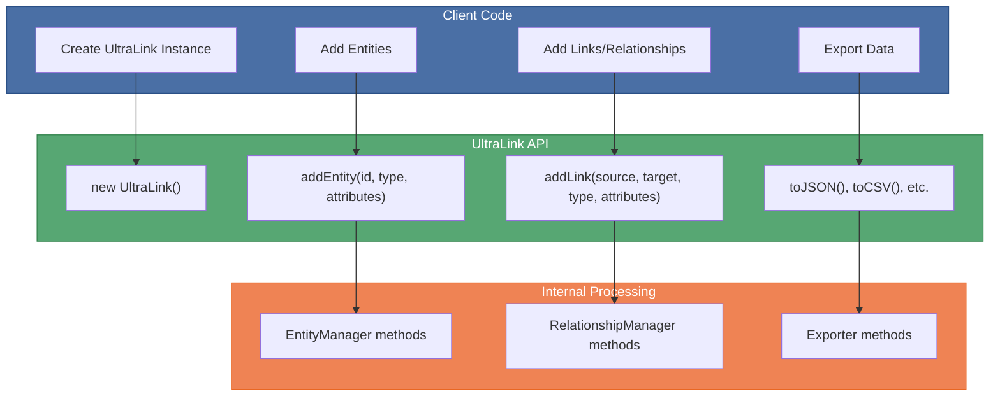
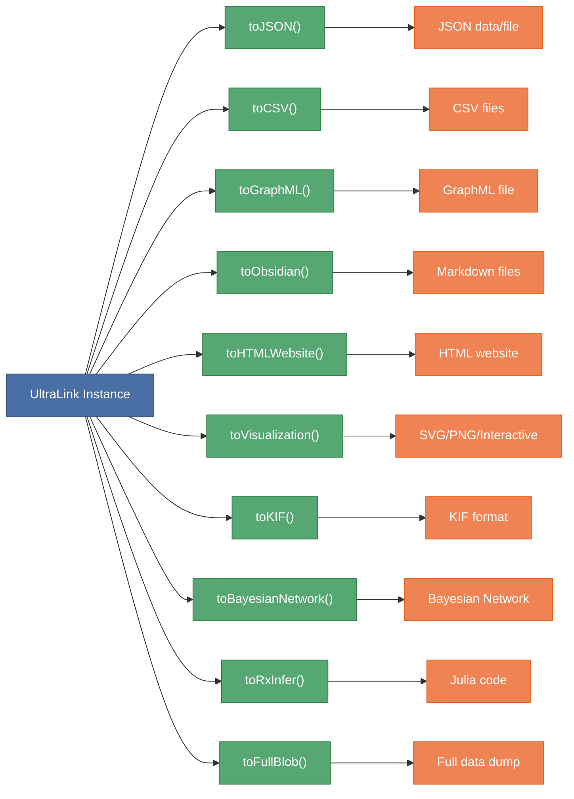
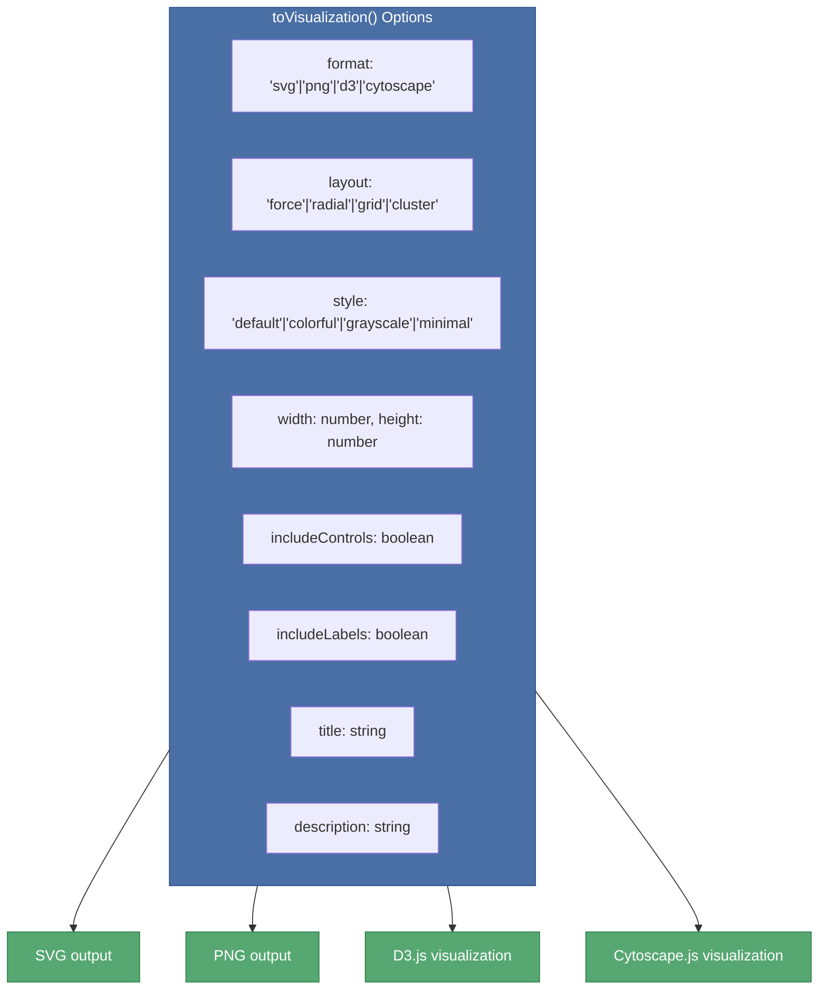
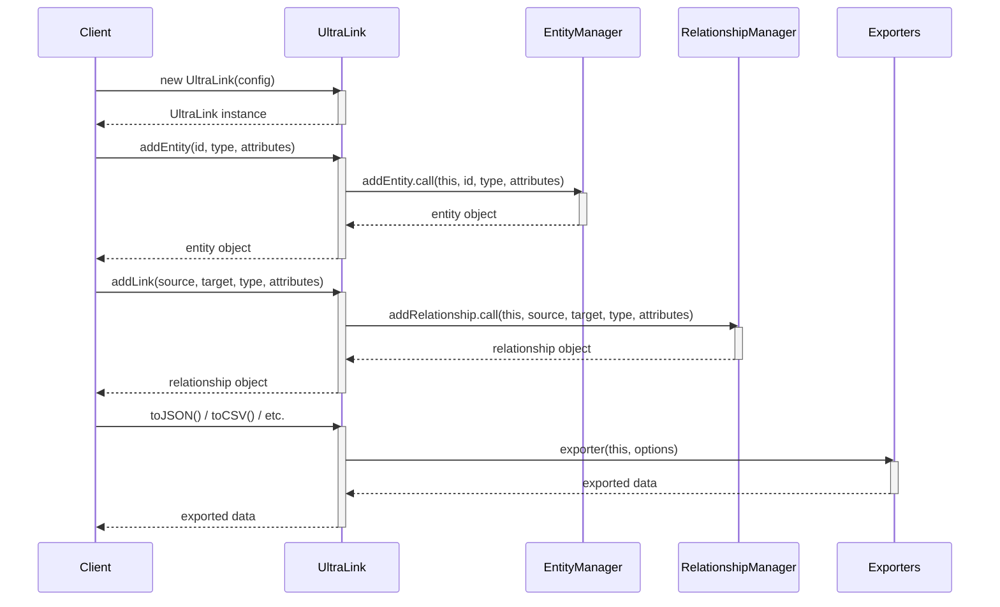

# UltraLink API Structure

This document provides a comprehensive visualization of the UltraLink API structure, showing the relationships between key components and methods.

## Core Architecture

## Entity-Relationship Model

## Method Call Flow

## Export Workflow

## Visualization Options

## Common API Patterns

This documentation provides a comprehensive visual overview of the UltraLink API structure and usage patterns. For detailed method descriptions, options, and code examples, refer to the [API Usage Guide](API_USAGE.md). 