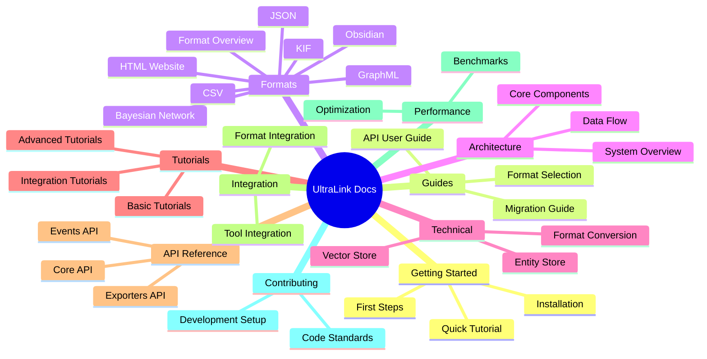

# UltraLink Documentation

Welcome to the official documentation for UltraLink, a powerful JavaScript library for creating, managing, and exporting knowledge graphs with advanced vector integration and LLM capabilities. This comprehensive documentation will guide you through all aspects of UltraLink, from basic installation to advanced use cases.

> **Documentation Standard**: All diagrams in the UltraLink documentation use Mermaid syntax for consistency, clarity, and maintainability. This ensures diagrams are both visually appealing and can be properly rendered in various documentation formats.

## What is UltraLink?

UltraLink is a meta-linking paradigm for managing and analyzing relational content with:

- **Flexible rendering system** that transforms knowledge into multiple target formats
- **Vector embeddings** for semantic similarity
- **LLM-generated insights** for advanced content analysis
- **Deterministic deployment** capabilities
- **Temporal analysis** to track knowledge evolution

Whether you're building a knowledge management system, a research platform, or integrating knowledge graphs into your applications, UltraLink provides the tools and flexibility you need.

## 🔑 Key Differentiator: Flexible Rendering System

The **defining feature** of UltraLink is its exceptionally flexible rendering system. Unlike traditional knowledge graph tools that lock you into specific formats, UltraLink can transform your knowledge into virtually any target format:

- **Standard Formats**: JSON, GraphML, CSV for universal compatibility
- **Knowledge Management**: Obsidian, Wiki formats, Documentation systems
- **Analytical Formats**: Bayesian Networks, KIF, RDF/OWL
- **Interactive Formats**: HTML websites, D3.js visualizations, 3D networks
- **Custom Formats**: Game engines, VR/AR, audio descriptions, and more

This format-agnostic approach means the same knowledge graph can power documentation, visualizations, analysis tools, and interactive applications without duplication or synchronization issues.

**[Learn more about UltraLink's Flexible Rendering System](./core-features/rendering-flexibility.md)**

## Documentation Structure

The documentation is organized into the following sections:



## Main Documentation Sections

### [Getting Started](./getting-started/README.md)

Begin your journey with UltraLink by following our getting started guides. Learn the basics of installation, configuration, and creating your first knowledge graph.

### [Guides](./guides/README.md)

Comprehensive guides for various aspects of UltraLink:

- [API User Guide](./guides/api-user-guide.md) - Learn how to use UltraLink's API effectively
- [Choosing the Right Format](./guides/choosing-format.md) - Select the appropriate export format for your needs
- [Migration Guide](./guides/migration-guide.md) - Upgrade between versions or migrate between formats

### [Formats](./formats/README.md)

UltraLink supports numerous export formats, each suited for different use cases:

- [JSON Format](./formats/json_format.md)
- [GraphML Format](./formats/graphml_format.md)
- [CSV Format](./formats/csv_format.md)
- [Obsidian Format](./formats/obsidian_format.md)
- [HTML Website Format](./formats/html_website_format.md)
- [Bayesian Network Format](./formats/bayesian_network_format.md)
- [Knowledge Interchange Format (KIF)](./formats/kif_format.md)
- [Full Blob Format](./formats/full_blob_format.md)
- [Visualization Format](./formats/visualization_format.md)
- [Formats Overview](./formats/formats_overview.md)
- [Rendering Targets Overview](./formats/rendering_targets.md)

### [Core Features](./core-features/README.md)

Understand UltraLink's core differentiating features:

- [Rendering Flexibility](./core-features/rendering-flexibility.md) - The power of UltraLink's format-agnostic approach
- [Vector Integration](./core-features/vector-integration.md) - Working with semantic vector embeddings
- [LLM Capabilities](./core-features/llm-capabilities.md) - Enhancing knowledge graphs with AI
- [Temporal Analysis](./core-features/temporal-analysis.md) - Tracking knowledge evolution over time

### [Architecture](./architecture/README.md)

Understand UltraLink's architecture and design principles:

- [System Overview](./architecture/overview.md)
- [Core Components](./architecture/components.md)
- [Data Flow](./architecture/data-flow.md)

### [Technical Documentation](./technical/README.md)

Dive into the technical details of UltraLink:

- [Format Conversion](./technical/format-conversion.md)
- [Entity Store](./technical/entity-store.md)
- [Vector Store](./technical/vector-store.md)
- [Event System](./technical/event-system.md)

### [Tutorials](./tutorials/README.md)

Step-by-step tutorials to help you master UltraLink:

- [Getting Started with UltraLink](./tutorials/getting-started.md)
- [Vector Embeddings and Semantic Search](./tutorials/vector-embeddings.md)
- [LLM Integration](./tutorials/llm-integration.md)
- [Extending with Custom Render Formats](./tutorials/custom-formats.md)
- [Bayesian Networks for Probabilistic Reasoning](./tutorials/bayesian-networks.md)

### [API Reference](./api/README.md)

Detailed API reference documentation:

- [Core API](./api/core-api.md)
- [Exporters API](./api/exporters-api.md)
- [Temporal API](./api/temporal-api.md)
- [Vector API](./api/vector-api.md)
- [LLM API](./api/llm-api.md)
- [Events API](./api/events-api.md)

### [Integration](./integration/README.md)

Guides for integrating UltraLink with other tools and systems:

- [Format Integration Guide](./integration/format-integration.md)
- [Tool Integration](./integration/tool-integration.md)

### [Performance](./performance/README.md)

Performance considerations and benchmarks:

- [Format Benchmarks](./performance/format-benchmarks.md)
- [Optimization Strategies](./performance/optimization.md)

### [Advanced Topics](./advanced/README.md)

Advanced features and use cases:

- [Custom Entity Types](./advanced/custom-entity-types.md)
- [Custom Rendering Formats](./advanced/custom-rendering-formats.md)
- [Plugin Development](./advanced/plugin-development.md)
- [Custom Transformations](./advanced/custom-transformations.md)
- [Advanced Query Patterns](./advanced/advanced-query-patterns.md)

### [For Agents](./for-agents/README.md)

Documentation for AI agent integration:

- [Agent Integration Guide](./for-agents/agent-integration.md) 
- [LLM Compatibility](./for-agents/llm-compatibility.md)
- [Prompt Engineering](./for-agents/prompt-engineering.md)

### [Contributing](./contributing/README.md)

Guidelines for contributing to UltraLink development:

- [Development Setup](./contributing/development-setup.md)
- [Coding Standards](./contributing/coding-standards.md)

## Additional Resources

- [FAQ](./faq.md) - Frequently asked questions about UltraLink
- [Troubleshooting](./troubleshooting.md) - Solutions to common issues
- [Community Support](./community-support.md) - Where to get help from the community

## Latest Updates

UltraLink is continuously evolving. Check out the [latest updates](./updates/README.md) to see what's new.

## Version Information

This documentation applies to UltraLink version 0.5.x. For documentation on other versions, please see the [version archive](./versions/README.md).

## Contributing to Documentation

We welcome contributions to improve this documentation. Please see the [documentation contribution guide](./contributing/documentation-guide.md) for details on how to help.

## Documentation Standards

All documentation in this project follows these standards:

1. **Clarity**: Information is presented clearly with appropriate examples.
2. **Comprehensive**: Each topic is covered thoroughly with all relevant details.
3. **Structured**: Documentation follows a consistent structure.
4. **Updated**: Documentation is kept in sync with the codebase.
5. **Accessible**: Documentation is accessible to both beginners and advanced users.
6. **Visual**: Complex concepts are illustrated with Mermaid diagrams for consistency.

## Building the Documentation

To build the documentation locally, run:

```bash
# Install documentation dependencies
npm install --dev

# Build the documentation
npm run docs:build

# Serve the documentation locally
npm run docs:serve
```

## Documentation Roadmap

We have the following improvements planned for our documentation:

1. Video tutorials for common tasks
2. Interactive examples embedded in the documentation
3. Translation to additional languages
4. Improved searchability and cross-referencing
5. User-contributed cookbook recipes ]