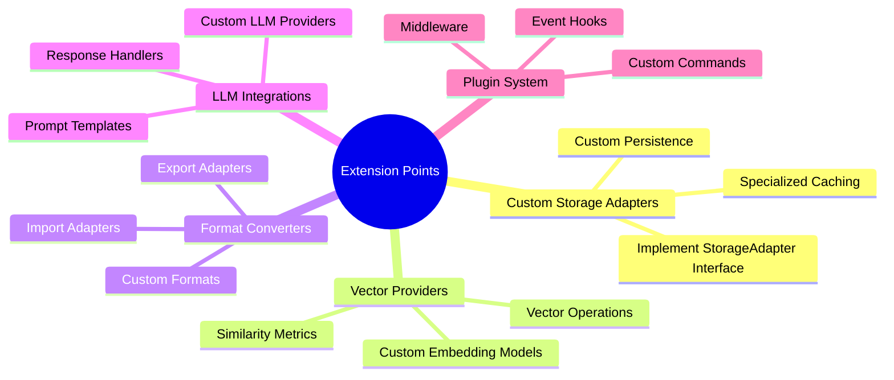

# Extending UltraLink

This guide provides comprehensive documentation on extending UltraLink's functionality through its various extension mechanisms. UltraLink is designed to be highly extensible, allowing developers to customize and enhance its capabilities while maintaining consistency and reliability.

## Extension Points Overview



## Core Extension Interfaces

### Storage Adapter Interface

```typescript
interface StorageAdapter {
  // Required methods
  connect(): Promise<void>;
  disconnect(): Promise<void>;
  get(key: string): Promise<any>;
  set(key: string, value: any): Promise<void>;
  delete(key: string): Promise<void>;
  clear(): Promise<void>;

  // Optional methods
  batch?(): BatchOperations;
  subscribe?(callback: (change: Change) => void): Unsubscribe;
  getMetadata?(): StorageMetadata;
}

// Example implementation for Redis
class RedisStorageAdapter implements StorageAdapter {
  private client: Redis;
  private options: RedisOptions;

  constructor(options: RedisOptions) {
    this.options = options;
  }

  async connect(): Promise<void> {
    this.client = new Redis(this.options);
    await this.client.ping();
  }

  async disconnect(): Promise<void> {
    await this.client.quit();
  }

  async get(key: string): Promise<any> {
    const value = await this.client.get(key);
    return value ? JSON.parse(value) : null;
  }

  async set(key: string, value: any): Promise<void> {
    await this.client.set(key, JSON.stringify(value));
  }

  async delete(key: string): Promise<void> {
    await this.client.del(key);
  }

  async clear(): Promise<void> {
    await this.client.flushdb();
  }

  // Optional batch operations
  batch(): BatchOperations {
    const pipeline = this.client.pipeline();
    return {
      set: (key, value) => pipeline.set(key, JSON.stringify(value)),
      delete: (key) => pipeline.del(key),
      execute: () => pipeline.exec()
    };
  }
}
```

### Vector Provider Interface

```typescript
interface VectorProvider {
  // Required methods
  initialize(config: VectorConfig): Promise<void>;
  generateEmbedding(content: string): Promise<number[]>;
  similarity(v1: number[], v2: number[]): number;
  search(query: number[], options: SearchOptions): Promise<SearchResult[]>;

  // Optional methods
  batchGenerate?(contents: string[]): Promise<number[][]>;
  cluster?(vectors: number[][], options: ClusterOptions): Promise<ClusterResult>;
}

// Example implementation using OpenAI
class OpenAIVectorProvider implements VectorProvider {
  private client: OpenAI;
  private model: string;

  constructor(apiKey: string, model = 'text-embedding-ada-002') {
    this.client = new OpenAI({ apiKey });
    this.model = model;
  }

  async initialize(): Promise<void> {
    // Validate API key and model availability
    await this.client.models.retrieve(this.model);
  }

  async generateEmbedding(content: string): Promise<number[]> {
    const response = await this.client.embeddings.create({
      model: this.model,
      input: content
    });
    return response.data[0].embedding;
  }

  similarity(v1: number[], v2: number[]): number {
    return cosineSimilarity(v1, v2);
  }

  async search(query: number[], options: SearchOptions): Promise<SearchResult[]> {
    // Implement vector search using HNSW or other algorithms
    return performVectorSearch(query, options);
  }

  // Optional batch processing
  async batchGenerate(contents: string[]): Promise<number[][]> {
    const response = await this.client.embeddings.create({
      model: this.model,
      input: contents
    });
    return response.data.map(item => item.embedding);
  }
}
```

### Format Converter Interface

```typescript
interface FormatConverter {
  // Required methods
  canHandle(format: string): boolean;
  import(data: any, options?: ImportOptions): Promise<GraphData>;
  export(data: GraphData, options?: ExportOptions): Promise<any>;

  // Optional methods
  validate?(data: any): Promise<ValidationResult>;
  getMetadata?(): ConverterMetadata;
}

// Example implementation for Markdown
class MarkdownConverter implements FormatConverter {
  canHandle(format: string): boolean {
    return format.toLowerCase() === 'markdown';
  }

  async import(data: string, options?: ImportOptions): Promise<GraphData> {
    const nodes: Node[] = [];
    const edges: Edge[] = [];
    
    // Parse markdown and extract nodes/edges
    const ast = parseMarkdown(data);
    traverseAst(ast, (node) => {
      // Convert headings to nodes
      if (node.type === 'heading') {
        nodes.push({
          id: generateId(),
          type: 'heading',
          content: node.content,
          level: node.depth
        });
      }
      // Convert links to edges
      if (node.type === 'link') {
        edges.push({
          source: node.sourceId,
          target: node.targetId,
          type: 'reference'
        });
      }
    });

    return { nodes, edges };
  }

  async export(data: GraphData, options?: ExportOptions): Promise<string> {
    let markdown = '';
    
    // Convert nodes to markdown
    for (const node of data.nodes) {
      if (node.type === 'heading') {
        markdown += `${'#'.repeat(node.level)} ${node.content}\n\n`;
      }
    }

    // Convert edges to markdown links
    for (const edge of data.edges) {
      markdown += `[${edge.source}](${edge.target})\n`;
    }

    return markdown;
  }

  async validate(data: string): Promise<ValidationResult> {
    try {
      const ast = parseMarkdown(data);
      return { valid: true };
    } catch (error) {
      return {
        valid: false,
        errors: [{ message: error.message }]
      };
    }
  }
}
```

### LLM Provider Interface

```typescript
interface LLMProvider {
  // Required methods
  initialize(config: LLMConfig): Promise<void>;
  generate(prompt: string, options: GenerateOptions): Promise<string>;
  analyze(content: string, options: AnalyzeOptions): Promise<AnalysisResult>;

  // Optional methods
  stream?(prompt: string, options: StreamOptions): AsyncIterator<string>;
  batchGenerate?(prompts: string[]): Promise<string[]>;
  estimateTokens?(content: string): number;
}

// Example implementation for Anthropic
class AnthropicProvider implements LLMProvider {
  private client: Anthropic;
  private model: string;

  constructor(apiKey: string, model = 'claude-3-opus-20240229') {
    this.client = new Anthropic({ apiKey });
    this.model = model;
  }

  async initialize(): Promise<void> {
    // Validate API key and model availability
  }

  async generate(prompt: string, options: GenerateOptions): Promise<string> {
    const response = await this.client.messages.create({
      model: this.model,
      max_tokens: options.maxTokens,
      temperature: options.temperature,
      messages: [{ role: 'user', content: prompt }]
    });
    return response.content[0].text;
  }

  async analyze(content: string, options: AnalyzeOptions): Promise<AnalysisResult> {
    const prompt = buildAnalysisPrompt(content, options);
    const response = await this.generate(prompt, options);
    return parseAnalysisResponse(response);
  }

  async stream(prompt: string, options: StreamOptions): AsyncIterator<string> {
    const stream = await this.client.messages.create({
      model: this.model,
      max_tokens: options.maxTokens,
      temperature: options.temperature,
      messages: [{ role: 'user', content: prompt }],
      stream: true
    });

    return {
      async next() {
        const chunk = await stream.next();
        if (chunk.done) return { done: true, value: undefined };
        return { done: false, value: chunk.value.content[0].text };
      }
    };
  }
}
```

## Plugin System

UltraLink's plugin system allows for extending functionality through a middleware-based approach:

```typescript
interface Plugin {
  name: string;
  version: string;
  initialize?(context: PluginContext): Promise<void>;
  hooks?: {
    [eventName: string]: HookFunction;
  };
  middleware?: {
    [operation: string]: MiddlewareFunction;
  };
  commands?: {
    [command: string]: CommandFunction;
  };
}

// Example Analytics Plugin
class AnalyticsPlugin implements Plugin {
  name = 'analytics';
  version = '1.0.0';

  async initialize(context: PluginContext): Promise<void> {
    // Set up analytics connection
  }

  hooks = {
    'entity:created': async (entity: Entity) => {
      await trackEvent('entity_created', {
        entityId: entity.id,
        type: entity.type
      });
    },
    'relationship:created': async (relationship: Relationship) => {
      await trackEvent('relationship_created', {
        source: relationship.source,
        target: relationship.target
      });
    }
  };

  middleware = {
    'query:execute': async (params, next) => {
      const start = Date.now();
      const result = await next(params);
      const duration = Date.now() - start;
      await trackMetric('query_duration', duration);
      return result;
    }
  };

  commands = {
    'analytics:report': async (options) => {
      return generateAnalyticsReport(options);
    }
  };
}
```

## Extension Examples

### Custom Storage Example: S3 Adapter

```typescript
class S3StorageAdapter implements StorageAdapter {
  private s3: AWS.S3;
  private bucket: string;
  private prefix: string;

  constructor(config: S3Config) {
    this.s3 = new AWS.S3(config);
    this.bucket = config.bucket;
    this.prefix = config.prefix || '';
  }

  async get(key: string): Promise<any> {
    try {
      const response = await this.s3.getObject({
        Bucket: this.bucket,
        Key: `${this.prefix}${key}`
      }).promise();
      
      return JSON.parse(response.Body.toString());
    } catch (error) {
      if (error.code === 'NoSuchKey') return null;
      throw error;
    }
  }

  async set(key: string, value: any): Promise<void> {
    await this.s3.putObject({
      Bucket: this.bucket,
      Key: `${this.prefix}${key}`,
      Body: JSON.stringify(value),
      ContentType: 'application/json'
    }).promise();
  }

  // Implement other required methods...
}
```

### Custom Vector Provider: Sentence Transformers

```typescript
class SentenceTransformerProvider implements VectorProvider {
  private model: any;
  private tokenizer: any;

  async initialize(config: VectorConfig): Promise<void> {
    // Load model and tokenizer
    this.model = await import('@xenova/transformers').then(
      m => m.pipeline('feature-extraction', config.modelName)
    );
  }

  async generateEmbedding(content: string): Promise<number[]> {
    const output = await this.model(content, {
      pooling: 'mean',
      normalize: true
    });
    return Array.from(output.data);
  }

  similarity(v1: number[], v2: number[]): number {
    return cosineSimilarity(v1, v2);
  }

  // Implement other required methods...
}
```

### Custom Format Converter: CSV

```typescript
class CSVConverter implements FormatConverter {
  canHandle(format: string): boolean {
    return format.toLowerCase() === 'csv';
  }

  async import(data: string, options?: ImportOptions): Promise<GraphData> {
    const rows = parseCSV(data);
    const nodes: Node[] = [];
    const edges: Edge[] = [];

    // Convert rows to nodes and edges based on options
    for (const row of rows) {
      if (options.nodeColumns) {
        nodes.push({
          id: row[options.nodeColumns.id],
          type: row[options.nodeColumns.type],
          attributes: extractAttributes(row, options.nodeColumns.attributes)
        });
      }
      
      if (options.edgeColumns) {
        edges.push({
          source: row[options.edgeColumns.source],
          target: row[options.edgeColumns.target],
          type: row[options.edgeColumns.type],
          attributes: extractAttributes(row, options.edgeColumns.attributes)
        });
      }
    }

    return { nodes, edges };
  }

  async export(data: GraphData, options?: ExportOptions): Promise<string> {
    const rows = [];
    
    // Convert nodes and edges to CSV rows
    for (const node of data.nodes) {
      rows.push({
        id: node.id,
        type: node.type,
        ...flattenAttributes(node.attributes)
      });
    }

    return generateCSV(rows, options);
  }
}
```

## Testing Extensions

UltraLink provides a testing framework for extensions:

```typescript
import { TestSuite } from '@ultralink/testing';

describe('Custom Storage Adapter', () => {
  const suite = new TestSuite();
  let adapter: CustomStorageAdapter;

  beforeEach(() => {
    adapter = new CustomStorageAdapter(config);
  });

  it('should pass the storage compliance tests', async () => {
    await suite.testStorageAdapter(adapter);
  });

  it('should handle concurrent operations', async () => {
    await suite.testConcurrency(adapter);
  });
});
```

## Best Practices

1. **Type Safety**
   - Use TypeScript for type checking
   - Implement all required interface methods
   - Document optional features

2. **Error Handling**
   - Provide detailed error messages
   - Use appropriate error types
   - Handle edge cases gracefully

3. **Performance**
   - Implement caching when appropriate
   - Use batch operations for bulk processing
   - Profile and optimize critical paths

4. **Testing**
   - Write comprehensive unit tests
   - Use the provided test suite
   - Test edge cases and error conditions

5. **Documentation**
   - Document configuration options
   - Provide usage examples
   - Include performance characteristics

## Publishing Extensions

Extensions can be published to npm:

```json
{
  "name": "@ultralink/extension-name",
  "version": "1.0.0",
  "main": "dist/index.js",
  "types": "dist/index.d.ts",
  "peerDependencies": {
    "@ultralink/core": "^1.0.0"
  }
}
```

## Extension Registry

UltraLink maintains an official extension registry:

1. Submit your extension through the registry interface
2. Provide documentation and examples
3. Pass the automated compliance tests
4. Maintain compatibility with core updates

## Debugging Extensions

UltraLink provides debugging tools for extensions:

```typescript
import { Debug } from '@ultralink/debug';

const debug = new Debug('my-extension');

class MyExtension implements Plugin {
  async initialize(context: PluginContext): Promise<void> {
    debug.log('Initializing extension');
    // Implementation
    debug.log('Extension initialized');
  }
}
```

## Migration Guide

When updating extensions for new UltraLink versions:

1. Review the changelog for breaking changes
2. Update interface implementations
3. Run the test suite
4. Update documentation
5. Publish new version

## Support and Community

- Join the Discord community for help
- Submit issues on GitHub
- Contribute to the extension ecosystem
- Share your extensions with the community

## Next Steps

- [Core API Reference](../api/core.md)
- [Plugin Development Guide](./plugin-development.md)
- [Testing Guide](../testing/index.md)
- [Deployment Guide](../deployment/index.md) 