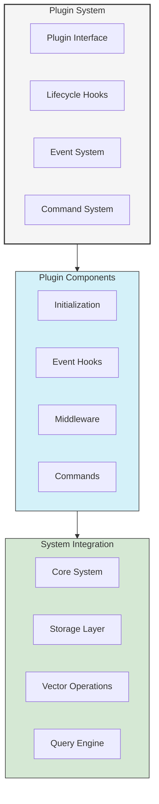

# Plugin Development Guide

This guide provides detailed information on developing plugins for UltraLink, including best practices, examples, and common patterns.

## Plugin Architecture



## Creating a Plugin

### Basic Plugin Structure

```typescript
import { Plugin, PluginContext } from '@ultralink/core';

interface MyPluginOptions {
  feature1: boolean;
  feature2: string;
}

class MyPlugin implements Plugin {
  name = 'my-plugin';
  version = '1.0.0';
  private options: MyPluginOptions;

  constructor(options: MyPluginOptions) {
    this.options = options;
  }

  async initialize(context: PluginContext): Promise<void> {
    // Plugin initialization logic
    await this.setup();
    this.registerEventHandlers(context);
    this.registerCommands(context);
  }

  private async setup(): Promise<void> {
    // Setup plugin resources
  }

  private registerEventHandlers(context: PluginContext): void {
    // Register event handlers
  }

  private registerCommands(context: PluginContext): void {
    // Register custom commands
  }
}
```

### Plugin Context

```typescript
interface PluginContext {
  // Core API access
  core: UltraLinkCore;
  
  // Event emitter
  events: EventEmitter;
  
  // Configuration
  config: Configuration;
  
  // Logger
  logger: Logger;
  
  // Plugin utilities
  utils: PluginUtils;
}

// Usage example
class FeaturePlugin implements Plugin {
  async initialize(context: PluginContext): Promise<void> {
    // Access core API
    const entity = await context.core.getEntity('123');
    
    // Log information
    context.logger.info('Plugin initialized');
    
    // Use utilities
    const hash = context.utils.generateHash(entity);
  }
}
```

## Event Handling

### Registering Event Handlers

```typescript
class EventPlugin implements Plugin {
  hooks = {
    // Entity events
    'entity:created': async (entity: Entity) => {
      // Handle entity creation
    },
    
    'entity:updated': async (entity: Entity, changes: Changes) => {
      // Handle entity update
    },
    
    // Relationship events
    'relationship:created': async (relationship: Relationship) => {
      // Handle relationship creation
    },
    
    // Vector events
    'vector:generated': async (entityId: string, vector: number[]) => {
      // Handle vector generation
    },
    
    // Query events
    'query:executed': async (query: Query, results: QueryResults) => {
      // Handle query execution
    }
  };
}
```

### Custom Event Patterns

```typescript
class AdvancedEventPlugin implements Plugin {
  async initialize(context: PluginContext): Promise<void> {
    // Pattern-based event handling
    context.events.on('entity:*', (eventName, data) => {
      // Handle all entity events
    });

    // Multiple event handlers
    context.events.on(['entity:created', 'entity:updated'], (event) => {
      // Handle multiple events
    });

    // Once handler
    context.events.once('initialization:complete', () => {
      // Handle one-time event
    });

    // Custom events
    context.events.emit('my-plugin:customEvent', {
      type: 'custom',
      data: { /* ... */ }
    });
  }
}
```

## Middleware System

### Request Pipeline

```typescript
class MiddlewarePlugin implements Plugin {
  middleware = {
    // Entity middleware
    'entity:create': async (params, next) => {
      // Pre-processing
      const startTime = Date.now();
      
      // Continue pipeline
      const result = await next(params);
      
      // Post-processing
      const duration = Date.now() - startTime;
      console.log(`Entity creation took ${duration}ms`);
      
      return result;
    },
    
    // Query middleware
    'query:execute': async (params, next) => {
      // Modify query parameters
      params.options.timeout = 5000;
      
      try {
        return await next(params);
      } catch (error) {
        // Error handling
        throw new Error('Query failed: ' + error.message);
      }
    }
  };
}
```

### Middleware Chains

```typescript
class ChainedMiddleware implements Plugin {
  middleware = {
    'entity:create': [
      // Authentication middleware
      async (params, next) => {
        if (!params.context.authenticated) {
          throw new Error('Unauthorized');
        }
        return next(params);
      },
      
      // Validation middleware
      async (params, next) => {
        validateEntity(params.data);
        return next(params);
      },
      
      // Logging middleware
      async (params, next) => {
        const result = await next(params);
        logEntityCreation(result);
        return result;
      }
    ]
  };
}
```

## Custom Commands

### Command Registration

```typescript
class CommandPlugin implements Plugin {
  commands = {
    // Simple command
    'my-plugin:hello': async (options) => {
      return 'Hello from plugin!';
    },
    
    // Command with parameters
    'my-plugin:process': async (options: ProcessOptions) => {
      const result = await processData(options);
      return result;
    },
    
    // Command with context
    'my-plugin:analyze': async (options, context) => {
      const entities = await context.core.findEntities(options.query);
      return analyzeEntities(entities);
    }
  };
}

// Usage
const result = await ultralink.executeCommand('my-plugin:process', {
  data: 'input',
  options: { /* ... */ }
});
```

### Complex Commands

```typescript
class AnalyticsPlugin implements Plugin {
  commands = {
    // Generate analytics report
    'analytics:report': async (options: ReportOptions) => {
      const report = await generateReport({
        startDate: options.startDate,
        endDate: options.endDate,
        metrics: options.metrics,
        format: options.format
      });
      
      return report;
    },
    
    // Real-time analytics
    'analytics:realtime': async (options: RealtimeOptions) => {
      return new RealtimeAnalytics(options);
    }
  };
  
  // Command implementation
  private async generateReport(options: ReportOptions) {
    // Implementation
  }
}
```

## Storage Extensions

### Custom Storage Plugin

```typescript
class CustomStoragePlugin implements Plugin {
  name = 'custom-storage';
  version = '1.0.0';
  
  private storage: CustomStorage;
  
  async initialize(context: PluginContext): Promise<void> {
    // Initialize custom storage
    this.storage = new CustomStorage(context.config.storage);
    
    // Register storage adapter
    context.core.registerStorageAdapter('custom', {
      connect: () => this.storage.connect(),
      disconnect: () => this.storage.disconnect(),
      get: (key) => this.storage.get(key),
      set: (key, value) => this.storage.set(key, value),
      delete: (key) => this.storage.delete(key),
      clear: () => this.storage.clear()
    });
  }
}
```

## Vector Provider Extensions

### Custom Vector Plugin

```typescript
class CustomVectorPlugin implements Plugin {
  name = 'custom-vector';
  version = '1.0.0';
  
  private vectorEngine: CustomVectorEngine;
  
  async initialize(context: PluginContext): Promise<void> {
    // Initialize vector engine
    this.vectorEngine = new CustomVectorEngine(context.config.vector);
    
    // Register vector provider
    context.core.registerVectorProvider('custom', {
      generateEmbedding: (content) => this.vectorEngine.embed(content),
      similarity: (v1, v2) => this.vectorEngine.similarity(v1, v2),
      search: (query, options) => this.vectorEngine.search(query, options)
    });
  }
}
```

## Testing Plugins

### Unit Testing

```typescript
import { TestSuite } from '@ultralink/testing';

describe('MyPlugin', () => {
  let plugin: MyPlugin;
  let context: PluginContext;
  
  beforeEach(() => {
    plugin = new MyPlugin(options);
    context = createTestContext();
  });
  
  it('should initialize correctly', async () => {
    await plugin.initialize(context);
    expect(context.events.listenerCount('entity:created')).toBe(1);
  });
  
  it('should handle entity creation', async () => {
    const handler = plugin.hooks['entity:created'];
    const entity = createTestEntity();
    await handler(entity);
    // Assert expected behavior
  });
});
```

### Integration Testing

```typescript
describe('Plugin Integration', () => {
  let ultralink: UltraLink;
  
  beforeEach(async () => {
    ultralink = new UltraLink({
      plugins: [new MyPlugin(options)]
    });
    await ultralink.initialize();
  });
  
  it('should work with core functionality', async () => {
    const entity = await ultralink.createEntity({
      type: 'test',
      attributes: { /* ... */ }
    });
    // Assert plugin behavior
  });
});
```

## Debugging Plugins

### Debug Logging

```typescript
import { Debug } from '@ultralink/debug';

class DebuggablePlugin implements Plugin {
  private debug: Debug;
  
  constructor() {
    this.debug = new Debug('my-plugin');
  }
  
  async initialize(context: PluginContext): Promise<void> {
    this.debug.log('Initializing plugin');
    
    try {
      await this.setup();
      this.debug.log('Plugin initialized successfully');
    } catch (error) {
      this.debug.error('Plugin initialization failed', error);
      throw error;
    }
  }
}
```

### Performance Monitoring

```typescript
class MonitoredPlugin implements Plugin {
  middleware = {
    'query:execute': async (params, next) => {
      const start = performance.now();
      
      try {
        const result = await next(params);
        
        const duration = performance.now() - start;
        this.recordMetric('query_duration', duration);
        
        return result;
      } catch (error) {
        this.recordError('query_error', error);
        throw error;
      }
    }
  };
  
  private recordMetric(name: string, value: number): void {
    // Record metric
  }
  
  private recordError(type: string, error: Error): void {
    // Record error
  }
}
```

## Best Practices

1. **Plugin Structure**
   - Keep plugins focused and single-purpose
   - Use TypeScript for better type safety
   - Follow the plugin lifecycle correctly

2. **Error Handling**
   - Implement proper error handling
   - Use custom error types
   - Provide detailed error messages

3. **Performance**
   - Minimize initialization overhead
   - Use async operations appropriately
   - Implement caching when beneficial

4. **Testing**
   - Write comprehensive tests
   - Test edge cases
   - Use the testing utilities provided

5. **Documentation**
   - Document plugin configuration
   - Provide usage examples
   - Include performance considerations

## Publishing Plugins

### Package Configuration

```json
{
  "name": "@ultralink/plugin-name",
  "version": "1.0.0",
  "main": "dist/index.js",
  "types": "dist/index.d.ts",
  "files": [
    "dist",
    "README.md"
  ],
  "peerDependencies": {
    "@ultralink/core": "^1.0.0"
  }
}
```

### Documentation

```markdown
# My UltraLink Plugin

## Installation

```bash
npm install @ultralink/plugin-name
```

## Usage

```typescript
import { MyPlugin } from '@ultralink/plugin-name';

const ultralink = new UltraLink({
  plugins: [
    new MyPlugin({
      // Plugin options
    })
  ]
});
```

## Configuration

- `option1`: Description of option 1
- `option2`: Description of option 2

## API Reference

### Methods

- `method1(param: Type): ReturnType`
- `method2(param: Type): ReturnType`

## Examples

```typescript
// Example usage
```
```

## Support and Resources

- Join the Discord community for help
- Submit issues on GitHub
- Contribute to the plugin ecosystem
- Share your plugins with others

## Next Steps

- [Core API Reference](../api/core.md)
- [Testing Guide](../testing/index.md)
- [Deployment Guide](../deployment/index.md) 