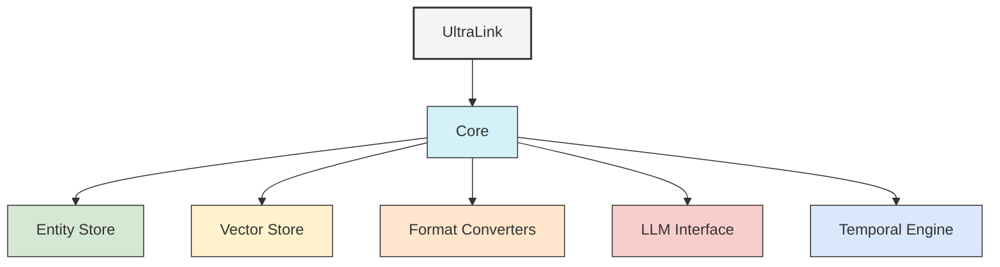

# UltraLink Architecture

This section provides detailed documentation on UltraLink's architecture and design principles, helping you understand how the system works under the hood.

## Architecture Overview

UltraLink is designed with a modular, extensible architecture that enables powerful knowledge representation, management, and transformation capabilities.

### [Architecture Overview](./architecture_overview.md)

A comprehensive introduction to UltraLink's architecture:

- System layers and components
- Design principles
- Data flow and processing
- Extensibility points
- Deployment architectures

## Component Documentation

UltraLink consists of several core components that work together:

### Core Components

- **Entity Store**: The primary storage mechanism for entities and relationships
- **Vector Store**: Manages vector embeddings and semantic similarity operations
- **Format Converters**: Transform knowledge between different representations
- **LLM Interface**: Connects with language models for content generation and analysis
- **Temporal Engine**: Handles versioning and time-based operations
- **Query Engine**: Provides flexible querying capabilities across all dimensions

### Developer Interfaces

- **Core API**: The primary JavaScript API for interacting with UltraLink
- **Events System**: Subscription-based system for reacting to changes
- **Plugin Architecture**: Extension points for custom functionality
- **Format Adapters**: Interfaces for creating custom format converters

## Integration Architecture

UltraLink is designed to integrate with various systems:

- **Frontend Frameworks**: React, Vue, Angular integration
- **Backend Systems**: Node.js, Express, NestJS integration
- **Database Systems**: MongoDB, PostgreSQL, Neo4j integration
- **LLM Providers**: OpenAI, Anthropic, local models integration
- **Vector Databases**: Pinecone, Weaviate, Milvus integration

## Technical Implementation

For detailed technical implementation details, see the [Technical Documentation](../technical/README.md).

## Design Principles

UltraLink's architecture adheres to these core principles:

1. **Modularity**: Components are loosely coupled and independently testable
2. **Extensibility**: Clear extension points for custom functionality
3. **Format Agnosticism**: Knowledge representation is separate from output format
4. **Performance**: Optimized for both small and large knowledge graphs
5. **Developer Experience**: Intuitive APIs and comprehensive documentation 