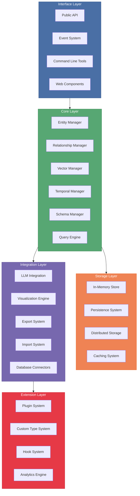
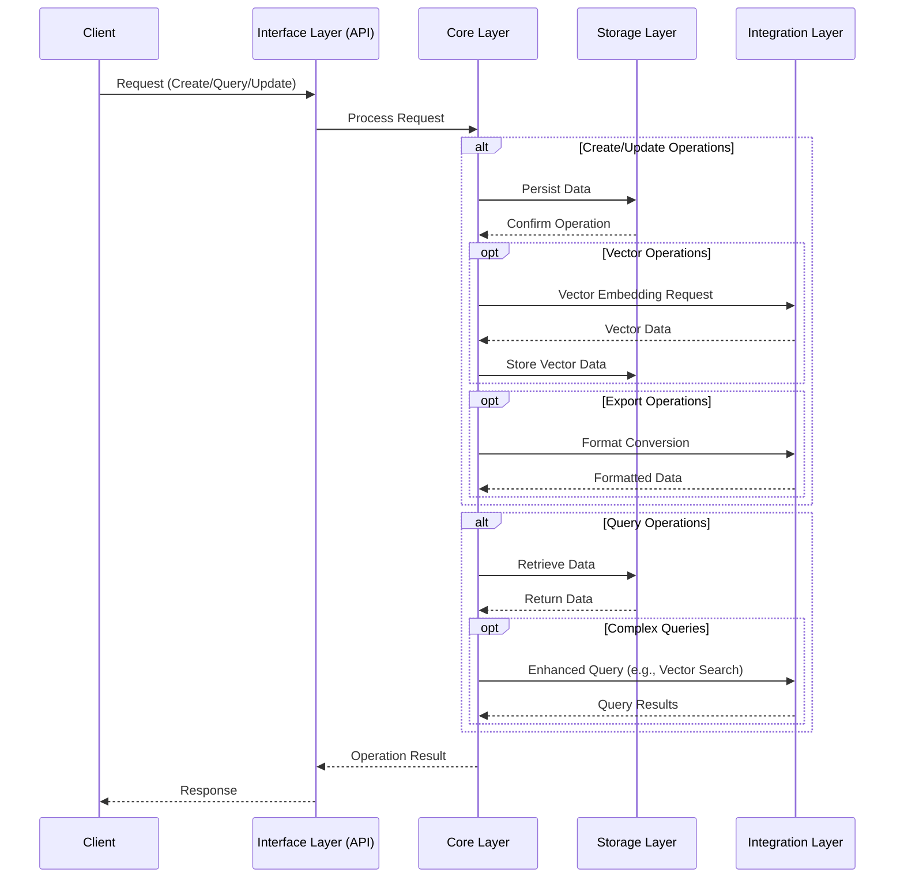

# UltraLink Architecture

This document provides a comprehensive overview of the UltraLink architecture, detailing the system's components, layers, and how they interact.

## Table of Contents

- [Overview](#overview)
- [Architectural Principles](#architectural-principles)
- [System Layers](#system-layers)
  - [Interface Layer](#interface-layer)
  - [Core Layer](#core-layer)
  - [Storage Layer](#storage-layer)
  - [Integration Layer](#integration-layer)
  - [Extension Layer](#extension-layer)
- [Component Interactions](#component-interactions)
- [Data Flow](#data-flow)
- [Scalability Considerations](#scalability-considerations)
- [Security Model](#security-model)
- [Development Considerations](#development-considerations)

## Overview

UltraLink is designed as a modular, layered architecture that provides a flexible framework for managing relational content. The architecture follows a clean separation of concerns, allowing for extensibility while maintaining a stable core.

## Architectural Principles

UltraLink's architecture is guided by the following principles:

1. **Modularity**: Each component has clear boundaries and responsibilities
2. **Extensibility**: The system can be extended at multiple points without modifying core code
3. **Separation of Concerns**: Each layer handles specific aspects of the system
4. **Pluggability**: Components can be swapped or extended with custom implementations
5. **Performance**: Architecture optimized for efficient data processing and retrieval
6. **Developer Experience**: Clean, consistent APIs that are easy to understand and use

## System Layers

### Interface Layer

The Interface Layer provides various ways for users and external systems to interact with UltraLink.

#### Components:

- **Public API**: The primary programmatic interface for working with UltraLink
- **Event System**: Publish-subscribe system for reacting to changes in the system
- **CLI**: Command-line tools for working with UltraLink from terminals
- **Web Components**: Ready-to-use UI components for web applications

### Core Layer

The Core Layer contains the central business logic and data management capabilities.

#### Components:

- **Entity Manager**: Handles creation, retrieval, updating, and deletion of entities
- **Relationship Manager**: Manages links between entities with their properties
- **Vector Manager**: Handles vector embeddings and vector-based operations
- **Temporal Manager**: Tracks changes and evolution over time
- **Schema Manager**: Enforces data structure and validation rules
- **Query Engine**: Provides flexible querying capabilities across the system

### Storage Layer

The Storage Layer handles persistence and retrieval of data.

#### Components:

- **In-Memory Store**: Fast, ephemeral storage for active data
- **Persistence System**: Long-term data storage to disk or databases
- **Distributed Storage**: Support for storing data across multiple nodes
- **Caching System**: Performance optimization through intelligent caching

### Integration Layer

The Integration Layer connects UltraLink to external systems and technologies.

#### Components:

- **LLM Integration**: Interfaces with Large Language Models for AI capabilities
- **Visualization Engine**: Renders interactive visualizations of relationships
- **Export System**: Converts UltraLink data to various external formats
- **Import System**: Ingests data from various sources into UltraLink
- **Database Connectors**: Connects to external database systems

### Extension Layer

The Extension Layer provides mechanisms for customizing and extending UltraLink.

#### Components:

- **Plugin System**: Framework for adding new capabilities without core changes
- **Custom Type System**: Allows definition of domain-specific entity and relationship types
- **Hook System**: Provides extension points for custom behavior at key moments
- **Analytics Engine**: Computes metrics and insights from the relationship network

## Component Interactions

The components interact according to these patterns:

1. **Interface-to-Core**: External requests flow through the Interface Layer to Core Layer
2. **Core-to-Storage**: Core components use Storage for data persistence
3. **Core-to-Integration**: Core uses Integration Layer for external capabilities
4. **Extension Hooks**: Extensions modify behavior at defined points in the Core and Integration layers

## Data Flow

Data flows through the system as follows:

## Scalability Considerations

UltraLink's architecture supports scalability through:

1. **Modular Storage**: Storage layer can be scaled independently
2. **Stateless API Design**: Interface layer can be horizontally scaled
3. **Distributed Processing**: Support for sharding large datasets
4. **Asynchronous Operations**: Non-blocking operations for high throughput
5. **Selective Loading**: Only loading required data into memory

## Security Model

The security model includes:

1. **Authentication**: Identity verification at the Interface Layer
2. **Authorization**: Permission checking in the Core Layer
3. **Data Validation**: Schema enforcement to prevent invalid data
4. **Secure Storage**: Encrypted persistence options
5. **Audit Trail**: Logging of operations with identity information

## Development Considerations

For developers extending or modifying UltraLink:

1. **Modular Development**: Focus on specific components without changing the entire system
2. **Extension Points**: Use the Plugin System and Hook System for customizations
3. **API Stability**: Core APIs are versioned and maintain backward compatibility
4. **Testing**: Each component has its own test suite
5. **Documentation**: Architecture and API documentation maintained alongside code

This architectural design enables UltraLink to provide a powerful yet flexible foundation for relational content management with semantic understanding and temporal awareness. 