# UltraLink Architecture Overview

This document provides a comprehensive overview of UltraLink's architecture, detailing its core components, data flow, and design principles.

## Architectural Vision

UltraLink is designed as a flexible, modular system for creating, managing, and exporting knowledge graphs with advanced vector embedding and LLM integration capabilities. The architecture follows these key principles:

1. **Modularity**: Clear separation of concerns with loosely coupled components
2. **Extensibility**: Easy extension points for custom functionality
3. **Determinism**: Predictable behavior with consistent outputs
4. **Performance**: Optimized for efficiency across various data scales
5. **Multi-environment**: Works seamlessly in both Node.js and browser environments

## System Layers

UltraLink's architecture is organized into distinct layers:

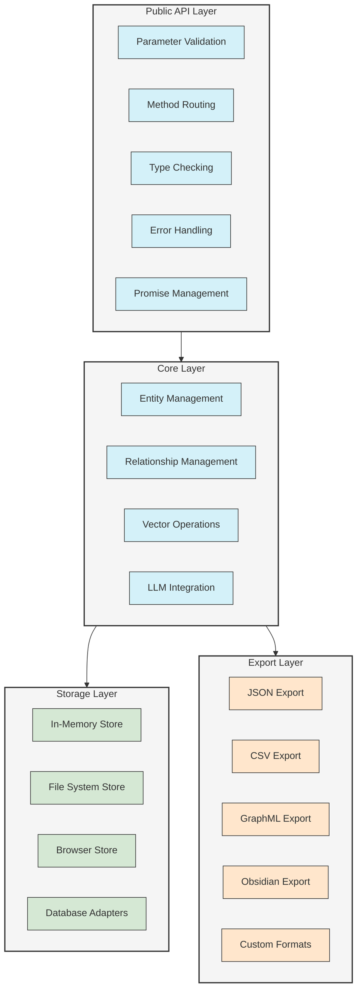
```mermaid
flowchart TD
    subgraph API["Public API Layer"]
        Validation[Parameter Validation]
        Routing[Method Routing]
        TypeCheck[Type Checking]
        ErrorHandling[Error Handling]
        Promises[Promise Management]
    end

    subgraph Core["Core Layer"]
        direction LR
        Entity[Entity Management]
        Relationship[Relationship Management]
        Vector[Vector Operations]
        LLM[LLM Integration]
    end

    subgraph Storage["Storage Layer"]
        Memory[In-Memory Store]
        File[File System Store]
        IndexedDB[Browser Store]
        Database[Database Adapters]
    end

    subgraph Export["Export Layer"]
        JSON[JSON Export]
        CSV[CSV Export]
        GraphML[GraphML Export]
        Obsidian[Obsidian Export]
        Custom[Custom Formats]
    end

    API --> Core
    Core --> Storage
    Core --> Export

    classDef layer fill:#f5f5f5,stroke:#333,stroke-width:2px
    classDef module fill:#d4f1f9,stroke:#333,stroke-width:1px
    classDef store fill:#d5e8d4,stroke:#333,stroke-width:1px
    classDef export fill:#ffe6cc,stroke:#333,stroke-width:1px

    class API,Core,Storage,Export layer
    class Validation,Routing,TypeCheck,ErrorHandling,Promises,Entity,Relationship,Vector,LLM module
    class Memory,File,IndexedDB,Database store
    class JSON,CSV,GraphML,Obsidian,Custom export
```

### 1. Public API Layer

The Public API Layer provides a clean, consistent interface for applications to interact with UltraLink. It exposes the core functionality while hiding implementation details.

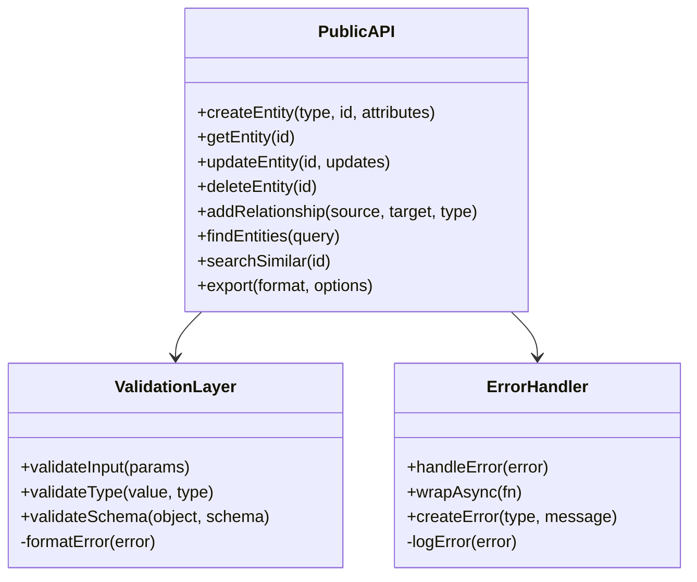
```mermaid
classDiagram
    class PublicAPI {
        +createEntity(type, id, attributes)
        +getEntity(id)
        +updateEntity(id, updates)
        +deleteEntity(id)
        +addRelationship(source, target, type)
        +findEntities(query)
        +searchSimilar(id)
        +export(format, options)
    }

    class ValidationLayer {
        +validateInput(params)
        +validateType(value, type)
        +validateSchema(object, schema)
        -formatError(error)
    }

    class ErrorHandler {
        +handleError(error)
        +wrapAsync(fn)
        +createError(type, message)
        -logError(error)
    }

    PublicAPI --> ValidationLayer
    PublicAPI --> ErrorHandler
```

Key responsibilities:
- Parameter validation
- Method routing to appropriate internal components
- Type checking
- Error handling and normalization
- Promise management

### 2. Core Layer

The Core Layer contains the central logic of UltraLink, divided into specialized modules:

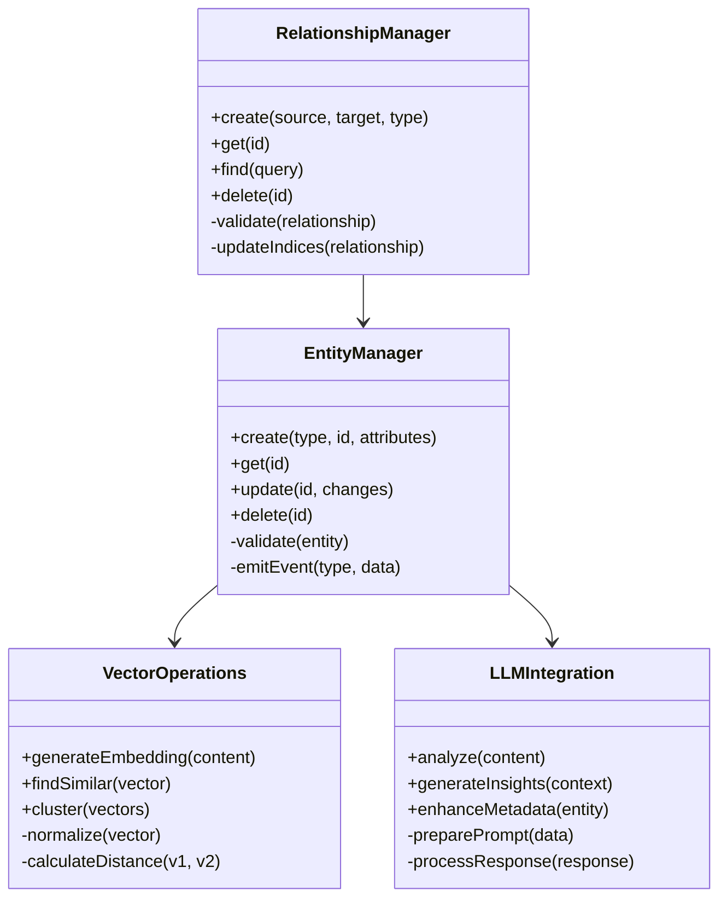
```mermaid
classDiagram
    class EntityManager {
        +create(type, id, attributes)
        +get(id)
        +update(id, changes)
        +delete(id)
        -validate(entity)
        -emitEvent(type, data)
    }

    class RelationshipManager {
        +create(source, target, type)
        +get(id)
        +find(query)
        +delete(id)
        -validate(relationship)
        -updateIndices(relationship)
    }

    class VectorOperations {
        +generateEmbedding(content)
        +findSimilar(vector)
        +cluster(vectors)
        -normalize(vector)
        -calculateDistance(v1, v2)
    }

    class LLMIntegration {
        +analyze(content)
        +generateInsights(context)
        +enhanceMetadata(entity)
        -preparePrompt(data)
        -processResponse(response)
    }

    EntityManager --> VectorOperations
    EntityManager --> LLMIntegration
    RelationshipManager --> EntityManager
```

#### Entity Management Module

Responsible for:
- Entity creation, retrieval, updating, and deletion
- Entity validation and type checking
- Attribute management
- Entity metadata tracking
- Entity events

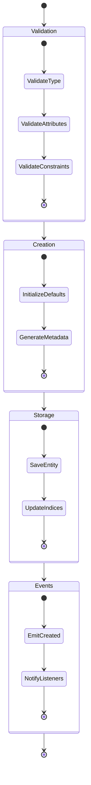
```mermaid
stateDiagram-v2
    [*] --> Validation
    Validation --> Creation
    Creation --> Storage
    Storage --> Events
    Events --> [*]

    state Validation {
        [*] --> ValidateType
        ValidateType --> ValidateAttributes
        ValidateAttributes --> ValidateConstraints
        ValidateConstraints --> [*]
    }

    state Creation {
        [*] --> InitializeDefaults
        InitializeDefaults --> GenerateMetadata
        GenerateMetadata --> [*]
    }

    state Storage {
        [*] --> SaveEntity
        SaveEntity --> UpdateIndices
        UpdateIndices --> [*]
    }

    state Events {
        [*] --> EmitCreated
        EmitCreated --> NotifyListeners
        NotifyListeners --> [*]
    }
```

#### Relationship Management Module

Responsible for:
- Link creation, retrieval, updating, and deletion
- Link validation
- Relationship traversal
- Link metadata management
- Relationship events

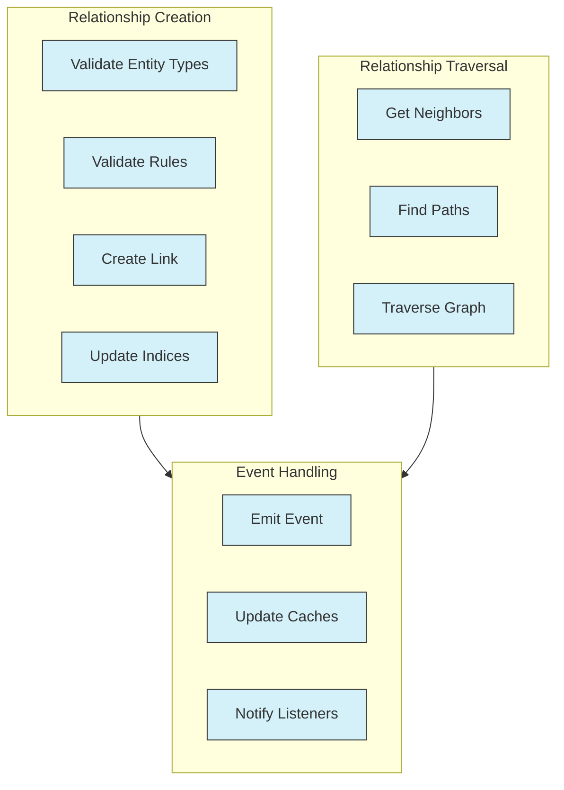
```mermaid
flowchart TD
    subgraph Creation["Relationship Creation"]
        ValidateTypes[Validate Entity Types]
        ValidateRules[Validate Rules]
        CreateLink[Create Link]
        UpdateIndices[Update Indices]
    end

    subgraph Traversal["Relationship Traversal"]
        GetNeighbors[Get Neighbors]
        FindPaths[Find Paths]
        TraverseGraph[Traverse Graph]
    end

    subgraph Events["Event Handling"]
        EmitEvent[Emit Event]
        UpdateCaches[Update Caches]
        NotifyListeners[Notify Listeners]
    end

    Creation --> Events
    Traversal --> Events

    classDef process fill:#d4f1f9,stroke:#333,stroke-width:1px
    class ValidateTypes,ValidateRules,CreateLink,UpdateIndices,GetNeighbors,FindPaths,TraverseGraph,EmitEvent,UpdateCaches,NotifyListeners process
```

#### Vector Operations Module

The Vector Operations Module manages all vector-related functionality in UltraLink:

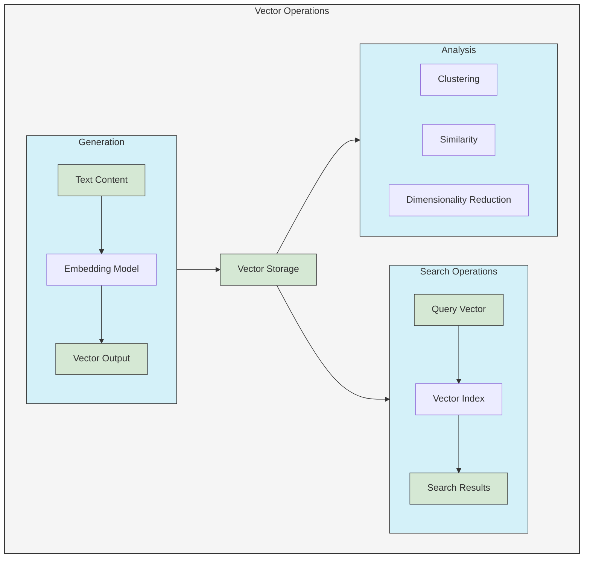
```mermaid
flowchart TD
    subgraph VectorOps["Vector Operations"]
        Generation[Vector Generation]
        Storage[Vector Storage]
        Search[Vector Search]
        Analysis[Vector Analysis]
    end

    subgraph Generation["Generation"]
        Text[Text Content]
        Embedding[Embedding Model]
        Vector[Vector Output]
        Text --> Embedding
        Embedding --> Vector
    end

    subgraph Search["Search Operations"]
        Query[Query Vector]
        Index[Vector Index]
        Results[Search Results]
        Query --> Index
        Index --> Results
    end

    subgraph Analysis["Analysis"]
        Clustering[Clustering]
        Similarity[Similarity]
        Reduction[Dimensionality Reduction]
    end

    Generation --> Storage
    Storage --> Search
    Storage --> Analysis

    classDef ops fill:#f5f5f5,stroke:#333,stroke-width:2px
    classDef process fill:#d4f1f9,stroke:#333,stroke-width:1px
    classDef data fill:#d5e8d4,stroke:#333,stroke-width:1px

    class VectorOps ops
    class Generation,Search,Analysis process
    class Text,Vector,Query,Results,Storage data
```

##### Vector Generation Pipeline

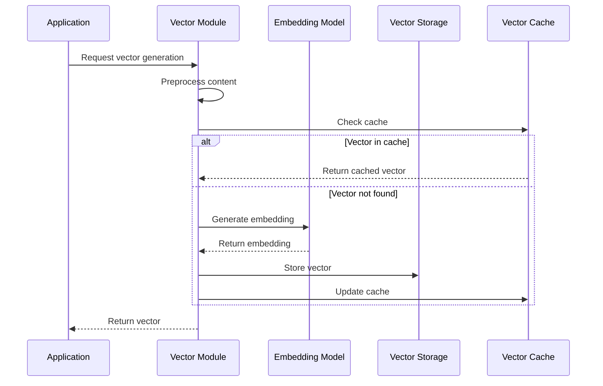
```mermaid
sequenceDiagram
    participant App as Application
    participant VM as Vector Module
    participant EM as Embedding Model
    participant VS as Vector Storage
    participant Cache as Vector Cache

    App->>VM: Request vector generation
    VM->>VM: Preprocess content
    VM->>Cache: Check cache
    alt Vector in cache
        Cache-->>VM: Return cached vector
    else Vector not found
        VM->>EM: Generate embedding
        EM-->>VM: Return embedding
        VM->>VS: Store vector
        VM->>Cache: Update cache
    end
    VM-->>App: Return vector
```

##### Vector Search and Similarity

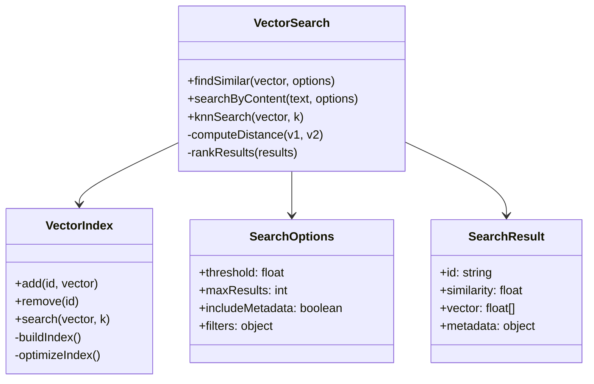
```mermaid
classDiagram
    class VectorSearch {
        +findSimilar(vector, options)
        +searchByContent(text, options)
        +knnSearch(vector, k)
        -computeDistance(v1, v2)
        -rankResults(results)
    }

    class VectorIndex {
        +add(id, vector)
        +remove(id)
        +search(vector, k)
        -buildIndex()
        -optimizeIndex()
    }

    class SearchOptions {
        +threshold: float
        +maxResults: int
        +includeMetadata: boolean
        +filters: object
    }

    class SearchResult {
        +id: string
        +similarity: float
        +vector: float[]
        +metadata: object
    }

    VectorSearch --> VectorIndex
    VectorSearch --> SearchOptions
    VectorSearch --> SearchResult
```

##### Vector Analysis and Clustering

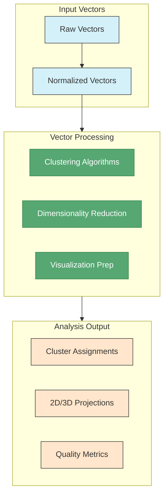
```mermaid
flowchart TD
    subgraph Input["Input Vectors"]
        Raw[Raw Vectors]
        Normalized[Normalized Vectors]
    end

    subgraph Processing["Vector Processing"]
        Clustering[Clustering Algorithms]
        DimReduction[Dimensionality Reduction]
        Visualization[Visualization Prep]
    end

    subgraph Output["Analysis Output"]
        Clusters[Cluster Assignments]
        Projections[2D/3D Projections]
        Metrics[Quality Metrics]
    end

    Raw --> Normalized
    Normalized --> Processing
    Processing --> Output

    classDef input fill:#d4f1f9,stroke:#333,stroke-width:1px
    classDef process fill:#57a773,stroke:#2e8049,color:white
    classDef output fill:#ffe6cc,stroke:#333,stroke-width:1px

    class Raw,Normalized input
    class Clustering,DimReduction,Visualization process
    class Clusters,Projections,Metrics output
```

The Vector Operations Module provides these key capabilities:

1. **Vector Generation**
   - Text to vector conversion
   - Multi-modal content support
   - Batch processing
   - Caching and optimization

2. **Vector Storage**
   - Efficient vector storage
   - Index management
   - Compression options
   - Persistence strategies

3. **Vector Search**
   - K-nearest neighbors search
   - Range queries
   - Hybrid search (vector + metadata)
   - Search optimization

4. **Vector Analysis**
   - Clustering algorithms
   - Dimensionality reduction
   - Similarity metrics
   - Quality assessment

#### LLM Integration Module

The LLM Integration Module manages interactions with language models:

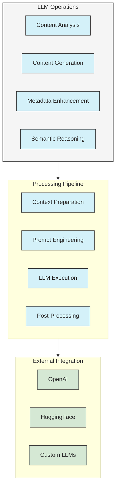
```mermaid
flowchart TD
    subgraph LLMOps["LLM Operations"]
        Analysis[Content Analysis]
        Generation[Content Generation]
        Enhancement[Metadata Enhancement]
        Reasoning[Semantic Reasoning]
    end

    subgraph Processing["Processing Pipeline"]
        Context[Context Preparation]
        Prompt[Prompt Engineering]
        Execution[LLM Execution]
        PostProcess[Post-Processing]
    end

    subgraph Integration["External Integration"]
        OpenAI[OpenAI]
        HuggingFace[HuggingFace]
        Custom[Custom LLMs]
    end

    LLMOps --> Processing
    Processing --> Integration

    classDef ops fill:#f5f5f5,stroke:#333,stroke-width:2px
    classDef process fill:#d4f1f9,stroke:#333,stroke-width:1px
    classDef integration fill:#d5e8d4,stroke:#333,stroke-width:1px

    class LLMOps ops
    class Analysis,Generation,Enhancement,Reasoning,Context,Prompt,Execution,PostProcess process
    class OpenAI,HuggingFace,Custom integration
```

##### LLM Request Flow

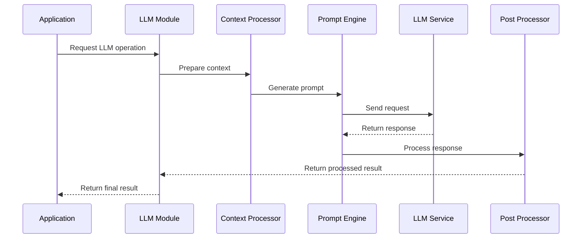
```mermaid
sequenceDiagram
    participant App as Application
    participant LM as LLM Module
    participant CP as Context Processor
    participant PE as Prompt Engine
    participant LLM as LLM Service
    participant PP as Post Processor

    App->>LM: Request LLM operation
    LM->>CP: Prepare context
    CP->>PE: Generate prompt
    PE->>LLM: Send request
    LLM-->>PE: Return response
    PE->>PP: Process response
    PP-->>LM: Return processed result
    LM-->>App: Return final result
```

##### LLM Integration Architecture

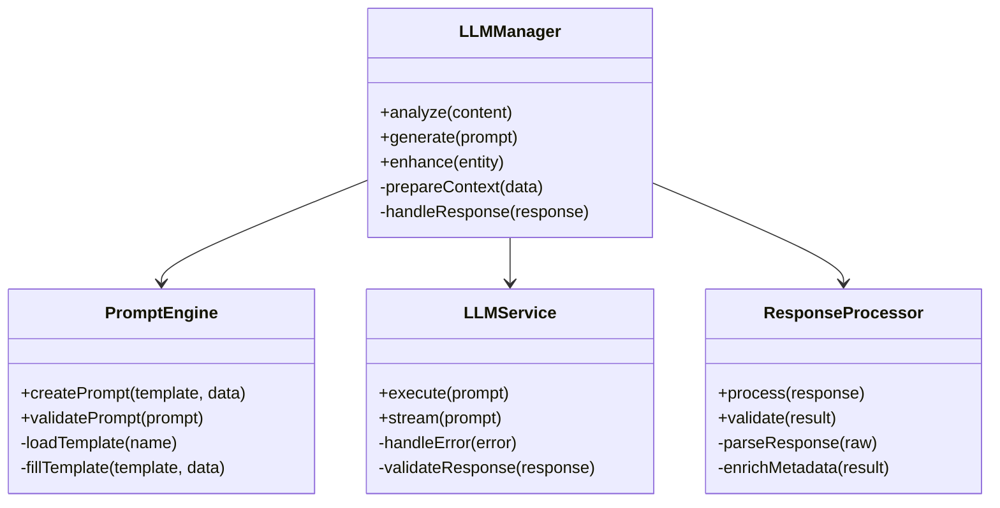
```mermaid
classDiagram
    class LLMManager {
        +analyze(content)
        +generate(prompt)
        +enhance(entity)
        -prepareContext(data)
        -handleResponse(response)
    }

    class PromptEngine {
        +createPrompt(template, data)
        +validatePrompt(prompt)
        -loadTemplate(name)
        -fillTemplate(template, data)
    }

    class LLMService {
        +execute(prompt)
        +stream(prompt)
        -handleError(error)
        -validateResponse(response)
    }

    class ResponseProcessor {
        +process(response)
        +validate(result)
        -parseResponse(raw)
        -enrichMetadata(result)
    }

    LLMManager --> PromptEngine
    LLMManager --> LLMService
    LLMManager --> ResponseProcessor
```

The LLM Integration Module provides:

1. **Content Analysis**
   - Semantic understanding
   - Entity extraction
   - Relationship inference
   - Content classification

2. **Content Generation**
   - Description generation
   - Summary creation
   - Relationship explanation
   - Documentation assistance

3. **Metadata Enhancement**
   - Attribute enrichment
   - Tag generation
   - Category inference
   - Quality assessment

4. **Semantic Reasoning**
   - Logical inference
   - Pattern recognition
   - Knowledge gap identification
   - Consistency checking

### 3. Storage Layer

The Storage Layer provides flexible and efficient data persistence across different environments:

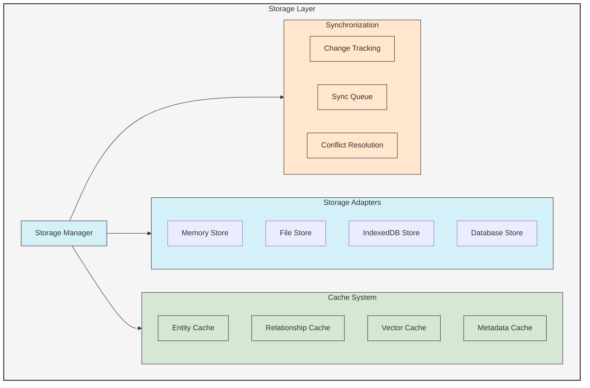
```mermaid
flowchart TD
    subgraph Storage["Storage Layer"]
        Manager[Storage Manager]
        Adapters[Storage Adapters]
        Cache[Cache Layer]
        Sync[Sync Manager]
    end

    subgraph Adapters["Storage Adapters"]
        Memory[Memory Store]
        File[File Store]
        IndexedDB[IndexedDB Store]
        DB[Database Store]
    end

    subgraph Cache["Cache System"]
        EntityCache[Entity Cache]
        RelCache[Relationship Cache]
        VectorCache[Vector Cache]
        MetaCache[Metadata Cache]
    end

    subgraph Sync["Synchronization"]
        Changes[Change Tracking]
        Queue[Sync Queue]
        Conflict[Conflict Resolution]
    end

    Manager --> Adapters
    Manager --> Cache
    Manager --> Sync

    classDef layer fill:#f5f5f5,stroke:#333,stroke-width:2px
    classDef component fill:#d4f1f9,stroke:#333,stroke-width:1px
    classDef cache fill:#d5e8d4,stroke:#333,stroke-width:1px
    classDef sync fill:#ffe6cc,stroke:#333,stroke-width:1px

    class Storage layer
    class Manager,Adapters component
    class Cache,EntityCache,RelCache,VectorCache,MetaCache cache
    class Sync,Changes,Queue,Conflict sync
```

#### Storage Manager Architecture

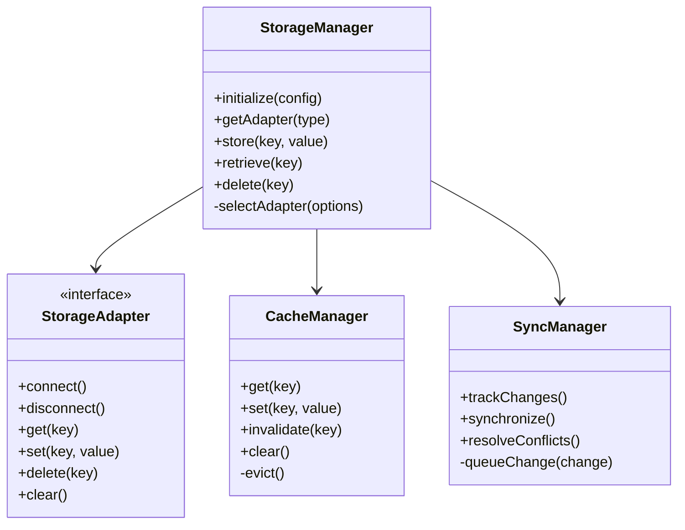
```mermaid
classDiagram
    class StorageManager {
        +initialize(config)
        +getAdapter(type)
        +store(key, value)
        +retrieve(key)
        +delete(key)
        -selectAdapter(options)
    }

    class StorageAdapter {
        <<interface>>
        +connect()
        +disconnect()
        +get(key)
        +set(key, value)
        +delete(key)
        +clear()
    }

    class CacheManager {
        +get(key)
        +set(key, value)
        +invalidate(key)
        +clear()
        -evict()
    }

    class SyncManager {
        +trackChanges()
        +synchronize()
        +resolveConflicts()
        -queueChange(change)
    }

    StorageManager --> StorageAdapter
    StorageManager --> CacheManager
    StorageManager --> SyncManager
```

#### Storage Adapters

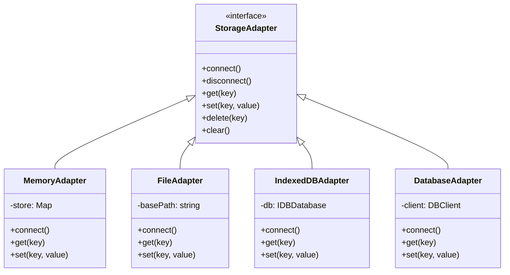
```mermaid
classDiagram
    class StorageAdapter {
        <<interface>>
        +connect()
        +disconnect()
        +get(key)
        +set(key, value)
        +delete(key)
        +clear()
    }

    class MemoryAdapter {
        -store: Map
        +connect()
        +get(key)
        +set(key, value)
    }

    class FileAdapter {
        -basePath: string
        +connect()
        +get(key)
        +set(key, value)
    }

    class IndexedDBAdapter {
        -db: IDBDatabase
        +connect()
        +get(key)
        +set(key, value)
    }

    class DatabaseAdapter {
        -client: DBClient
        +connect()
        +get(key)
        +set(key, value)
    }

    StorageAdapter <|-- MemoryAdapter
    StorageAdapter <|-- FileAdapter
    StorageAdapter <|-- IndexedDBAdapter
    StorageAdapter <|-- DatabaseAdapter
```

#### Cache System

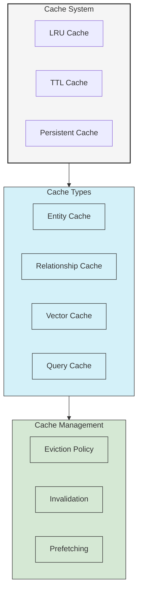
```mermaid
flowchart TD
    subgraph CacheSystem["Cache System"]
        LRU[LRU Cache]
        TTL[TTL Cache]
        Persistent[Persistent Cache]
    end

    subgraph CacheTypes["Cache Types"]
        Entity[Entity Cache]
        Relationship[Relationship Cache]
        Vector[Vector Cache]
        Query[Query Cache]
    end

    subgraph Management["Cache Management"]
        Eviction[Eviction Policy]
        Invalidation[Invalidation]
        Prefetch[Prefetching]
    end

    CacheSystem --> CacheTypes
    CacheTypes --> Management

    classDef system fill:#f5f5f5,stroke:#333,stroke-width:2px
    classDef types fill:#d4f1f9,stroke:#333,stroke-width:1px
    classDef management fill:#d5e8d4,stroke:#333,stroke-width:1px

    class CacheSystem system
    class CacheTypes,Entity,Relationship,Vector,Query types
    class Management,Eviction,Invalidation,Prefetch management
```

The Storage Layer provides these key capabilities:

1. **Flexible Storage Options**
   - In-memory storage for temporary use
   - File-based storage for Node.js environments
   - IndexedDB for browser persistence
   - Database adapters for external databases

2. **Efficient Caching**
   - Multi-level caching strategy
   - LRU and TTL cache policies
   - Automatic cache invalidation
   - Cache size management

3. **Synchronization**
   - Change tracking
   - Conflict resolution
   - Batch synchronization
   - Offline support

4. **Performance Optimization**
   - Lazy loading
   - Batch operations
   - Index management
   - Query optimization

### 4. Export Layer

The Export Layer handles transformations of the knowledge graph into different formats:

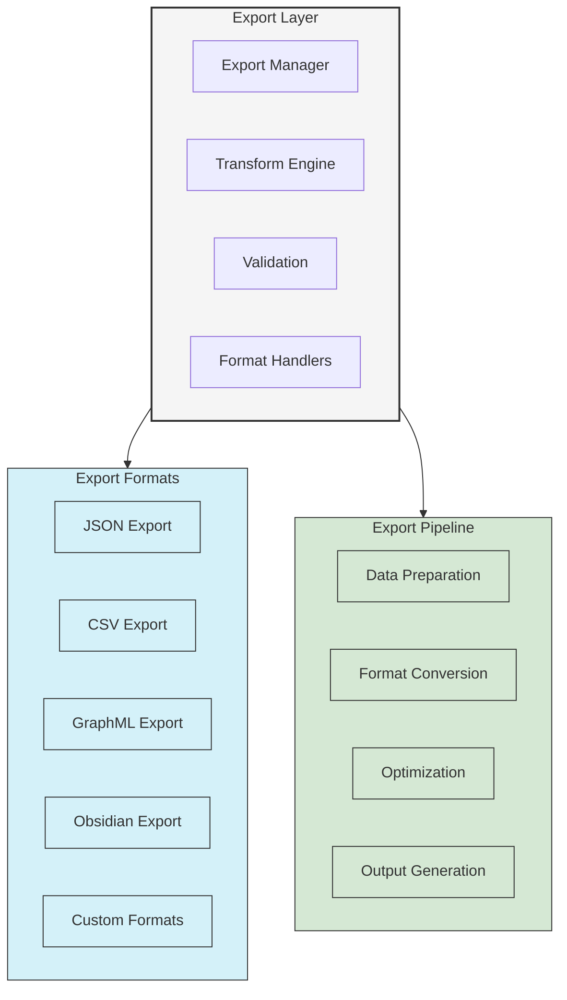
```mermaid
flowchart TD
    subgraph Export["Export Layer"]
        Manager[Export Manager]
        Transform[Transform Engine]
        Validate[Validation]
        Format[Format Handlers]
    end

    subgraph Formats["Export Formats"]
        JSON[JSON Export]
        CSV[CSV Export]
        GraphML[GraphML Export]
        Obsidian[Obsidian Export]
        Custom[Custom Formats]
    end

    subgraph Pipeline["Export Pipeline"]
        Prepare[Data Preparation]
        Convert[Format Conversion]
        Optimize[Optimization]
        Output[Output Generation]
    end

    Export --> Formats
    Export --> Pipeline

    classDef layer fill:#f5f5f5,stroke:#333,stroke-width:2px
    classDef format fill:#d4f1f9,stroke:#333,stroke-width:1px
    classDef pipeline fill:#d5e8d4,stroke:#333,stroke-width:1px

    class Export layer
    class Formats,JSON,CSV,GraphML,Obsidian,Custom format
    class Pipeline,Prepare,Convert,Optimize,Output pipeline
```

#### Export Architecture

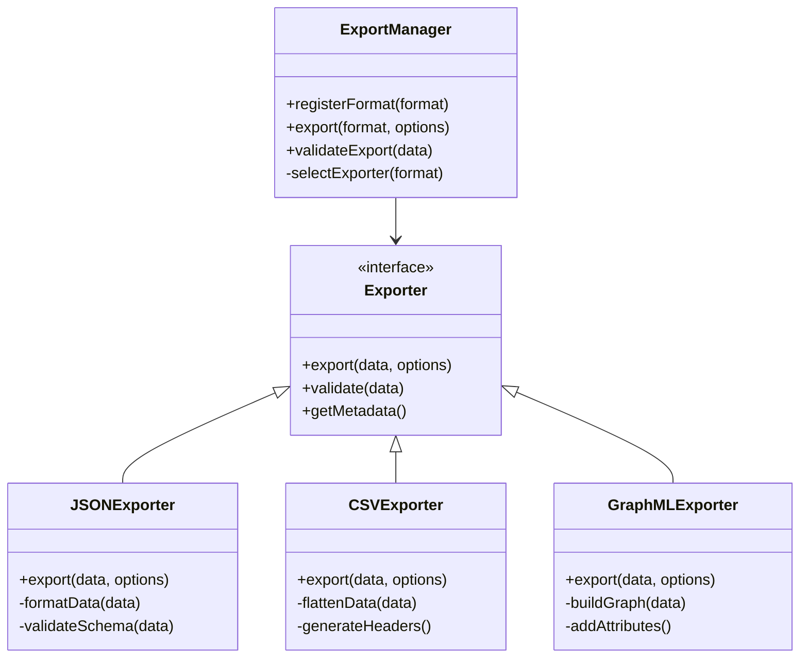
```mermaid
classDiagram
    class ExportManager {
        +registerFormat(format)
        +export(format, options)
        +validateExport(data)
        -selectExporter(format)
    }

    class Exporter {
        <<interface>>
        +export(data, options)
        +validate(data)
        +getMetadata()
    }

    class JSONExporter {
        +export(data, options)
        -formatData(data)
        -validateSchema(data)
    }

    class CSVExporter {
        +export(data, options)
        -flattenData(data)
        -generateHeaders()
    }

    class GraphMLExporter {
        +export(data, options)
        -buildGraph(data)
        -addAttributes()
    }

    Exporter <|-- JSONExporter
    Exporter <|-- CSVExporter
    Exporter <|-- GraphMLExporter
    ExportManager --> Exporter
```

#### Export Pipeline

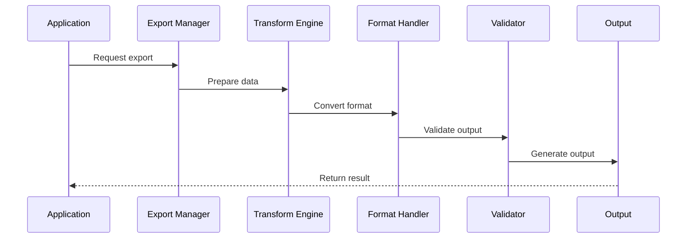
```mermaid
sequenceDiagram
    participant App as Application
    participant EM as Export Manager
    participant TE as Transform Engine
    participant FH as Format Handler
    participant Val as Validator
    participant Out as Output

    App->>EM: Request export
    EM->>TE: Prepare data
    TE->>FH: Convert format
    FH->>Val: Validate output
    Val->>Out: Generate output
    Out-->>App: Return result
```

The Export Layer provides:

1. **Format Support**
   - JSON for data exchange
   - CSV for tabular analysis
   - GraphML for visualization
   - Obsidian for knowledge management
   - Custom format extensibility

2. **Transformation Features**
   - Schema validation
   - Data normalization
   - Format conversion
   - Metadata preservation

3. **Export Options**
   - Selective export
   - Batch processing
   - Streaming support
   - Compression options

4. **Quality Assurance**
   - Format validation
   - Data integrity checks
   - Error handling
   - Export verification

## Memory Management

UltraLink implements several strategies to manage memory efficiently:

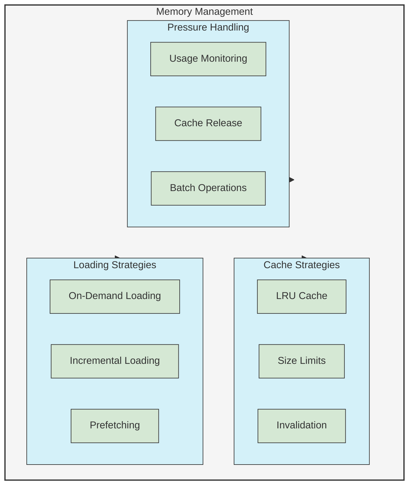
```mermaid
flowchart TD
    subgraph Memory["Memory Management"]
        Cache[Cache Management]
        Loading[Lazy Loading]
        Pressure[Pressure Handling]
    end

    subgraph Cache["Cache Strategies"]
        LRU[LRU Cache]
        Size[Size Limits]
        Invalid[Invalidation]
    end

    subgraph Loading["Loading Strategies"]
        Demand[On-Demand Loading]
        Incremental[Incremental Loading]
        Prefetch[Prefetching]
    end

    subgraph Pressure["Pressure Handling"]
        Monitor[Usage Monitoring]
        Release[Cache Release]
        Batch[Batch Operations]
    end

    Memory --> Cache
    Memory --> Loading
    Memory --> Pressure

    classDef main fill:#f5f5f5,stroke:#333,stroke-width:2px
    classDef strat fill:#d4f1f9,stroke:#333,stroke-width:1px
    classDef action fill:#d5e8d4,stroke:#333,stroke-width:1px

    class Memory main
    class Cache,Loading,Pressure strat
    class LRU,Size,Invalid,Demand,Incremental,Prefetch,Monitor,Release,Batch action
```

### Entity Caching

- LRU cache for recently accessed entities
- Configurable cache size limits
- Automatic cache invalidation on updates

### Lazy Loading

- Entities are loaded on-demand rather than all at once
- Relationships can be loaded incrementally
- Vector embeddings loaded only when needed

### Memory Pressure Handling

- Monitors memory usage and responds to high usage
- Can release non-essential caches under pressure
- Batched operations for large data sets

## Error Handling Strategy

```mermaid
flowchart TD
    subgraph Strategy["Error Handling"]
        Validation[Input Validation]
        Categories[Error Categories]
        Handling[Error Handling]
        Recovery[Error Recovery]
    end

    subgraph Types["Error Types"]
        Validation --> Input[Input Errors]
        Validation --> Type[Type Errors]
        Validation --> Format[Format Errors]
        Categories --> Business[Business Errors]
        Categories --> Technical[Technical Errors]
        Categories --> External[External Errors]
    end

    subgraph Actions["Error Actions"]
        Handling --> Log[Error Logging]
        Handling --> Notify[User Notification]
        Recovery --> Retry[Retry Logic]
        Recovery --> Fallback[Fallback Options]
    end

    classDef strategy fill:#f5f5f5,stroke:#333,stroke-width:2px
    classDef type fill:#d4f1f9,stroke:#333,stroke-width:1px
    classDef action fill:#d5e8d4,stroke:#333,stroke-width:1px

    class Strategy strategy
    class Types,Input,Type,Format,Business,Technical,External type
    class Actions,Log,Notify,Retry,Fallback action
```

UltraLink implements a comprehensive error handling strategy:

1. **Descriptive Errors**: All errors include detailed messages
2. **Error Categories**: Errors are categorized for easier handling
3. **Graceful Degradation**: Features degrade gracefully when possible
4. **Retry Mechanisms**: Built-in retry for transient failures
5. **Validation First**: Input validation before expensive operations

## Security Considerations

```mermaid
flowchart TD
    subgraph Security["Security Measures"]
        Input[Input Validation]
        API[API Security]
        Data[Data Security]
        Config[Configuration]
    end

    subgraph Validation["Input Validation"]
        Schema[Schema Validation]
        Sanitize[Input Sanitization]
        TypeCheck[Type Checking]
    end

    subgraph APIKey["API Security"]
        Keys[Key Management]
        Auth[Authentication]
        Access[Access Control]
    end

    subgraph DataSec["Data Security"]
        Serialize[Serialization Safety]
        Encrypt[Encryption]
        Protect[Data Protection]
    end

    Security --> Validation
    Security --> APIKey
    Security --> DataSec

    classDef security fill:#f5f5f5,stroke:#333,stroke-width:2px
    classDef measure fill:#d4f1f9,stroke:#333,stroke-width:1px
    classDef action fill:#d5e8d4,stroke:#333,stroke-width:1px

    class Security security
    class Validation,APIKey,DataSec measure
    class Schema,Sanitize,TypeCheck,Keys,Auth,Access,Serialize,Encrypt,Protect action
```

UltraLink's architecture includes security measures:

1. **Input Validation**: All public methods validate input
2. **API Key Management**: Secure handling of external service keys
3. **Serialization Safety**: Prevents dangerous objects in serialization
4. **Safe Defaults**: Security-focused default configurations

## Performance Optimizations

```mermaid
flowchart TD
    subgraph Performance["Performance Optimizations"]
        Access[Access Patterns]
        Operations[Bulk Operations]
        Algorithms[Algorithm Optimization]
        Caching[Cache Strategy]
        Vector[Vector Operations]
    end

    subgraph Access["Access Patterns"]
        Index[Indexed Access]
        Lazy[Lazy Loading]
        Batch[Batch Processing]
    end

    subgraph Ops["Operations"]
        Bulk[Bulk Updates]
        Stream[Streaming]
        Parallel[Parallel Processing]
    end

    subgraph Cache["Caching"]
        Multi[Multi-Level]
        Strategy[Cache Strategy]
        Invalidate[Invalidation]
    end

    Performance --> Access
    Performance --> Ops
    Performance --> Cache

    classDef perf fill:#f5f5f5,stroke:#333,stroke-width:2px
    classDef pattern fill:#d4f1f9,stroke:#333,stroke-width:1px
    classDef action fill:#d5e8d4,stroke:#333,stroke-width:1px

    class Performance perf
    class Access,Ops,Cache pattern
    class Index,Lazy,Batch,Bulk,Stream,Parallel,Multi,Strategy,Invalidate action
```

Performance is optimized through several mechanisms:

1. **Indexed Access**: O(1) entity and relationship lookup
2. **Batch Operations**: Optimized batch operations for bulk changes
3. **Efficient Algorithms**: Optimized graph traversal algorithms
4. **Caching Strategy**: Multi-level caching for frequent operations
5. **Vector Operation Optimization**: Efficient vector calculations

## Multi-Environment Support

```mermaid
flowchart TD
    subgraph Environments["Environment Support"]
        Browser[Browser Environment]
        Node[Node.js Environment]
        Hybrid[Hybrid Environment]
    end

    subgraph Browser["Browser Features"]
        IndexedDB[IndexedDB Storage]
        Worker[Web Workers]
        Memory[Memory Management]
        BrowserExport[Browser Exports]
    end

    subgraph Node["Node.js Features"]
        FileSystem[File System]
        Streams[Stream Processing]
        Server[Server Optimizations]
        NodeAPI[Node.js APIs]
    end

    Environments --> Browser
    Environments --> Node

    classDef env fill:#f5f5f5,stroke:#333,stroke-width:2px
    classDef feature fill:#d4f1f9,stroke:#333,stroke-width:1px
    classDef impl fill:#d5e8d4,stroke:#333,stroke-width:1px

    class Environments env
    class Browser,Node feature
    class IndexedDB,Worker,Memory,BrowserExport,FileSystem,Streams,Server,NodeAPI impl
```

UltraLink is designed to work across different JavaScript environments:

### Browser Environment

- Uses IndexedDB for persistence
- Web Worker support for vector operations
- Memory-conscious operations
- Browser-optimized exports

### Node.js Environment

- File system storage option
- Stream-based exports for large datasets
- Optimized for server workloads
- Integration with Node.js APIs

## API Design Philosophy

```mermaid
mindmap
  root((API Design))
    Consistency
      Method Patterns
      Naming Conventions
      Parameter Order
    Discoverability
      Logical Grouping
      Clear Categories
      Documentation
    Progressive Complexity
      Simple Operations
      Advanced Features
      Expert Mode
    Promises
      Async Operations
      Error Handling
      Progress Tracking
    Type Safety
      TypeScript Support
      Runtime Checks
      Schema Validation
```

UltraLink's API is designed with these principles:

1. **Consistency**: Methods follow consistent patterns
2. **Discoverability**: Related methods are logically grouped
3. **Progressive Complexity**: Simple operations are simple, complex operations are possible
4. **Promises**: Asynchronous operations return promises
5. **Type Safety**: Strong typing with TypeScript support

## Conclusion

UltraLink's architecture provides a robust foundation for knowledge graph management with a focus on flexibility, performance, and developer experience. The modular design allows for customization and extension, while the layered approach ensures separation of concerns and maintainability.

For more details on specific components, refer to the following documentation:

- [Core Components](./components.md)
- [Data Flow](./data-flow.md)
- [Storage Systems](../technical/storage.md)
- [Extension Mechanisms](../advanced/extending-ultralink.md)