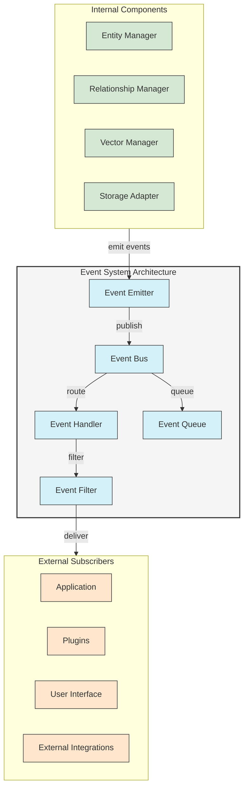
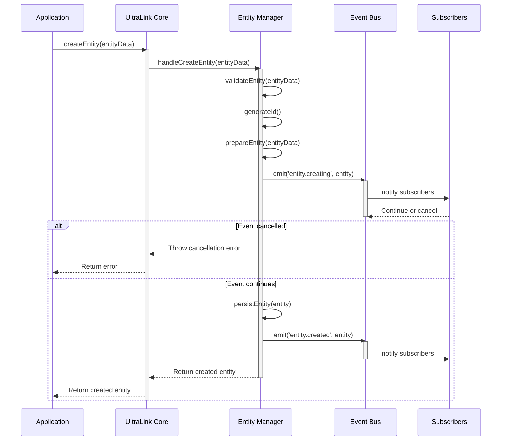
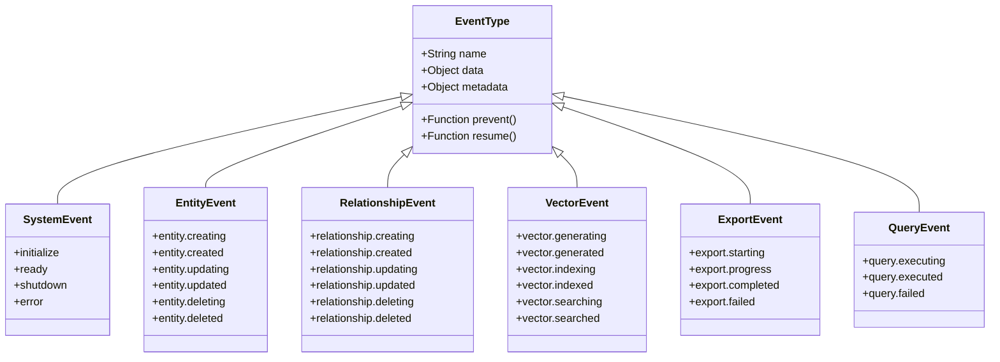
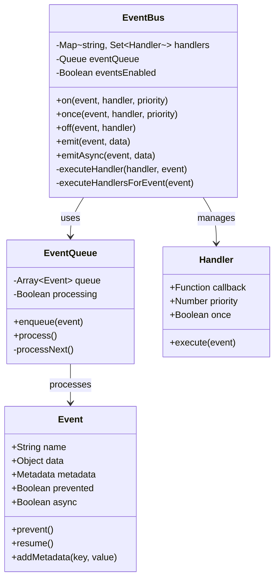
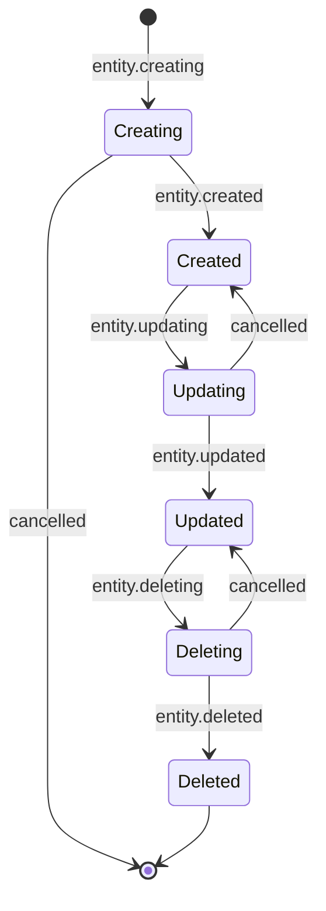

# Event System Architecture

UltraLink's event system provides a powerful mechanism for building reactive applications and enabling communication between different components of your application. This document outlines the architecture and usage patterns of the event system.

## Event System Overview

UltraLink implements a comprehensive event system that enables both internal components and external subscribers to respond to changes in the knowledge graph.



## Event Flow

The following sequence diagram illustrates the flow of events through the UltraLink system:



## Event Types

UltraLink emits a variety of events throughout its operation:



## Event Bus Implementation



## Lifecycle Events

The following diagram illustrates the lifecycle events emitted during entity operations:



## Working with Events

### Event Subscription

```typescript
import { UltraLink } from '@ultralink/core';

const ultralink = new UltraLink();
await ultralink.initialize();

// Subscribe to entity created events
ultralink.events.on('entity.created', (event) => {
  const entity = event.data;
  console.log(`Entity created: ${entity.id} of type ${entity.type}`);
});

// Subscribe to events with wildcards
ultralink.events.on('entity.*', (event) => {
  console.log(`Entity event: ${event.name}`);
  console.log(`Entity: ${event.data.id}`);
});

// One-time subscription
ultralink.events.once('relationship.created', (event) => {
  console.log(`Relationship created: ${event.data.id}`);
});

// Priority handlers (higher numbers execute first)
ultralink.events.on('entity.creating', validateEntityHandler, 100);
ultralink.events.on('entity.creating', logEntityCreation, 10);
```

### Event Cancellation

```typescript
// Prevent an operation by cancelling the event
ultralink.events.on('entity.creating', (event) => {
  const entity = event.data;
  
  // Check if entity meets criteria
  if (!entity.attributes.title) {
    console.error('Entity must have a title');
    event.prevent(); // Cancels the operation
    return;
  }
  
  // Modify the entity before creation
  entity.attributes.createdBy = 'system';
});

// Handle cancellation errors
try {
  await ultralink.createEntity({ 
    type: 'document', 
    attributes: {} // Missing title
  });
} catch (error) {
  if (error.code === 'EVENT_PREVENTED') {
    console.log('Entity creation was prevented');
  }
}
```

### Asynchronous Event Handling

```typescript
// Asynchronous event handlers
ultralink.events.on('entity.created', async (event) => {
  const entity = event.data;
  
  // Perform asynchronous operations
  await updateExternalSystem(entity);
  await sendNotification(entity);
});

// Emit asynchronous events
await ultralink.events.emitAsync('custom.event', { 
  data: 'value'
});
```

## Event Monitoring

```mermaid
graph LR
    subgraph Monitoring["Event Monitoring"]
        direction TB
        Counter[Event Counters]
        Timing[Event Timing]
        Logging[Event Logging]
    end
    
    subgraph Events["Event Types"]
        direction TB
        System[System Events]
        Entity[Entity Events]
        Relationship[Relationship Events]
        Vector[Vector Events]
        Export[Export Events]
        Query[Query Events]
    end
    
    Events --> Monitoring
    
    classDef monitoring fill:#f5f5f5,stroke:#333,stroke-width:1px
    classDef events fill:#d4f1f9,stroke:#333,stroke-width:1px
    
    class Monitoring monitoring
    class Events,System,Entity,Relationship,Vector,Export,Query events
```



### Event Debugging

```typescript
// Enable detailed event logging
ultralink.events.enableDebug();

// Monitor specific events
ultralink.events.monitor('entity.*', {
  counter: true,    // Count events
  timing: true,     // Time event processing
  logging: 'debug', // Log level
});

// Get event statistics
const stats = ultralink.events.getStats();
console.log(`Entity created events: ${stats.counts['entity.created']}`);
console.log(`Avg. processing time: ${stats.timing['entity.created'].avg}ms`);
```

## Custom Event Plugins

Developers can extend UltraLink's event system with custom plugins:

```typescript
// Create a custom event plugin
class NotificationPlugin {
  constructor(options = {}) {
    this.options = options;
  }
  
  install(ultralink) {
    // Register event handlers
    ultralink.events.on('entity.created', this.handleEntityCreated.bind(this));
    ultralink.events.on('entity.updated', this.handleEntityUpdated.bind(this));
    
    // Add custom events
    ultralink.events.registerCustomEvent('notification.sent');
  }
  
  async handleEntityCreated(event) {
    const entity = event.data;
    
    // Process the event
    if (this.shouldNotify(entity)) {
      await this.sendNotification(entity, 'created');
      
      // Emit custom event
      await event.emitter.emit('notification.sent', {
        entity,
        type: 'created',
        timestamp: new Date()
      });
    }
  }
  
  // Additional methods...
}

// Use the plugin
ultralink.use(new NotificationPlugin({
  channels: ['email', 'slack']
}));
```

## Best Practices

1. **Performance Considerations**:
   - Use event filters to limit processing unnecessary events
   - Consider asynchronous event handling for expensive operations
   - Monitor event processing times to identify bottlenecks

2. **Error Handling**:
   - Always implement error handling in event subscribers
   - Use try/catch blocks in async handlers
   - Consider how to handle partial failures

3. **Design Patterns**:
   - Use event-driven architecture for loosely coupled components
   - Implement the observer pattern with event subscriptions
   - Consider the Command Query Responsibility Segregation (CQRS) pattern

## Related Documentation

- [Events API Reference](../api/events-api.md)
- [Plugin Development Guide](../advanced/plugin-development.md)
- [Performance Monitoring](../performance/monitoring.md)
- [Reactive Applications with UltraLink](../guides/reactive-applications.md) 