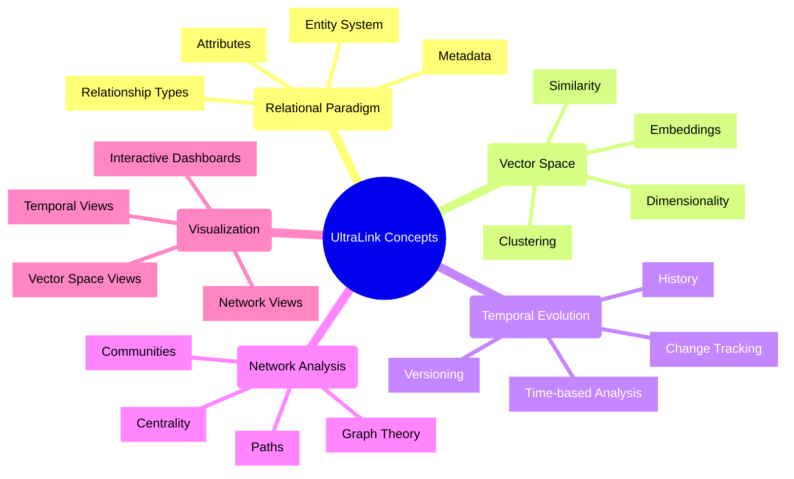
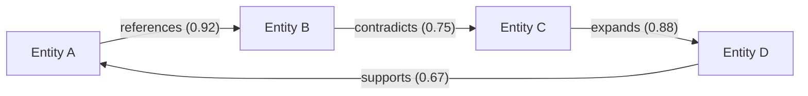
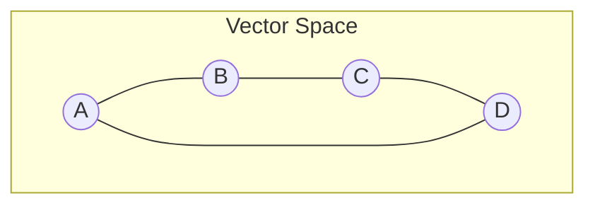
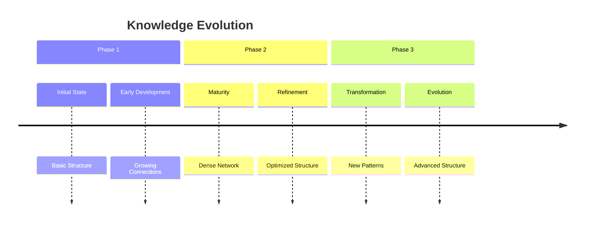
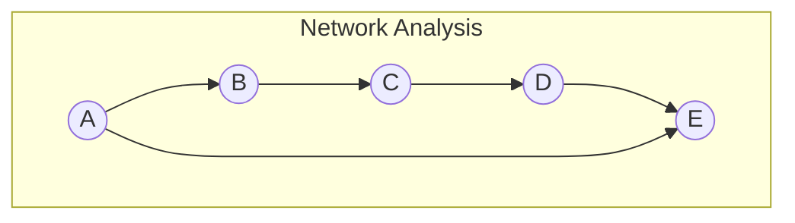
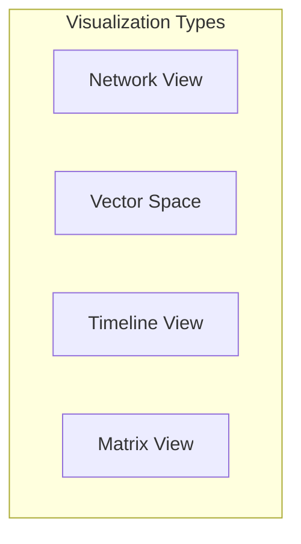
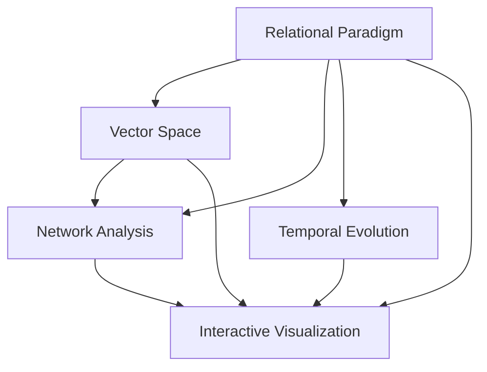

# UltraLink Core Concepts 🧠

This document provides an overview of the core concepts that form the foundation of UltraLink. Understanding these concepts is essential for effectively using and extending the UltraLink framework.

## Conceptual Overview



## Core Concept Areas

UltraLink is built around five core concept areas that work together to provide a comprehensive framework for managing and visualizing relational content:

### 1. Relational Paradigm

The foundation of UltraLink is a rich relational model that goes beyond simple links to provide context, meaning, and structure to relationships.

[**Learn more about the Relational Paradigm →**](./relational-paradigm.md)



Key concepts:
- **Entities**: Nodes in the knowledge graph with types, attributes, and metadata
- **Relationships**: Typed, directed connections between entities with attributes
- **Attributes**: Properties that describe entities and relationships
- **Metadata**: Information about the graph itself, including schema and statistics

### 2. Vector Space Model

UltraLink uses vector embeddings to represent semantic meaning and enable advanced operations like similarity search and clustering.

[**Learn more about the Vector Space Model →**](./vector-space.md)



Key concepts:
- **Vector Embeddings**: Numerical representations of entities in multi-dimensional space
- **Similarity Metrics**: Methods for measuring semantic similarity between entities
- **Clustering**: Grouping similar entities based on their vector representations
- **Dimensionality Reduction**: Techniques for visualizing high-dimensional vectors

### 3. Temporal Evolution

UltraLink tracks how entities, relationships, and knowledge evolve over time, enabling historical analysis and temporal visualization.

[**Learn more about Temporal Evolution →**](./temporal-evolution.md)



Key concepts:
- **Versioning**: Tracking different versions of the knowledge graph
- **Change History**: Recording modifications to entities and relationships
- **Temporal Analysis**: Analyzing how the graph evolves over time
- **Time-based Filtering**: Viewing the graph at specific points in time

### 4. Network Analysis

UltraLink provides tools for analyzing the structure and dynamics of the knowledge graph as a network.

[**Learn more about Network Analysis →**](./network-analysis.md)



Key concepts:
- **Graph Metrics**: Measures of network structure and properties
- **Centrality**: Identifying important nodes in the network
- **Path Analysis**: Finding and analyzing paths between entities
- **Community Detection**: Identifying groups of closely related entities

### 5. Interactive Visualization

UltraLink provides rich, interactive visualizations for exploring and understanding complex relational data.

[**Learn more about Visualization →**](../guides/visualization.md)



Key concepts:
- **Network Visualization**: Visual representation of the graph structure
- **Vector Space Visualization**: 2D/3D representation of vector embeddings
- **Temporal Visualization**: Visualizing changes over time
- **Interactive Dashboards**: Combining multiple visualizations for comprehensive analysis

## Concept Relationships

These core concepts are deeply interconnected and work together to provide a comprehensive framework:



## Practical Application

Understanding how these concepts apply in practice is essential for effective use of UltraLink:

### Example: Research Knowledge Graph

```javascript
// Create a research knowledge graph
const researchKG = new UltraLink();

// Add entities (Relational Paradigm)
const paper = researchKG.addEntity('paper-2023', 'publication', {
  title: 'Vector Embeddings in Knowledge Graphs',
  authors: ['alice-chen', 'bob-smith']
});

// Add relationships (Relational Paradigm)
researchKG.addLink('paper-2023', 'vector-embeddings', 'introduces', {
  importance: 0.95
});

// Generate vector embeddings (Vector Space)
await researchKG.generateVectors();

// Find similar entities (Vector Space)
const similar = researchKG.findSimilar('paper-2023', {
  minSimilarity: 0.7
});

// Track changes over time (Temporal Evolution)
researchKG.createVersion('v1.0');
researchKG.updateEntity('paper-2023', { citations: 10 });
researchKG.createVersion('v1.1');

// Analyze network properties (Network Analysis)
const centrality = researchKG.analyze.centrality();
const communities = researchKG.analyze.communities();

// Create interactive visualization (Visualization)
const dashboard = researchKG.createDashboard({
  views: ['network', 'vector', 'temporal']
});
```

## Conceptual Foundations

UltraLink builds on several foundational concepts from different fields:

### Graph Theory

- **Nodes and Edges**: The basic building blocks of graphs
- **Graph Properties**: Characteristics like connectivity, density, and diameter
- **Graph Algorithms**: Methods for analyzing and manipulating graphs

### Vector Semantics

- **Distributional Semantics**: The idea that meaning can be represented by context
- **Vector Space Models**: Representing meaning in multi-dimensional space
- **Embedding Techniques**: Methods for generating vector representations

### Temporal Dynamics

- **Version Control**: Tracking changes to content over time
- **Temporal Logic**: Reasoning about time-dependent properties
- **Change Analysis**: Understanding patterns of change

### Information Visualization

- **Visual Encoding**: Mapping data to visual properties
- **Interactive Techniques**: Methods for user interaction with visualizations
- **Cognitive Principles**: Understanding how humans perceive and interpret visualizations

## Further Reading

- [UltraLink API Reference](../api/README.md)
- [Implementation Guides](../guides/README.md)
- [Example Applications](../../examples/README.md)
- [Advanced Topics](../advanced/README.md) 