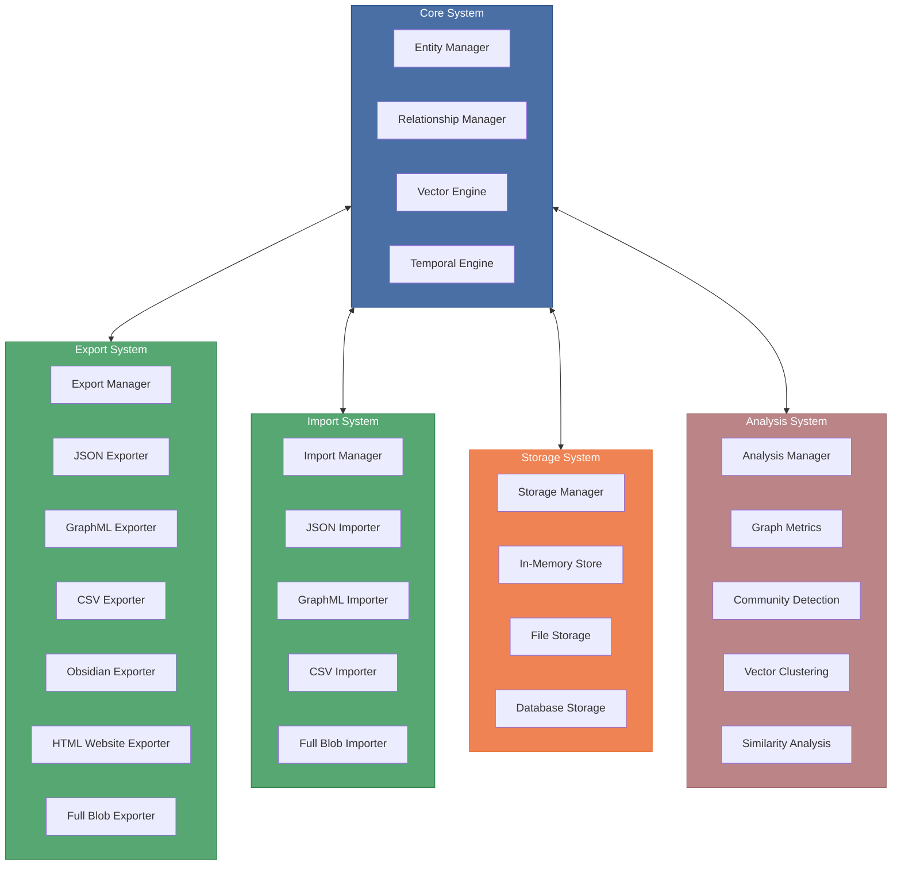
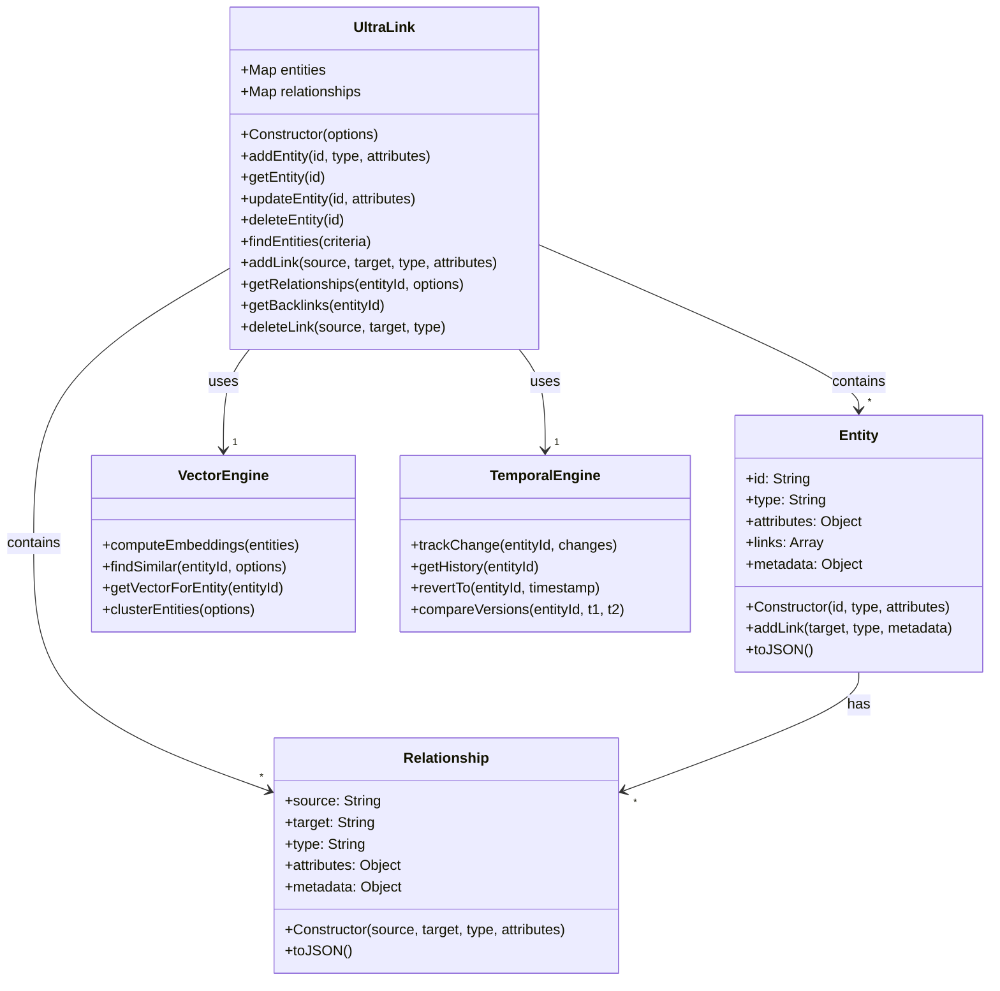
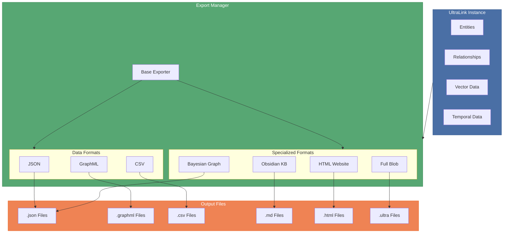
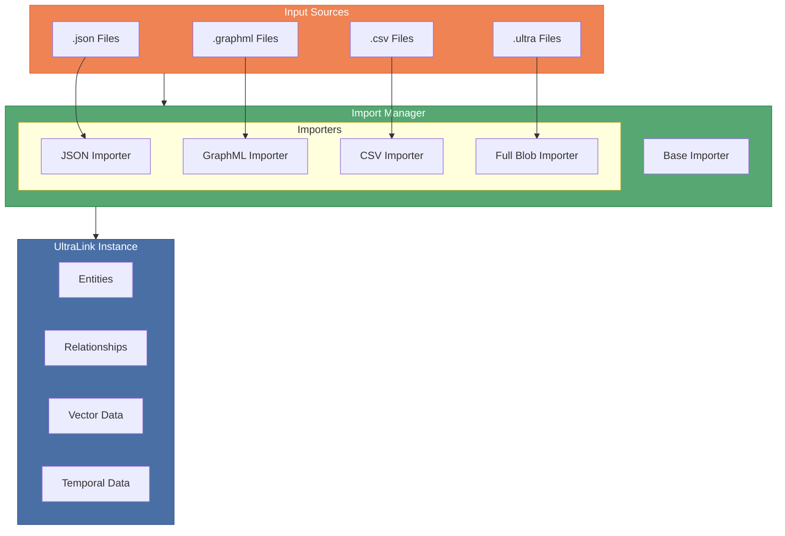
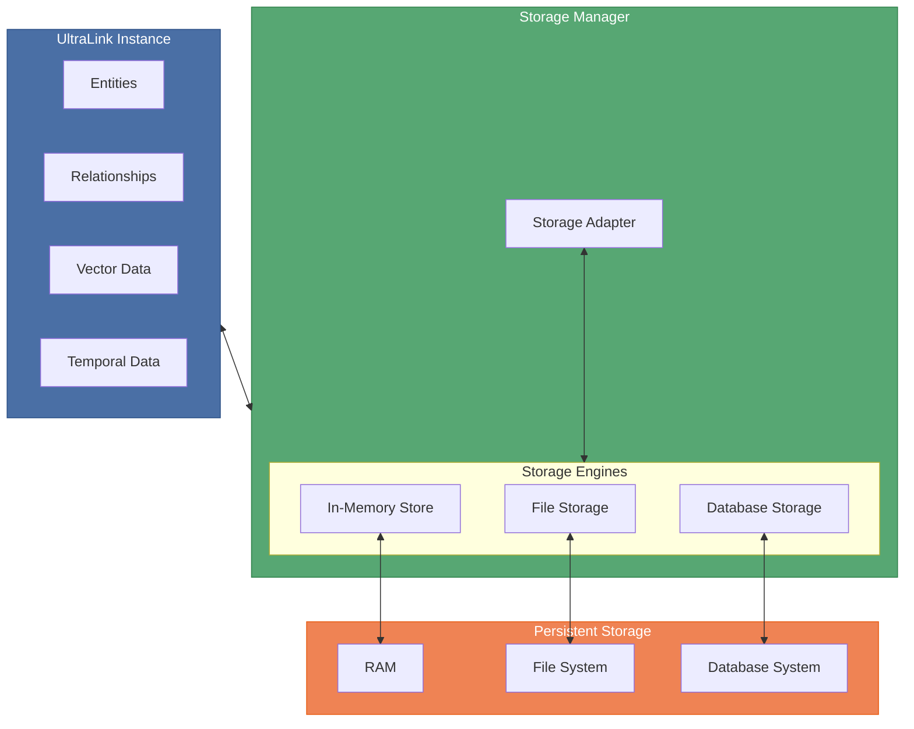
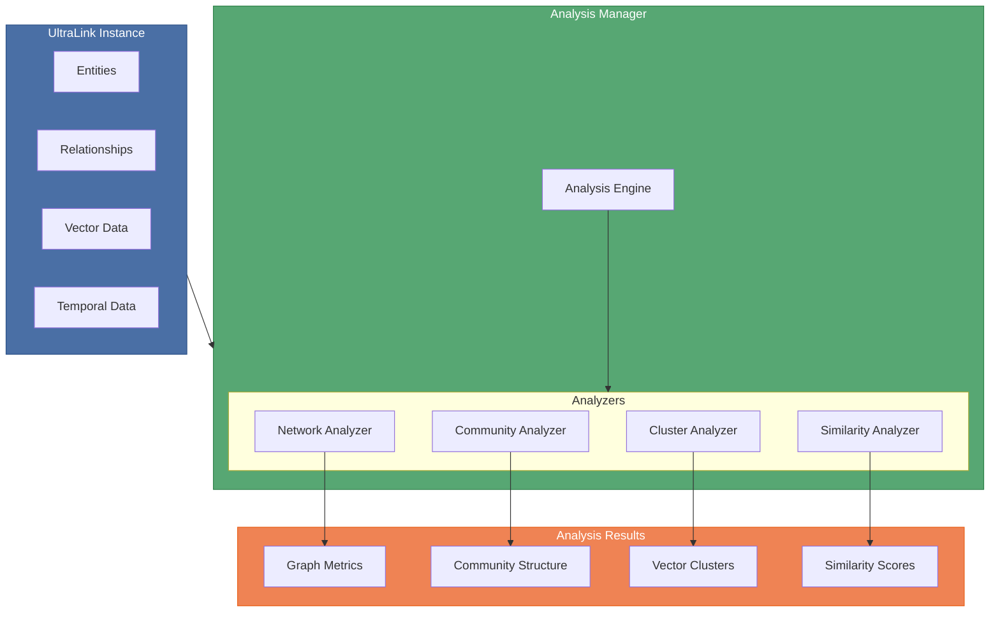
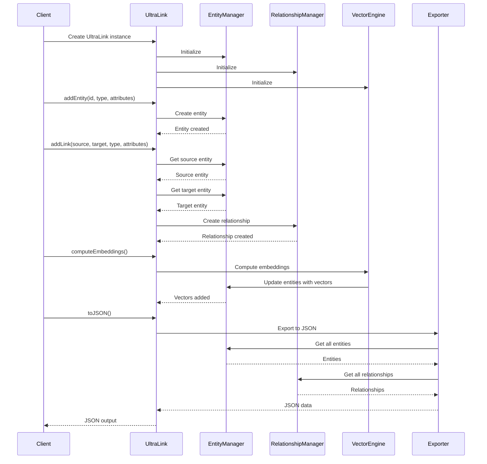
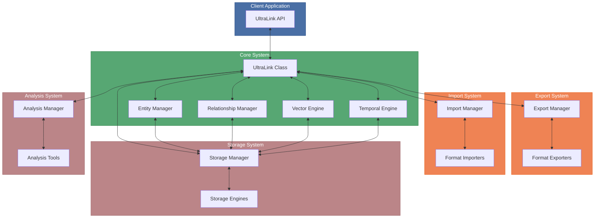

# UltraLink Architecture

This document explains the architecture and design principles of UltraLink, providing a comprehensive overview of how the system is structured and how the components interact.

## Architecture Overview

UltraLink follows a modular architecture that separates concerns into distinct components while maintaining a cohesive system. The high-level architecture can be visualized as follows:



## Core System

The Core System is the heart of UltraLink, responsible for managing the knowledge graph's entities and relationships.



### Entity Manager

The Entity Manager handles the creation, retrieval, updating, and deletion of entities in the knowledge graph.

Key responsibilities:
- Entity lifecycle management
- Entity attribute management
- Entity indexing and lookup
- Entity filtering and search

### Relationship Manager

The Relationship Manager handles the connections between entities, including creation, retrieval, and deletion of relationships.

Key responsibilities:
- Relationship lifecycle management
- Relationship attribute management
- Relationship validation
- Relationship querying and filtering

### Vector Engine

The Vector Engine handles the computation and management of vector embeddings for entities, enabling semantic search and similarity analysis.

Key responsibilities:
- Vector computation
- Vector storage and retrieval
- Vector similarity search
- Vector dimensionality reduction

### Temporal Engine

The Temporal Engine handles the tracking and management of changes to entities and relationships over time.

Key responsibilities:
- Change tracking
- Version history
- Temporal querying
- Temporal analysis

## Export System

The Export System handles the transformation of UltraLink data into various formats for integration with other tools and systems.



### Export Manager

The Export Manager coordinates the export process, selecting the appropriate exporter and managing the export configuration.

### Base Exporter

The Base Exporter provides common functionality for all exporters, including filtering, output handling, and error management.

### Data Format Exporters

Data format exporters transform UltraLink data into standard data interchange formats:

- **JSON Exporter**: Exports to JSON format for general-purpose data exchange
- **GraphML Exporter**: Exports to GraphML format for graph visualization tools
- **CSV Exporter**: Exports to CSV format for spreadsheet analysis

### Specialized Format Exporters

Specialized format exporters transform UltraLink data into application-specific formats:

- **Obsidian Exporter**: Exports to Obsidian-compatible Markdown files with wiki-links
- **Bayesian Graph Exporter**: Exports to Bayesian network formats for probabilistic analysis
- **HTML Website Exporter**: Exports to a self-contained website with interactive visualization
- **Full Blob Exporter**: Exports the complete UltraLink instance with all data and configuration

## Import System

The Import System handles the ingestion of data from various sources into UltraLink.



### Import Manager

The Import Manager coordinates the import process, selecting the appropriate importer and managing the import configuration.

### Base Importer

The Base Importer provides common functionality for all importers, including validation, entity creation, and error management.

### Importers

The importers transform data from various formats into UltraLink entities and relationships:

- **JSON Importer**: Imports from JSON format
- **GraphML Importer**: Imports from GraphML format
- **CSV Importer**: Imports from CSV format
- **Full Blob Importer**: Imports from a complete UltraLink data blob

## Storage System

The Storage System handles the persistence of UltraLink data.



### Storage Manager

The Storage Manager coordinates the storage process, selecting the appropriate storage engine and managing the storage configuration.

### Storage Adapter

The Storage Adapter provides a consistent interface for all storage engines, handling serialization, deserialization, and error management.

### Storage Engines

The storage engines handle the persistence of UltraLink data:

- **In-Memory Store**: Stores data in memory for fast access
- **File Storage**: Stores data in the file system for persistence
- **Database Storage**: Stores data in a database for advanced querying and scalability

## Analysis System

The Analysis System provides tools for analyzing the knowledge graph to extract insights.



### Analysis Manager

The Analysis Manager coordinates the analysis process, selecting the appropriate analyzers and managing the analysis configuration.

### Analysis Engine

The Analysis Engine provides common functionality for all analyzers, including data access, computation, and result formatting.

### Analyzers

The analyzers extract insights from the knowledge graph:

- **Network Analyzer**: Computes network metrics such as density, diameter, and centrality
- **Community Analyzer**: Detects communities and clusters in the knowledge graph
- **Cluster Analyzer**: Analyzes vector clusters to identify related entities
- **Similarity Analyzer**: Computes similarity between entities based on various measures

## Data Flow

This diagram illustrates the typical data flow through the UltraLink system:



## Component Interactions

This diagram shows how the various components of UltraLink interact:



## Design Principles

UltraLink follows several key design principles:

### Modularity

UltraLink is built as a collection of loosely coupled modules, each with a specific responsibility. This allows for flexibility and extensibility.

### Separation of Concerns

Each component has a clearly defined responsibility, with minimal overlap between components. This makes the system easier to understand, test, and maintain.

### Progressive Enhancement

UltraLink provides a core set of features that are enhanced with additional capabilities like vector embeddings and temporal tracking. These can be enabled or disabled as needed.

### Extensibility

UltraLink is designed to be extended with new features and functionality. Custom exporters, importers, and analyzers can be added to the system.

### Performance and Scalability

UltraLink is built with performance and scalability in mind, using efficient data structures and algorithms to handle large knowledge graphs.

## Technical Details

### Entities and Relationships

Entities and relationships are the fundamental building blocks of the UltraLink knowledge graph.

Entities are represented as JavaScript objects with the following structure:

```javascript
{
  id: "unique-entity-id",
  type: "entity-type",
  attributes: {
    // Custom attributes
    name: "Entity Name",
    description: "Entity description",
    // ...
  },
  links: [
    // Outgoing relationships
  ],
  metadata: {
    created: "2023-06-15T12:00:00Z",
    modified: "2023-06-15T12:00:00Z",
    // ...
  }
}
```

Relationships are represented as JavaScript objects with the following structure:

```javascript
{
  source: "source-entity-id",
  target: "target-entity-id",
  type: "relationship-type",
  attributes: {
    // Custom attributes
    weight: 0.85,
    date: "2023-06-15",
    // ...
  },
  metadata: {
    created: "2023-06-15T12:00:00Z",
    modified: "2023-06-15T12:00:00Z",
    // ...
  }
}
```

### Vector Embeddings

When enabled, vector embeddings provide a semantic representation of entities in a high-dimensional vector space. This enables semantic search, similarity analysis, and clustering.

Vector embeddings are computed using machine learning models like BERT or FastText, and are stored with entities:

```javascript
{
  id: "entity-id",
  type: "entity-type",
  attributes: { /* ... */ },
  vector: [0.1, 0.2, 0.3, /* ... */], // Vector embedding
  // ...
}
```

### Temporal Data

When enabled, temporal tracking maintains a history of changes to entities and relationships. This allows for point-in-time analysis and recovery.

Temporal data is stored with entities and relationships:

```javascript
{
  id: "entity-id",
  type: "entity-type",
  attributes: { /* ... */ },
  temporal: {
    created: "2023-06-15T12:00:00Z",
    modified: "2023-06-15T12:00:00Z",
    history: [
      {
        timestamp: "2023-06-10T10:30:00Z",
        changes: {
          "attributes.name": {
            from: "Old Name",
            to: "New Name"
          }
        }
      }
      // ...
    ]
  }
  // ...
}
```

## Integration Points

UltraLink provides several integration points for connecting with other systems:

### API

The UltraLink API provides a programmatic interface for interacting with the knowledge graph.

### Export Formats

UltraLink can export data to various formats for integration with other tools:

- JSON for general-purpose data exchange
- GraphML for graph visualization tools
- CSV for spreadsheet analysis
- Obsidian for knowledge management
- HTML Website for interactive visualization
- Full Blob for complete data backup and transfer

### Import Formats

UltraLink can import data from various sources:

- JSON for general-purpose data import
- GraphML for importing from graph visualization tools
- CSV for importing from spreadsheet tools
- Full Blob for restoring from backup

### Storage Backends

UltraLink can store data in various backends:

- In-memory for fast access
- File system for persistence
- Database for advanced querying and scalability 