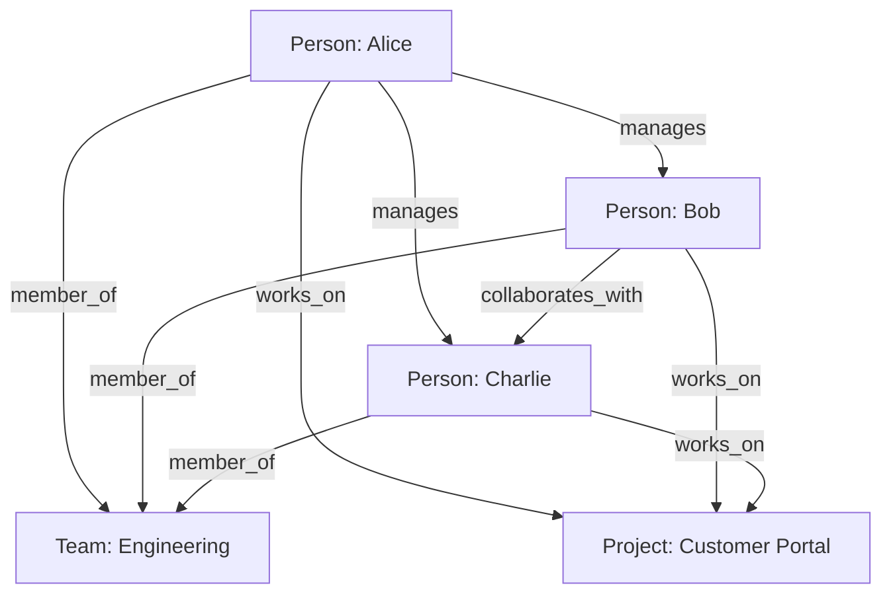
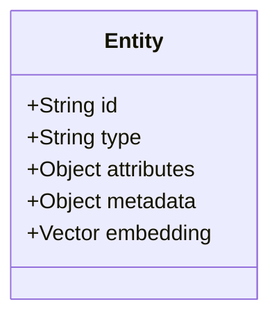
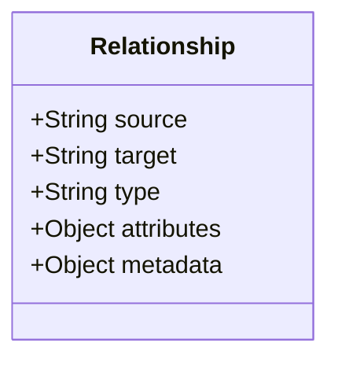
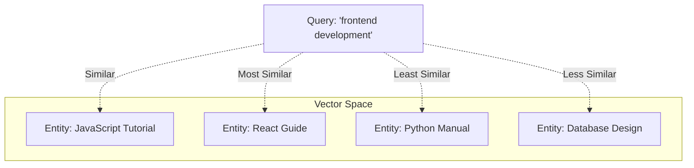
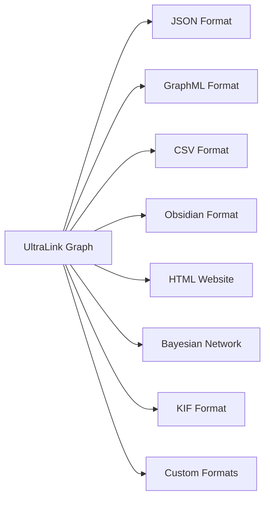
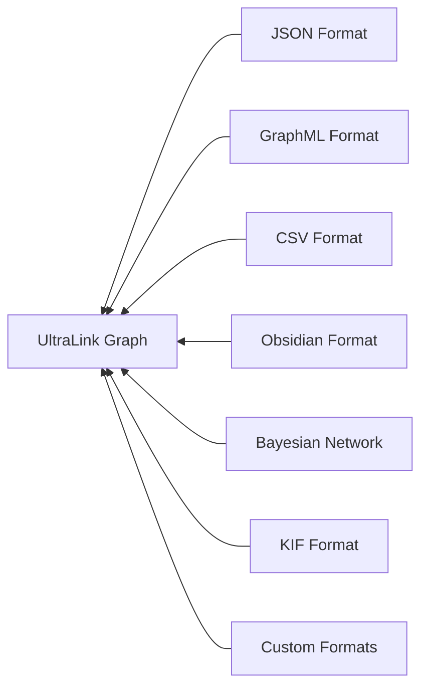

# UltraLink Core Concepts

This guide introduces the fundamental concepts of UltraLink, providing a strong foundation for understanding how UltraLink represents and works with knowledge graphs.

## Table of Contents

- [Knowledge Graph Model](#knowledge-graph-model)
- [Entities](#entities)
- [Relationships](#relationships)
- [Attributes and Metadata](#attributes-and-metadata)
- [Vector Embeddings](#vector-embeddings)
- [Events and Reactivity](#events-and-reactivity)
- [Exporters and Importers](#exporters-and-importers)
- [Core Principles](#core-principles)

## Knowledge Graph Model

UltraLink is built around a property graph model, which represents knowledge as a network of interconnected entities (nodes) and relationships (edges).



In UltraLink, this property graph model is implemented with a focus on:

- **Flexibility**: Entities and relationships can have any structure needed
- **Extensibility**: The system can be extended with custom exporters, importers, and plugins
- **Performance**: Efficient storage and retrieval of entities and relationships
- **Interoperability**: Export and import capabilities for various formats

## Entities

Entities are the nodes in the knowledge graph. They represent discrete objects, concepts, or things in your domain.

### Entity Structure

Each entity in UltraLink consists of:



- **ID**: A unique identifier for the entity (e.g., 'alice', 'project-a', 'concept-42')
- **Type**: The category or class of the entity (e.g., 'person', 'project', 'concept')
- **Attributes**: Properties that describe the entity (e.g., name, age, status)
- **Metadata**: Information about the entity itself (e.g., creation date, source, confidence)
- **Embedding**: Optional vector representation for semantic search

Example entity in JSON representation:

```json
{
  "id": "alice",
  "type": "person",
  "attributes": {
    "name": "Alice Johnson",
    "title": "Lead Developer",
    "skills": ["JavaScript", "React", "Node.js"],
    "experience": 8
  },
  "metadata": {
    "created": "2023-01-15T12:30:45Z",
    "modified": "2023-02-20T09:15:30Z",
    "source": "employee-database",
    "confidence": 1.0
  }
}
```

### Entity Types

UltraLink allows you to define any entity types that make sense for your domain. Common examples include:

- People, organizations, or agents
- Documents, articles, or knowledge artifacts
- Concepts, topics, or ideas
- Physical objects or locations
- Events or temporal occurrences
- Variables or parameters (for Bayesian networks)

## Relationships

Relationships are the edges that connect entities in the knowledge graph. They represent the ways entities interact, relate to, or affect each other.

### Relationship Structure

Each relationship in UltraLink consists of:



- **Source**: The ID of the entity where the relationship originates
- **Target**: The ID of the entity where the relationship points to
- **Type**: The nature of the relationship (e.g., 'knows', 'works_for', 'contains')
- **Attributes**: Properties that describe the relationship (e.g., since, strength, context)
- **Metadata**: Information about the relationship itself (e.g., creation date, source, confidence)

Example relationship in JSON representation:

```json
{
  "source": "alice",
  "target": "bob",
  "type": "manages",
  "attributes": {
    "since": "2021-03-15",
    "directReport": true
  },
  "metadata": {
    "created": "2021-03-15T09:00:00Z",
    "modified": "2023-01-10T14:25:12Z",
    "source": "org-chart",
    "confidence": 1.0
  }
}
```

### Relationship Types

UltraLink allows any relationship types that describe the connections in your domain. Relationships can be:

- **Social**: 'knows', 'friends_with', 'reports_to'
- **Organizational**: 'member_of', 'works_for', 'manages'
- **Conceptual**: 'related_to', 'similar_to', 'derived_from'
- **Causal**: 'causes', 'influences', 'depends_on'
- **Temporal**: 'precedes', 'follows', 'during'
- **Spatial**: 'contains', 'near', 'within'

### Relationship Direction

All relationships in UltraLink are directional, flowing from the source entity to the target entity. If you need bidirectional relationships, you can create two relationships in opposite directions or use a specific relationship type that implies bidirectionality.

## Attributes and Metadata

Both entities and relationships can have attributes and metadata, which provide rich descriptions and context.

### Attributes

Attributes describe the properties of entities and relationships. They can be:

- **Primitive Values**: Strings, numbers, booleans, dates
- **Arrays**: Lists of values
- **Nested Objects**: Complex structured data

```javascript
// Entity with various attribute types
await ultralink.addEntity('alice', 'person', {
  name: "Alice Johnson",             // string
  age: 32,                           // number
  active: true,                      // boolean
  hired: new Date('2020-03-15'),     // date
  skills: ['JavaScript', 'Python'],  // array
  address: {                         // nested object
    street: "123 Main St",
    city: "San Francisco",
    state: "CA"
  }
});
```

### Metadata

Metadata provides information about the entities and relationships themselves rather than their inherent properties. Common metadata includes:

- **Provenance**: Where the data came from
- **Confidence**: How certain we are about the data
- **Temporal Information**: When the data was created, modified, or is valid
- **Permissions**: Who can access or modify the data
- **Versioning**: Information about versions or revisions

```javascript
// Entity with metadata
await ultralink.addEntity('research-finding', 'finding', 
  { title: "Increased efficacy in treatment group", result: "statistically significant" },
  { 
    source: "clinical-trial-123",
    confidence: 0.95,
    created: new Date().toISOString(),
    author: "researcher-456",
    version: "1.2.0"
  }
);
```

## Vector Embeddings

UltraLink supports vector embeddings for entities, enabling semantic search and similarity matching.

### What are Vector Embeddings?

Vector embeddings are numerical representations of entities in a high-dimensional space, where semantic similarity is captured by vector distance. These embeddings make it possible to:

- Find semantically similar entities
- Perform fuzzy matching beyond keyword search
- Cluster entities by meaning
- Build recommendation systems



### How Embeddings Work in UltraLink

UltraLink allows you to:

1. **Create embeddings** for entities using external embedding models
2. **Store embeddings** with entities in the knowledge graph
3. **Search by similarity** using vector comparisons
4. **Combine semantic and attribute-based search** for powerful hybrid queries

```javascript
// Add embedding to an entity
await ultralink.setEntityEmbedding('document-123', new Float32Array([0.1, 0.2, ...]);

// Find similar entities
const similar = await ultralink.findSimilarEntities('document-123', {
  limit: 5,
  minSimilarity: 0.7
});
```

## Events and Reactivity

UltraLink includes an event system that allows your application to react to changes in the knowledge graph.

### Event Types

UltraLink emits events for various operations:

- **Entity Events**: 'entity.added', 'entity.updated', 'entity.removed'
- **Relationship Events**: 'relationship.added', 'relationship.updated', 'relationship.removed'
- **Export Events**: 'export.started', 'export.completed', 'export.failed'
- **Import Events**: 'import.started', 'import.completed', 'import.failed'
- **System Events**: 'system.ready', 'system.error'
- **Custom Events**: User-defined events for application-specific needs

### Using Events

Events enable reactive programming patterns with UltraLink:

```javascript
// Listen for entity events
ultralink.events.on('entity.added', (entity) => {
  console.log(`New entity added: ${entity.id}`);
  // Update UI, trigger side effects, etc.
});

// Listen for multiple events
ultralink.events.on(['entity.updated', 'entity.removed'], (payload) => {
  // Handle both update and remove events
});

// Listen to all events with wildcard
ultralink.events.on('*', (eventType, ...args) => {
  console.log(`Event occurred: ${eventType}`);
});
```

## Exporters and Importers

UltraLink's exporters and importers enable interoperability with various formats and systems.

### Export Process

The export process transforms the internal knowledge graph representation into external formats:



Each exporter handles:
- Entity and relationship transformation
- Format-specific serialization
- Handling of attributes and metadata
- Optimizations for the specific format

### Import Process

The import process transforms external data into UltraLink's internal representation:



Each importer handles:
- Parsing the external format
- Mapping to UltraLink's data model
- Validation of imported data
- Resolution of references and links

## Core Principles

UltraLink is designed around several core principles that guide its implementation and usage:

### Flexibility First

UltraLink doesn't impose a rigid schema on your data. You can define any entity types, relationship types, and attributes that make sense for your domain. This flexibility allows UltraLink to adapt to a wide range of use cases.

### Interoperability

UltraLink prioritizes interoperability with other systems through its extensive import and export capabilities. This enables UltraLink to fit into existing workflows and ecosystems rather than forcing users to adopt a closed system.

### Performance and Scalability

UltraLink is designed to handle knowledge graphs of various sizes efficiently. The internal implementation includes optimizations for memory usage, query performance, and export/import operations.

### Extensibility

UltraLink is built to be extended with custom exporters, importers, and plugins. This extensibility ensures that UltraLink can evolve to meet new requirements and support additional formats and use cases.

### Developer Experience

UltraLink provides a clear, consistent API that aims to make working with knowledge graphs intuitive and productive. The library includes comprehensive documentation, helpful error messages, and sensible defaults to enhance the developer experience.

## Conclusion

These core concepts form the foundation of UltraLink's knowledge graph system. Understanding entities, relationships, attributes, metadata, and how they all work together will help you leverage UltraLink effectively in your applications.

As you continue with UltraLink, you'll explore more advanced topics like query optimization, custom exporters, and integration patterns, but these fundamentals will remain central to your work with knowledge graphs.

For practical examples of these concepts in action, see the [Getting Started Tutorial](../tutorials/getting-started.md) and the [API User Guide](../guides/api-user-guide.md). 