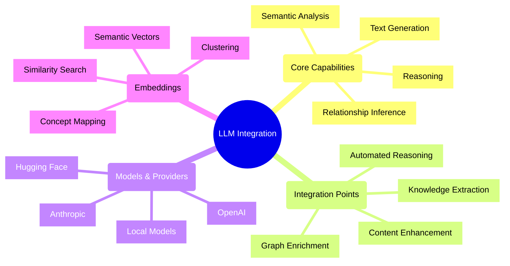
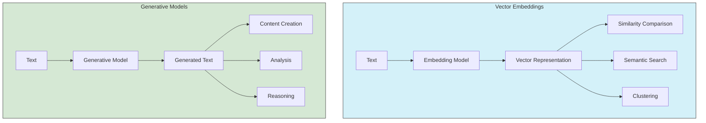
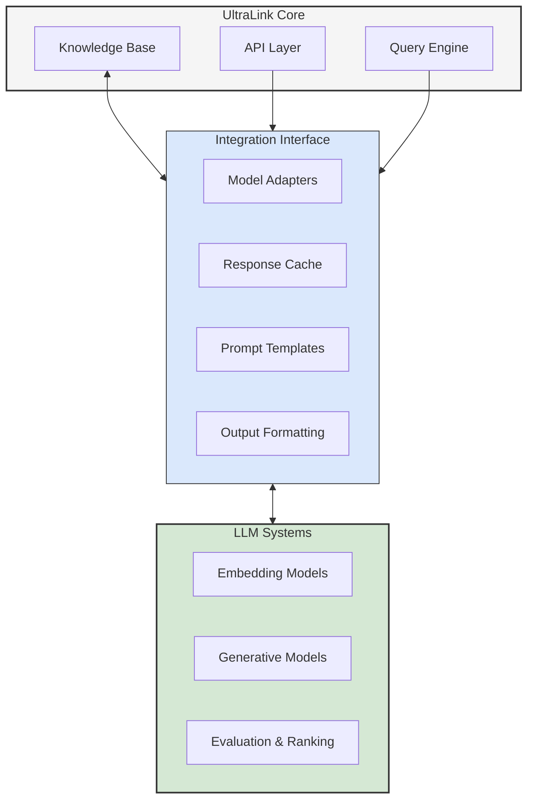
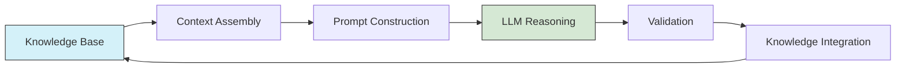
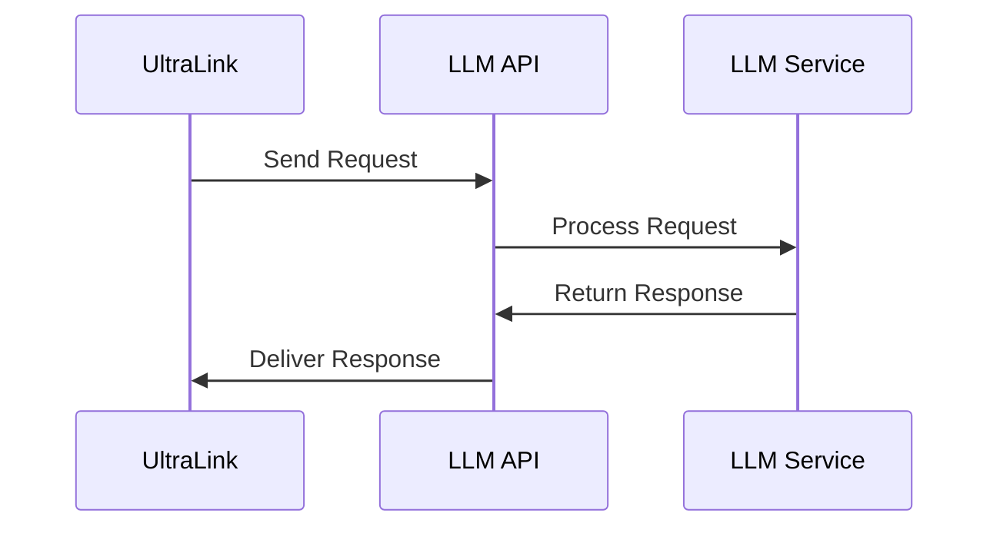
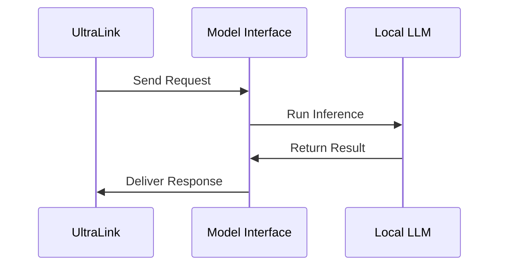
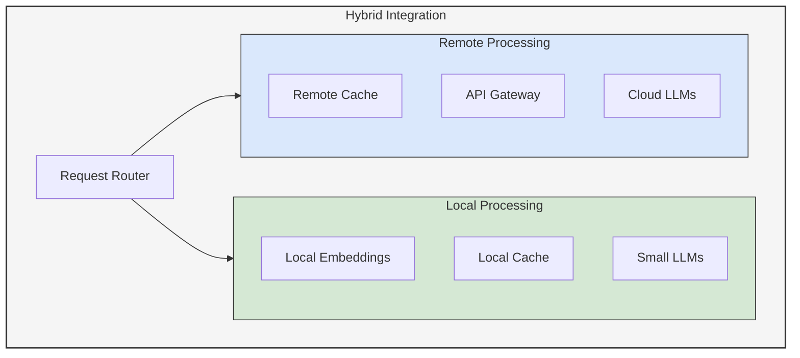
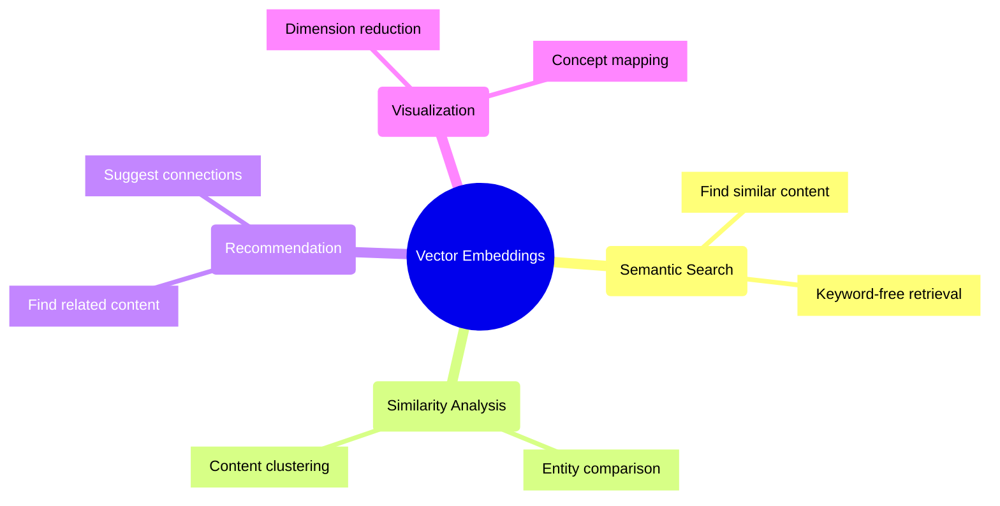
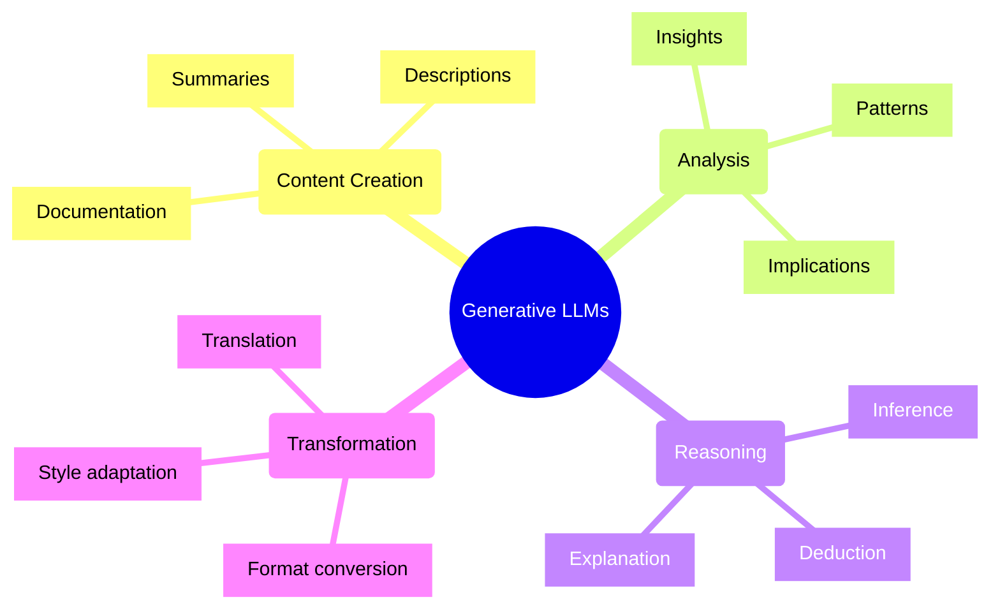

# LLM Foundations in UltraLink 🧠

## Overview

Large Language Models (LLMs) form a fundamental component of UltraLink's intelligence and reasoning capabilities. This document explains the core concepts of how LLMs are integrated, utilized, and enhanced within the UltraLink ecosystem.

## Fundamental Concepts

### What are Large Language Models?

Large Language Models are AI systems trained on vast amounts of text data that can understand and generate human-like text. In UltraLink, LLMs serve as powerful tools for:

1. **Knowledge extraction** - Identifying entities, relationships, and concepts in unstructured text
2. **Semantic understanding** - Comprehending the meaning and context of content
3. **Inference generation** - Drawing conclusions and generating insights from existing knowledge
4. **Content creation** - Generating descriptions, summaries, and explanations

### Vector Embeddings vs. Generative Models

UltraLink leverages two distinct but complementary LLM capabilities:

- **Vector Embeddings** transform text into numerical vector representations that capture semantic meaning
- **Generative Models** produce new text based on provided context, instructions, and patterns learned during training

UltraLink often combines both capabilities, using embeddings for efficient search and retrieval, and generative models for reasoning and content creation.

## LLM Integration Architecture

### System Design

UltraLink's LLM integration follows a modular design that separates:

1. **Core functionality** - Knowledge representation and management
2. **Integration interface** - Adapters, templates, and formatting 
3. **LLM systems** - External or embedded LLM services

This architecture enables:

- Provider-agnostic integration with multiple LLM services
- Consistent interface regardless of underlying models
- Caching and optimization for improved performance
- Graceful fallbacks when services are unavailable

## Key Capabilities

### 1. Semantic Understanding

LLMs provide UltraLink with semantic understanding capabilities:

```mermaid
graph LR
    subgraph Input["Raw Content"]
        Text[Text]
        Structure[Structure]
        Context[Context]
    end
    
    subgraph Processing["LLM Processing"]
        Analysis[Semantic Analysis]
        Extraction[Entity Extraction]
        Relationship[Relationship Detection]
    end
    
    subgraph Output["Semantic Understanding"]
        Entities[Entities]
        Relations[Relationships]
        Concepts[Concepts]
        Meaning[Semantic Meaning]
    end
    
    Input --> Processing
    Processing --> Output
    
    style Input fill:#f9f9f9,stroke:#333,stroke-width:1px
    style Processing fill:#e1d5e7,stroke:#333,stroke-width:1px
    style Output fill:#d5e8d4,stroke:#333,stroke-width:1px
```

UltraLink uses LLMs to:

- Extract structured information from unstructured text
- Identify conceptual relationships beyond explicit mentions
- Understand context and implied meaning
- Categorize and tag content semantically

### 2. Reasoning and Inference

LLMs enable sophisticated reasoning capabilities:

Key reasoning capabilities include:

- **Deductive reasoning** - Drawing logical conclusions from premises
- **Inductive reasoning** - Identifying patterns and generalizations
- **Abductive reasoning** - Forming plausible explanations for observations
- **Analogical reasoning** - Transferring knowledge across similar domains

### 3. Vector-Based Operations

Vector embeddings enable powerful operations:

- **Semantic search** - Finding relevant information based on meaning rather than keywords
- **Similarity detection** - Identifying conceptually similar entities
- **Clustering** - Grouping related entities based on semantic proximity
- **Concept mapping** - Visually representing the conceptual space

### 4. Content Enhancement

LLMs can enhance existing content:

- **Summarization** - Creating concise summaries of longer content
- **Expansion** - Elaborating on concepts with additional details
- **Refinement** - Improving clarity, coherence, and accuracy
- **Translation** - Converting content between different formats or styles

## Integration Models

UltraLink supports several integration models for LLMs:

### 1. API-Based Integration

- Connects to cloud-based LLM providers (OpenAI, Anthropic, etc.)
- Offers scalability and access to state-of-the-art models
- Requires internet connectivity and API keys

### 2. Local Model Integration

- Runs models locally using frameworks like Hugging Face Transformers
- Provides privacy and works offline
- Requires local computational resources

### 3. Hybrid Approaches

- Combines local and remote models for optimal performance and privacy
- Routes requests based on complexity, sensitivity, and availability
- Caches responses to reduce API costs and latency

## Embedding Models

Vector embeddings play a critical role in UltraLink:

### 1. Text Embedding Models

UltraLink supports various text embedding models:

- **OpenAI Embeddings** - text-embedding-3-large, text-embedding-3-small
- **Sentence Transformers** - Various models for sentence and document embeddings
- **Domain-specific embeddings** - Models trained for specific domains

### 2. Embedding Applications

Embeddings enable UltraLink to:

- Create a semantic index for efficient retrieval
- Detect duplicate or similar entities
- Organize knowledge in a semantic space
- Visualize conceptual relationships

## Generative Models

UltraLink integrates with various generative LLMs:

### 1. Supported Models

- **OpenAI GPT models** - GPT-4, GPT-3.5-Turbo
- **Anthropic Claude models** - Claude 3, Claude 2
- **Open-source models** - Llama, Mistral, Falcon
- **Custom fine-tuned models** - Domain-specific adaptations

### 2. Generative Applications

Generative models allow UltraLink to:

- Produce natural language descriptions of entities and relationships
- Generate insights and analyses from structured data
- Create explanations for complex relationships
- Transform content between different formats and styles

## Best Practices

### Model Selection

Choose the appropriate model based on:

- **Task complexity** - More complex tasks may require more advanced models
- **Performance requirements** - Consider latency and throughput needs
- **Cost considerations** - Balance capability with operational costs
- **Privacy requirements** - Consider data handling and security implications

### Prompt Engineering

Effective prompt engineering is crucial for optimal results:

- **Be specific** - Clearly define what you want the LLM to do
- **Provide context** - Include relevant background information
- **Structure outputs** - Specify format requirements
- **Use examples** - Include examples for complex tasks
- **Set constraints** - Define boundaries and limitations

### Handling Uncertainty

LLMs inherently involve some uncertainty:

- **Verify critical information** - Cross-check important facts
- **Implement validation** - Validate outputs against known criteria
- **Use confidence scores** - Request and respect confidence levels
- **Consider multiple options** - Generate alternatives for important decisions

## Advanced Topics

For more detailed information on advanced LLM topics, refer to:

- [LLM Integration Guide](../guides/llm-integration.md) - Detailed integration instructions
- [Prompt Engineering Guide](../guides/prompt-engineering.md) - Techniques for effective prompting
- [LLM Security Guide](../guides/llm-security.md) - Security considerations and best practices
- [Vector Operations](../concepts/vector-space.md) - Detailed explanation of vector operations

## Conclusion

Large Language Models provide UltraLink with powerful capabilities for understanding, generating, and reasoning about information. By combining both embedding and generative capabilities, UltraLink creates a rich, semantically-aware knowledge representation system that extends beyond traditional data models. 