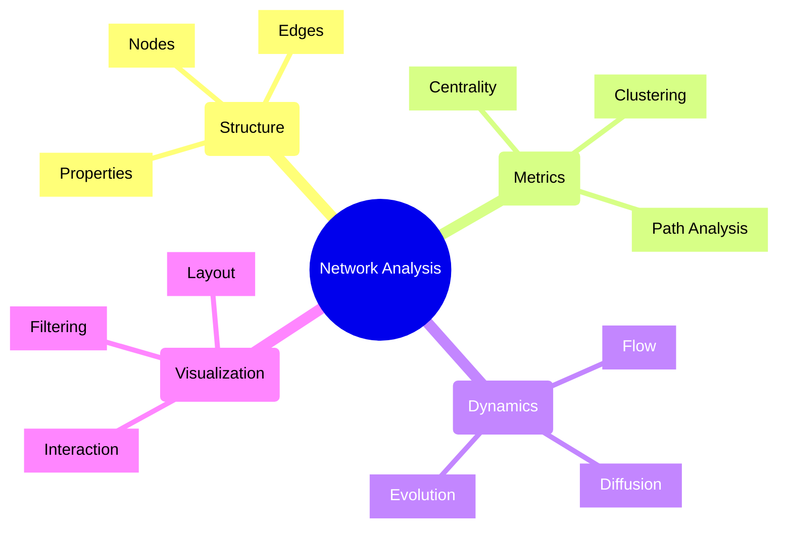
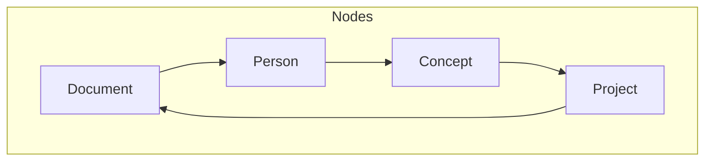
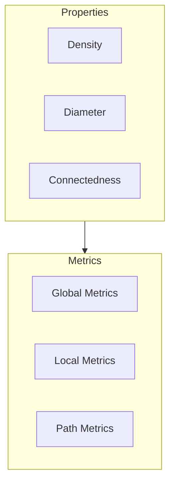
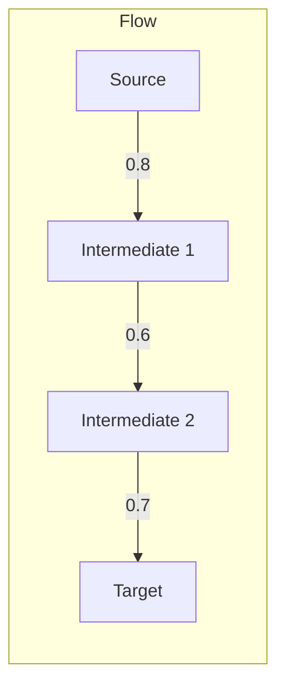
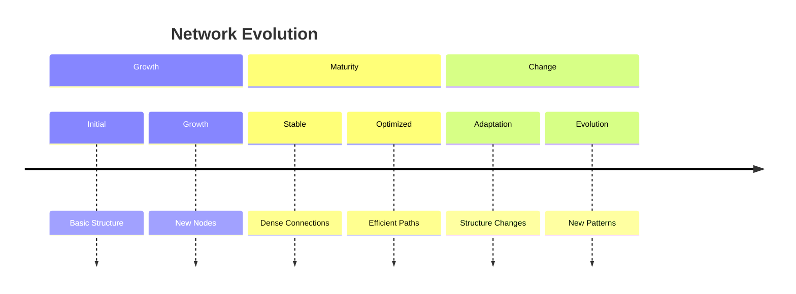
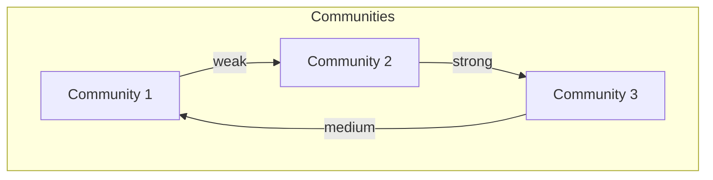
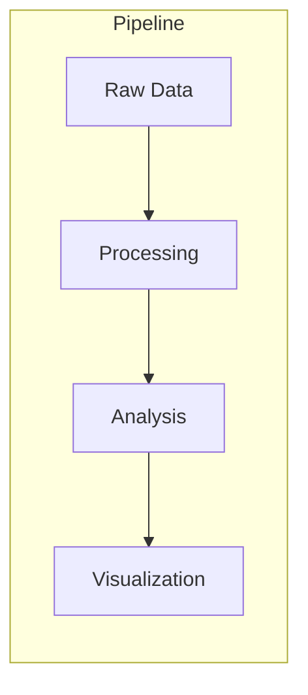

# Network Analysis in UltraLink 🕸️

## Overview

Network Analysis in UltraLink provides powerful tools for understanding the structure, dynamics, and evolution of interconnected entities. This document explains how UltraLink analyzes and visualizes complex networks of relationships.

## Core Concepts



## Network Structure

### 1. Node Types



### 2. Edge Types

```typescript
interface Edge {
    // Core Properties
    source: string;
    target: string;
    type: EdgeType;
    
    // Edge Attributes
    attributes: {
        weight: number;
        direction: 'uni' | 'bi';
        temporal: TimeRange;
        confidence: number;
    };
    
    // Metadata
    metadata: {
        created: DateTime;
        lastModified: DateTime;
        creator: string;
    };
}
```

### 3. Network Properties



## Network Metrics

### 1. Centrality Analysis

```javascript
// Calculate various centrality metrics
const centrality = await ultralink.network.analyzeCentrality({
    metrics: [
        'degree',
        'betweenness',
        'closeness',
        'eigenvector'
    ],
    normalize: true,
    weighted: true
});
```

### 2. Clustering Analysis

```javascript
// Analyze network clusters
const clusters = await ultralink.network.analyzeClusters({
    algorithm: 'louvain',
    resolution: 1.0,
    metrics: [
        'modularity',
        'density',
        'cohesion'
    ]
});
```

### 3. Path Analysis

```javascript
// Analyze paths between nodes
const paths = await ultralink.network.analyzePaths({
    source: sourceNode,
    target: targetNode,
    options: {
        maxLength: 5,
        weighted: true,
        algorithm: 'dijkstra'
    }
});
```

## Network Dynamics

### 1. Flow Analysis



### 2. Diffusion Analysis

```javascript
// Analyze information diffusion
const diffusion = await ultralink.network.analyzeDiffusion({
    startNodes: seedNodes,
    model: 'independent-cascade',
    parameters: {
        threshold: 0.5,
        decay: 0.1,
        iterations: 1000
    }
});
```

### 3. Evolution Analysis



## Network Visualization

### 1. Layout Algorithms

```javascript
// Configure network layout
const layout = ultralink.network.createLayout({
    algorithm: 'force-directed',
    options: {
        gravity: 0.1,
        linkDistance: 100,
        charge: -30,
        iterations: 300
    }
});
```

### 2. Interactive Features

```javascript
// Add interactive features
const interaction = ultralink.network.addInteraction({
    features: {
        zoom: true,
        pan: true,
        select: true,
        highlight: true
    },
    events: {
        onNodeClick: handleNodeClick,
        onEdgeHover: handleEdgeHover
    }
});
```

### 3. Filtering and Views

```javascript
// Configure network views
const view = ultralink.network.createView({
    filters: {
        nodes: {
            type: ['person', 'document'],
            centrality: { min: 0.5 }
        },
        edges: {
            weight: { min: 0.3 },
            type: ['cites', 'collaborates']
        }
    },
    layout: 'hierarchical',
    style: {
        nodes: nodeStyleFunction,
        edges: edgeStyleFunction
    }
});
```

## Advanced Features

### 1. Community Detection



### 2. Role Analysis

```javascript
// Analyze node roles
const roles = await ultralink.network.analyzeRoles({
    method: 'structural',
    metrics: [
        'hub',
        'authority',
        'broker',
        'peripheral'
    ],
    threshold: 0.7
});
```

### 3. Predictive Analysis

```javascript
// Predict network evolution
const prediction = await ultralink.network.predict({
    features: [
        'new_connections',
        'community_changes',
        'role_changes'
    ],
    horizon: '6months',
    confidence: 0.9
});
```

## Implementation Patterns

### 1. Network Construction

```javascript
// Build network from data
const network = await ultralink.network.build({
    nodes: nodeData,
    edges: edgeData,
    options: {
        directed: true,
        weighted: true,
        temporal: true
    }
});
```

### 2. Network Operations

```javascript
// Perform network operations
const operations = ultralink.network.createOperations({
    validate: true,
    optimize: true,
    cache: true
});

// Add node
await operations.addNode(newNode);

// Add edge
await operations.addEdge(newEdge);

// Update structure
await operations.updateStructure(changes);
```

### 3. Network Analysis Pipeline



## Best Practices

### 1. Data Quality

- Validate node and edge data
- Handle missing information
- Ensure consistency
- Monitor data quality

### 2. Performance

- Use efficient algorithms
- Implement caching
- Batch operations
- Optimize queries

### 3. Visualization

- Choose appropriate layouts
- Implement progressive loading
- Provide interaction controls
- Support different views

## Integration Examples

### 1. Social Network Analysis

```javascript
// Analyze social network
const social = await ultralink.network.analyzeSocial({
    network: socialNetwork,
    metrics: [
        'influence',
        'communities',
        'interaction_patterns'
    ]
});
```

### 2. Citation Network

```javascript
// Analyze citation network
const citations = await ultralink.network.analyzeCitations({
    papers: papers,
    metrics: [
        'impact_factor',
        'citation_patterns',
        'research_flow'
    ]
});
```

### 3. Collaboration Network

```javascript
// Analyze collaboration network
const collaboration = await ultralink.network.analyzeCollaboration({
    projects: projects,
    metrics: [
        'team_structure',
        'communication_flow',
        'expertise_distribution'
    ]
});
```

## Troubleshooting

### 1. Common Issues

- Performance with large networks
- Visualization scalability
- Algorithm convergence
- Data consistency

### 2. Solutions

```javascript
// Optimize network performance
const optimization = await ultralink.network.optimize({
    techniques: [
        'pruning',
        'aggregation',
        'sampling',
        'caching'
    ],
    targets: {
        memory: '4GB',
        renderTime: '100ms'
    }
});
```

### 3. Monitoring

```javascript
// Monitor network operations
ultralink.network.monitor({
    metrics: [
        'operation_time',
        'memory_usage',
        'query_performance',
        'visualization_fps'
    ],
    alerts: {
        performance: true,
        errors: true,
        thresholds: true
    }
});
```

## Further Reading

1. [Graph Theory Basics](../guides/graph-theory.md)
2. [Network Algorithms](../guides/network-algorithms.md)
3. [Visualization Techniques](../guides/visualization.md)
4. [Performance Optimization](../guides/network-performance.md) 