# UltraLink Relational Paradigm 🔗

## Overview

UltraLink introduces a new paradigm for managing relationships between content that goes beyond traditional hyperlinks. This document explains the core concepts and principles behind UltraLink's relational model.

## Core Principles

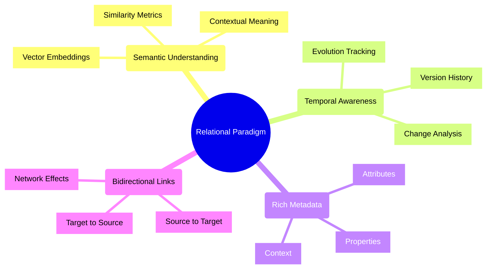

## Relationship Types

### 1. Direct Relationships

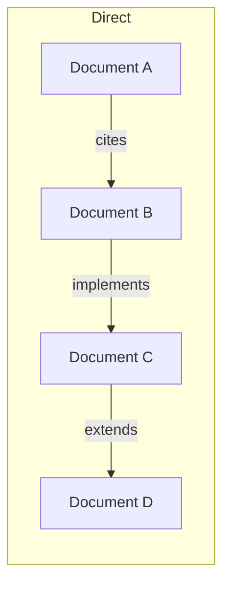

Properties:
- Explicit connections
- Clear directionality
- Strong semantics
- Verifiable links

### 2. Semantic Relationships

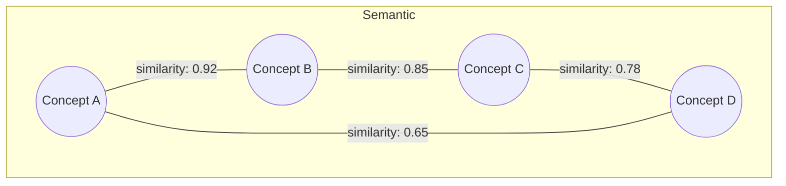

Properties:
- Vector-based similarity
- Contextual relevance
- Automatic discovery
- Strength metrics

### 3. Temporal Relationships

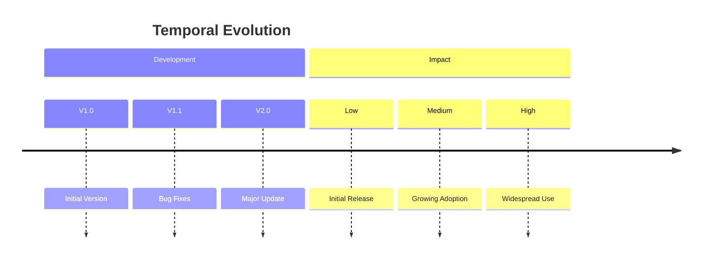

Properties:
- Version tracking
- Evolution paths
- Impact measurement
- Change analysis

## Relationship Attributes

```typescript
interface Relationship {
    // Core Properties
    source: string;
    target: string;
    type: RelationType;
    
    // Rich Metadata
    attributes: {
        confidence: number;      // [0-1] confidence score
        strength: number;        // [0-1] relationship strength
        context: string[];       // contextual tags
        temporal: {
            created: DateTime;
            modified: DateTime;
            validUntil?: DateTime;
        };
        
        // Vector Properties
        vectorSimilarity?: number;
        contextualRelevance?: number;
        
        // Impact Metrics
        citations?: number;
        usageCount?: number;
        influenceScore?: number;
    };
    
    // Evolution Tracking
    history: Change[];
    versions: Version[];
}
```

## Network Effects

### Local Impact

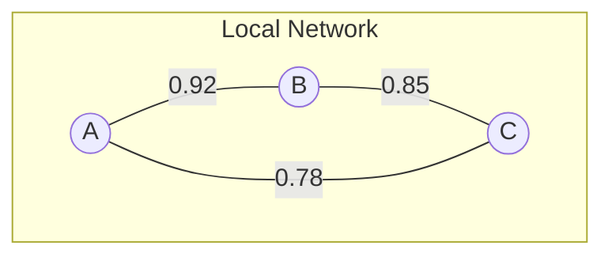

Properties:
- Direct influence
- Immediate connections
- Strong relationships

### Global Impact

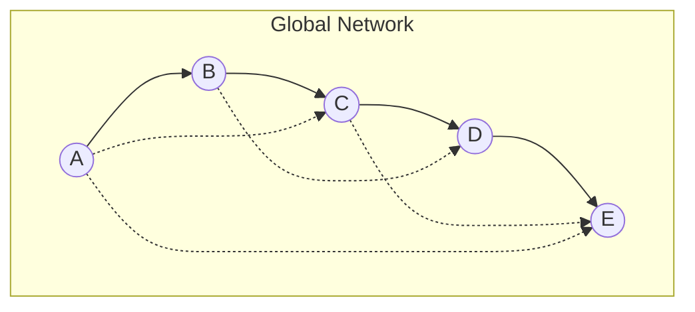

Properties:
- Network centrality
- Path analysis
- Influence propagation

## Implementation Patterns

### 1. Basic Relationship Creation

```javascript
// Create a basic relationship
ultralink.createRelationship({
    source: 'document-a',
    target: 'document-b',
    type: 'references',
    attributes: {
        confidence: 0.92,
        context: ['technical', 'implementation']
    }
});
```

### 2. Semantic Enhancement

```javascript
// Enhance with semantic understanding
await ultralink.enhanceRelationship('relationship-id', {
    vectorAnalysis: true,
    contextDiscovery: true,
    confidenceScoring: true
});
```

### 3. Temporal Tracking

```javascript
// Track relationship evolution
await ultralink.trackEvolution('relationship-id', {
    metrics: ['strength', 'impact', 'usage'],
    interval: 'monthly',
    retention: '1year'
});
```

## Best Practices

### 1. Relationship Design

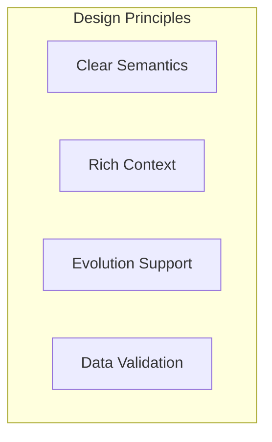

Guidelines:
- Define clear relationship types
- Include rich metadata
- Plan for evolution
- Validate connections

### 2. Performance Optimization

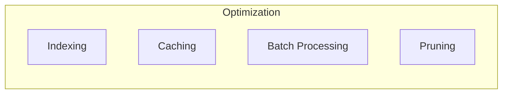

Strategies:
- Index common queries
- Cache frequent lookups
- Batch relationship updates
- Prune stale connections

### 3. Data Quality

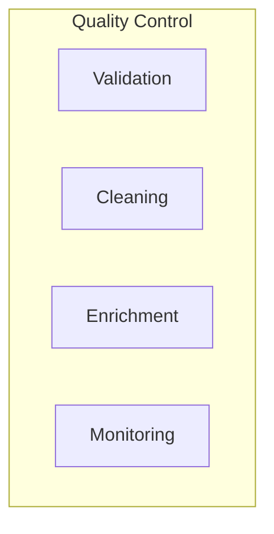

Measures:
- Validate relationships
- Clean metadata
- Enrich context
- Monitor health

## Advanced Concepts

### 1. Relationship Inference

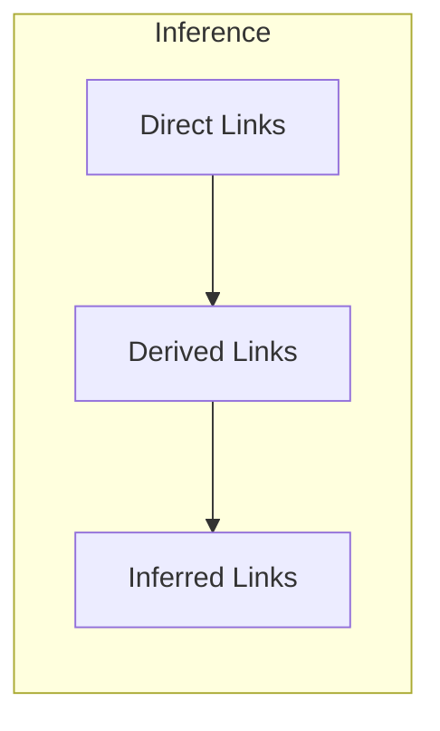

### 2. Impact Analysis

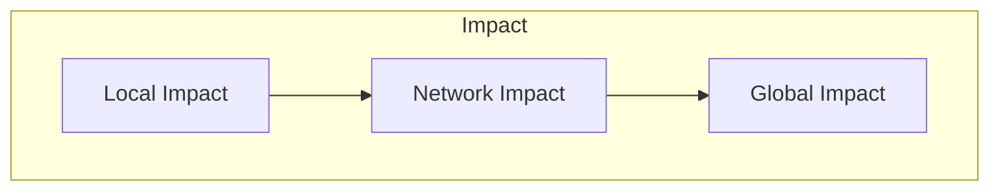

### 3. Evolution Patterns

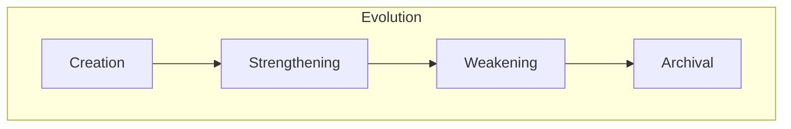

## Integration Patterns

### 1. System Integration

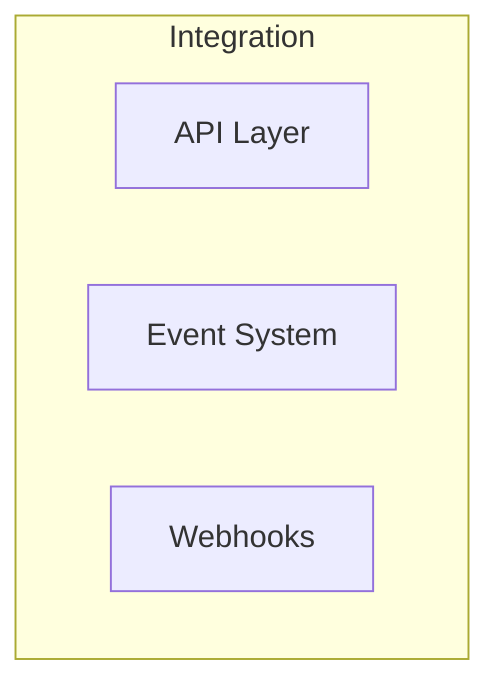

### 2. Data Flow

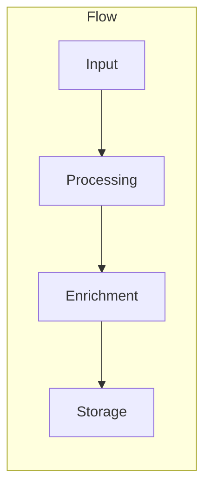

### 3. Extension Points

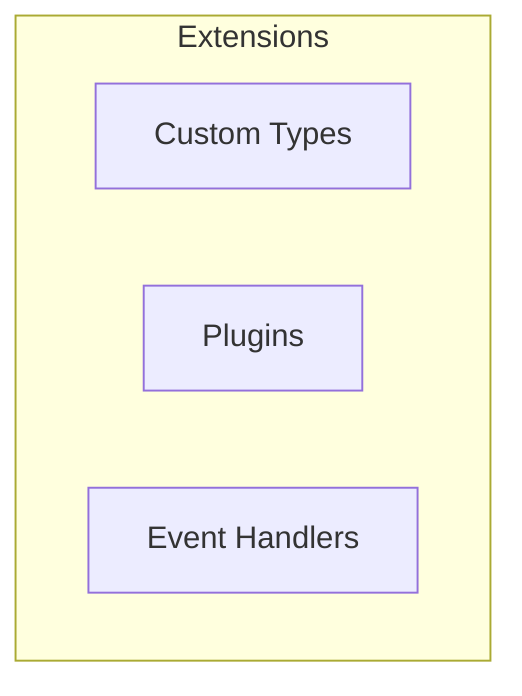

## Further Reading

1. [Vector Space Model](./vector-space.md)
2. [Temporal Evolution](./temporal-evolution.md)
3. [Network Analysis](./network-analysis.md)
4. [Implementation Guide](../guides/implementation.md) 