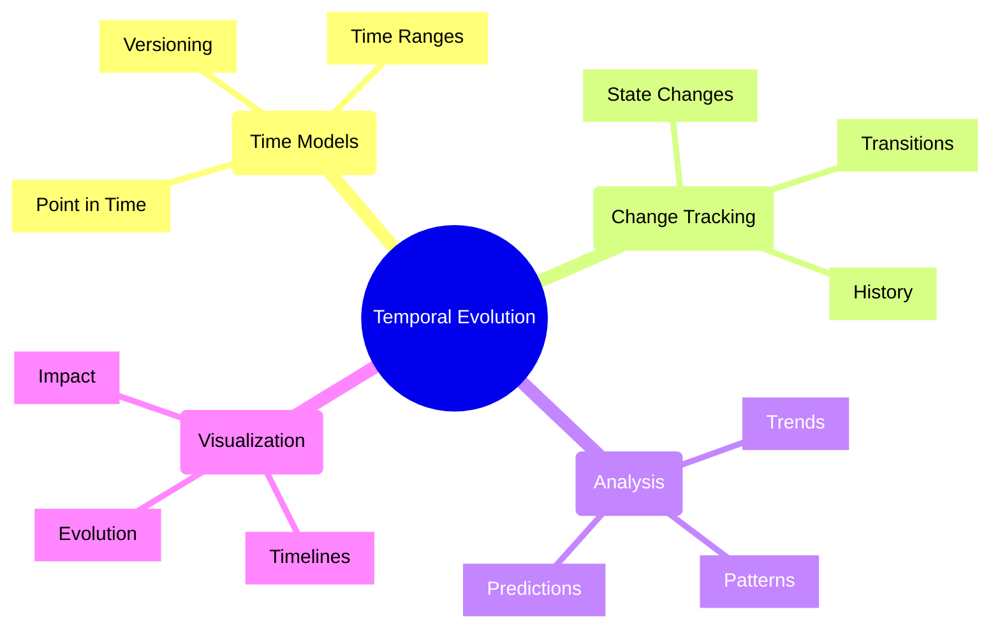
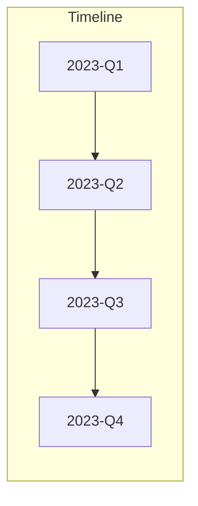
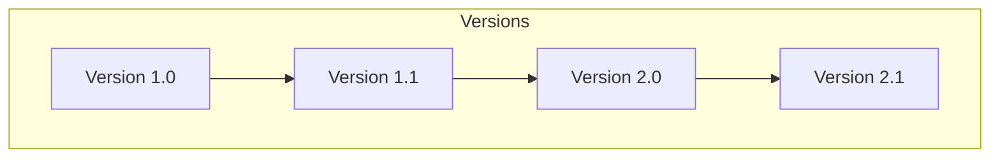
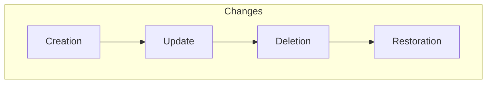
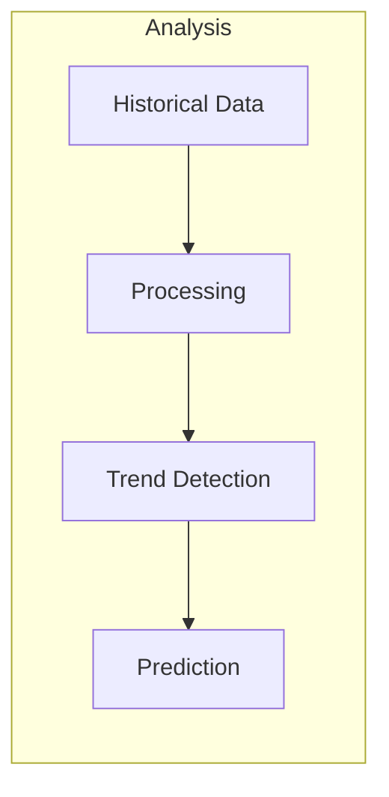
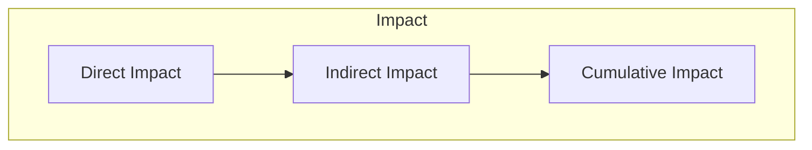
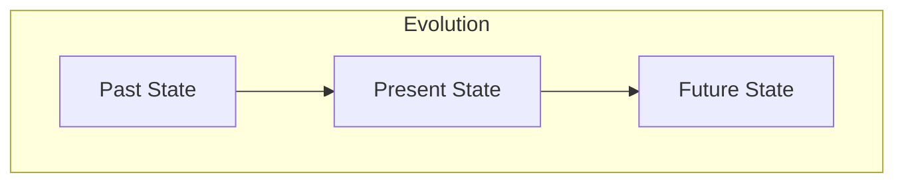
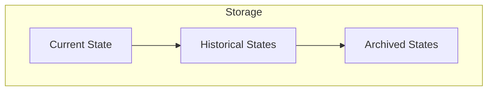

# Temporal Evolution in UltraLink ⏱️

## Overview

Temporal Evolution is a fundamental aspect of UltraLink that tracks how entities, relationships, and knowledge evolve over time. This document explains how UltraLink manages temporal data and enables time-based analysis.

## Core Concepts



## Time Models

### 1. Point in Time



### 2. Time Ranges

```typescript
interface TimeRange {
    start: DateTime;
    end: DateTime;
    duration: Duration;
    
    // Range Properties
    properties: {
        continuous: boolean;
        periodic: boolean;
        granularity: TimeGranularity;
    };
    
    // Range Operations
    contains(time: DateTime): boolean;
    overlaps(range: TimeRange): boolean;
    merge(range: TimeRange): TimeRange;
}
```

### 3. Versioning



## Change Tracking

### 1. State Changes

```javascript
// Track entity state changes
const history = await ultralink.temporal.trackChanges({
    entity: 'document-a',
    properties: ['content', 'metadata', 'relationships'],
    timeframe: {
        start: '2023-01-01',
        end: '2023-12-31'
    }
});
```

### 2. Change Types



### 3. Change Metadata

```typescript
interface Change {
    // Change Information
    id: string;
    type: ChangeType;
    timestamp: DateTime;
    
    // Change Details
    details: {
        before: any;
        after: any;
        diff: Diff;
    };
    
    // Context
    actor: string;
    reason: string;
    impact: ImpactLevel;
}
```

## Evolution Analysis

### 1. Trend Analysis



### 2. Pattern Detection

```javascript
// Detect temporal patterns
const patterns = await ultralink.temporal.detectPatterns({
    data: timeSeriesData,
    patterns: [
        'seasonal',
        'cyclic',
        'trend',
        'outliers'
    ],
    confidence: 0.95
});
```

### 3. Impact Analysis



## Temporal Visualization

### 1. Timeline View

```javascript
// Create interactive timeline
const timeline = ultralink.temporal.createTimeline({
    data: evolutionData,
    view: {
        type: 'interactive',
        scale: 'linear',
        markers: true,
        zoom: true
    },
    events: {
        onClick: handleTimelineClick,
        onHover: handleTimelineHover
    }
});
```

### 2. Evolution View



### 3. Impact Charts

```javascript
// Generate impact visualization
const impact = ultralink.temporal.visualizeImpact({
    data: impactData,
    metrics: ['direct', 'indirect', 'cumulative'],
    visualization: 'stacked-area',
    interactive: true
});
```

## Implementation Patterns

### 1. Temporal Storage



### 2. Change Management

```javascript
// Manage state changes
const changeManager = ultralink.temporal.createChangeManager({
    entity: entity,
    options: {
        trackHistory: true,
        validateChanges: true,
        notifySubscribers: true
    }
});

// Apply changes
await changeManager.applyChange({
    type: 'update',
    changes: changes,
    metadata: metadata
});
```

### 3. Version Control

```javascript
// Version management
const versionControl = ultralink.temporal.createVersionControl({
    strategy: 'semantic',
    storage: 'distributed',
    conflict: 'resolution'
});

// Create new version
const newVersion = await versionControl.createVersion({
    changes: changes,
    type: 'minor',
    notes: 'Updated content structure'
});
```

## Advanced Features

### 1. Time Travel

```javascript
// Time travel to specific point
const historicalState = await ultralink.temporal.timeTravel({
    entity: entity,
    timestamp: '2023-06-15T10:30:00Z',
    options: {
        includeRelationships: true,
        resolveReferences: true
    }
});
```

### 2. Temporal Queries

```javascript
// Perform temporal query
const results = await ultralink.temporal.query({
    timeframe: {
        start: '2023-01',
        end: '2023-12'
    },
    conditions: [
        { field: 'status', operator: 'changed', value: 'active' },
        { field: 'impact', operator: 'increased', threshold: 0.5 }
    ],
    aggregation: 'monthly'
});
```

### 3. Predictive Analysis

```javascript
// Generate predictions
const predictions = await ultralink.temporal.predict({
    historical: historicalData,
    horizon: '6months',
    confidence: 0.95,
    metrics: ['usage', 'impact', 'relationships']
});
```

## Best Practices

### 1. Data Management

- Use appropriate time granularity
- Implement efficient storage
- Handle timezone issues
- Maintain data integrity

### 2. Performance

- Optimize historical queries
- Cache frequent lookups
- Batch temporal operations
- Archive old data

### 3. Analysis

- Validate temporal patterns
- Consider seasonality
- Handle missing data
- Account for outliers

## Integration Examples

### 1. Content Evolution

```javascript
// Track content evolution
const evolution = await ultralink.temporal.trackContent({
    document: doc,
    metrics: ['changes', 'versions', 'impact'],
    visualization: true
});
```

### 2. Relationship Evolution

```javascript
// Track relationship changes
const relationshipChanges = await ultralink.temporal.trackRelationships({
    entity: entity,
    depth: 2,
    timeframe: 'last-year'
});
```

### 3. Impact Evolution

```javascript
// Track impact evolution
const impactEvolution = await ultralink.temporal.trackImpact({
    entity: entity,
    metrics: ['citations', 'usage', 'influence'],
    granularity: 'monthly'
});
```

## Troubleshooting

### 1. Common Issues

- Inconsistent timestamps
- Missing historical data
- Performance degradation
- Data integrity issues

### 2. Solutions

```javascript
// Validate temporal data
const validation = await ultralink.temporal.validate({
    data: temporalData,
    checks: [
        'consistency',
        'completeness',
        'integrity',
        'performance'
    ]
});
```

### 3. Monitoring

```javascript
// Monitor temporal operations
ultralink.temporal.monitor({
    metrics: [
        'query_performance',
        'storage_usage',
        'data_quality',
        'system_health'
    ],
    alerts: {
        performance: true,
        integrity: true,
        availability: true
    }
});
```

## Further Reading

1. [Time Series Analysis](../guides/time-series.md)
2. [Version Control](../guides/versioning.md)
3. [Temporal Queries](../guides/temporal-queries.md)
4. [Impact Analysis](../guides/impact-analysis.md) 