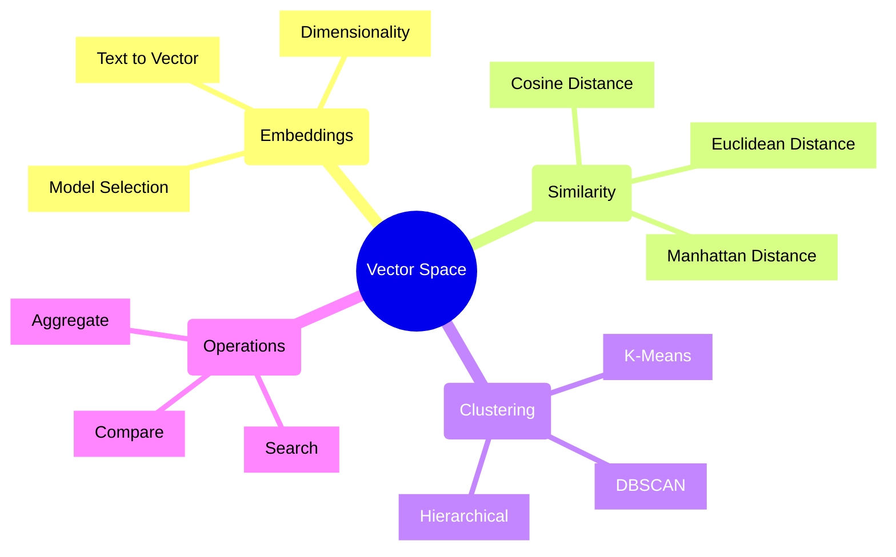
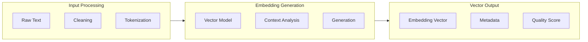
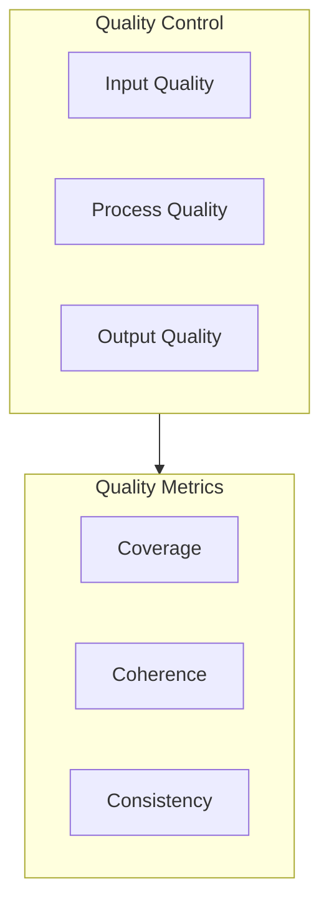
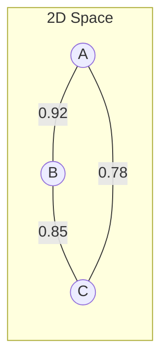
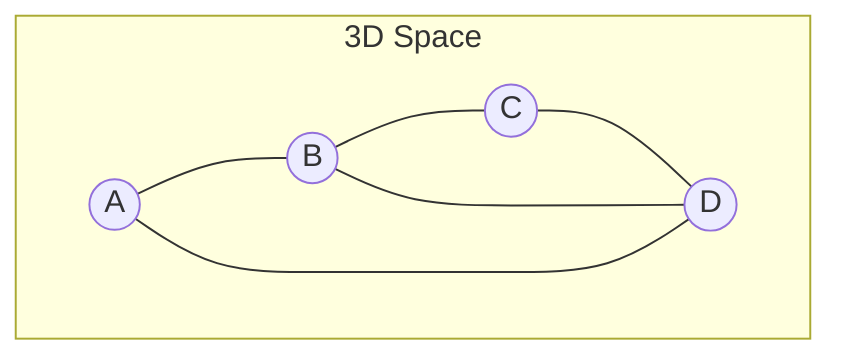
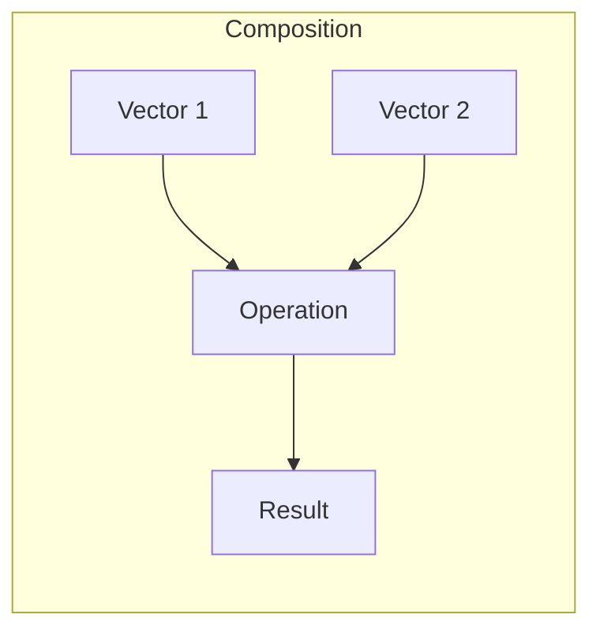
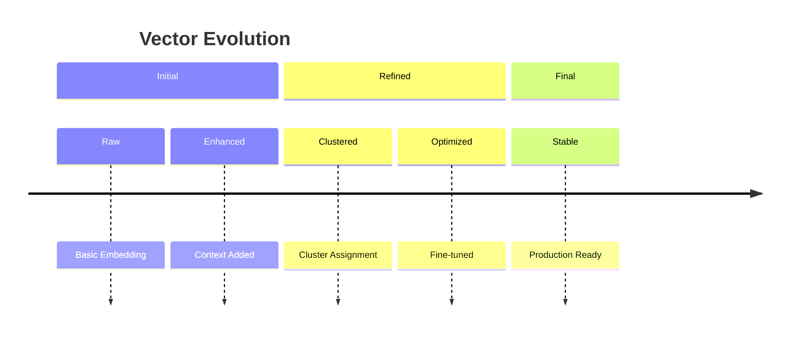
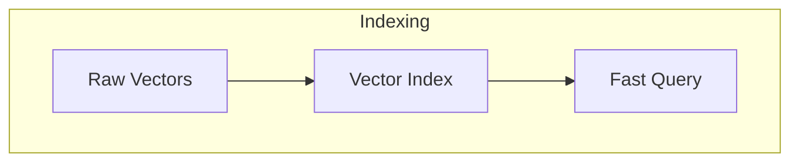

# Vector Space Model in UltraLink 🎯

## Overview

The Vector Space Model is a core component of UltraLink that enables semantic understanding and similarity analysis of entities and relationships. This document explains how UltraLink uses vector embeddings to create a rich, multidimensional space for content analysis.

## Core Concepts



## Vector Generation

### 1. Text to Vector Process



### 2. Model Selection

```typescript
interface VectorModel {
    // Model Configuration
    name: string;
    dimensions: number;
    contextWindow: number;
    
    // Generation Options
    options: {
        pooling: 'mean' | 'max' | 'cls';
        normalize: boolean;
        truncate: boolean;
        maxLength: number;
    };
    
    // Performance Metrics
    metrics: {
        accuracy: number;
        speed: number;
        memoryUsage: number;
    };
}
```

### 3. Quality Control



## Vector Operations

### 1. Similarity Calculation

```javascript
// Calculate cosine similarity
function cosineSimilarity(vector1, vector2) {
    return ultralink.vectors.similarity({
        method: 'cosine',
        vectors: [vector1, vector2],
        normalize: true
    });
}

// Calculate euclidean distance
function euclideanDistance(vector1, vector2) {
    return ultralink.vectors.distance({
        method: 'euclidean',
        vectors: [vector1, vector2]
    });
}
```

### 2. Vector Search

```javascript
// Perform nearest neighbor search
async function findSimilar(vector, options) {
    return await ultralink.vectors.search({
        vector: vector,
        limit: options.limit || 10,
        minSimilarity: options.threshold || 0.7,
        algorithm: 'annoy'  // Approximate Nearest Neighbors
    });
}
```

### 3. Clustering

```javascript
// Perform vector clustering
async function clusterVectors(vectors, options) {
    return await ultralink.vectors.cluster({
        vectors: vectors,
        method: 'kmeans',
        numberOfClusters: options.k || 5,
        iterations: options.iterations || 100
    });
}
```

## Vector Space Visualization

### 1. 2D Projection



### 2. 3D Projection



### 3. Interactive Exploration

```javascript
// Create interactive visualization
const visualization = ultralink.createVectorViz({
    type: '3d',
    data: vectors,
    options: {
        dimensions: 3,
        interactive: true,
        clustering: true,
        labels: true
    }
});
```

## Advanced Features

### 1. Vector Composition



### 2. Vector Evolution



### 3. Vector Analysis

```javascript
// Analyze vector characteristics
const analysis = await ultralink.vectors.analyze({
    vector: vector,
    metrics: [
        'dimensionality',
        'sparsity',
        'magnitude',
        'distribution'
    ],
    visualization: true
});
```

## Performance Optimization

### 1. Indexing Strategies



### 2. Caching

```javascript
// Configure vector cache
ultralink.vectors.configureCache({
    strategy: 'lru',
    maxSize: '1GB',
    ttl: '1h',
    preload: ['frequent', 'important']
});
```

### 3. Batch Processing

```javascript
// Batch vector operations
await ultralink.vectors.batch({
    operations: [
        { type: 'generate', data: text1 },
        { type: 'generate', data: text2 },
        { type: 'similarity', vectors: [vec1, vec2] }
    ],
    concurrency: 5
});
```

## Best Practices

### 1. Vector Generation

- Use appropriate model for content type
- Normalize vectors when comparing
- Handle edge cases (empty text, long text)
- Validate vector quality

### 2. Vector Storage

- Use efficient storage format
- Implement proper indexing
- Regular maintenance
- Backup strategy

### 3. Vector Operations

- Batch similar operations
- Cache frequent computations
- Monitor performance
- Handle errors gracefully

## Integration Examples

### 1. Content Analysis

```javascript
// Analyze document content
const analysis = await ultralink.analyze.content({
    text: documentText,
    vector: true,
    sentiment: true,
    topics: true,
    entities: true
});
```

### 2. Similarity Search

```javascript
// Search similar documents
const similar = await ultralink.search.similar({
    document: sourceDoc,
    useVector: true,
    limit: 10,
    threshold: 0.7
});
```

### 3. Clustering

```javascript
// Cluster documents
const clusters = await ultralink.cluster.documents({
    documents: docs,
    method: 'kmeans',
    vectorField: 'embedding',
    numberOfClusters: 5
});
```

## Troubleshooting

### 1. Common Issues

- Poor vector quality
- High dimensionality
- Sparse vectors
- Performance bottlenecks

### 2. Solutions

```javascript
// Improve vector quality
const improved = await ultralink.vectors.enhance({
    vector: poorVector,
    techniques: [
        'normalization',
        'dimensionality_reduction',
        'noise_removal'
    ]
});
```

### 3. Monitoring

```javascript
// Monitor vector operations
ultralink.vectors.monitor({
    metrics: [
        'generation_time',
        'quality_scores',
        'cache_hits',
        'index_performance'
    ],
    alerts: true
});
```

## Further Reading

1. [Vector Database Integration](../guides/vector-db.md)
2. [Advanced Vector Operations](../guides/vector-ops.md)
3. [Performance Tuning](../guides/performance.md)
4. [Model Selection Guide](../guides/models.md) 