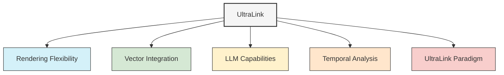

# UltraLink Core Features

This directory contains detailed documentation about the core differentiating features of UltraLink that make it a powerful tool for knowledge representation and management.

## Core Features Overview

### [Rendering Flexibility](./rendering-flexibility.md)

The most distinctive feature of UltraLink is its exceptional rendering flexibility. Unlike traditional knowledge graph tools that lock you into specific formats, UltraLink transforms your knowledge into virtually any target format:

- Export to multiple standard formats (JSON, GraphML, CSV)
- Create knowledge management artifacts (Obsidian, Wiki, Documentation)
- Generate analytical representations (Bayesian Networks, KIF)
- Build interactive experiences (HTML websites, D3.js visualizations)
- Support custom formats for specialized needs

### [Vector Integration](./vector-integration.md)

UltraLink's seamless vector integration brings the power of modern embeddings to your knowledge graphs:

- Connect entities with semantic similarity
- Perform context-aware searches
- Cluster related knowledge
- Integrate with external vector databases
- Support for multiple embedding models

### [LLM Capabilities](./llm-capabilities.md)

Enhance your knowledge graphs with advanced AI capabilities:

- Generate entities and relationships from unstructured data
- Extract insights through natural language queries
- Augment existing knowledge with AI-generated content
- Create dynamic content summaries
- Ground LLM responses in structured knowledge

### [Temporal Analysis](./temporal-analysis.md)

Track and analyze the evolution of knowledge over time:

- Historical versioning of entities and relationships
- Temporal queries to understand knowledge evolution
- Timeline visualizations
- Snapshot comparison
- Forecasting capabilities

### [UltraLink Paradigm](./ultralink-paradigm.md)

Understand the fundamental paradigm that makes UltraLink different:

- Meta-linking principles
- Entity-relationship foundation
- Multi-dimensional knowledge representation
- Extensibility model
- Integration architecture

## Implementation Details

Each core feature is implemented in the UltraLink codebase in dedicated modules that work together to provide a cohesive experience. For technical implementation details, see the [Technical Documentation](../technical/README.md). 