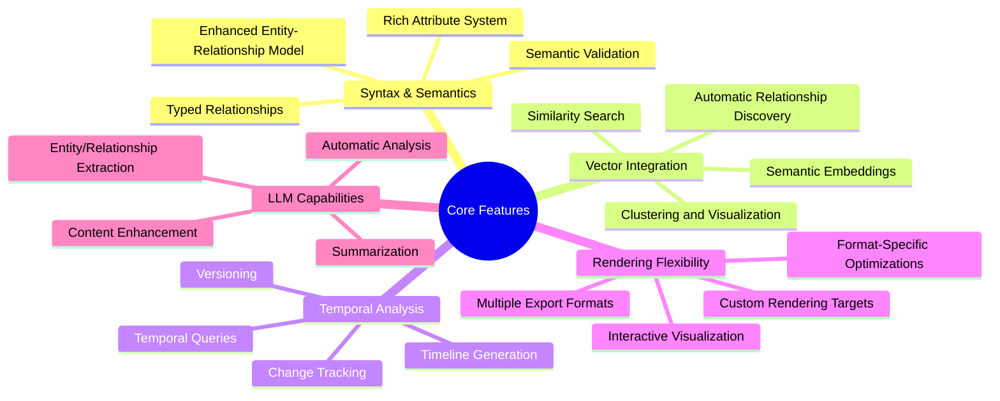

# UltraLink Core Features

This section documents the core features and differentiating capabilities of UltraLink, explaining what makes it unique among knowledge management and graph systems.

## Core Feature Documentation

### [Syntax and Semantics](./syntax-and-semantics.md)

UltraLink's foundation is built on a rich, semantically enhanced graph model that goes beyond traditional hypertext or knowledge graphs. Key aspects include:

- Enhanced entity-relationship model with rich attributes
- Type system for entities and relationships
- Semantic validation and constraints
- Multi-dimensional traversal capabilities
- Advanced query syntax for precise knowledge retrieval

The [Syntax and Semantics](./syntax-and-semantics.md) document provides comprehensive documentation of UltraLink's core syntax and semantic model.

### [Vector Integration](./vector-integration.md)

UltraLink integrates vector embeddings throughout its architecture to provide semantic understanding of content:

- Automatic vector generation for entities and relationships
- Semantic similarity search beyond explicit connections
- Content clustering and recommendation capabilities
- Automatic relationship inference based on semantic similarity
- Multi-modal vector representation (text, code, images)

### [Rendering Flexibility](./rendering-flexibility.md)

The defining feature of UltraLink is its exceptional rendering flexibility:

- Format-agnostic knowledge representation
- Multiple export formats for different use cases
- Preservation of semantics across formats
- Interactive visualizations and explorations
- Custom rendering target capabilities

### [Temporal Analysis](./temporal-analysis.md)

UltraLink provides robust tracking of how knowledge evolves over time:

- Complete history of entity and relationship changes
- Point-in-time querying of historical states
- Version management and comparison
- Timeline generation and visualization
- Continuous vs. discrete temporal modeling

### [LLM Capabilities](./llm-capabilities.md)

UltraLink leverages large language models to enhance knowledge graphs:

- Automatic content enhancement and enrichment
- Entity and relationship extraction from documents
- Intelligent summarization and exploration
- Natural language querying and interaction
- Multi-modal content understanding

## Getting Started with Core Features

For practical examples of how to use these core features, refer to the following guides:

- [Working with Entities and Relationships](../guides/entities-and-relationships.md)
- [Vector-Based Search and Discovery](../guides/vector-search.md)
- [Temporal Analysis Guide](../guides/temporal-analysis.md)
- [Format Selection Guide](../guides/choosing-format.md)
- [LLM Integration Guide](../guides/llm-integration.md)

## Next Steps

After understanding UltraLink's core features, explore:

- [Tutorials](../tutorials/README.md) for step-by-step learning
- [API Reference](../api/README.md) for detailed function documentation
- [Advanced Topics](../advanced/README.md) for extending UltraLink 