# LLM Integration in UltraLink

## Enhancing Knowledge Graphs with AI Intelligence

UltraLink seamlessly integrates with **Large Language Models (LLMs)** to provide AI-powered capabilities that enhance knowledge graphs with automated insights, content generation, semantic analysis, and reasoning capabilities.

> **Note:** All diagrams in the UltraLink documentation use Mermaid syntax for consistency, clarity, and maintainability.

## Why LLM Integration Matters

While traditional knowledge graphs excel at modeling explicit relationships, LLM integration adds an intelligence layer that can:

- **Generate insights** about entities and relationships
- **Extract knowledge** automatically from unstructured text
- **Enhance content** with summaries, explanations, and examples
- **Answer questions** based on knowledge graph content
- **Reason about connections** between concepts
- **Validate knowledge** for consistency and accuracy

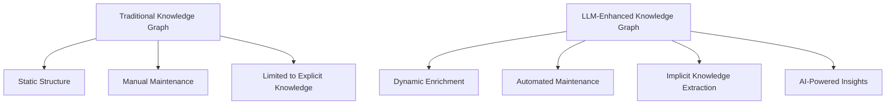

## Core LLM Integration Concepts

### LLM Integration Architecture

UltraLink's LLM integration is built on a flexible architecture that supports multiple models and providers:

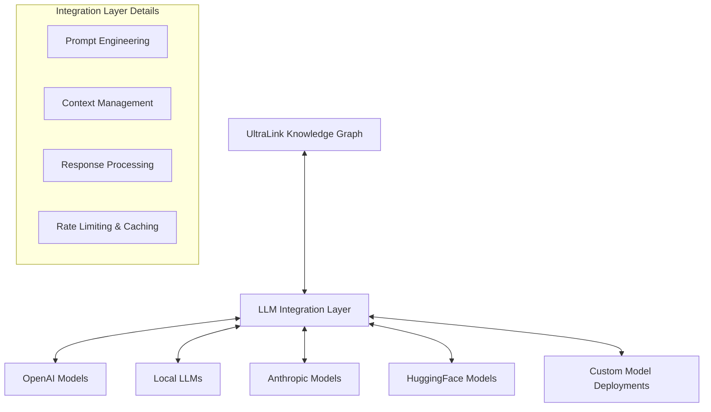

### Multiple Integration Modes

UltraLink supports different LLM integration modes for various use cases:

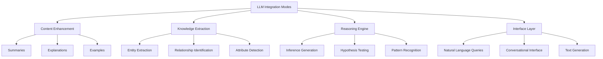

## Working with LLM Integration

### Configuring LLM Integration

Set up LLM integration with your preferred providers:

```javascript
// Configure LLM integration
graph.configureLLMIntegration({
  defaultProvider: 'openai',
  providers: {
    openai: {
      apiKey: process.env.OPENAI_API_KEY,
      defaultModel: 'gpt-4o',
      embeddingModel: 'text-embedding-3-small'
    },
    anthropic: {
      apiKey: process.env.ANTHROPIC_API_KEY,
      defaultModel: 'claude-3-opus'
    },
    local: {
      endpoint: 'http://localhost:11434',
      models: {
        completion: 'llama3',
        embedding: 'nomic-embed-text'
      }
    }
  },
  cache: {
    enabled: true,
    ttl: '1d'
  }
});
```

### Content Enhancement

Enhance knowledge graph content with LLM-generated insights:

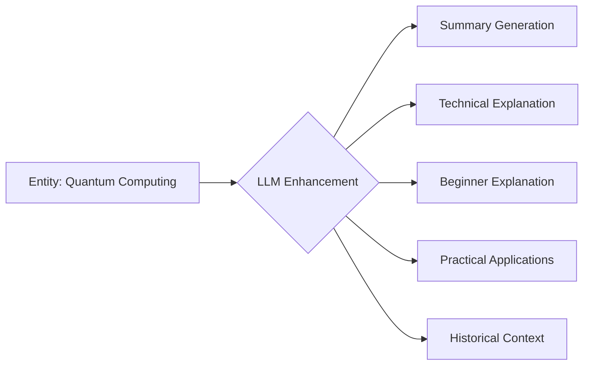

```javascript
// Enhance an entity with LLM-generated content
await graph.enhanceEntityWithLLM('quantum-computing', {
  enhancements: [
    'summary',
    'technical_explanation',
    'beginner_explanation',
    'practical_applications',
    'historical_context'
  ],
  model: 'gpt-4o',
  maxTokens: 500
});

// Access enhanced content
const entity = graph.getEntity('quantum-computing');
console.log('Summary:', entity.attributes.llm_summary);
console.log('For beginners:', entity.attributes.llm_beginner_explanation);
```

### Knowledge Extraction

Extract knowledge from unstructured text:

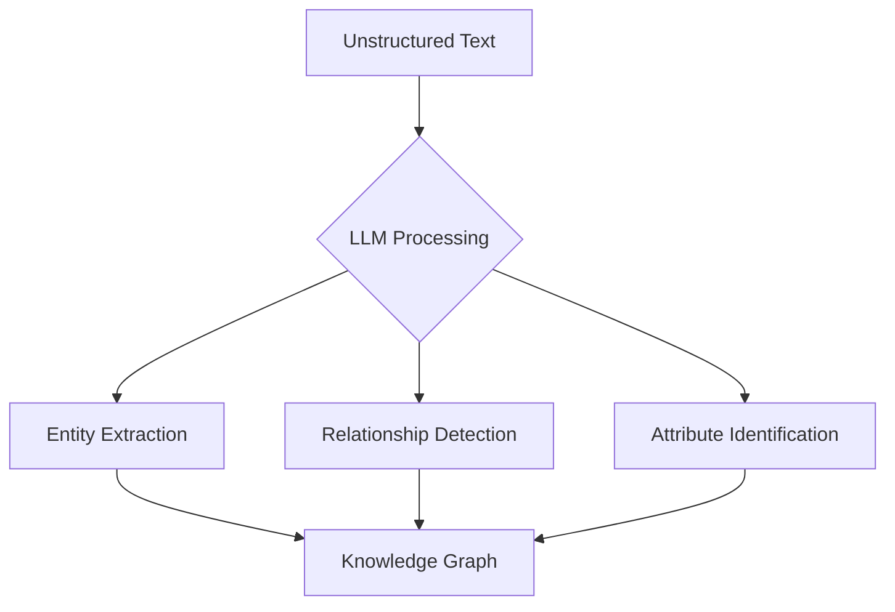

```javascript
// Extract knowledge from text
const extractionResults = await graph.extractKnowledgeFromText(`
  The transformer architecture, introduced in the "Attention is All You Need" 
  paper by Vaswani et al. in 2017, revolutionized natural language processing. 
  It forms the foundation for models like BERT, developed by Google, and GPT, 
  created by OpenAI. Unlike previous recurrent neural network approaches, 
  transformers use self-attention mechanisms to process entire sequences simultaneously.
`, {
  extractEntities: true,
  extractRelationships: true,
  confidenceThreshold: 0.7,
  addToGraph: true
});

console.log(`Extracted ${extractionResults.entities.length} entities and ${extractionResults.relationships.length} relationships`);
```

### Natural Language Querying

Query the knowledge graph using natural language:

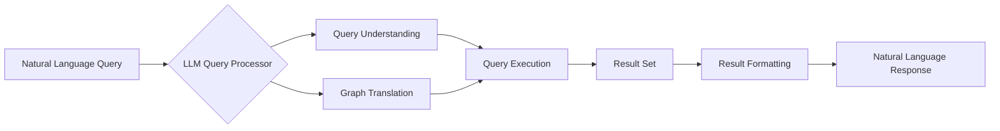

```javascript
// Query the knowledge graph in natural language
const answer = await graph.naturalLanguageQuery(
  "What are the key differences between BERT and GPT, and which companies developed them?"
);

console.log('Answer:', answer.text);
console.log('Source entities:', answer.sources);
```

### Reasoning and Inference

Generate insights and inferences about the knowledge graph:

```javascript
// Identify connections between concepts
const connections = await graph.findConceptualConnections({
  concepts: ['quantum-computing', 'neural-networks'],
  reasoningDepth: 'deep',
  includeSpeculative: true
});

// Generate hypotheses about emerging trends
const hypotheses = await graph.generateHypotheses({
  topic: 'climate-technology',
  timeframe: 'next 5 years',
  confidenceScoring: true
});
```

## Advanced LLM Capabilities

### Prompt Templates and Management

UltraLink includes a sophisticated prompt management system:

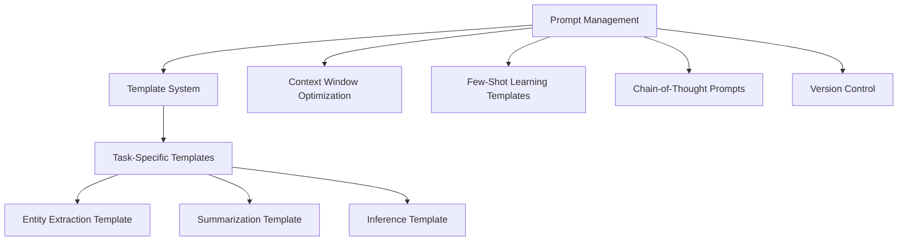

```javascript
// Define a custom prompt template
graph.defineLLMPromptTemplate('entity-risks', `
  You are an expert risk analyst reviewing information about {{entity.type}}: {{entity.attributes.name}}.
  
  Context information:
  {{entity.attributes.description}}
  
  Based ONLY on this information, identify the top 3 potential risks or challenges 
  associated with this {{entity.type}}, with a brief explanation for each.
  
  Format your response as a JSON array with "risk" and "explanation" fields.
`);

// Use the template
const risks = await graph.executeLLMPrompt('entity-risks', {
  entity: graph.getEntity('new-technology-x')
});

// Parse and store the results
graph.updateEntity('new-technology-x', {
  risk_assessment: risks
});
```

### Automated Knowledge Graph Construction

Build entire knowledge graphs from source materials:

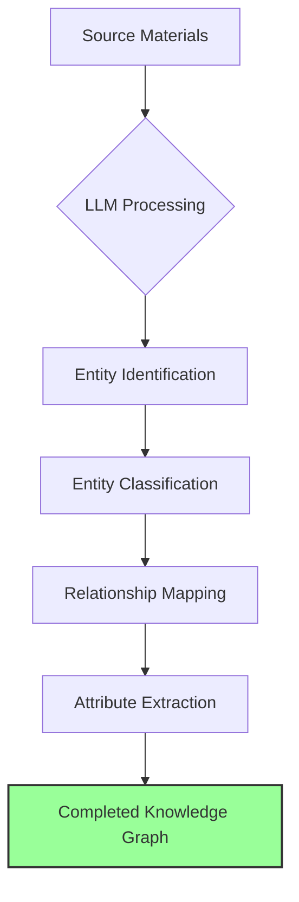

```javascript
// Build a knowledge graph from a collection of documents
const buildResult = await graph.buildKnowledgeGraphFromDocuments([
  { type: 'research-paper', content: paperText1, metadata: { ... } },
  { type: 'research-paper', content: paperText2, metadata: { ... } },
  { type: 'news-article', content: articleText1, metadata: { ... } }
], {
  entityTypes: ['person', 'organization', 'technology', 'concept', 'event'],
  relationshipTypes: ['works_for', 'developed_by', 'part_of', 'influenced', 'enables'],
  includeSources: true,
  confidenceThreshold: 0.75,
  batchSize: 1
});

console.log(`Built knowledge graph with ${buildResult.stats.entitiesAdded} entities and ${buildResult.stats.relationshipsAdded} relationships`);
```

### Knowledge Validation and Quality Assurance

Use LLMs to validate and improve knowledge graph quality:

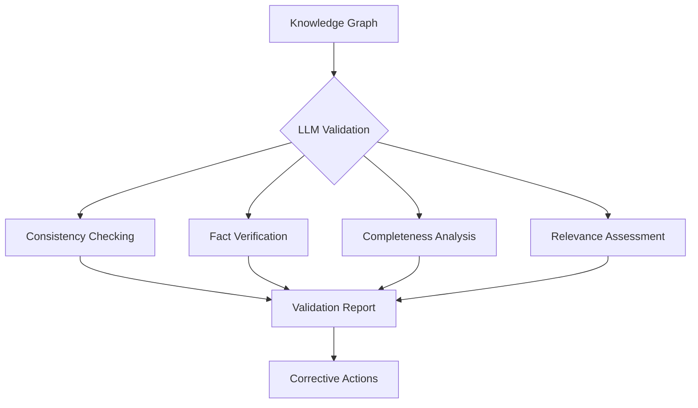

```javascript
// Validate knowledge graph quality
const validationReport = await graph.validateKnowledgeWithLLM({
  entityTypes: ['research-finding', 'technology'],
  checksToPerform: [
    'factual_accuracy', 
    'logical_consistency', 
    'completeness',
    'source_credibility'
  ],
  sampleSize: 50 // number of entities to check (use null for all)
});

console.log('Validation report:', validationReport.summary);
console.log('Issues found:', validationReport.issues.length);

// Automatically fix simple issues
if (validationReport.issues.length > 0) {
  await graph.applyLLMValidationFixes(validationReport, {
    fixTypes: ['inconsistency', 'incompleteness'],
    requireConfidence: 0.9
  });
}
```

### Multi-Step LLM Workflows

Create complex, multi-step LLM workflows for sophisticated analysis:

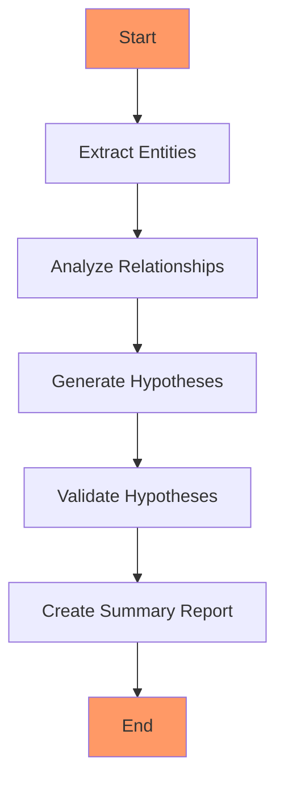

```javascript
// Create a multi-step LLM workflow
const workflow = graph.createLLMWorkflow('research-analysis', [
  {
    name: 'extract-key-concepts',
    prompt: 'Extract all key scientific concepts from the following research abstract: {{input}}',
    output: 'concepts'
  },
  {
    name: 'analyze-relationships',
    prompt: 'Analyze how these concepts relate to each other: {{concepts}}',
    output: 'relationships'
  },
  {
    name: 'generate-hypothesis',
    prompt: 'Based on these concepts and relationships, generate 3 testable hypotheses: Concepts: {{concepts}}\nRelationships: {{relationships}}',
    output: 'hypotheses'
  },
  {
    name: 'evaluate-novelty',
    prompt: 'Evaluate the novelty of these hypotheses compared to current research:\n{{hypotheses}}',
    output: 'novelty_assessment'
  }
]);

// Execute the workflow
const results = await workflow.execute({
  input: researchAbstract,
  model: 'gpt-4o'
});

console.log('Workflow results:', results);
```

### Evidence and Attribution

UltraLink maintains evidence and attribution for LLM-generated content:

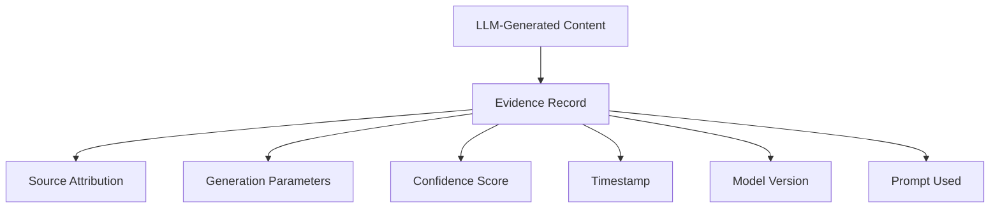

```javascript
// Retrieve evidence for LLM-generated content
const evidence = graph.getLLMGenerationEvidence('quantum-computing', 'llm_practical_applications');

console.log('Generated by:', evidence.model);
console.log('Generation date:', evidence.timestamp);
console.log('Confidence score:', evidence.confidence);
console.log('Based on sources:', evidence.sources);
```

## Integration with Other UltraLink Features

### Vector + LLM Integration

Combine vector operations with LLM capabilities:

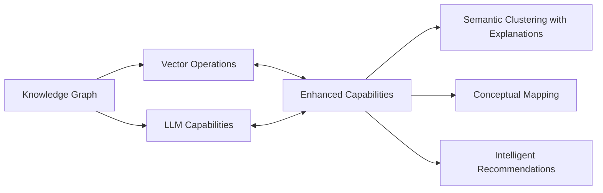

```javascript
// Perform vector clustering with LLM-generated cluster explanations
const clusters = await graph.clusterEntitiesWithExplanations({
  entityType: 'research-paper',
  clusterCount: 5,
  generateLabels: true,
  explainRelationships: true
});

// For each cluster, LLM generates:
// - Descriptive name
// - Key themes
// - Explanation of why papers are related
```

### Temporal + LLM Integration

Combine temporal analysis with LLM insights:

```javascript
// Analyze concept evolution with LLM insights
const evolutionAnalysis = await graph.analyzeConceptEvolutionWithLLM('artificial-intelligence', {
  timespan: '10y',
  intervals: 'year',
  analysisAspects: [
    'key_developments',
    'paradigm_shifts',
    'controversy_analysis',
    'future_predictions'
  ]
});
```

### Rendering + LLM Integration

Enhance rendered output with LLM-generated content:

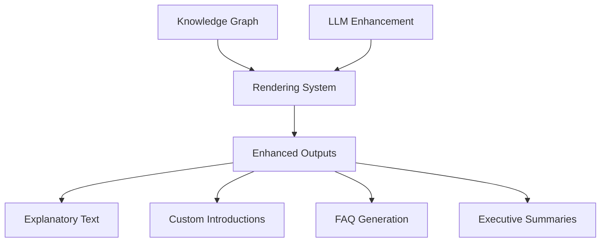

```javascript
// Generate enhanced HTML website with LLM-generated content
const enhancedWebsite = graph.toHTMLWebsite({
  title: 'Research Knowledge Base',
  enhanceWithLLM: true,
  llmEnhancements: {
    generateIntroductions: true,
    createSummaries: true,
    addExplanations: true,
    includeExamples: true,
    generateFAQ: true
  }
});
```

## Practical Applications

### Automated Research Assistant

Build a research assistant that helps analyze and synthesize information:

```javascript
// Create a research assistant on a topic
const researchAssistant = graph.createLLMAssistant('quantum-computing-research', {
  capabilities: [
    'literature_review',
    'gap_analysis',
    'hypothesis_generation',
    'experiment_design',
    'result_interpretation'
  ],
  knowledgeSources: [
    { type: 'graph', scope: 'full' },
    { type: 'papers', source: 'connected_papers' }
  ]
});

// Ask research questions
const answer = await researchAssistant.ask(
  "What are the main obstacles to achieving quantum supremacy, and what approaches show the most promise?"
);
```

### Knowledge Base Expansion

Automatically expand knowledge bases with verified information:

```javascript
// Expand knowledge on a specific topic
await graph.expandKnowledgeWithLLM('climate-technology', {
  aspectsToExpand: [
    'current_developments',
    'key_players',
    'research_areas',
    'challenges',
    'breakthrough_technologies'
  ],
  verificationLevel: 'high', // requires source citation
  maxEntities: 50
});
```

### Content Generation

Generate content from knowledge graph data:

```javascript
// Generate various content formats from knowledge graph
const contentGenerationResults = await graph.generateContentFromKnowledge({
  topic: 'quantum-computing',
  formats: [
    { type: 'blog_post', options: { wordCount: 1200, audience: 'technical' } },
    { type: 'executive_summary', options: { length: 'concise' } },
    { type: 'tutorial', options: { complexity: 'beginner' } },
    { type: 'social_media', options: { platform: 'linkedin', count: 5 } }
  ],
  includeSources: true
});
```

## LLM Provider Support

UltraLink supports a variety of LLM providers:

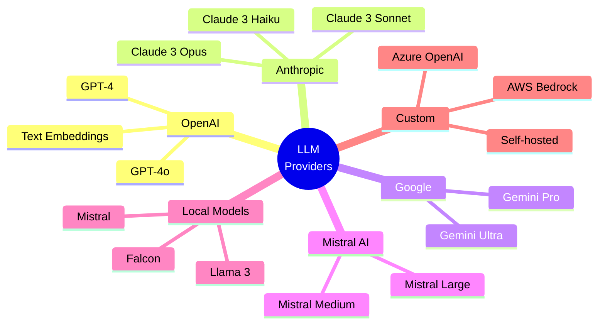

## API Reference

The LLM API includes these main method groups:

| Method Group | Description |
|--------------|-------------|
| `configureLLMIntegration()` | Configure LLM providers and settings |
| `enhanceEntityWithLLM()` | Enhance entities with LLM-generated content |
| `extractKnowledgeFromText()` | Extract structured knowledge from text |
| `naturalLanguageQuery()` | Query knowledge graph using natural language |
| `buildKnowledgeGraphFromDocuments()` | Build knowledge graph from documents |
| `validateKnowledgeWithLLM()` | Validate knowledge quality |
| `defineLLMPromptTemplate()` / `executeLLMPrompt()` | Manage and execute prompts |
| `createLLMWorkflow()` | Create multi-step LLM workflows |
| `createLLMAssistant()` | Create domain-specific assistants |

## Example: Complete LLM Integration Workflow

Here's a complete example demonstrating various LLM capabilities:

```javascript
const { UltraLink } = require('ultralink');
const { LLMExtension } = require('@ultralink/llm');

async function main() {
  // Initialize UltraLink with LLM capabilities
  const graph = new UltraLink();
  graph.use(LLMExtension);
  
  // Configure LLM integration
  graph.configureLLMIntegration({
    defaultProvider: 'openai',
    providers: {
      openai: {
        apiKey: process.env.OPENAI_API_KEY,
        defaultModel: 'gpt-4o',
        embeddingModel: 'text-embedding-3-small'
      }
    }
  });
  
  console.log('Building initial knowledge graph...');
  
  // First, let's create some basic entities
  const quantumComputing = graph.createEntity('technology', 'quantum-computing', {
    name: 'Quantum Computing',
    description: 'Computing that uses quantum-mechanical phenomena to perform operations on data.'
  });
  
  const machineLearn = graph.createEntity('technology', 'machine-learning', {
    name: 'Machine Learning',
    description: 'Field of study that gives computers the ability to learn without being explicitly programmed.'
  });
  
  // Link the entities
  graph.createLink('quantum-computing', 'machine-learning', 'can_enhance', {
    strength: 'significant',
    maturity: 'emerging'
  });
  
  console.log('Enhancing entities with LLM-generated content...');
  
  // Enhance entities with LLM-generated content
  await graph.enhanceEntityWithLLM('quantum-computing', {
    enhancements: [
      'detailed_explanation',
      'historical_context',
      'current_state',
      'future_potential',
      'challenges'
    ]
  });
  
  console.log('Extracting knowledge from research text...');
  
  // Extract knowledge from a research abstract
  const researchText = `
    Recent advances in quantum machine learning have demonstrated significant potential
    for exponential speedup in specific computational tasks. The quantum support vector
    machine algorithm, developed by Rebentrost et al. in 2014, shows quadratic speedup
    over classical algorithms for certain classification problems. Meanwhile, quantum
    neural networks (QNNs) are being explored by companies like Google and IBM for their
    ability to process complex quantum data states. These approaches are particularly
    promising for chemical simulations and materials science applications.
  `;
  
  const extractionResults = await graph.extractKnowledgeFromText(researchText, {
    extractEntities: true,
    extractRelationships: true,
    confidenceThreshold: 0.7,
    addToGraph: true
  });
  
  console.log(`Extracted ${extractionResults.entities.length} entities and ${extractionResults.relationships.length} relationships`);
  
  console.log('Querying the knowledge graph...');
  
  // Query the knowledge graph using natural language
  const answer = await graph.naturalLanguageQuery(
    "What are the main applications of quantum machine learning and which companies are involved?"
  );
  
  console.log('Answer to query:', answer.text);
  console.log('Source entities:', answer.sources);
  
  console.log('Generating insights about relationships...');
  
  // Generate insights about relationships between technologies
  const insights = await graph.generateInsightsWithLLM({
    focus: 'relationship_between',
    entities: ['quantum-computing', 'machine-learning'],
    aspects: ['synergies', 'technical_challenges', 'comparative_advantages', 'future_developments']
  });
  
  console.log('Generated insights:', insights);
  
  console.log('Creating expert assistant...');
  
  // Create a domain-specific assistant
  const quantumExpert = graph.createLLMAssistant('quantum-expert', {
    expertise: 'quantum-computing',
    capabilities: ['explain', 'compare', 'analyze', 'predict'],
    knowledgeBase: graph
  });
  
  // Ask the expert a question
  const expertAnswer = await quantumExpert.ask(
    "How might quantum computing change our approach to training large neural networks?"
  );
  
  console.log('Expert response:', expertAnswer.text);
  
  console.log('Generating content from knowledge graph...');
  
  // Generate content from the knowledge graph
  const blogPost = await graph.generateContentFromKnowledge({
    topic: 'quantum-computing and machine-learning',
    format: 'blog_post',
    options: {
      title: 'The Quantum Future of AI',
      wordCount: 800,
      audience: 'technical',
      includeSections: ['introduction', 'current_state', 'applications', 'challenges', 'future', 'conclusion']
    }
  });
  
  console.log('Blog post title:', blogPost.title);
  console.log('Blog post excerpt:', blogPost.content.substring(0, 300) + '...');
  
  console.log('LLM integration workflow complete!');
}

main().catch(console.error);
```

## Best Practices for LLM Integration

For optimal use of the LLM API:

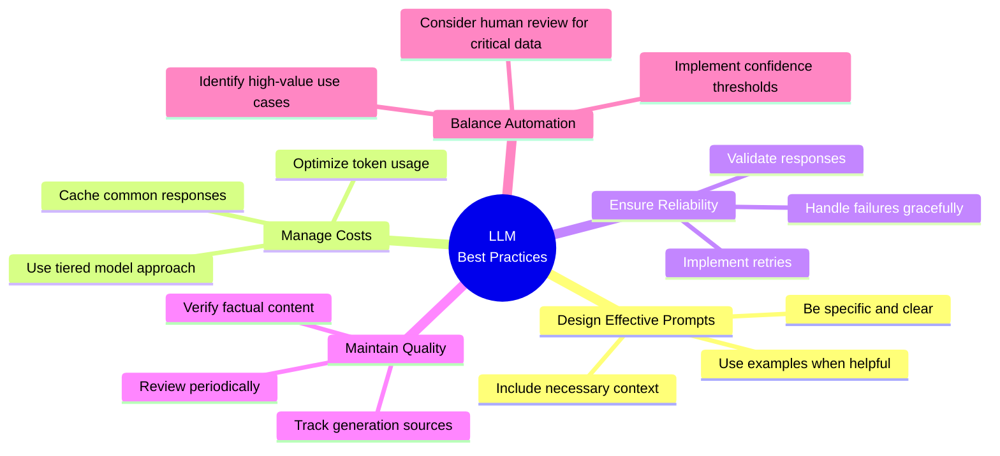

1. **Design effective prompts** - Clear instructions and sufficient context improve results
2. **Manage costs effectively** - Use appropriate models and implement caching
3. **Ensure reliability** - Handle rate limits, implement retries, validate responses
4. **Maintain content quality** - Verify facts, track sources, review periodically
5. **Balance automation with oversight** - Consider confidence thresholds and human review
6. **Optimize for specific tasks** - Use different models for different needs

## Conclusion: AI-Enhanced Knowledge Management

The LLM integration capabilities of UltraLink transform knowledge graphs from static representations into intelligent knowledge systems capable of reasoning, generating insights, and communicating in natural language. By combining structured knowledge with the power of language models, UltraLink provides a comprehensive platform for knowledge management that understands both explicit and implicit information.

Whether you're building research tools, documentation systems, intelligence platforms, or educational products, UltraLink's LLM capabilities provide the foundation for sophisticated, AI-enhanced knowledge applications. 