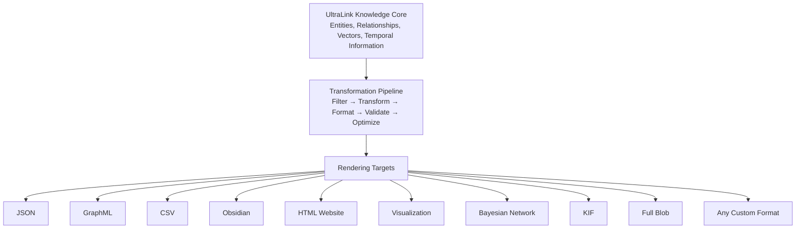
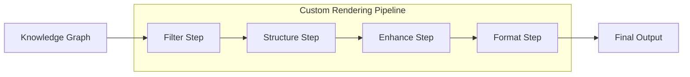
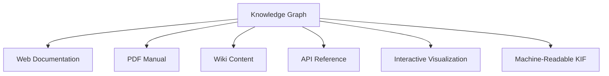
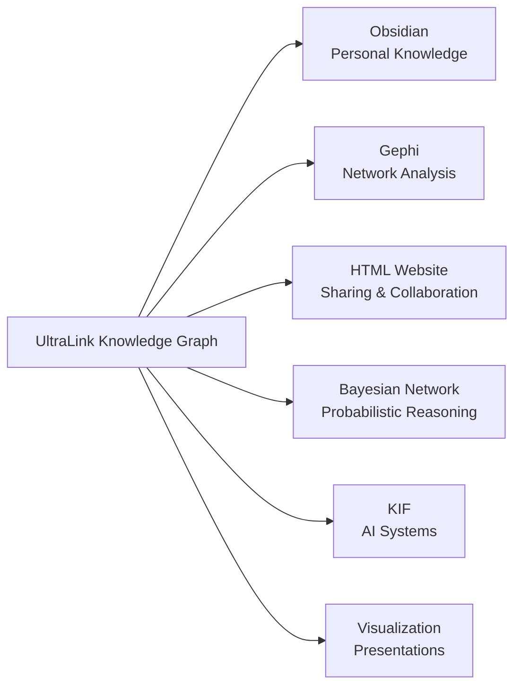

# UltraLink's Flexible Rendering System

## A Core Differentiating Feature

The hallmark feature of UltraLink is its **exceptionally flexible rendering system**, which allows knowledge graphs to be seamlessly transformed into a wide variety of target formats. This flexibility is a foundational design principle, making UltraLink not just another knowledge graph library, but a comprehensive **knowledge transformation framework**.

The UltraLink paradigm emphasizes the separation of knowledge representation from knowledge presentation, allowing the same underlying data model to be rendered appropriately for different contexts, tools, and use cases.

## Rendering Architecture

UltraLink's rendering system is built on a modular architecture that enables:

1. **Format Independence**: The core knowledge representation is completely decoupled from output formats
2. **Deterministic Transformations**: Consistent, reliable outputs across transformations
3. **Comprehensive Format Support**: Built-in support for a wide range of standard and specialized formats
4. **Custom Format Extension**: Easy creation of new rendering targets for specialized needs
5. **Test-Driven Rendering**: Extensive test suite ensures rendering fidelity across targets



> **Note:** All diagrams in the UltraLink documentation use Mermaid syntax for consistency, clarity, and maintainability.

## Supported Rendering Targets

UltraLink provides built-in support for a wide range of rendering targets, each optimized for specific use cases:

### Standard Data Formats

- **JSON**: Universal data interchange format for systems integration and API integration
- **GraphML**: XML-based graph format for visualization tools like Gephi and Cytoscape
- **CSV**: Tabular format for spreadsheet analysis, data processing, and database import

### Knowledge Management Formats

- **Obsidian**: Markdown files with wiki-links for knowledge management and personal knowledge bases
- **HTML Website**: Self-contained interactive website with D3.js visualizations for sharing and exploration
- **Documentation**: Structured documentation with automated cross-references and consistent formatting

### Visualization Formats

- **SVG**: Scalable Vector Graphics for crisp, resolution-independent visualizations
- **PNG**: Raster graphics for compatibility with presentation software and documents
- **D3.js**: Code for interactive, data-driven visualizations using the D3 library
- **Cytoscape.js**: Code for flexible network visualizations with comprehensive graph theory capabilities

### Analytical Formats

- **Bayesian Network**: Probabilistic graphical models in BIF format for causal inference and reasoning
- **KIF**: Knowledge Interchange Format for AI systems, automated reasoning, and expert systems
- **RDF/OWL**: Semantic web formats for linked data applications and ontology definition

### Specialized Formats

- **Network Graphs**: For network analysis tools like Gephi, Cytoscape, and NetworkX
- **Visualization Data**: For D3.js, Three.js, and other visualization libraries
- **Game Engine Data**: For educational games and simulations

### Persistence Formats

- **Full Blob**: Complete serialization of UltraLink data including vectors and history for backup and transfer
- **Differential Updates**: Efficient format for tracking changes over time in collaborative environments
- **Streaming Format**: For real-time data sharing and synchronization between systems

## Multi-Dimensional Knowledge Representation

UltraLink's rendering system handles the transformation of various knowledge dimensions:

### Semantic Dimension

```javascript
// Render semantic relationships
const graph = new UltraLink();
graph.addEntity('saguaro', 'organism', { name: 'Saguaro Cactus' });
graph.addEntity('aridity', 'environmental_factor', { name: 'Aridity' });
graph.addLink('saguaro', 'aridity', 'adapts_to', { mechanism: 'Water storage' });

// Export semantic relationships to GraphML
const graphml = graph.toGraphML();
```

### Vector Dimension

```javascript
// Add vector embeddings
graph.addEntity('saguaro', 'organism', { 
  name: 'Saguaro Cactus',
  vector: [0.1, 0.2, 0.3, 0.4] // Semantic embedding
});

// Export with vectors included
const jsonWithVectors = graph.toJSON({ includeVectors: true });
```

### Temporal Dimension

```javascript
// Add temporal entities
graph.addEntity('saguaro_1900', 'organism', { 
  name: 'Saguaro Distribution 1900',
  year: 1900,
  range: 'Southwestern US, Northern Mexico'
});

graph.addEntity('saguaro_2000', 'organism', { 
  name: 'Saguaro Distribution 2000',
  year: 2000,
  range: 'Arizona, Sonora'
});

graph.addLink('saguaro_1900', 'saguaro_2000', 'evolves_to', {
  factor: 'climate_change',
  confidence: 0.85
});

// Export temporal relationships to KIF
const kif = graph.toKIF();
```

### Logical Dimension

```javascript
// Export to KIF with logical rules
const kifWithRules = graph.toKIF({
  includeRules: true,
  includeFunctions: true
});
```

## The Power of Extensible Rendering

Beyond the built-in formats, UltraLink's true power lies in its extensibility:

### Custom Rendering Targets

You can easily extend UltraLink with your own rendering targets:

```javascript
// Define a custom renderer for a game engine format
graph.registerRenderer('unity-scene', {
  name: 'Unity Scene Format',
  description: 'Exports knowledge graphs as Unity scene files',
  contentType: 'application/unity-scene',
  
  render: (graph, options) => {
    // Custom rendering logic for Unity scene format
    const sceneData = {
      gameObjects: [],
      connections: []
    };
    
    // Transform entities to game objects
    graph.getAllEntities().forEach(entity => {
      sceneData.gameObjects.push({
        id: entity.id,
        type: mapEntityTypeToGameObjectType(entity.type),
        position: calculatePosition(entity),
        properties: transformAttributes(entity.attributes)
      });
    });
    
    // Transform relationships to connections
    graph.getAllLinks().forEach(link => {
      sceneData.connections.push({
        sourceId: link.source,
        targetId: link.target,
        type: mapLinkTypeToConnectionType(link.type),
        properties: transformAttributes(link.attributes)
      });
    });
    
    return JSON.stringify(sceneData);
  }
});

// Now you can render to this custom format
const unitySceneData = graph.toFormat('unity-scene', {
  includeInactive: false,
  sceneType: '3d'
});
```

### Rendering Adapters

For complex rendering targets, you can create adapter modules:

```javascript
// Import the VR rendering adapter
const { VRAdapter } = require('@ultralink/adapters-vr');

// Register the adapter
graph.registerAdapter(VRAdapter);

// Now you can render to VR formats
const vrData = graph.toFormat('vr-scene', {
  environment: 'space',
  interactionMode: 'gesture'
});
```

### Render Pipelines

For advanced transformation needs, create custom render pipelines:



```javascript
// Create a custom rendering pipeline
const pipeline = graph.createRenderPipeline('advanced-documentation', [
  { step: 'filter', options: { entityTypes: ['concept', 'principle', 'example'] } },
  { step: 'structure', options: { hierarchyAttribute: 'category' } },
  { step: 'enhance', options: { generateSummaries: true } },
  { step: 'format', options: { format: 'markdown', template: 'academic' } }
]);

// Execute the pipeline
const documentation = pipeline.execute();
```

## Practical Applications

The flexible rendering system unlocks numerous practical applications:

### Multi-Format Publications

Create consistent multi-format publications from a single knowledge source:



```javascript
// Generate documentation in multiple formats from the same knowledge graph
const webDocs = graph.toHTMLWebsite({ theme: 'light' });
const pdfContent = graph.toPDF({ layout: 'print' });
const wikiContent = graph.toObsidian();
const apiDocs = graph.toOpenAPI();
const vizData = graph.toVisualization({ format: 'svg' });
const kifData = graph.toKIF();
```

### Interactive Visualizations

Create rich, interactive visualizations:

```javascript
// Generate visualization outputs
const svg = graph.toVisualization({ format: 'svg' });
const d3Code = graph.toVisualization({ format: 'd3' });
const cytoscapeCode = graph.toVisualization({ 
  format: 'cytoscape',
  layout: 'force-directed' 
});
```

### Cross-Tool Workflows

Seamlessly move between different tools and platforms:



```javascript
// Start with a research knowledge graph
const researchGraph = new UltraLink();

// Add research entities and relationships
// ...

// Export to Obsidian for personal knowledge management
const obsidianFiles = researchGraph.toObsidian();

// Export to GraphML for advanced network analysis in Gephi
const graphML = researchGraph.toGraphML();

// Export to HTML for sharing with colleagues
const htmlSite = researchGraph.toHTMLWebsite();

// Export to Bayesian Network for probabilistic reasoning
const bayesNet = researchGraph.toBayesianNetwork();

// Export to KIF for AI reasoning systems
const kifOutput = researchGraph.toKIF({
  includeMetaKnowledge: true,
  includeRules: true
});

// Export visualizations for presentations
const svgOutput = researchGraph.toVisualization({
  format: 'svg',
  style: 'presentation'
});
```

### Educational Tools

Create educational materials and interactive simulations:

```javascript
// Educational knowledge graph about biology
const biologyGraph = new UltraLink();

// Add concepts, relationships, etc.
// ...

// Generate different outputs for educational purposes
const conceptMap = biologyGraph.toVisualization({ 
  format: 'svg', 
  layout: 'hierarchical',
  style: 'educational'
});

const interactiveWebsite = biologyGraph.toHTMLWebsite({
  theme: 'academic',
  interactive: true,
  highlightRelationships: true
});

const obsidianNotes = biologyGraph.toObsidian({
  includeDefinitions: true,
  includeDiagrams: true
});

const bayesianDiagram = biologyGraph.toBayesianNetwork({
  nodeTypeMapping: {
    'process': 'discrete',
    'condition': 'boolean'
  }
});
```

## Supported UltraLink Methods

UltraLink provides the following built-in rendering methods:

```javascript
// Data exchange formats
graph.toJSON(options);                // Export to JSON
graph.toGraphML(options);             // Export to GraphML
graph.toCSV(options);                 // Export to CSV files

// Knowledge management formats
graph.toObsidian(options);            // Export to Obsidian markdown
graph.toHTMLWebsite(options);         // Export as interactive website

// Visualization formats
graph.toVisualization(options);       // Export as visual representations

// Analytical formats
graph.toBayesianNetwork(options);     // Export as Bayesian network
graph.toKIF(options);                 // Export to KIF format

// Persistence formats
graph.toFullBlob(options);            // Complete serialization
graph.fromFullBlob(blob, options);    // Import from serialization
```

## Conclusion

UltraLink's flexible rendering system is a foundational capability that transforms it from a simple knowledge graph library into a comprehensive knowledge transformation framework. By supporting a wide range of rendering targets and providing easy extensibility, UltraLink enables seamless transformation of knowledge across different formats, tools, and platforms.

This rendering flexibility is what allows UltraLink to bridge the gap between different knowledge representation systems, making it an essential tool for knowledge management, research, education, and AI applications. 