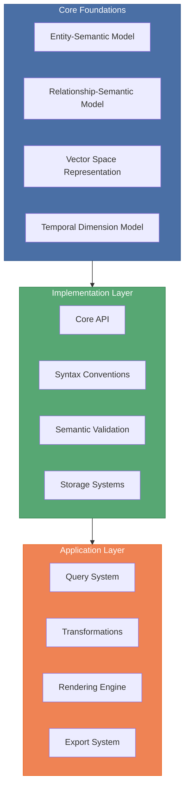
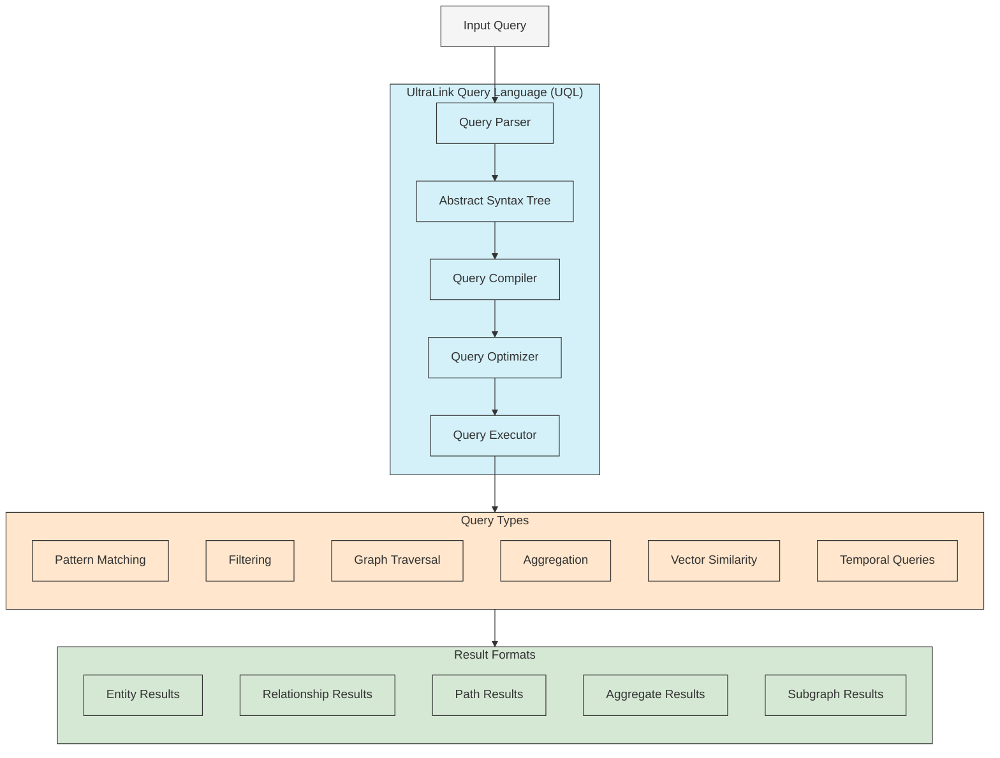

# UltraLink Core Syntax and Semantics

This document provides an in-depth explanation of UltraLink's core syntax, semantic model, and the key features that differentiate it from traditional hypertext and knowledge graph systems.



## 1. Core Conceptual Model

UltraLink is built on an enhanced entity-relationship model that goes beyond traditional graph structures to incorporate semantic richness, vectorization, and temporal dimensions.

### 1.1 Basic Building Blocks

The foundation of UltraLink consists of three primary building blocks:

1. **Entities**: Objects or concepts represented in the knowledge graph
2. **Relationships**: Connections between entities with semantic meaning
3. **Attributes**: Properties that describe entities and relationships

```javascript
// Creating an entity
const person = ultralink.addEntity('alice', 'person', {
  name: 'Alice Chen',
  expertise: ['machine learning', 'data visualization'],
  experience_years: 7
});

// Creating another entity
const project = ultralink.addEntity('project-quantum', 'project', {
  name: 'Quantum',
  status: 'active',
  priority: 'high',
  description: 'Machine learning system for anomaly detection'
});

// Creating a relationship between entities
ultralink.addRelationship('alice', 'project-quantum', 'leads', {
  start_date: '2023-03-15',
  responsibility_level: 0.9,
  contributions: ['architecture', 'ml pipeline design']
});
```

### 1.2 Semantic Types

Unlike simple graph databases, UltraLink treats semantic types as first-class citizens:

#### Entity Types

Entity types define semantic categories with:
- Type-specific validation rules
- Inheritance of attributes from parent types
- Type-specific behavior and rendering

```javascript
// Defining a custom entity type
ultralink.defineEntityType('research_paper', {
  parent: 'document',
  attributes: {
    title: { type: 'string', required: true },
    authors: { type: 'string[]', required: true },
    publication_date: { type: 'date' },
    abstract: { type: 'text' },
    keywords: { type: 'string[]' },
    citations: { type: 'number', default: 0 }
  },
  validators: [
    (entity) => entity.authors.length > 0 ? null : 'Paper must have at least one author'
  ]
});
```

#### Relationship Types

Relationship types provide semantic context for connections:
- Direction and cardinality constraints
- Domain and range restrictions
- Semantic validation rules
- Temporal characteristics

```javascript
// Defining a custom relationship type
ultralink.defineRelationshipType('cites', {
  sourceTypes: ['research_paper', 'technical_document'],
  targetTypes: ['research_paper', 'technical_document', 'dataset'],
  attributes: {
    context: { type: 'text' },
    page_number: { type: 'number' },
    quote: { type: 'text' },
    significance: { 
      type: 'enum', 
      values: ['supporting', 'contrasting', 'building_upon', 'methodology']
    }
  },
  validators: [
    (rel) => rel.source !== rel.target ? null : 'A paper cannot cite itself'
  ]
});
```

## 2. Syntax Conventions

UltraLink provides a clean, consistent syntax for working with knowledge graphs that emphasizes readability and expressiveness.

### 2.1 Entity Syntax

The core entity syntax follows this pattern:

```javascript
ultralink.addEntity(id, type, attributes);
```

Where:
- `id`: A unique identifier for the entity (string)
- `type`: The semantic type of the entity (string)
- `attributes`: An object containing key-value pairs of attributes

Example with all options:

```javascript
ultralink.addEntity('concept-123', 'concept', {
  name: 'Neural Networks',
  description: 'Computational systems inspired by biological neural networks',
  importance: 0.85,
  tags: ['machine learning', 'AI', 'deep learning'],
  created_at: new Date('2023-06-12'),
  metadata: {
    source: 'textbook',
    page: 42,
    verified: true
  }
}, {
  generateVector: true,          // Automatically generate vector embedding
  linkExisting: true,            // Automatically link to similar existing entities
  temporalTracking: true,        // Enable versioning and temporal tracking
  vectorOptions: {
    model: 'all-MiniLM-L6-v2',   // Specify embedding model
    dimensions: 384              // Specify embedding dimensions
  }
});
```

### 2.2 Relationship Syntax

Relationships follow this pattern:

```javascript
ultralink.addRelationship(sourceId, targetId, type, attributes);
```

Where:
- `sourceId`: ID of the source entity (string)
- `targetId`: ID of the target entity (string)
- `type`: The semantic type of the relationship (string)
- `attributes`: An object containing key-value pairs of attributes

Example with all options:

```javascript
ultralink.addRelationship('concept-123', 'concept-456', 'relates_to', {
  strength: 0.75,
  description: 'Foundational concept that enables understanding of CNNs',
  bidirectional: true,
  tags: ['foundational', 'prerequisite'],
  created_at: new Date('2023-06-12')
}, {
  generateVector: true,          // Generate embedding for this relationship
  temporalTracking: true,        // Track changes to this relationship over time
  weight: 0.75,                  // Weighted relationship for visualization/analysis
  strictValidation: true,        // Enforce strict type validation
});
```

### 2.3 Query Syntax

UltraLink's query syntax is designed for flexibility and expressiveness:

```javascript
// Basic entity query
const results = await ultralink.findEntities({
  type: 'concept',
  attributes: {
    tags: { $contains: 'machine learning' },
    importance: { $gt: 0.7 }
  }
});

// Relationship query
const connections = await ultralink.findRelationships({
  type: 'relates_to',
  attributes: {
    strength: { $gte: 0.6 }
  },
  sourceEntity: {
    type: 'concept'
  },
  targetEntity: {
    type: 'application'
  }
});

// Path query
const paths = await ultralink.findPaths({
  start: 'concept-123',
  end: 'application-789',
  maxDepth: 3,
  relationshipFilter: {
    type: { $in: ['relates_to', 'implements', 'uses'] }
  }
});

// Vector similarity query
const similar = await ultralink.findSimilar('concept-123', {
  threshold: 0.7,
  limit: 5,
  types: ['concept', 'theory']
});
```

## 3. UltraLink Query Language (UQL)

UltraLink provides a comprehensive query language for complex knowledge graph operations. The UQL syntax builds on the programmatic query API with a more expressive text-based format.

### 3.1 Query Language Architecture



### 3.2 UQL Syntax

The UQL syntax is inspired by Cypher (used in Neo4j) but enhanced with UltraLink-specific features:

#### Basic Pattern Matching

```
// Find all persons who authored documents
MATCH (person:person)-[r:authored]->(doc:document)
RETURN person, doc
```

#### Filtering and Conditions

```
// Find documents on AI published after 2020
MATCH (doc:document)
WHERE doc.attributes.tags CONTAINS 'AI'
AND doc.attributes.publication_date > '2020-01-01'
RETURN doc
```

#### Multiple Patterns and Relationships

```
// Find collaborations between authors who both wrote about AI
MATCH (author1:person)-[:authored]->(doc1:document),
      (author2:person)-[:authored]->(doc2:document)
WHERE doc1.attributes.tags CONTAINS 'AI'
AND doc2.attributes.tags CONTAINS 'AI'
AND author1 != author2
RETURN author1, author2
```

#### Path Queries

```
// Find all paths between two people with max 3 hops
MATCH p = (a:person {id: 'alice'})-[*1..3]->(b:person {id: 'bob'})
RETURN p
```

#### Aggregations

```
// Count documents by topic
MATCH (doc:document)
RETURN doc.attributes.topic, COUNT(doc) AS topic_count
ORDER BY topic_count DESC
```

### 3.3 Vector Queries in UQL

UltraLink's query language includes support for vector operations:

```
// Find similar documents based on vector similarity
MATCH (doc:document)
WHERE VECTOR_SIMILARITY(doc, 'query text') > 0.7
RETURN doc
ORDER BY VECTOR_SIMILARITY(doc, 'query text') DESC
LIMIT 10
```

```
// Find entities with similar vectors to a specific entity
MATCH (target) SIMILAR TO (source {id: 'concept-123'})
WITH target, similarity
WHERE similarity > 0.8
RETURN target
```

### 3.4 Temporal Queries

UltraLink's query language includes syntax for temporal queries:

```
// Find the state of an entity at a specific point in time
MATCH (entity {id: 'project-123'}) AT '2023-01-15'
RETURN entity
```

```
// Find changes to an entity over time
MATCH (entity {id: 'project-123'}) CHANGES BETWEEN '2023-01-01' AND '2023-06-30'
RETURN entity, change_type, timestamp
```

### 3.5 Query Language vs API

UQL and the programmatic API can be used interchangeably depending on the context:

```javascript
// Using the query language
const results = await ultralink.executeQuery(`
  MATCH (person:person)-[r:authored]->(doc:document)
  WHERE doc.attributes.tags CONTAINS 'tutorial'
  AND person.attributes.expertise IN ['javascript', 'typescript']
  RETURN person, doc
  SORT doc.attributes.publishDate DESC
  LIMIT 10
`);

// Equivalent using the programmatic API
const results = await ultralink.findRelationships({
  type: 'authored',
  sourceEntity: {
    type: 'person',
    attributes: {
      expertise: { $in: ['javascript', 'typescript'] }
    }
  },
  targetEntity: {
    type: 'document',
    attributes: {
      tags: { $contains: 'tutorial' }
    }
  },
  sort: [{ field: 'targetEntity.attributes.publishDate', order: 'desc' }],
  limit: 10,
  include: ['sourceEntity', 'targetEntity']
});
```

### 3.6 Parameterized Queries

For security and reusability, UQL supports parameterized queries:

```javascript
// Using parameters in a query
const results = await ultralink.executeQuery(`
  MATCH (doc:document)
  WHERE doc.attributes.topic = $topic
  AND doc.attributes.published_date > $date
  RETURN doc
`, {
  topic: 'machine learning',
  date: '2023-01-01'
});
```

### 3.7 Query Optimization

UltraLink's query engine automatically optimizes queries:

1. **Index Utilization**: Uses available indices for faster lookups
2. **Join Order Optimization**: Determines the most efficient order to process patterns
3. **Predicate Pushdown**: Applies filters as early as possible in the query execution
4. **Query Rewriting**: Rewrites queries into semantically equivalent but more efficient forms
5. **Caching**: Caches frequently used query patterns and results

## 4. Attribute Types and Validation

UltraLink supports a variety of attribute types with built-in validation:

### 4.1 Primitive Types

- **string**: Text values
- **number**: Numeric values (integers or floating point)
- **boolean**: True/false values
- **date**: Date and time values

### 4.2 Complex Types

- **object**: Nested object structures
- **array**: Lists of values
- **<type>[]**: Arrays of a specific type (e.g., string[])
- **enum**: Values from a predefined set
- **reference**: References to other entities
- **vector**: Vector embeddings

### 4.3 Type Definition and Validation

Type definitions include validation rules to ensure data integrity:

```javascript
ultralink.defineEntityType('researcher', {
  attributes: {
    name: { 
      type: 'string', 
      required: true,
      minLength: 2
    },
    h_index: { 
      type: 'number', 
      min: 0, 
      default: 0 
    },
    active: { 
      type: 'boolean', 
      default: true 
    },
    expertise: { 
      type: 'string[]', 
      minItems: 1 
    },
    primary_institution: { 
      type: 'reference', 
      targetType: 'institution', 
      required: true 
    },
    contact: { 
      type: 'object', 
      properties: {
        email: { type: 'string', format: 'email' },
        phone: { type: 'string', pattern: '^\\+[0-9]{1,3}-[0-9]{3,14}$' }
      }
    }
  }
});
```

## 5. Advanced Syntax Features

### 5.1 Custom Functions

UltraLink allows defining custom functions for use in queries and transformations:

```javascript
// Define a custom scoring function
ultralink.defineFunction('expertiseScore', (entity, field) => {
  if (!entity.attributes[field]) return 0;
  
  let score = 0;
  const expertise = entity.attributes[field];
  
  if (Array.isArray(expertise)) {
    score = expertise.length * 10;
    if (expertise.includes('machine learning')) score += 20;
  }
  
  return score;
});

// Use the custom function in a query
const experts = await ultralink.findEntities({
  type: 'person',
  customScore: {
    function: 'expertiseScore',
    args: ['expertise'],
    min: 30
  }
});
```

### 5.2 Multi-hop Relationship Traversal

UltraLink provides syntax for multi-hop traversals through the graph:

```javascript
// Find all entities connected to 'concept-123' within 2 hops
const connected = await ultralink.traverse({
  start: 'concept-123',
  depth: 2,
  direction: 'both',
  relationshipTypes: ['references', 'related_to', 'depends_on']
});

// Find reachable entities with specific constraints
const reachable = await ultralink.traverse({
  start: 'project-456',
  pathCondition: {
    minLength: 1,
    maxLength: 3,
    relationshipFilter: {
      type: { $in: ['part_of', 'has_component'] }
    }
  },
  nodeFilter: {
    type: 'component',
    attributes: {
      status: 'active'
    }
  }
});
```

### 5.3 Temporal Syntax

UltraLink's temporal features have their own syntax for tracking changes over time:

```javascript
// Get entity state at a specific point in time
const historicalState = await ultralink.getEntityAt('project-123', '2023-01-15');

// Compare entity states between two dates
const changes = await ultralink.compareEntityStates('project-123', {
  from: '2023-01-01',
  to: '2023-06-30'
});

// Track entity evolution over time
const evolution = await ultralink.trackEntityEvolution('project-123', {
  interval: 'month',
  from: '2023-01-01',
  to: '2023-12-31',
  attributes: ['status', 'completion_percentage']
});
```

## 6. Syntax Extensions

UltraLink can be extended with custom syntax for domain-specific applications:

### 6.1 Domain-Specific Languages

```javascript
// Register a DSL extension
ultralink.registerSyntaxExtension('science', {
  patterns: {
    EXPERIMENT: /\[\[EXP:([\w-]+)\]\]/g
  },
  handlers: {
    EXPERIMENT: (match, entityStore) => {
      const experimentId = match[1];
      // Create an entity reference for the experiment
      return {
        type: 'entity_reference',
        entityId: `experiment-${experimentId}`,
        display: `Experiment ${experimentId}`
      };
    }
  }
});

// Parse content with DSL syntax
const parsed = await ultralink.parseContent(`
  In [[EXP:A123]], we observed significant results compared to [[EXP:B456]].
`, 'research-note-789');
```

## 7. Relationship with Other Syntax Standards

UltraLink's syntax is designed to be interoperable with other standards:

### 7.1 Compatibility with Common Formats

| Format | Compatibility | Notes |
|--------|---------------|-------|
| JSON | Full | Native representation |
| GraphML | Full | Complete graph export |
| RDF/OWL | Partial | Semantic mappings available |
| Cypher | Partial | Query language compatible |
| SPARQL | Limited | Basic query patterns |
| Markdown/Wiki | Full | Via parser extensions |
| CSV | Partial | Tabular representation |

## 8. Best Practices

### 8.1 Entity and Relationship Naming

- Use consistent, meaningful IDs
- Follow clear type naming conventions (e.g., camelCase for entity types)
- Use verbs for relationship types (e.g., `authored`, `depends_on`)
- Be consistent with attribute naming (e.g., snake_case or camelCase)

### 8.2 Query Optimization

- Use indices for frequently queried attributes
- Limit the scope of traversal queries
- Use parameterized queries for better caching
- Split complex queries into simpler ones when appropriate
- Profile queries to identify performance bottlenecks

## 9. Conclusion

UltraLink's syntax and semantics provide a powerful framework for working with knowledge graphs that goes beyond traditional systems. By combining rich semantic relationships, vector embeddings, temporal tracking, and flexible rendering, UltraLink enables a new generation of knowledge applications.

The key advantages include:

1. **Semantic richness**: Relationships and entities with multi-dimensional context
2. **Vector understanding**: Content similarity and semantic discovery
3. **Temporal awareness**: Knowledge evolution tracking
4. **Format flexibility**: Multiple rendering targets from a single source
5. **Integration capabilities**: Connection with LLMs and external systems

These capabilities enable applications ranging from research knowledge management and education to complex data analysis and decision support systems. 