# Temporal Analysis in UltraLink

## Understanding the Time Dimension in Knowledge Graphs

One of UltraLink's most powerful capabilities is its comprehensive **temporal analysis system**. While most knowledge graph systems focus only on the current state of knowledge, UltraLink captures the evolution of knowledge over time, enabling a wide range of historical analysis, trend detection, and predictive capabilities.

> **Note:** All diagrams in the UltraLink documentation use Mermaid syntax for consistency, clarity, and maintainability.

## Why Temporal Analysis Matters

Knowledge is not static—it evolves, adapts, and changes. The temporal dimension adds crucial context to knowledge representation:

- Track how concepts evolve over time
- Understand the development and adoption of ideas
- Identify emerging trends and fading topics
- Analyze cause-and-effect relationships across time
- Compare knowledge states at different points in time
- Predict future knowledge developments

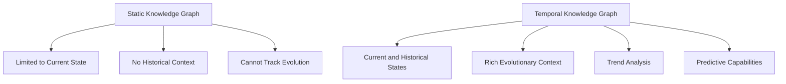

## Core Temporal Concepts

### Temporal Snapshots

UltraLink automatically creates snapshots of your knowledge graph at configurable intervals or when significant changes occur:

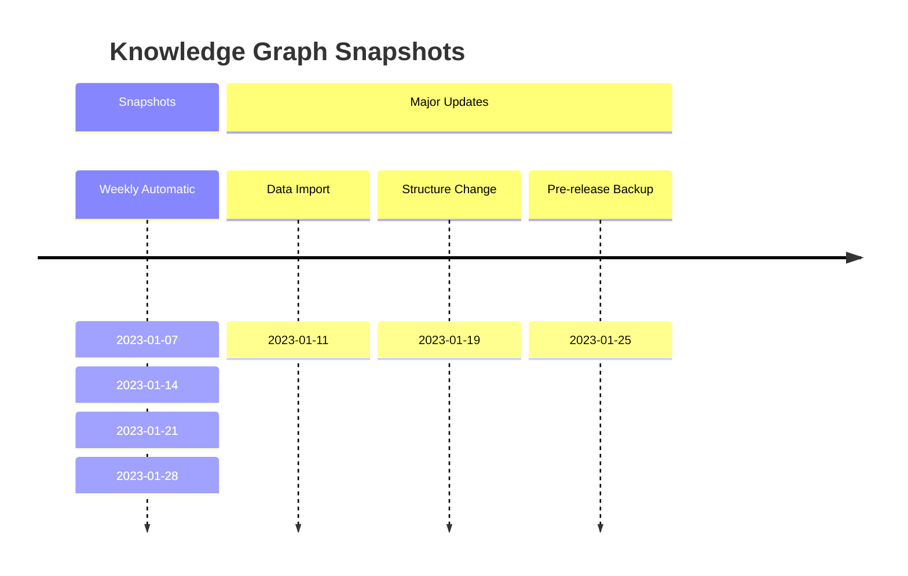

Snapshots can be created automatically at regular intervals or manually at significant points:

```javascript
// Configure automatic snapshots
graph.configureTemporalTracking({
  autoSnapshot: true,
  snapshotInterval: '1d',     // Take daily snapshots
  snapshotOnThreshold: 50,    // Or snapshot after 50 changes
  pruneSnapshots: true,       // Clean up old snapshots
  retentionPolicy: '90d'      // Keep snapshots for 90 days
});

// Manually create a snapshot
const snapshotId = await graph.createSnapshot({
  label: 'Pre-update baseline',
  metadata: {
    author: 'Alice',
    reason: 'Before major data update'
  }
});
```

### Entity and Relationship History

Each entity and relationship maintains a complete history of changes:

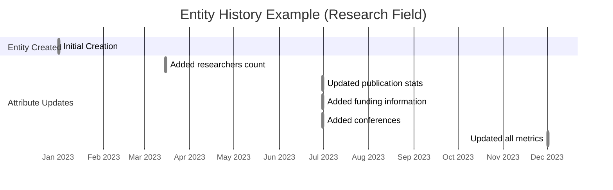

Access this history with simple API calls:

```javascript
// Get the complete history of an entity
const history = graph.getEntityHistory('research-paper-1', {
  includeAttributes: true,
  includeRelationships: true,
  startTime: '2023-01-01',
  endTime: '2023-12-31'
});

// Display how an entity evolved
for (const change of history.changes) {
  console.log(`[${change.timestamp}] ${change.type}: ${JSON.stringify(change.details)}`);
}
```

### Temporal Queries

Query your knowledge graph at specific points in time:

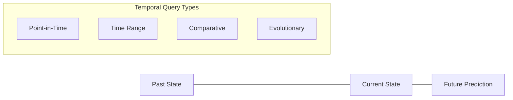

```javascript
// Get the state of an entity at a specific point in time
const pastEntity = graph.getEntityAtTime('research-paper-1', '2023-06-15T12:00:00Z');

// Get the entire knowledge graph as it existed at a specific time
const pastGraph = graph.getGraphAtTime('2023-06-15T12:00:00Z');

// Query entities that existed during a time range
const entitiesInTimeRange = graph.queryEntitiesInTimeRange({
  startTime: '2023-01-01',
  endTime: '2023-03-31',
  type: 'research-paper',
  attributes: {
    status: 'published'
  }
});
```

## Tracking Temporal Changes

### Change Tracking System

UltraLink automatically tracks all changes to the knowledge graph:

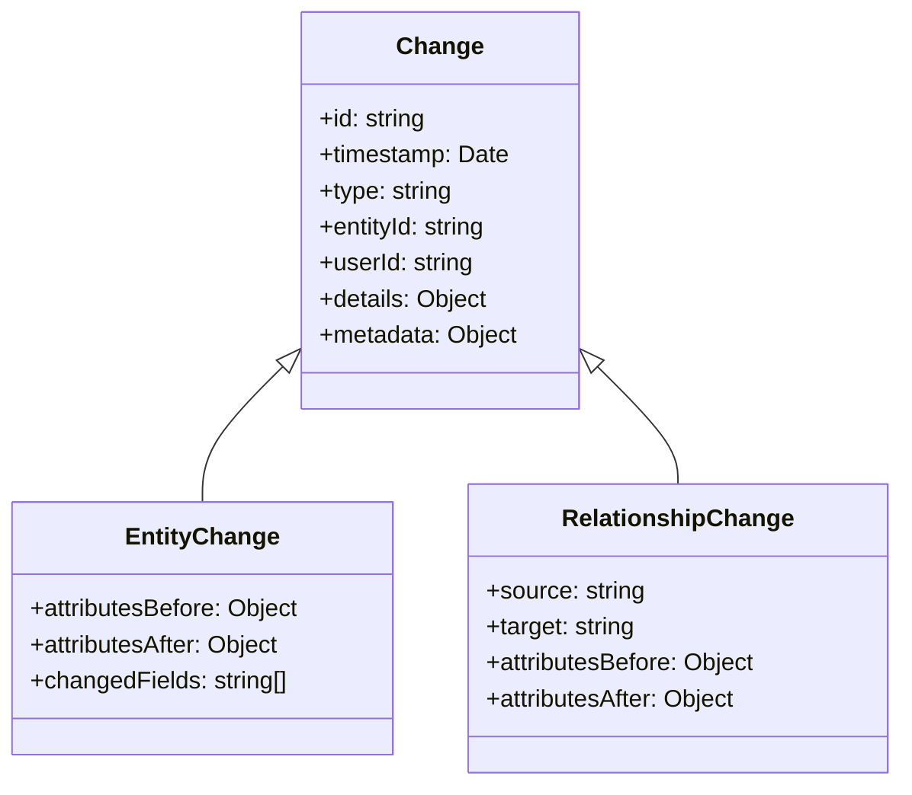

Changes are tracked automatically as you update the graph:

```javascript
// Entity update - change tracked automatically
graph.updateEntity('researcher-1', {
  h_index: 27,  // Update h-index from previous value
  publications: 45
});

// Relationship update - change tracked automatically
graph.updateLink('researcher-1', 'paper-1', {
  role: 'corresponding author',  // Previously was 'lead author'
  contribution_percentage: 65
});
```

### Change Annotations

Add context to changes with metadata:

```javascript
// Update with change metadata
graph.updateEntity('research-paper-1', 
  { status: 'published' },
  { 
    changeReason: 'Peer review completed',
    changedBy: 'journal-editor',
    changeContext: 'Publication workflow step 5'
  }
);
```

## Analyzing Temporal Data

### Change Statistics

Understand how your knowledge graph evolves over time:

```mermaid
bar
    title Entity Change Frequency (6 Months)
    x-axis [Jan, Feb, Mar, Apr, May, Jun]
    y-axis Changes
    bar [45, 32, 67, 89, 103, 120]
```

```javascript
// Get change frequency statistics
const changeStats = graph.getChangeStatistics({
  entityType: 'research-paper',
  timeframe: '6 months',
  aggregateBy: 'week'
});

console.log('Change frequency by week:', changeStats.byPeriod);
console.log('Most frequently changed attributes:', changeStats.attributes);
```

### Temporal Patterns

Detect patterns in how your knowledge graph evolves:

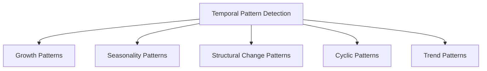

```javascript
// Analyze temporal patterns
const patterns = graph.analyzeTemporalPatterns({
  entityTypes: ['research-paper', 'researcher'],
  patternTypes: ['growth', 'seasonality', 'structural_change'],
  timeframe: '2 years'
});

// Results include identified patterns, confidence scores, and supporting evidence
console.log('Detected patterns:', patterns);
```

### Evolution Analysis

Track how concepts evolve over time:

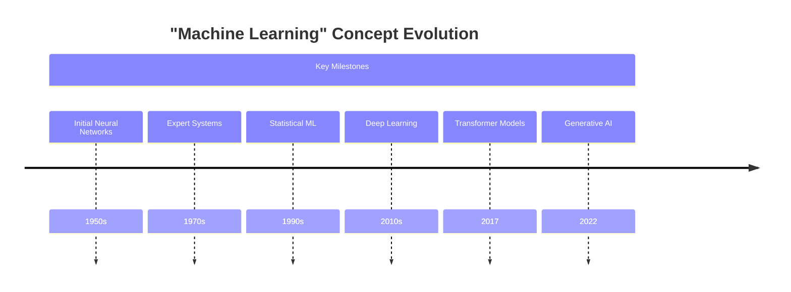

```javascript
// Track how a concept has evolved over time
const evolution = graph.trackConceptEvolution('machine-learning', {
  startTime: '2020-01-01',
  endTime: '2023-01-01',
  resolution: 'quarter',
  trackAttributes: ['popularity', 'applications', 'related_concepts']
});

// Visualize the evolution
console.log('Concept evolution by quarter:', evolution);
```

## Temporal Comparison

### Comparing Snapshots

Compare different versions of your knowledge graph:

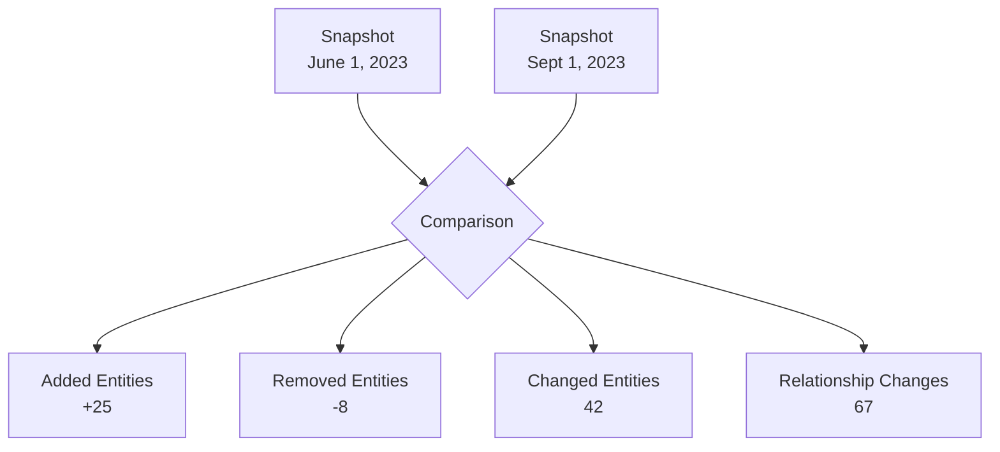

```javascript
// Compare two snapshots
const diff = graph.compareSnapshots('snapshot-20230601', 'snapshot-20230901', {
  detailLevel: 'comprehensive',
  includeAddedEntities: true,
  includeRemovedEntities: true,
  includeChangedEntities: true,
  includeRelationshipChanges: true
});

console.log('Entities added:', diff.addedEntities.length);
console.log('Entities removed:', diff.removedEntities.length);
console.log('Entities changed:', diff.changedEntities.length);
console.log('Relationships changed:', diff.changedRelationships.length);
```

### Comparing Entities Over Time

Compare how specific entities have changed:

```javascript
// Compare an entity across time periods
const entityComparison = graph.compareEntityAcrossTime('researcher-1', {
  timePoint1: '2022-01-01',
  timePoint2: '2023-01-01',
  attributes: ['h_index', 'publications', 'collaborators']
});

console.log('Entity changes:', entityComparison);
```

## Causal Analysis

### Identifying Influence

Identify causal relationships between changes:

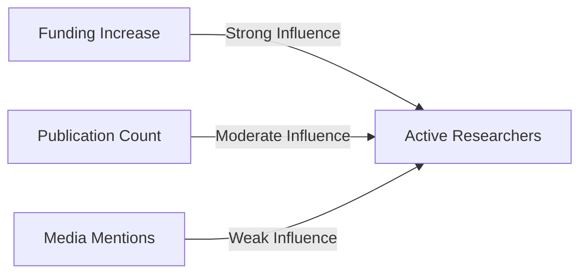

```javascript
// Analyze causal influences
const causalAnalysis = graph.analyzeCausalInfluence({
  targetEntityId: 'research-field-1',
  targetAttribute: 'active_researchers',
  potentialCauses: ['funding', 'publication_count', 'media_mentions'],
  timeframe: '5 years',
  confidenceThreshold: 0.7
});

console.log('Causal factors:', causalAnalysis.factors);
console.log('Confidence scores:', causalAnalysis.confidenceScores);
```

### Change Propagation

Analyze how changes propagate through the knowledge graph:

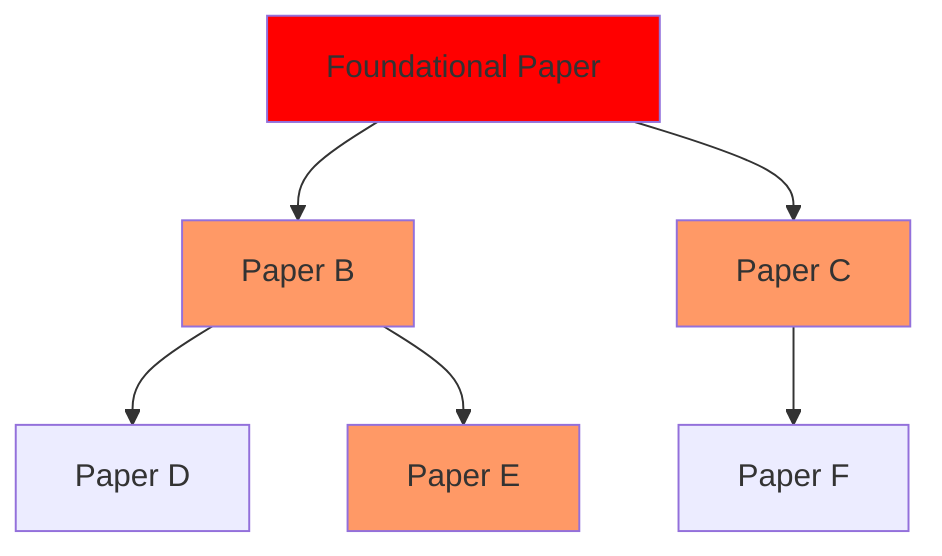

```javascript
// Track how changes propagate
const propagationAnalysis = graph.analyzeChangePropagation({
  sourceEntityId: 'foundational-paper-1',
  propagationDepth: 3,
  timeframe: '2 years',
  relationshipTypes: ['cites', 'builds_upon', 'critiques']
});

console.log('Change propagation network:', propagationAnalysis.network);
console.log('Propagation metrics:', propagationAnalysis.metrics);
```

## Temporal Visualization

Prepare temporal data for visualization:

```mermaid
xychart-beta
    title "Research Field Growth (3 Years)"
    x-axis [Q1-2021, Q2-2021, Q3-2021, Q4-2021, Q1-2022, Q2-2022, Q3-2022, Q4-2022, Q1-2023, Q2-2023, Q3-2023, Q4-2023]
    y-axis "Researchers" 100 -> 300
    line [120, 135, 142, 150, 165, 178, 190, 210, 225, 245, 260, 290]
```

```javascript
// Generate temporal visualization data
const visualizationData = graph.generateTemporalVisualizationData({
  entityTypes: ['research-paper', 'researcher', 'research-field'],
  timeframe: '3 years',
  resolution: 'month',
  metrics: ['count', 'connection_density', 'centrality'],
  format: 'timeseries'
});

// Result can be used with visualization libraries like D3.js
console.log('Visualization data prepared for rendering');
```

## Advanced Temporal Features

### Temporal Inference

Infer relationships based on temporal patterns:

```javascript
// Infer temporal relationships
const inferredRelationships = graph.inferTemporalRelationships({
  entityType: 'research-paper',
  relationshipTypes: ['influences', 'precedes'],
  confidenceThreshold: 0.8,
  requireTemporalOrder: true
});

console.log(`Inferred ${inferredRelationships.length} temporal relationships`);
```

### Predictive Analysis

Predict future states based on historical patterns:

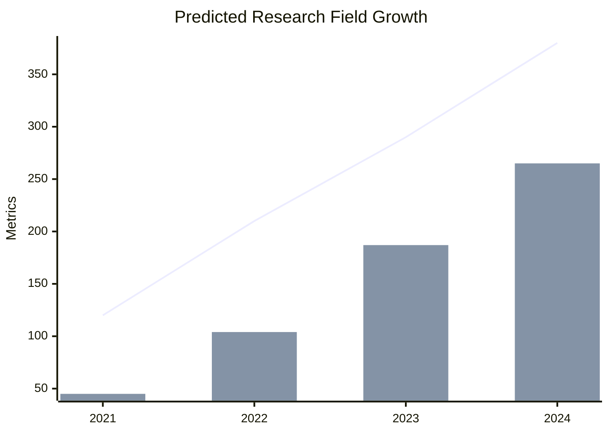

```javascript
// Predict future trends
const predictions = graph.predictTemporalTrends({
  entityId: 'research-field-1',
  attributes: ['active_researchers', 'funding', 'publication_count'],
  predictionHorizon: '1 year',
  confidenceInterval: 0.9
});

console.log('Predicted trends:', predictions);
```

## Working with Time Periods

### Setting Time Periods

Define custom time periods for analysis:

```javascript
// Define custom time periods
graph.defineTimePeriods({
  'pre-pandemic': { start: '2019-01-01', end: '2020-02-29' },
  'early-pandemic': { start: '2020-03-01', end: '2020-08-31' },
  'mid-pandemic': { start: '2020-09-01', end: '2021-12-31' },
  'post-pandemic': { start: '2022-01-01', end: '2023-12-31' }
});

// Use defined time periods in queries
const publishedDuringPeriod = graph.queryEntitiesInTimePeriod('early-pandemic', {
  type: 'research-paper',
  attributes: { status: 'published' }
});
```

### Time-Based Events

Track significant events on your temporal timeline:

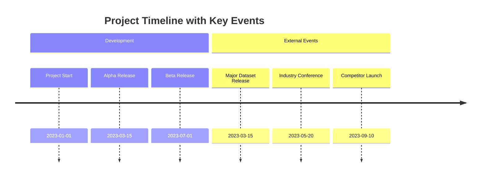

```javascript
// Add a significant event
graph.addTimelineEvent({
  timestamp: '2023-03-15T09:00:00Z',
  title: 'Major Dataset Release',
  description: 'Release of comprehensive research dataset',
  impact: 'high',
  relatedEntities: ['dataset-1', 'research-team-3']
});

// Get timeline events
const events = graph.getTimelineEvents({
  startTime: '2023-01-01',
  endTime: '2023-12-31',
  impactLevel: 'high'
});
```

## Temporal API Configuration

Configure how the Temporal API behaves:

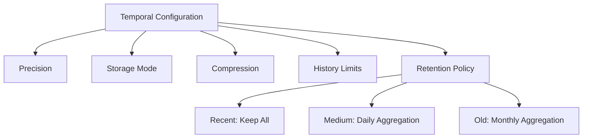

```javascript
// Configure temporal tracking
graph.configureTemporalOptions({
  precision: 'millisecond',      // Timestamp precision
  storageMode: 'differential',   // Only store changes, not full copies
  compressionEnabled: true,      // Compress temporal data to save space
  maxHistoryPerEntity: 1000,     // Maximum history entries per entity
  historyRetentionPolicy: {
    recentChanges: 'all',        // Keep all recent changes
    olderThan: '30d',            // For changes older than 30 days...
    aggregationInterval: '1d',   // ...aggregate changes by day
    olderThan: '1y',             // For changes older than 1 year...
    aggregationInterval: '1M'    // ...aggregate changes by month
  }
});
```

## Integration with Rendering System

The Temporal API integrates with UltraLink's flexible rendering system:

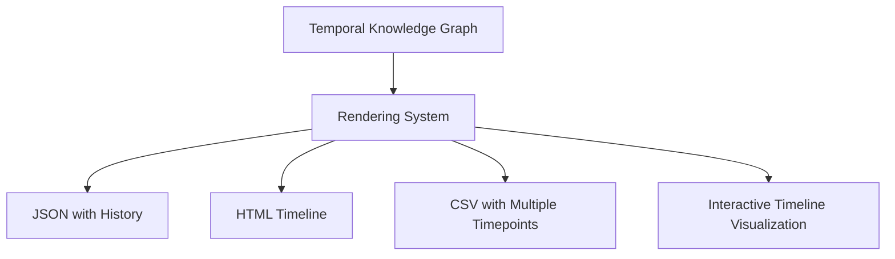

```javascript
// Export temporal data in various formats
const temporalJson = graph.toJSON({
  includeHistory: true,
  historyFormat: 'comprehensive'
});

// Create a temporal visualization in HTML
const temporalHtml = graph.toHTMLWebsite({
  includeTimeline: true,
  timelineStyle: 'interactive',
  historyDepth: '1 year'
});

// Export to other formats with temporal information preserved
const temporalCSV = graph.toCSV({
  includeSnapshots: ['2023-01-01', '2023-06-01', '2023-12-01']
});
```

## Example: Complete Temporal Analysis Workflow

Here's a complete example that demonstrates a temporal analysis workflow:

```javascript
const { UltraLink } = require('ultralink');
const { TemporalExtension } = require('@ultralink/temporal');

async function main() {
  // Create UltraLink instance with temporal tracking
  const graph = new UltraLink();
  graph.use(TemporalExtension);
  
  // Configure temporal tracking
  graph.configureTemporalTracking({
    autoSnapshot: true,
    snapshotInterval: '1w'  // Weekly snapshots
  });
  
  // Create initial entities (Jan 1, 2023)
  graph.setSystemTime('2023-01-01');  // For demo purposes
  
  const field = graph.createEntity('research-field', 'quantum-ml', {
    name: 'Quantum Machine Learning',
    active_researchers: 120,
    publication_count: 45
  });
  
  // First update (March 15, 2023)
  graph.setSystemTime('2023-03-15');
  
  graph.updateEntity('quantum-ml', {
    active_researchers: 150,
    publication_count: 62,
    funding: '$12M'
  });
  
  // Second update (June 30, 2023)
  graph.setSystemTime('2023-06-30');
  
  graph.updateEntity('quantum-ml', {
    active_researchers: 185,
    publication_count: 104,
    funding: '$18M',
    major_conferences: 3
  });
  
  // Final update (December 1, 2023)
  graph.setSystemTime('2023-12-01');
  
  graph.updateEntity('quantum-ml', {
    active_researchers: 250,
    publication_count: 187,
    funding: '$25M',
    major_conferences: 5,
    commercial_applications: 2
  });
  
  // Reset system time
  graph.useSystemTime();
  
  // Analyze the field's growth
  const history = graph.getEntityHistory('quantum-ml');
  
  console.log('History of Quantum ML field:');
  for (const change of history.changes) {
    console.log(`[${change.timestamp}] Changes: ${JSON.stringify(change.details)}`);
  }
  
  // Generate growth metrics
  const growthAnalysis = graph.analyzeAttributeGrowth('quantum-ml', {
    attributes: ['active_researchers', 'publication_count', 'funding'],
    startTime: '2023-01-01',
    endTime: '2023-12-01'
  });
  
  console.log('\nGrowth analysis:');
  for (const attribute in growthAnalysis) {
    console.log(`${attribute}: ${growthAnalysis[attribute].growthRate}% growth`);
  }
  
  // Predict future trend
  const prediction = graph.predictAttributeValues('quantum-ml', {
    attributes: ['active_researchers', 'publication_count'],
    predictionPoint: '2024-06-01'
  });
  
  console.log('\nPredictions for June 2024:');
  console.log(`Predicted researchers: ${prediction.active_researchers.value} (confidence: ${prediction.active_researchers.confidence})`);
  console.log(`Predicted publications: ${prediction.publication_count.value} (confidence: ${prediction.publication_count.confidence})`);
  
  // Export temporal data
  const timelineData = graph.exportAttributeTimeline('quantum-ml', {
    attributes: ['active_researchers', 'publication_count', 'funding'],
    format: 'csv'
  });
  
  console.log('\nTimeline data exported successfully');
}

main().catch(console.error);
```

## Best Practices for Temporal Data

For optimal use of the Temporal API:

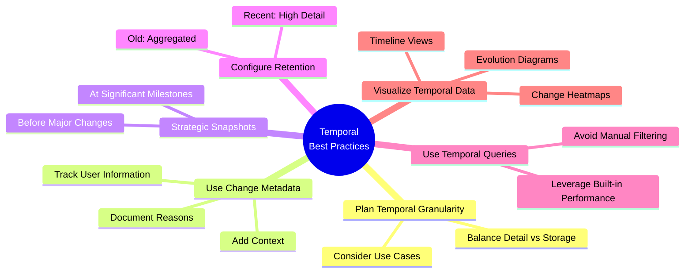

1. **Plan your temporal granularity** - Consider how fine-grained your temporal tracking needs to be
2. **Use change metadata** - Add context to changes to make historical analysis more meaningful
3. **Create snapshots before major changes** - Especially for large batch operations
4. **Configure retention policies** - Balance historical detail with storage efficiency
5. **Use temporal queries** - Instead of building your own time-based filtering logic
6. **Leverage visualization exports** - Use the rendering system to visualize temporal data

## API Reference Details

The complete Temporal API includes these main method groups:

| Method Group | Description |
|--------------|-------------|
| `configureTemporalTracking()` | Configure temporal tracking options |
| `createSnapshot()` / `getSnapshot()` | Create and retrieve snapshots |
| `getEntityHistory()` / `getLinkHistory()` | Get historical changes |
| `getEntityAtTime()` / `getGraphAtTime()` | Access past states |
| `compareSnapshots()` / `compareEntityAcrossTime()` | Temporal comparison |
| `analyzeTemporalPatterns()` / `trackConceptEvolution()` | Temporal analysis |
| `predictTemporalTrends()` | Predictive functions |
| `exportAttributeTimeline()` | Export temporal data |

Each method accepts specific options to customize its behavior. For comprehensive details on parameters and return values, see the [Temporal API Reference](../api/temporal-api.md).

## Conclusion: The Power of Time-Aware Knowledge

The temporal capabilities of UltraLink transform static knowledge into dynamic, evolving representations of information. By capturing not just what is known, but how knowledge changes over time, UltraLink enables deeper insights, more nuanced analysis, and better-informed decisions.

Whether you're tracking research trends, monitoring organizational knowledge, or analyzing the evolution of complex systems, UltraLink's temporal features provide the tools you need to understand not just the current state of knowledge, but its past and potential future. 