# The UltraLink Paradigm: A Formal Specification

## 1. Abstract

UltraLink represents a novel meta-linking paradigm for managing and analyzing relational content with deterministic deployment capabilities. It provides a unified framework for representing, transforming, and analyzing complex knowledge networks enriched with vector embeddings, LLM-generated insights, and temporal evolution patterns.

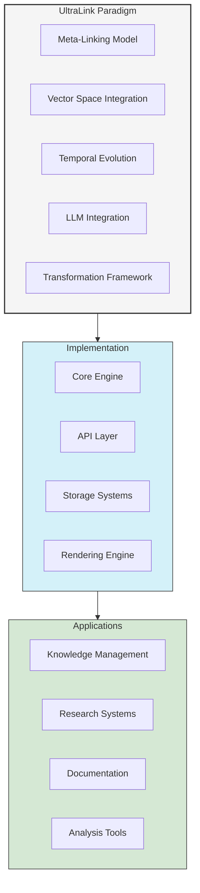

## 2. Core Concepts

### 2.1 Meta-Linking Model

The UltraLink meta-linking model is defined as a tuple \( U = (E, L, M, V) \) where:
- \( E \): Set of entities with typed attributes
- \( L \): Set of directed links between entities
- \( M \): Global metadata store
- \( V \): Vector space mappings

#### 2.1.1 Entity Definition

An entity \( e \in E \) is formally defined as:
```typescript
Entity = {
  id: string;
  type: string;
  attributes: {
    [key: string]: any;
    vector?: VectorMetadata;
    llm_insights?: LLMInsights;
    temporal?: TemporalData;
  }
}
```

#### 2.1.2 Link Definition

A link \( l \in L \) is defined as:
```typescript
Link = {
  source: string;  // Entity ID
  target: string;  // Entity ID
  type: string;
  attributes?: {[key: string]: any}
}
```

### 2.2 Vector Space Integration

Vector space mappings \( V \) provide:
- Embedding functions \( f: E \rightarrow \mathbb{R}^n \)
- Distance metrics \( d: \mathbb{R}^n \times \mathbb{R}^n \rightarrow \mathbb{R} \)
- Cluster assignments \( c: \mathbb{R}^n \rightarrow C \)

```typescript
VectorMetadata = {
  embedding: number[];
  cluster: string;
  centroid_distance: number;
  similar_concepts: Array<{
    id: string;
    similarity: number;
  }>;
}
```

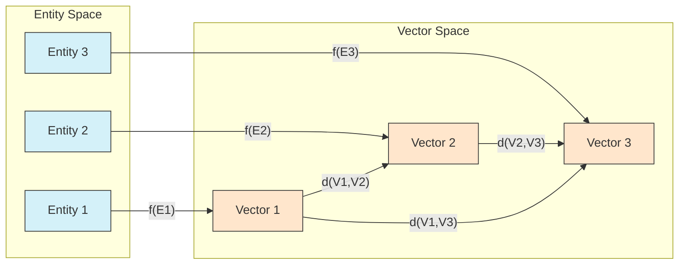

### 2.3 LLM Integration Layer

LLM-generated insights are structured as:
```typescript
LLMInsights = {
  key_findings: Array<{
    statement: string;
    justification: string;
    confidence: number;
    supporting_evidence: string[];
  }>;
  critical_parameters: {
    [key: string]: {
      value: any;
      justification: string;
    }
  };
  risk_assessment: {
    technical_risks: Array<{
      risk: string;
      probability: number;
      impact: number;
    }>;
  };
}
```

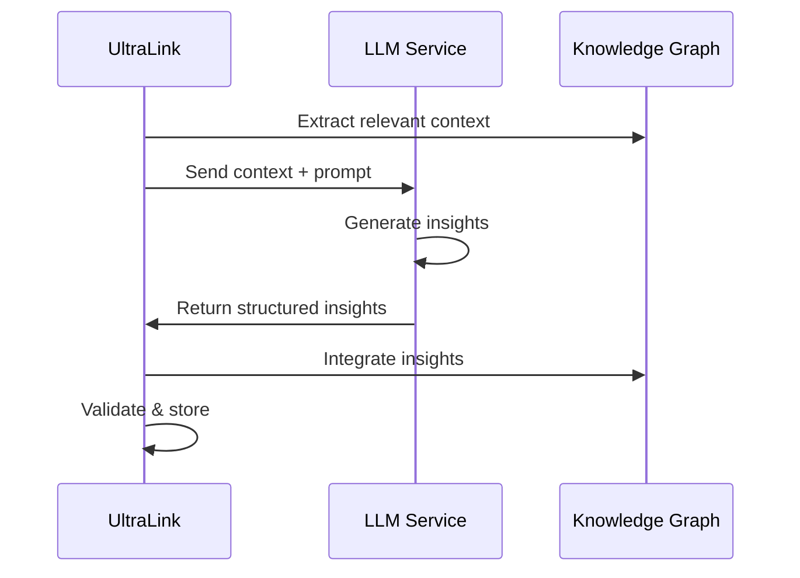

## 3. Transformation Framework

### 3.1 Export Formats

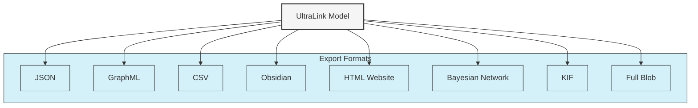

#### 3.1.1 JSON Representation
- Complete serialization of \( U = (E, L, M, V) \)
- Preserves all metadata and relationships
- Suitable for full system state persistence

#### 3.1.2 GraphML Export
- Network-centric representation
- XML-based format with attribute preservation
- Suitable for graph analysis tools

#### 3.1.3 CSV Export
- Flattened representation of entities and relationships
- Normalized attribute columns
- Suitable for tabular analysis and data science workflows

#### 3.1.4 Obsidian Export
- Markdown-based knowledge representation
- Bidirectional linking support
- Human-readable format with metadata sections

### 3.2 Transformation Rules

1. **Completeness Rule**: All transformations must preserve the complete information content of the source data
2. **Determinism Rule**: Transformations must be deterministic and reproducible
3. **Reversibility Rule**: When possible, transformations should be reversible
4. **Type Preservation Rule**: Entity and relationship types must be preserved across transformations

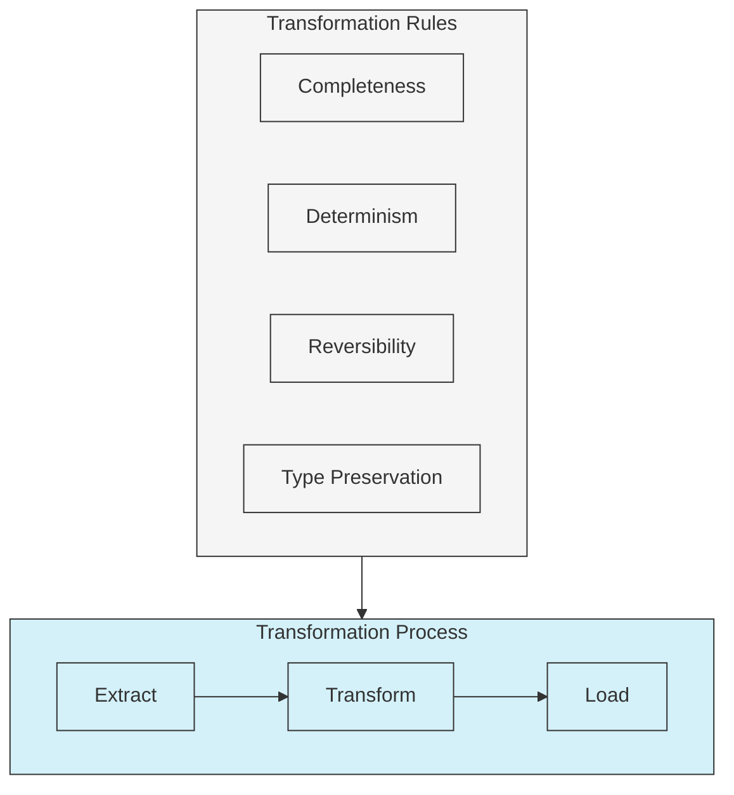

## 4. Temporal Evolution Model

### 4.1 Knowledge Evolution Tracking

```typescript
TemporalAnalysis = {
  knowledge_evolution: Array<{
    timeframe: string;
    key_developments: string[];
    impact_score: number;
  }>;
  version_history: Array<{
    version: string;
    changes: Change[];
    metadata: any;
  }>;
}
```

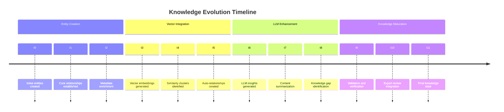

### 4.2 Change Propagation

Changes in the knowledge graph are propagated according to:
1. **Immediate Propagation**: Direct entity and relationship updates
2. **Cascading Updates**: Changes affecting dependent entities
3. **Metadata Evolution**: Updates to global metadata store

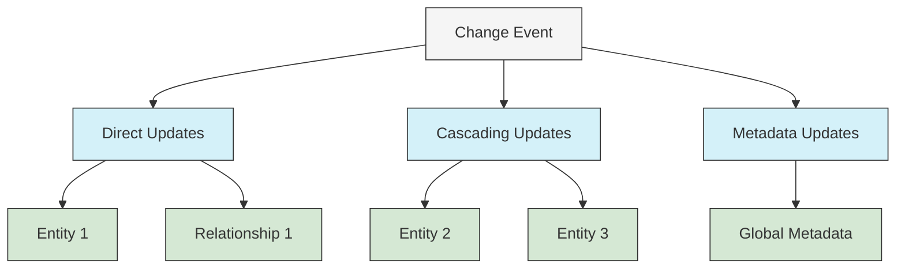

## 5. Analysis Capabilities

### 5.1 Graph Metrics

```typescript
GraphMetrics = {
  density: number;
  clustering_coefficient: number;
  average_path_length: number;
  centrality_measures: {
    betweenness: {[key: string]: number};
    eigenvector: {[key: string]: number};
    degree: {[key: string]: number};
  };
}
```

### 5.2 Cluster Analysis

```typescript
ClusterAnalysis = Array<{
  name: string;
  centroid: number[];
  members: string[];
  coherence: number;
  temporal_stability: number;
}>;
```

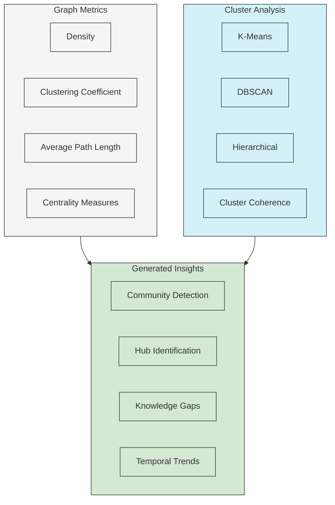

### 5.3 Impact Analysis

```typescript
ImpactMetrics = {
  citation_network: {
    vector: number[];
    influential_citations: Citation[];
    research_threads: ResearchThread[];
  };
  methodology_assessment: {
    novelty_score: number;
    reproducibility_score: number;
    justification: string;
  };
}
```

## 6. Implementation Guidelines

### 6.1 Core System Requirements

1. **Persistence Layer**
   - Efficient storage of entities and relationships
   - Support for vector operations
   - Temporal data management

2. **Query Interface**
   - Graph traversal operations
   - Vector similarity search
   - Temporal queries

3. **Export Pipeline**
   - Format-specific serializers
   - Validation mechanisms
   - Error handling

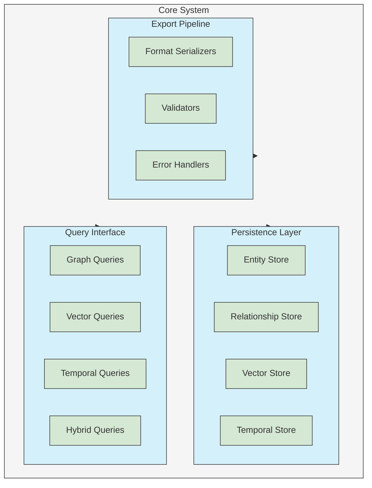

### 6.2 Extension Points

1. **Custom Entity Types**
   ```typescript
   interface CustomEntity extends Entity {
     custom_attributes: any;
     validation_rules: ValidationRule[];
   }
   ```

2. **Custom Transformations**
   ```typescript
   interface CustomTransformation {
     source_format: string;
     target_format: string;
     transform(data: any): any;
     validate(result: any): boolean;
   }
   ```

3. **Analysis Plugins**
   ```typescript
   interface AnalysisPlugin {
     name: string;
     description: string;
     compute(graph: UltraLink): AnalysisResult;
   }
   ```

## 7. Best Practices

### 7.1 Data Modeling

1. **Entity Design**
   - Use meaningful and unique identifiers
   - Include comprehensive metadata
   - Maintain type consistency

2. **Relationship Modeling**
   - Define clear relationship types
   - Include relationship attributes
   - Consider bidirectional relationships

3. **Vector Space Design**
   - Choose appropriate embedding dimensions
   - Define meaningful similarity metrics
   - Implement efficient clustering

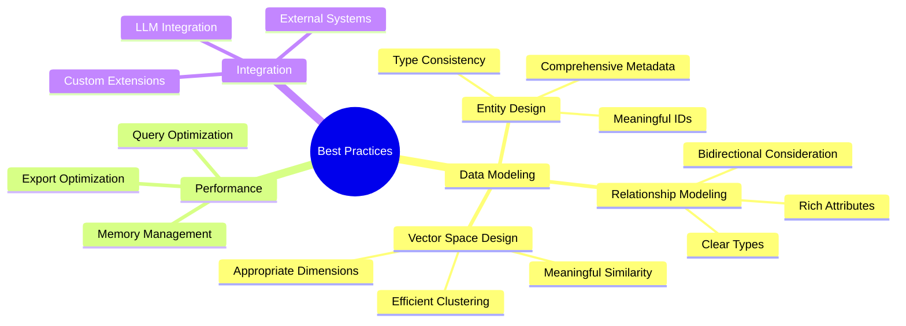

### 7.2 Performance Optimization

1. **Query Optimization**
   - Index frequently accessed attributes
   - Cache vector computations
   - Optimize graph traversals

2. **Memory Management**
   - Implement lazy loading for large graphs
   - Use efficient data structures
   - Consider compression for vector data

3. **Export Optimization**
   - Batch processing for large exports
   - Parallel processing where applicable
   - Incremental updates

## 8. Future Directions

1. **Enhanced LLM Integration**
   - Real-time insight generation
   - Automated knowledge graph updates
   - Context-aware relationship inference

2. **Advanced Vector Operations**
   - Dynamic embedding updates
   - Multi-modal vector spaces
   - Hierarchical clustering

3. **Temporal Analysis**
   - Predictive evolution modeling
   - Temporal pattern recognition
   - Change impact prediction

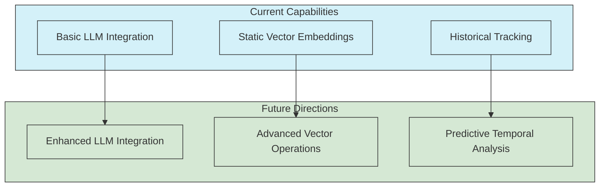

## 9. References

1. Graph Theory Foundations
2. Vector Space Models in Knowledge Representation
3. Temporal Logic in Information Systems
4. LLM Integration Patterns
5. Knowledge Graph Evolution Models 