# Vector Integration in UltraLink

## Semantic Understanding with Vector Embeddings

UltraLink's **vector integration** capabilities enable a powerful semantic layer to your knowledge graph, allowing entities to be compared, clustered, and searched based on meaning rather than just explicit connections or exact text matching.

> **Note:** All diagrams in the UltraLink documentation use Mermaid syntax for consistency, clarity, and maintainability.

## Why Vector Embeddings Matter

Traditional knowledge graphs model explicit relationships between entities. Vector embeddings add a critical dimension: **implicit semantic relationships** based on the meaning and context of entities. This enables:

- **Semantic similarity** detection between entities even without direct connections
- **Concept clustering** based on meaning rather than explicit categorization
- **Fuzzy matching** that understands conceptual similarity
- **Dimensionality reduction** for visualizing complex relationships
- **Improved search** that understands the intent behind queries

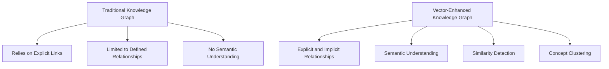

## Core Vector Concepts

### Vector Embeddings

Vector embeddings represent entities as points in a high-dimensional vector space where semantic similarity is captured by proximity:

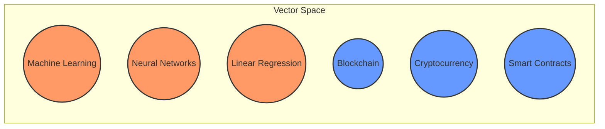

The vector space automatically organizes conceptually similar entities close together, with distance representing semantic dissimilarity.

### Vector Dimensions and Similarity

UltraLink supports various dimensions and similarity metrics for vector embeddings:

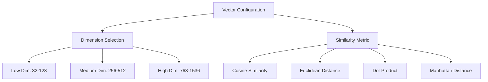

```javascript
// Initialize UltraLink with vector capabilities
const graph = new UltraLink({
  vectorDimensions: 384,  // Common dimension for sentence embeddings
  similarityMetric: 'cosine'  // Most common similarity metric
});
```

### Embedding Sources

UltraLink supports multiple ways to generate vector embeddings:

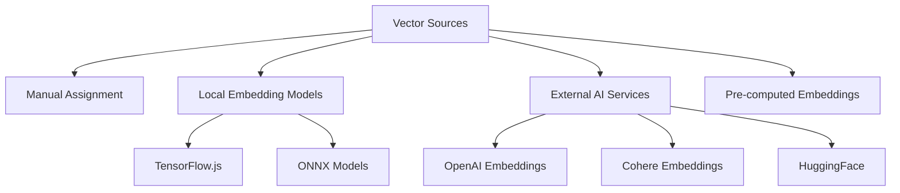

## Working with Vector Embeddings

### Adding Entities with Vectors

Entities can be created with vector embeddings in several ways:

```javascript
// Create entity with manual vector assignment
const entity1 = graph.createEntity('concept', 'neural-networks', {
  name: 'Neural Networks',
  description: 'Computational models inspired by biological neural networks',
  vector: [0.2, 0.5, -0.1, 0.8, ...] // Explicitly provide vector
});

// Create entity and auto-generate vector from text
const entity2 = await graph.createEntityWithEmbedding('concept', 'deep-learning', {
  name: 'Deep Learning',
  description: 'Machine learning based on artificial neural networks with multiple layers'
}, {
  textToEmbed: 'Deep learning is a subset of machine learning using neural networks with multiple layers',
  embeddingModel: 'text-embedding-3-small'
});
```

### Finding Similar Entities

Find semantically similar entities based on vector proximity:

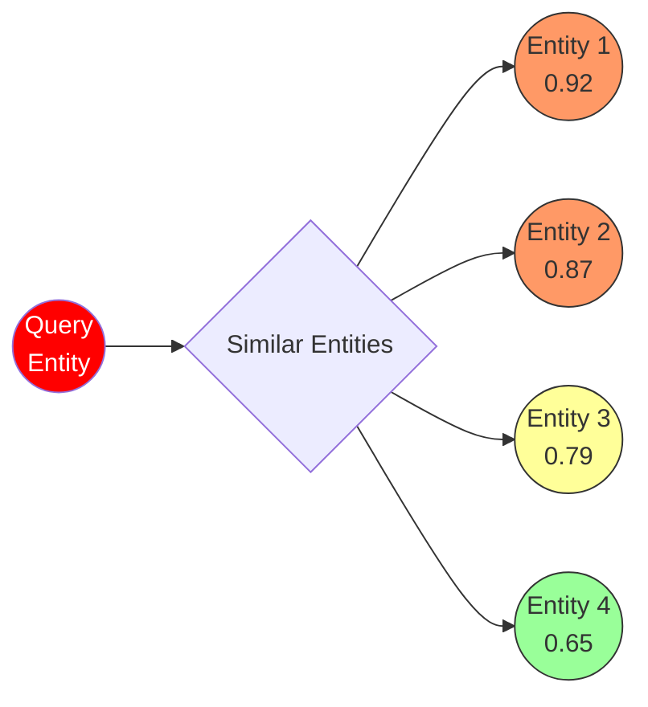

```javascript
// Find similar entities by vector similarity
const similarEntities = graph.findSimilarEntities('neural-networks', {
  limit: 10,
  threshold: 0.7,  // Minimum similarity score (0-1)
  types: ['concept', 'technology']  // Optional type filtering
});

// Find similar entities by providing a vector directly
const similarToVector = graph.findSimilarByVector([0.2, 0.5, -0.1, 0.8, ...], {
  limit: 10,
  threshold: 0.7
});
```

### Cluster Analysis

Group entities by semantic similarity using vector clustering:

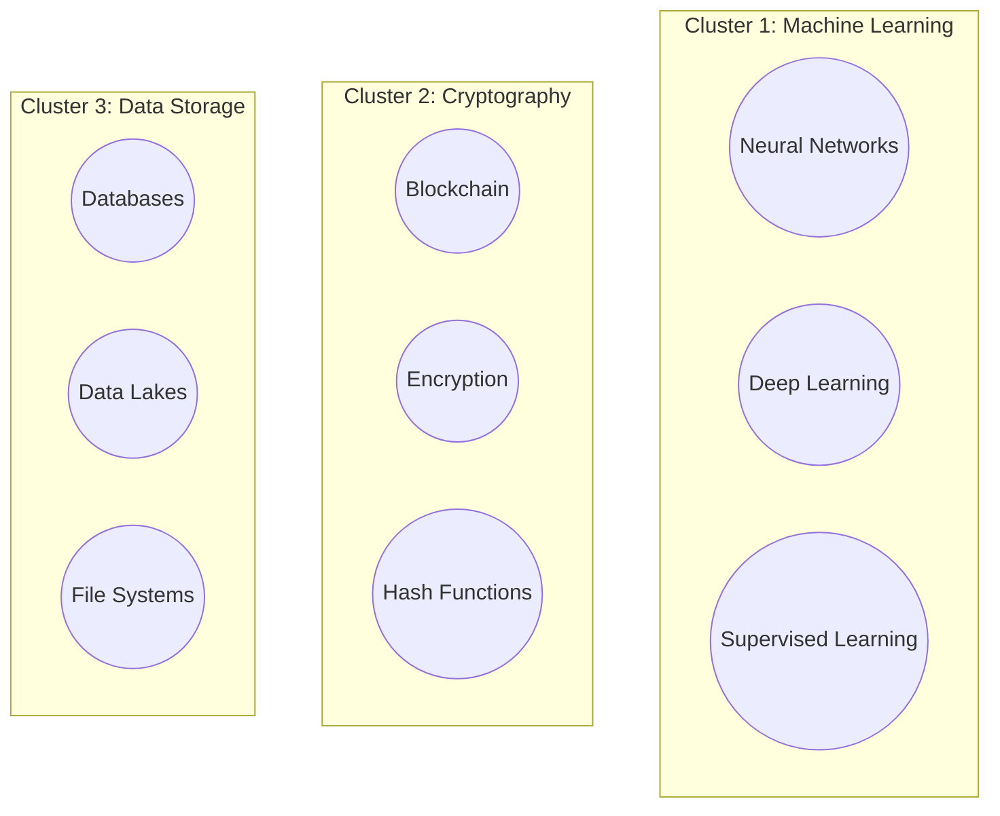

```javascript
// Perform clustering on vectors
const clusters = graph.clusterEntities({
  algorithm: 'kmeans',
  clusters: 5,  // Number of clusters to create
  entityTypes: ['concept', 'technology'],
  minClusterSize: 3
});

// Access clustering results
clusters.forEach((cluster, index) => {
  console.log(`Cluster ${index} (${cluster.entities.length} entities):`);
  cluster.entities.forEach(entity => {
    console.log(`- ${entity.attributes.name} (${entity.id})`);
  });
});
```

### Semantic Search

Search entities based on meaning rather than exact keywords:

```javascript
// Search by semantic meaning
const searchResults = await graph.semanticSearch('machine learning for image recognition', {
  limit: 20,
  types: ['research-paper', 'technology'],
  threshold: 0.65
});

// Results will include semantically related entities even if they
// don't contain the exact search terms
```

## Advanced Vector Capabilities

### Vector Indexing

UltraLink uses efficient vector indexes for fast similarity search:

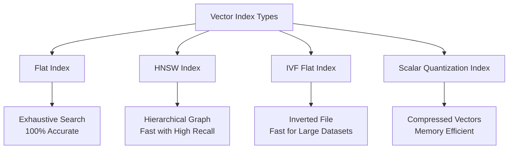

```javascript
// Configure vector index
graph.configureVectorIndex({
  type: 'hnsw',  // Hierarchical Navigable Small World
  parameters: {
    efConstruction: 200,
    M: 16
  }
});

// Rebuild index with new parameters
graph.rebuildVectorIndex();
```

### Dimensionality Reduction

Visualize high-dimensional vector relationships in 2D or 3D space:

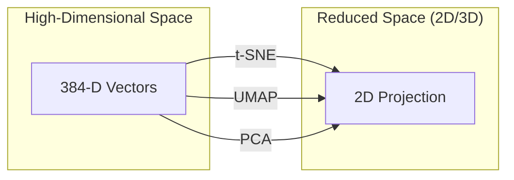

```javascript
// Generate 2D projection for visualization
const projection = graph.createVectorProjection({
  method: 'tsne', // 't-sne', 'umap', or 'pca'
  dimensions: 2,
  perplexity: 30,  // t-SNE specific parameter
  entityTypes: ['concept', 'technology']
});

// Use projection data with visualization libraries
console.log(projection.coordinates); // Array of [x, y] coordinates
```

### Vector Operations

Perform mathematical operations on vectors to discover relationships:

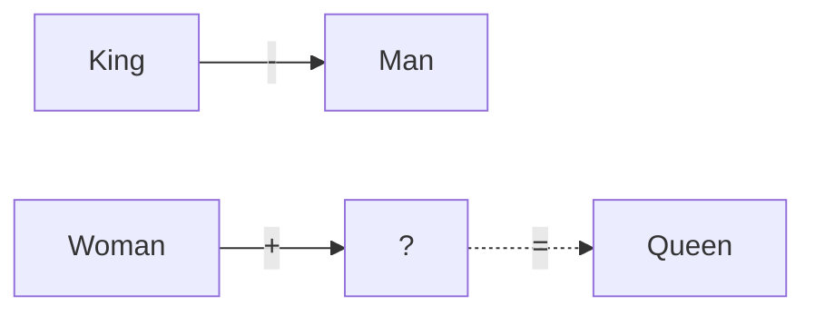

```javascript
// Analogical reasoning with vectors
const result = graph.vectorAnalogy({
  positive: ['woman', 'king'],
  negative: ['man']
});

console.log(result); // Most likely: 'queen'

// Vector arithmetic for concept discovery
const combinedVector = graph.combineVectors({
  add: ['neural-networks', 'computer-vision'],
  subtract: ['image-classification']
});

const relatedEntities = graph.findSimilarByVector(combinedVector);
```

## Integration with Knowledge Graph

### Relationship Enhancement

Use vector similarity to enhance explicit relationships:

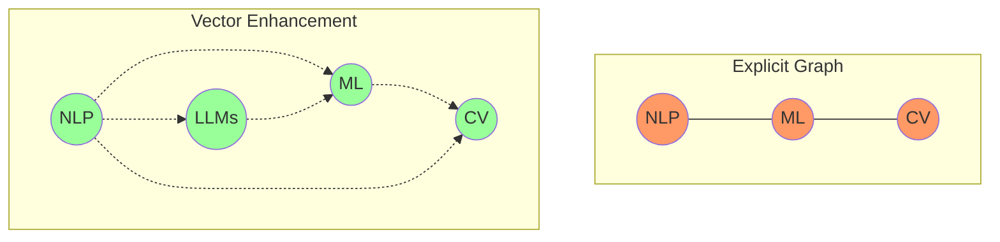

```javascript
// Generate implicit relationships based on vector similarity
const implicitRelations = graph.generateImplicitRelationships({
  threshold: 0.8,
  types: ['related_to', 'similar_to'],
  maxRelationsPerEntity: 5
});

// Add these to the knowledge graph if desired
if (confirm('Add implicit relationships to graph?')) {
  graph.addRelationships(implicitRelations);
}
```

### Hybrid Querying

Combine graph traversal with vector similarity for powerful queries:

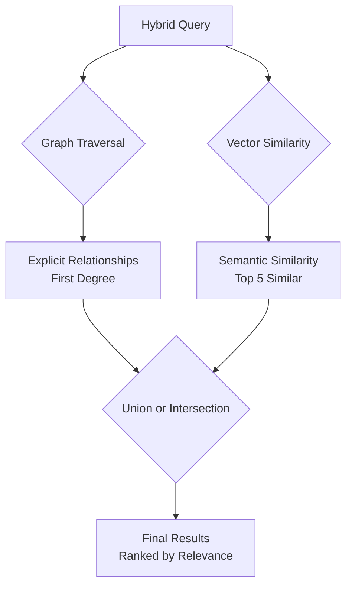

```javascript
// Hybrid query combining graph structure and vector similarity
const results = graph.hybridQuery({
  startEntity: 'machine-learning',
  graphTraversal: {
    depth: 2,
    relationshipTypes: ['uses', 'part_of']
  },
  vectorSimilarity: {
    threshold: 0.7,
    limit: 10
  },
  combineMethod: 'union', // or 'intersection'
  rankBy: 'combined_score' // or 'graph_distance' or 'vector_similarity'
});
```

## LLM Integration

UltraLink's vector system seamlessly integrates with LLMs for enhanced capabilities:

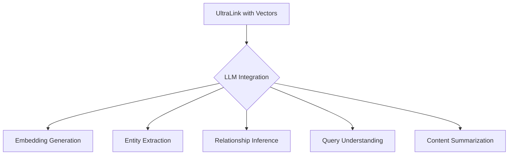

```javascript
// Generate embeddings via LLM
await graph.generateEmbeddings({
  entityType: 'research-paper',
  textField: 'abstract',
  model: 'text-embedding-3-large',
  batchSize: 20
});

// Extract entities from text via LLM
const extractedEntities = await graph.extractEntitiesFromText(longTextContent, {
  extractTypes: ['person', 'organization', 'concept'],
  generateVectors: true,
  confidence: 0.7
});

// Add extracted entities to graph
graph.addEntities(extractedEntities);
```

## Practical Applications

### Content Recommendation

Build sophisticated recommendation systems using vector similarity:

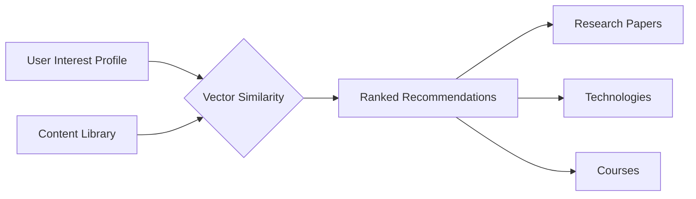

```javascript
// Create a user interest vector
const userVector = await graph.createVectorFromTexts([
  'machine learning applications in healthcare',
  'drug discovery optimization algorithms',
  'personalized medicine approaches'
]);

// Find relevant content across different entity types
const recommendations = graph.findSimilarByVector(userVector, {
  types: ['research-paper', 'technology', 'course'],
  limit: 10,
  threshold: 0.65
});
```

### Knowledge Discovery

Uncover non-obvious connections between concepts:

```javascript
// Find connecting concepts between two seemingly unrelated fields
const bridgingConcepts = graph.findBridgingConcepts({
  conceptA: 'quantum-mechanics',
  conceptB: 'machine-learning',
  method: 'vector_path',
  maxSteps: 3
});

// Discover emerging trends
const emergingTrends = graph.identifyEmergingClusters({
  timeframe: '1y',
  minGrowthRate: 0.3,
  vectorClusteringMethod: 'dbscan',
  minClusterSize: 5
});
```

### Multi-Modal Data Integration

Connect data across different modalities through vector embeddings:

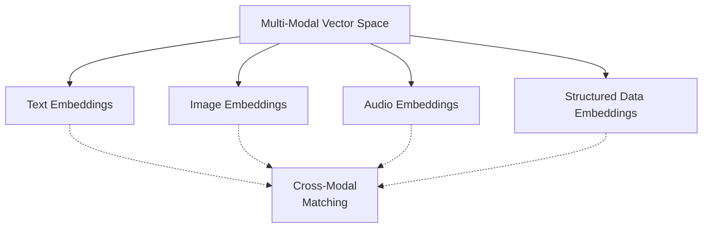

```javascript
// Create a multi-modal entity
await graph.createMultiModalEntity('research-finding', 'discovery-xyz', {
  textDescription: 'Novel protein folding mechanism discovered...',
  imageUrl: 'https://example.com/protein-structure.jpg',
  structuredData: { /* experimental results */ }
}, {
  generateVectorsFor: ['text', 'image'], // Generate embeddings for both modalities
  alignVectors: true // Ensure vectors are in compatible spaces
});

// Find similar entities across modalities
const similarEntities = graph.findCrossModalSimilarities('discovery-xyz', {
  modalityPriority: ['text', 'image'],
  threshold: 0.7
});
```

## Vector Storage and Performance

### Vector Storage Options

UltraLink provides flexible storage options for vector data:

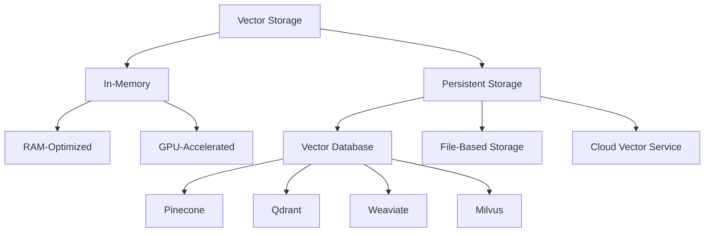

```javascript
// Configure vector storage
graph.configureVectorStorage({
  type: 'persistent',
  provider: 'pinecone',
  connectionString: process.env.PINECONE_URL,
  apiKey: process.env.PINECONE_API_KEY,
  namespace: 'research-knowledge-graph'
});
```

### Performance Optimization

Optimize vector operations for different workloads:

```javascript
// Configure performance settings
graph.configureVectorPerformance({
  indexUpdateStrategy: 'batch', // 'realtime', 'batch', or 'scheduled'
  searchAlgorithm: 'hnsw',
  approximateSearch: true, // Faster but slightly less accurate
  accelerationDevice: 'gpu', // 'cpu', 'gpu', or 'auto'
  cacheStrategy: {
    enabled: true,
    maxSize: '1GB',
    ttl: '1h'
  }
});
```

## API Reference

The Vector API includes these main method groups:

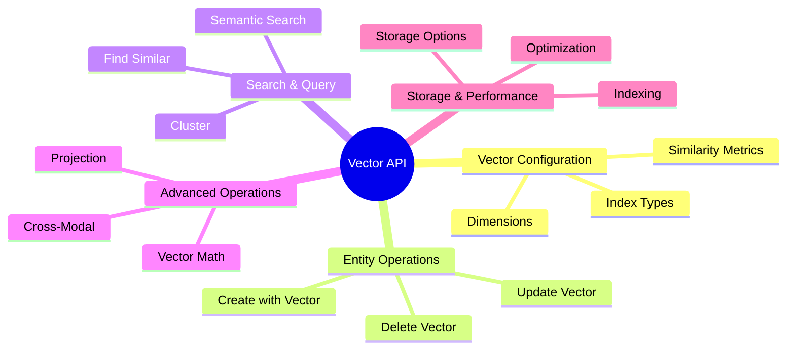

| Method Group | Description |
|--------------|-------------|
| `configureVectorSettings()` | Configure vector dimensions and metrics |
| `configureVectorIndex()` | Set up and optimize vector indexing |
| `createEntityWithEmbedding()` | Create entities with vector embeddings |
| `generateEmbeddings()` | Generate embeddings for existing entities |
| `findSimilarEntities()` | Find similar entities by vector proximity |
| `clusterEntities()` | Group entities using vector clustering |
| `semanticSearch()` | Search entities by meaning |
| `vectorOperations()` | Perform vector math operations |
| `createVectorProjection()` | Create 2D/3D projections of vector space |

## Example: Complete Vector Workflow

Here's a complete example demonstrating various vector capabilities:

```javascript
const { UltraLink } = require('ultralink');
const { VectorExtension } = require('@ultralink/vector');

async function main() {
  // Initialize UltraLink with vector capabilities
  const graph = new UltraLink();
  graph.use(VectorExtension);
  
  // Configure vector settings
  graph.configureVectorSettings({
    dimensions: 384,
    similarityMetric: 'cosine',
    embeddingModel: 'text-embedding-3-small'
  });
  
  // Set up an efficient vector index
  graph.configureVectorIndex({
    type: 'hnsw',
    parameters: {
      efConstruction: 200,
      M: 16
    }
  });
  
  console.log('Adding research papers...');
  
  // Add research papers with auto-generated embeddings
  const papers = [
    {
      id: 'paper-1',
      title: 'Advances in Neural Network Architectures',
      abstract: 'This paper explores recent innovations in neural network architectures...',
      keywords: ['neural networks', 'deep learning', 'architecture']
    },
    {
      id: 'paper-2',
      title: 'Vector Embeddings for Knowledge Representation',
      abstract: 'We present a novel approach to knowledge representation using high-dimensional vectors...',
      keywords: ['vector embeddings', 'knowledge representation', 'semantic similarity']
    },
    {
      id: 'paper-3',
      title: 'Quantum Computing Applications in Cryptography',
      abstract: 'This research investigates how quantum computing affects modern cryptographic methods...',
      keywords: ['quantum computing', 'cryptography', 'security']
    }
  ];
  
  for (const paper of papers) {
    await graph.createEntityWithEmbedding('research-paper', paper.id, {
      title: paper.title,
      abstract: paper.abstract,
      keywords: paper.keywords
    }, {
      textToEmbed: `${paper.title}. ${paper.abstract}`,
      embeddingModel: 'text-embedding-3-small'
    });
  }
  
  console.log('Finding similar papers...');
  
  // Find papers similar to paper-1
  const similarPapers = graph.findSimilarEntities('paper-1', {
    limit: 5,
    threshold: 0.5
  });
  
  console.log('Papers similar to "Advances in Neural Network Architectures":');
  for (const paper of similarPapers) {
    console.log(`- ${paper.attributes.title} (similarity: ${paper.similarity.toFixed(2)})`);
  }
  
  console.log('\nPerforming semantic search...');
  
  // Semantic search
  const searchResults = await graph.semanticSearch('machine learning for data analysis', {
    limit: 3
  });
  
  console.log('Search results for "machine learning for data analysis":');
  for (const result of searchResults) {
    console.log(`- ${result.attributes.title} (score: ${result.score.toFixed(2)})`);
  }
  
  console.log('\nClustering papers...');
  
  // Add more papers to make clustering meaningful
  const morePapers = [
    // ... add 15+ more papers with various topics
  ];
  
  // Perform clustering
  const clusters = graph.clusterEntities({
    algorithm: 'kmeans',
    clusters: 3
  });
  
  console.log('Identified paper clusters:');
  clusters.forEach((cluster, i) => {
    console.log(`\nCluster ${i+1} (${cluster.entities.length} papers):`);
    console.log(`Centroid topics: ${cluster.topKeywords.join(', ')}`);
    cluster.entities.slice(0, 3).forEach(entity => {
      console.log(`- ${entity.attributes.title}`);
    });
    if (cluster.entities.length > 3) {
      console.log(`- ... and ${cluster.entities.length - 3} more papers`);
    }
  });
  
  console.log('\nGenerating 2D projection for visualization...');
  
  // Create 2D projection for visualization
  const projection = graph.createVectorProjection({
    method: 'tsne',
    dimensions: 2
  });
  
  console.log('Projection created. Coordinates sample:');
  Object.entries(projection.coordinates).slice(0, 3).forEach(([id, coords]) => {
    console.log(`${id}: [${coords[0].toFixed(2)}, ${coords[1].toFixed(2)}]`);
  });
  
  // Output could be used with visualization libraries
  console.log('\nVector operations complete!');
}

main().catch(console.error);
```

## Best Practices for Vector Integration

For optimal use of the Vector API:

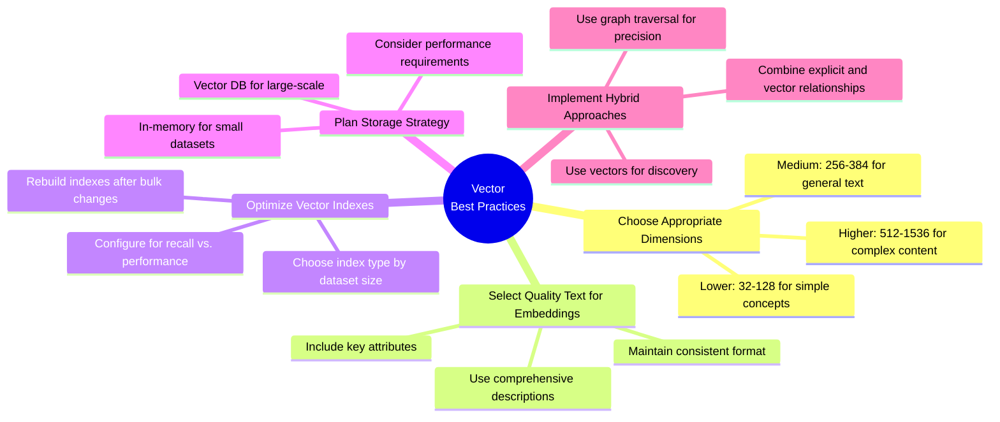

1. **Choose appropriate vector dimensions** - Balance precision vs. computational complexity
2. **Select quality text for embeddings** - The text used for embedding affects semantic quality
3. **Optimize vector indexes** - Choose the right index type for your scale and performance needs
4. **Plan your storage strategy** - Consider scale, persistence, and integration requirements
5. **Implement hybrid approaches** - Combine graph traversal with vector similarity for best results
6. **Regularly update embeddings** - As entity content changes, update embeddings to match

## Conclusion: The Power of Semantic Understanding

The vector integration capabilities of UltraLink transform knowledge graphs from purely structural representations to semantically rich information systems. By combining the explicit relationships of traditional knowledge graphs with the implicit semantic relationships enabled by vector embeddings, UltraLink provides a comprehensive knowledge representation system.

Whether you're building recommendation systems, research tools, semantic search applications, or knowledge discovery platforms, UltraLink's vector capabilities provide the foundation for sophisticated semantic understanding and analysis. 