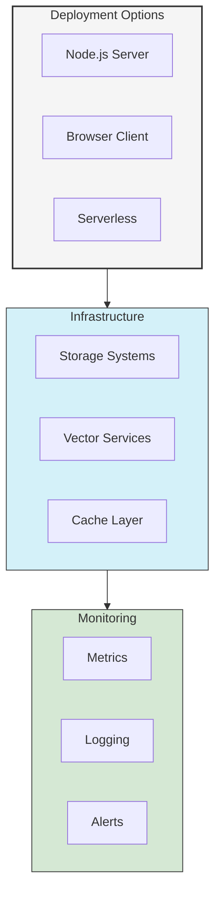

# Deployment Guide

This guide provides comprehensive information on deploying UltraLink in various environments, including configuration, scaling, and monitoring.

## Deployment Architecture



## Installation

### Node.js Server

```bash
# Install core package
npm install @ultralink/core

# Install optional components
npm install @ultralink/server @ultralink/redis @ultralink/vector-openai
```

### Browser Client

```html
<!-- UMD bundle -->
<script src="https://cdn.ultralink.dev/ultralink.min.js"></script>

<!-- ES modules -->
<script type="module">
  import { UltraLink } from 'https://cdn.ultralink.dev/ultralink.esm.js';
</script>
```

### Configuration

```typescript
// config.ts
import { UltraLinkConfig } from '@ultralink/core';

export const config: UltraLinkConfig = {
  // Storage configuration
  storage: {
    adapter: 'redis',
    options: {
      url: process.env.REDIS_URL,
      prefix: 'ultralink:'
    }
  },

  // Vector configuration
  vector: {
    provider: 'openai',
    options: {
      apiKey: process.env.OPENAI_API_KEY,
      model: 'text-embedding-ada-002'
    }
  },

  // Cache configuration
  cache: {
    enabled: true,
    ttl: 3600,
    maxSize: 1000
  },

  // Plugin configuration
  plugins: [
    // Add your plugins here
  ]
};
```

## Server Deployment

### Express Server

```typescript
import express from 'express';
import { UltraLink } from '@ultralink/core';
import { createServer } from '@ultralink/server';

const app = express();
const ultralink = new UltraLink(config);

// Create UltraLink server
const server = createServer(ultralink);

// Mount API routes
app.use('/api/ultralink', server);

// Error handling
app.use((err, req, res, next) => {
  console.error(err);
  res.status(500).json({
    error: err.message
  });
});

// Start server
app.listen(3000, () => {
  console.log('Server running on port 3000');
});
```

### Docker Deployment

```dockerfile
# Dockerfile
FROM node:16-alpine

WORKDIR /app

# Install dependencies
COPY package*.json ./
RUN npm ci --production

# Copy application files
COPY . .

# Build TypeScript
RUN npm run build

# Set environment variables
ENV NODE_ENV=production
ENV PORT=3000

# Expose port
EXPOSE 3000

# Start application
CMD ["npm", "start"]
```

```yaml
# docker-compose.yml
version: '3.8'

services:
  app:
    build: .
    ports:
      - "3000:3000"
    environment:
      - NODE_ENV=production
      - REDIS_URL=redis://redis:6379
      - OPENAI_API_KEY=${OPENAI_API_KEY}
    depends_on:
      - redis

  redis:
    image: redis:6-alpine
    ports:
      - "6379:6379"
    volumes:
      - redis-data:/data

volumes:
  redis-data:
```

## Serverless Deployment

### AWS Lambda

```typescript
import { APIGatewayProxyHandler } from 'aws-lambda';
import { UltraLink } from '@ultralink/core';
import { createLambdaHandler } from '@ultralink/serverless';

const ultralink = new UltraLink({
  storage: {
    adapter: 'dynamodb',
    options: {
      tableName: process.env.DYNAMODB_TABLE
    }
  },
  // Other configuration...
});

export const handler: APIGatewayProxyHandler = createLambdaHandler(ultralink);
```

```yaml
# serverless.yml
service: ultralink-api

provider:
  name: aws
  runtime: nodejs16.x
  region: us-east-1
  environment:
    DYNAMODB_TABLE: ${self:service}-${opt:stage, self:provider.stage}
    OPENAI_API_KEY: ${ssm:/ultralink/openai-key}

functions:
  api:
    handler: dist/handler.handler
    events:
      - http:
          path: /{proxy+}
          method: ANY

resources:
  Resources:
    UltraLinkTable:
      Type: AWS::DynamoDB::Table
      Properties:
        TableName: ${self:provider.environment.DYNAMODB_TABLE}
        BillingMode: PAY_PER_REQUEST
        AttributeDefinitions:
          - AttributeName: id
            AttributeType: S
        KeySchema:
          - AttributeName: id
            KeyType: HASH
```

### Vercel

```typescript
// api/ultralink.ts
import { VercelRequest, VercelResponse } from '@vercel/node';
import { UltraLink } from '@ultralink/core';
import { createVercelHandler } from '@ultralink/serverless';

const ultralink = new UltraLink({
  // Configuration...
});

export default createVercelHandler(ultralink);
```

```json
// vercel.json
{
  "version": 2,
  "builds": [
    {
      "src": "api/**/*.ts",
      "use": "@vercel/node"
    }
  ],
  "routes": [
    {
      "src": "/api/ultralink/(.*)",
      "dest": "/api/ultralink.ts"
    }
  ]
}
```

## Scaling

### Horizontal Scaling

```typescript
// cluster.ts
import cluster from 'cluster';
import os from 'os';
import { createServer } from './server';

if (cluster.isPrimary) {
  // Fork workers
  const numCPUs = os.cpus().length;
  for (let i = 0; i < numCPUs; i++) {
    cluster.fork();
  }

  cluster.on('exit', (worker, code, signal) => {
    console.log(`Worker ${worker.process.pid} died`);
    // Fork new worker
    cluster.fork();
  });
} else {
  // Workers share the TCP connection
  createServer();
}
```

### Load Balancing

```nginx
# nginx.conf
upstream ultralink {
    least_conn;  # Least connections algorithm
    server app1:3000;
    server app2:3000;
    server app3:3000;
}

server {
    listen 80;
    server_name api.ultralink.dev;

    location / {
        proxy_pass http://ultralink;
        proxy_set_header Host $host;
        proxy_set_header X-Real-IP $remote_addr;
    }
}
```

## Monitoring

### Metrics Collection

```typescript
import { metrics } from '@ultralink/monitoring';

// Configure metrics
metrics.configure({
  provider: 'prometheus',
  prefix: 'ultralink_',
  labels: {
    environment: process.env.NODE_ENV
  }
});

// Record metrics
metrics.increment('entity_created');
metrics.gauge('vector_queue_size', queueSize);
metrics.histogram('query_duration', duration);
```

### Logging

```typescript
import { logger } from '@ultralink/monitoring';

// Configure logger
logger.configure({
  level: 'info',
  format: 'json',
  transports: [
    new logger.transports.Console(),
    new logger.transports.File({ filename: 'ultralink.log' })
  ]
});

// Log events
logger.info('Entity created', { entityId });
logger.error('Query failed', { error });
```

### Health Checks

```typescript
import { HealthCheck } from '@ultralink/monitoring';

const health = new HealthCheck();

// Add checks
health.addCheck('storage', async () => {
  await ultralink.storage.ping();
  return { status: 'up' };
});

health.addCheck('vector', async () => {
  await ultralink.vector.ping();
  return { status: 'up' };
});

// Express middleware
app.get('/health', async (req, res) => {
  const status = await health.check();
  res.json(status);
});
```

## Security

### Authentication

```typescript
import { auth } from '@ultralink/auth';

// Configure authentication
const authMiddleware = auth({
  type: 'jwt',
  secret: process.env.JWT_SECRET,
  algorithms: ['HS256']
});

// Apply middleware
app.use('/api', authMiddleware);
```

### Authorization

```typescript
import { authorize } from '@ultralink/auth';

// Define permissions
const permissions = {
  'entity:create': ['admin', 'editor'],
  'entity:read': ['admin', 'editor', 'viewer'],
  'entity:update': ['admin', 'editor'],
  'entity:delete': ['admin']
};

// Configure authorization
const authzMiddleware = authorize({
  permissions,
  getRole: (req) => req.user.role
});

// Apply middleware
app.use('/api', authzMiddleware);
```

### API Keys

```typescript
import { apiKey } from '@ultralink/auth';

// Configure API key authentication
const apiKeyMiddleware = apiKey({
  header: 'X-API-Key',
  validate: async (key) => {
    // Validate key against database
    const valid = await validateApiKey(key);
    return valid;
  }
});

// Apply middleware
app.use('/api', apiKeyMiddleware);
```

## Performance Optimization

### Caching Strategy

```typescript
import { cache } from '@ultralink/cache';

// Configure cache
const cacheMiddleware = cache({
  store: 'redis',
  ttl: 3600,
  prefix: 'ultralink:cache:',
  serialize: JSON.stringify,
  deserialize: JSON.parse
});

// Apply cache to routes
app.get('/api/entities/:id', cacheMiddleware, async (req, res) => {
  const entity = await ultralink.getEntity(req.params.id);
  res.json(entity);
});
```

### Query Optimization

```typescript
// Configure query optimizer
ultralink.configure({
  query: {
    optimizer: {
      enabled: true,
      maxDepth: 3,
      timeout: 5000
    },
    cache: {
      enabled: true,
      ttl: 300
    }
  }
});
```

### Batch Operations

```typescript
// Batch entity creation
const entities = await ultralink.createEntities([
  { type: 'document', attributes: { /* ... */ } },
  { type: 'document', attributes: { /* ... */ } }
]);

// Batch vector generation
const vectors = await ultralink.generateEmbeddings([
  'First text',
  'Second text',
  'Third text'
]);
```

## Backup and Recovery

### Backup Configuration

```typescript
import { backup } from '@ultralink/backup';

// Configure backup
const backupConfig = {
  storage: {
    type: 's3',
    bucket: 'ultralink-backups',
    prefix: 'daily/'
  },
  schedule: '0 0 * * *', // Daily at midnight
  retention: {
    days: 30,
    copies: 7
  }
};

// Initialize backup system
const backupSystem = backup(backupConfig);

// Start scheduled backups
backupSystem.start();
```

### Manual Backup

```typescript
// Perform manual backup
const backup = await ultralink.backup({
  include: ['entities', 'relationships', 'vectors'],
  compress: true,
  metadata: {
    version: '1.0.0',
    timestamp: Date.now()
  }
});
```

### Recovery

```typescript
// Restore from backup
await ultralink.restore(backup, {
  validateData: true,
  onProgress: (progress) => {
    console.log(`Restore progress: ${progress}%`);
  }
});
```

## Best Practices

1. **Environment Configuration**
   - Use environment variables
   - Implement secure secrets management
   - Validate configuration at startup

2. **Scaling Strategy**
   - Plan for horizontal scaling
   - Implement proper load balancing
   - Use appropriate caching strategies

3. **Monitoring and Logging**
   - Implement comprehensive metrics
   - Set up proper logging
   - Configure alerts for critical issues

4. **Security**
   - Implement proper authentication
   - Use role-based authorization
   - Secure sensitive data

5. **Performance**
   - Optimize queries
   - Implement caching
   - Use batch operations when possible

## Next Steps

- [Core API Reference](../api/core.md)
- [Plugin Development Guide](../advanced/plugin-development.md)
- [Testing Guide](../testing/index.md) 