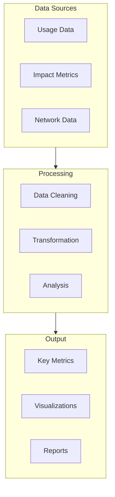

# UltraLink Technical Diagrams 📊

## Overview

UltraLink's architecture is designed around several key principles:
- 🔄 Plain text first, with rich metadata
- 🎯 Vector-based semantic understanding
- ⏱️ Temporal awareness and evolution
- 🔍 Interactive exploration and analysis
- 🎨 Multiple visualization paradigms

## Core Architecture Layers

## System Architecture

## Data Model Architecture

## Event Flow Architecture

## Data Flow Architecture

## Vector Processing Pipeline

## Vector Space Architecture

## LLM Integration Architecture

## Rendering Pipeline

## Interactive Dashboard Architecture

## Temporal Analysis System

## Integrity Checking System

## Export Pipeline

## Search System

## Analytics Pipeline

## Deployment Architecture

## Security Architecture

## Implementation Guidelines

When implementing UltraLink components:

1. **Core Components**
   - Follow the layered architecture
   - Maintain clear separation of concerns
   - Implement robust error handling
   - Ensure type safety

2. **Service Integration**
   - Use dependency injection
   - Implement retry mechanisms
   - Handle service degradation
   - Monitor performance

3. **Data Management**
   - Implement ACID transactions
   - Handle concurrent modifications
   - Maintain data integrity
   - Support data evolution

4. **Security Considerations**
   - Implement authentication
   - Enforce authorization
   - Protect sensitive data
   - Audit all changes

## Performance Optimization

Key areas for performance optimization:

1. **Vector Operations**
   - Efficient embedding generation
   - Optimized similarity calculations
   - Smart caching strategies
   - Batch processing

2. **Data Storage**
   - Indexed lookups
   - Efficient querying
   - Smart caching
   - Data compression

3. **API Performance**
   - Request batching
   - Response pagination
   - Cache management
   - Load balancing

## Monitoring and Observability

