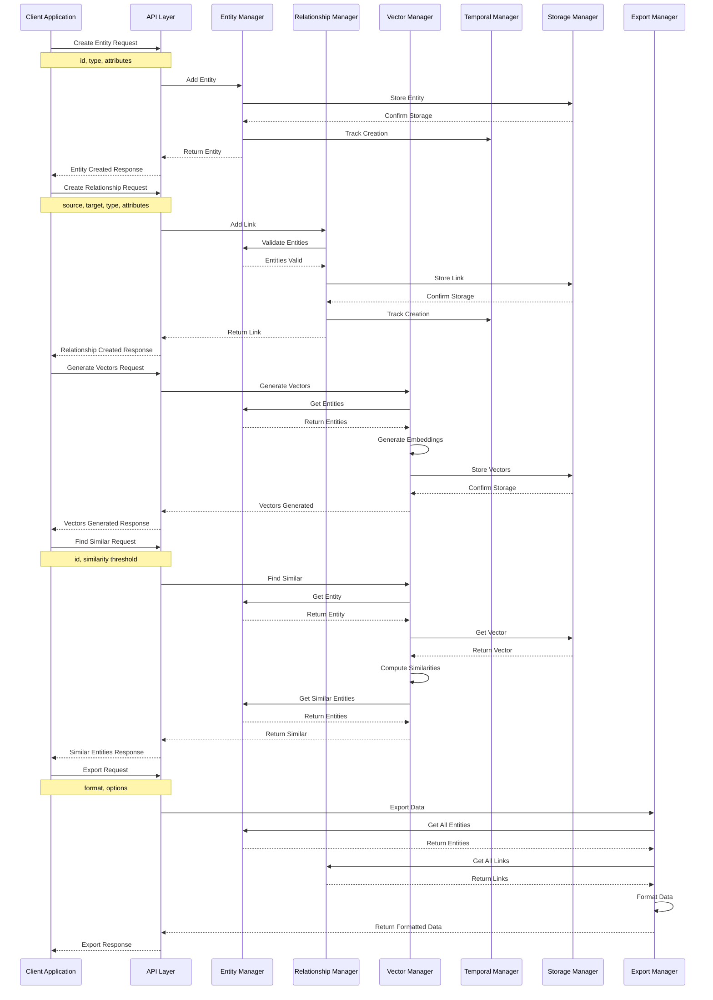
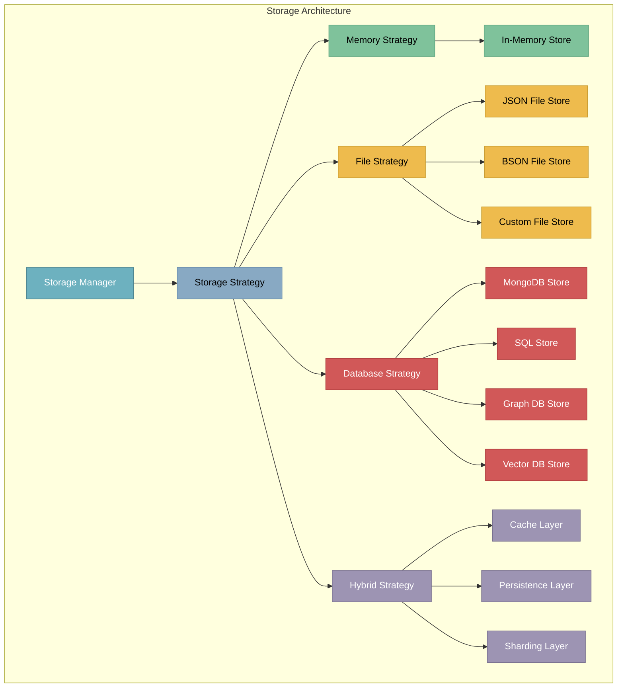
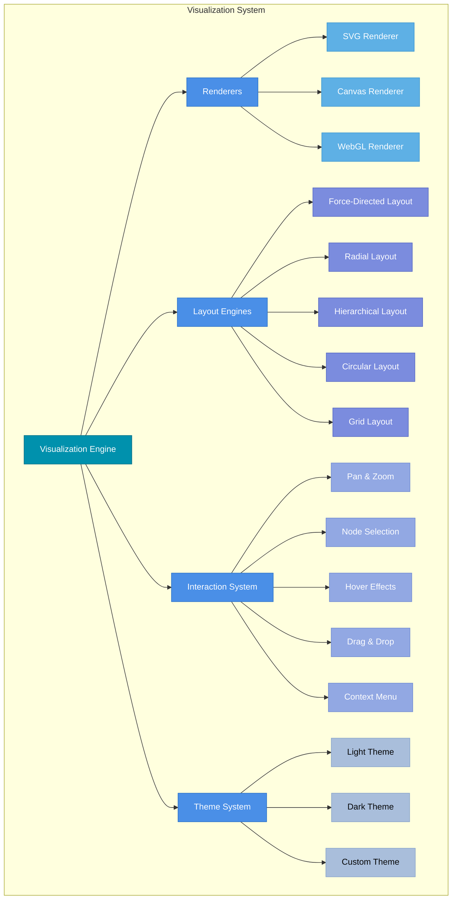

# UltraLink Ecosystem Diagrams

This document provides visual representations of the UltraLink ecosystem, its components, integration points, and workflows.

## UltraLink Ecosystem Overview

Below is a comprehensive view of the UltraLink ecosystem, showing how it connects with various technologies and services:

```mermaid
graph TB
    subgraph Ultralink["UltraLink Core"]
        API["API Layer"]
        Engine["Core Engine"]
        Storage["Storage System"]
        Vector["Vector System"]
        Export["Export System"]
    end
    
    subgraph Languages["Development Languages"]
        JS["JavaScript"]
        TS["TypeScript"]
        PY["Python Bindings"]
        Other["Other Language Bindings"]
    end
    
    subgraph Frontend["Frontend Integrations"]
        React["React Components"]
        Vue["Vue Components"]
        Angular["Angular Components"]
        Svelte["Svelte Components"]
        Vanilla["Vanilla JS"]
    end
    
    subgraph VectorDBs["Vector Databases"]
        Pinecone["Pinecone"]
        Weaviate["Weaviate"]
        Qdrant["Qdrant"]
        Milvus["Milvus"]
        ChromaDB["ChromaDB"]
    end
    
    subgraph LLMs["Language Models"]
        OpenAI["OpenAI API"]
        AzureAI["Azure OpenAI"]
        HuggingFace["Hugging Face"]
        LocalLLM["Local Models"]
        Anthropic["Anthropic Claude"]
        Cohere["Cohere"]
    end
    
    subgraph KnowledgeTools["Knowledge Tools"]
        Obsidian["Obsidian"]
        Logseq["Logseq"]
        Notion["Notion"]
        Roam["Roam Research"]
        TiddlyWiki["TiddlyWiki"]
    end
    
    subgraph GraphDBs["Graph Databases"]
        Neo4j["Neo4j"]
        ArangoDB["ArangoDB"]
        JanusGraph["JanusGraph"]
        Neptune["AWS Neptune"]
        TigerGraph["TigerGraph"]
    end
    
    subgraph Development["Developer Tools"]
        VS["VS Code Extension"]
        GitHub["GitHub Actions"]
        NPM["NPM Packages"]
        Jupyter["Jupyter Notebook"]
        CLI["Command Line Tools"]
    end
    
    subgraph Visualization["Visualization"]
        D3["D3.js"]
        ThreeJS["Three.js"]
        WebGL["WebGL"]
        Dash["Plotly Dash"]
        Tableau["Tableau Connector"]
    end
    
    subgraph Storage["Storage Systems"]
        File["File System"]
        IndexedDB["IndexedDB"]
        MongoDB["MongoDB"]
        SQLite["SQLite"]
        S3["S3 Compatible"]
    end
    
    subgraph Applications["Application Areas"]
        KnowledgeBase["Knowledge Bases"]
        Research["Research Networks"]
        Documentation["Documentation Systems"]
        Learning["Learning Pathways"]
        ContentMgmt["Content Management"]
    end
    
    Ultralink --> Languages
    Languages --> Frontend
    Ultralink --> VectorDBs
    Ultralink --> LLMs
    Ultralink --> KnowledgeTools
    Ultralink --> GraphDBs
    Ultralink --> Development
    Ultralink --> Visualization
    Ultralink --> Storage
    Ultralink --> Applications
    
    classDef core fill:#4a6fa5,stroke:#2b5086,color:white,font-weight:bold
    classDef langs fill:#57a773,stroke:#2e8049,color:white
    classDef front fill:#82c0cc,stroke:#489fb5,color:black
    classDef vector fill:#ffa62b,stroke:#c16a00,color:black
    classDef llm fill:#16697a,stroke:#0a4958,color:white
    classDef knowledge fill:#db504a,stroke:#bd2c25,color:white
    classDef graph fill:#e6af2e,stroke:#be8b15,color:black
    classDef dev fill:#9a879d,stroke:#766179,color:white
    classDef vis fill:#3e92cc,stroke:#2070a8,color:white
    classDef store fill:#e2c2c6,stroke:#c29399,color:black
    classDef apps fill:#7b506f,stroke:#593850,color:white
    
    class Ultralink core
    class Languages langs
    class Frontend front
    class VectorDBs vector
    class LLMs llm
    class KnowledgeTools knowledge
    class GraphDBs graph
    class Development dev
    class Visualization vis
    class Storage store
    class Applications apps
```

## Data Flow Diagram

This diagram illustrates how data flows through the UltraLink system:

```mermaid
flowchart TD
    Input["Input Data"] --> Parser["Parser"]
    Parser --> Validation["Validation"]
    Validation --> EntityCreation["Entity Creation"]
    EntityCreation --> LinkCreation["Link Creation"]
    
    EntityCreation --> VectorGeneration["Vector Generation"]
    VectorGeneration --> VectorStorage["Vector Storage"]
    VectorStorage --> VectorSearch["Vector Search"]
    
    EntityCreation --> TemporalTracking["Temporal Tracking"]
    LinkCreation --> TemporalTracking
    
    LinkCreation --> GraphOperations["Graph Operations"]
    GraphOperations --> PathAnalysis["Path Analysis"]
    GraphOperations --> CentralityAnalysis["Centrality Analysis"]
    GraphOperations --> CommunityDetection["Community Detection"]
    
    VectorSearch --> SemanticOperations["Semantic Operations"]
    SemanticOperations --> SimilarityAnalysis["Similarity Analysis"]
    SemanticOperations --> ClusterAnalysis["Cluster Analysis"]
    SemanticOperations --> TopicModeling["Topic Modeling"]
    
    TemporalTracking --> TimelineAnalysis["Timeline Analysis"]
    TemporalTracking --> EvolutionAnalysis["Evolution Analysis"]
    TemporalTracking --> VersionControl["Version Control"]
    
    GraphOperations --> Export["Export"]
    SemanticOperations --> Export
    TemporalTracking --> Export
    
    Export --> GraphMLFormat["GraphML"]
    Export --> JSONFormat["JSON/API"]
    Export --> CSVFormat["CSV/Tabular"]
    Export --> ObsidianFormat["Obsidian"]
    Export --> InteractiveHTML["Interactive HTML"]
    
    Export --> Visualization["Visualization"]
    Visualization --> NetworkView["Network View"]
    Visualization --> MatrixView["Matrix View"]
    Visualization --> TimelineView["Timeline View"]
    Visualization --> DashboardView["Dashboard"]
    
    classDef input fill:#e1e5f2,stroke:#bfcbec,color:black
    classDef process fill:#588b8b,stroke:#36686a,color:white
    classDef vector fill:#ffd166,stroke:#dcae35,color:black
    classDef graph fill:#ef476f,stroke:#d1214d,color:white
    classDef temporal fill:#06d6a0,stroke:#00ad7c,color:black
    classDef export fill:#0cb0a9,stroke:#088b86,color:white
    classDef visual fill:#118ab2,stroke:#0d6b8a,color:white
    
    class Input,Parser,Validation input
    class EntityCreation,LinkCreation,GraphOperations process
    class VectorGeneration,VectorStorage,VectorSearch,SemanticOperations vector
    class PathAnalysis,CentralityAnalysis,CommunityDetection,SimilarityAnalysis,ClusterAnalysis,TopicModeling graph
    class TemporalTracking,TimelineAnalysis,EvolutionAnalysis,VersionControl temporal
    class Export,GraphMLFormat,JSONFormat,CSVFormat,ObsidianFormat,InteractiveHTML export
    class Visualization,NetworkView,MatrixView,TimelineView,DashboardView visual
```

## Component Interaction Diagram

This diagram shows how different components of UltraLink interact with each other:



## Integration Patterns

This diagram illustrates common integration patterns for UltraLink:

```mermaid
graph TD
    subgraph Applications["Application Integration Patterns"]
        direction TB
        
        subgraph Embedded["Embedded Integration"]
            AppCode["Application Code"] --> ULInstance["UltraLink Instance"]
            ULInstance --> LocalStorage["Local Storage"]
        end
        
        subgraph API["API Integration"]
            ClientApp["Client Application"] -- "API Calls" --> ULServer["UltraLink Server"]
            ULServer --> DBStorage["Database Storage"]
        end
        
        subgraph Hybrid["Hybrid Integration"]
            ClientLib["Client Library"] -- "Local Operations" --> LocalCache["Local Cache"]
            ClientLib -- "Sync/Advanced Operations" --> ServerAPI["Server API"]
            ServerAPI --> CloudStorage["Cloud Storage"]
        end
        
        subgraph Headless["Headless Integration"]
            DataProcessing["Data Processing"] --> ULCore["UltraLink Core"]
            ULCore --> DataExport["Data Export"]
            DataExport --> ExternalSystems["External Systems"]
        end
    end
    
    classDef embedded fill:#f4acb7,stroke:#be6a76,color:black
    classDef api fill:#9d8189,stroke:#735f66,color:white
    classDef hybrid fill:#8a5a44,stroke:#634229,color:white
    classDef headless fill:#ccc9dc,stroke:#9995b1,color:black
    
    class Embedded,AppCode,ULInstance,LocalStorage embedded
    class API,ClientApp,ULServer,DBStorage api
    class Hybrid,ClientLib,LocalCache,ServerAPI,CloudStorage hybrid
    class Headless,DataProcessing,ULCore,DataExport,ExternalSystems headless
```



## Storage Architecture

This diagram shows the storage architecture options in UltraLink:



## Visualization System

This diagram illustrates the visualization capabilities of UltraLink:



These diagrams provide a comprehensive visual understanding of the UltraLink ecosystem, its components, and how they interact with each other and external systems. 