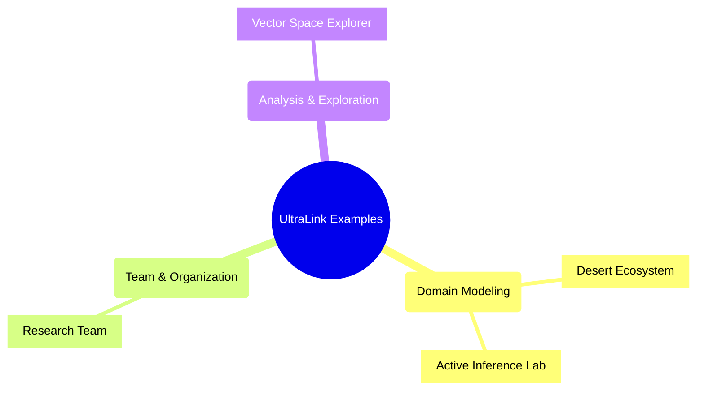

# UltraLink Examples

This directory contains comprehensive examples of how to use UltraLink in various scenarios. Each example includes detailed code samples, explanations, and visualizations.



## Overview

| Example | Description | Key Features |
|---------|-------------|-------------|
| [Desert Ecosystem](desert-ecosystem.md) | Model a desert ecosystem with organisms, abiotic factors, and their relationships | Custom entity types, temporal tracking, complex relationships |
| [Active Inference Lab](active-inference-lab.md) | Model a research laboratory with researchers, projects, and publications | Research tracking, collaboration networks, project management |
| [Research Team](research-team.md) | Model a research team's structure, expertise, and project assignments | Expertise mapping, collaboration analysis, skill management |
| [Vector Space Explorer](vector-space-explorer.md) | Create an interactive explorer for semantic analysis | Vector embeddings, dimensionality reduction, similarity analysis |

## Domain Modeling Examples

### [Desert Ecosystem](desert-ecosystem.md)

This example demonstrates how to use UltraLink to model a complex natural ecosystem, including:

- Desert animals with adaptations and behaviors
- Desert plants and survival mechanisms
- Environmental factors and geographical features
- Relationships between organisms and their environment
- Temporal changes in the ecosystem


### [Active Inference Lab](active-inference-lab.md)

This example shows how to model a scientific research laboratory, including:

- Researchers with their expertise and roles
- Research projects with goals and status
- Publications and their connections to researchers
- Experiments and their data
- Conceptual relationships in the research domain


## Team & Organization Examples

### [Research Team](research-team.md)

This example demonstrates how to model and analyze a research team's structure:

- Team members with their roles and expertise
- Project assignments and contributions
- Knowledge domains and expertise distribution
- Collaboration networks and mentorship
- Expertise gaps and team optimization


## Analysis & Exploration Examples

### [Vector Space Explorer](vector-space-explorer.md)

This example shows how to create an interactive vector space explorer:

- Vector embeddings for semantic analysis
- Dimensionality reduction techniques (t-SNE, UMAP, PCA)
- Similarity search and clustering
- Interactive 2D and 3D visualizations
- Semantic relationship discovery


## Getting Started with Examples

To run any of these examples, you'll need to:

1. Install UltraLink following the [installation instructions](../../INSTALLATION.md)
2. Download the example code from the GitHub repository
3. Install any additional dependencies listed in each example
4. Run the example code using Node.js

For example:

```bash
# Clone the repository
git clone https://github.com/yourusername/ultralink.git
cd ultralink

# Install dependencies
npm install

# Run an example
node examples/desert-ecosystem.js
```

## Extending the Examples

Each example is designed to be modular and extensible. You can:

- Add new entity types to model additional aspects
- Modify the relationships to reflect different domain knowledge
- Extend the visualizations with custom components
- Combine elements from different examples for your specific use case

See the [Contributing Guide](../../CONTRIBUTING.md) for more information on how to contribute new examples or improvements to existing ones. 