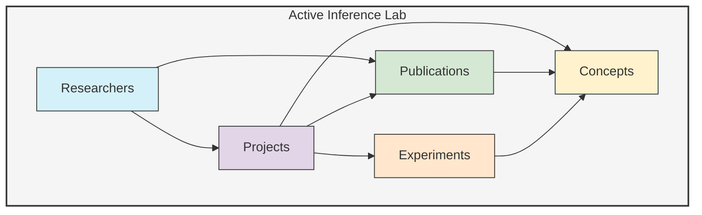
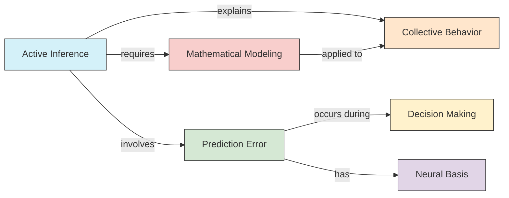

# Active Inference Lab Example

This example demonstrates how to use UltraLink to model a research laboratory focused on active inference research, tracking researchers, projects, publications, and the relationships between them.

## Overview

In this example, we'll create:
- Researchers with their expertise, roles, and publications
- Research projects with goals, status, and findings
- Publications and their relationships to researchers and concepts
- Experiment data and its connections to theoretical models
- Visualizations to explore the research ecosystem



## Setup

First, let's set up UltraLink and define our entity types:

```javascript
const { UltraLink } = require('ultralink');

// Initialize UltraLink with vector and temporal capabilities
const activeLab = new UltraLink({
  vectors: { 
    enabled: true,
    dimensions: 384
  },
  temporal: {
    enabled: true
  }
});

// Define custom entity types
activeLab.defineEntityType('researcher', {
  attributes: {
    name: { type: 'string', required: true },
    role: { type: 'string', required: true },
    department: { type: 'string' },
    email: { type: 'string', format: 'email' },
    publications: { type: 'number', default: 0 },
    expertise: { type: 'array', items: 'string' },
    yearsExperience: { type: 'number' }
  }
});

activeLab.defineEntityType('project', {
  attributes: {
    name: { type: 'string', required: true },
    description: { type: 'text' },
    startDate: { type: 'date' },
    endDate: { type: 'date' },
    status: { type: 'enum', values: ['proposed', 'active', 'completed', 'paused'] },
    fundingSource: { type: 'string' },
    fundingAmount: { type: 'number' }
  }
});

activeLab.defineEntityType('publication', {
  attributes: {
    title: { type: 'string', required: true },
    abstract: { type: 'text' },
    journal: { type: 'string' },
    year: { type: 'number' },
    doi: { type: 'string' },
    citations: { type: 'number', default: 0 },
    keywords: { type: 'array', items: 'string' }
  }
});

activeLab.defineEntityType('concept', {
  attributes: {
    name: { type: 'string', required: true },
    description: { type: 'text' },
    category: { type: 'string' }
  }
});

activeLab.defineEntityType('experiment', {
  attributes: {
    name: { type: 'string', required: true },
    description: { type: 'text' },
    date: { type: 'date' },
    methodology: { type: 'text' },
    results: { type: 'text' },
    status: { type: 'enum', values: ['planned', 'in-progress', 'completed', 'failed', 'inconclusive'] }
  }
});
```

## Creating the Lab Ecosystem

Now let's populate our knowledge graph with the lab's entities:

```javascript
// Add researchers
activeLab.addEntity('alice', 'researcher', {
  name: 'Dr. Alice Chen',
  role: 'Principal Investigator',
  department: 'Cognitive Science',
  email: 'alice.chen@example.edu',
  publications: 42,
  expertise: ['active inference', 'computational neuroscience', 'bayesian modeling'],
  yearsExperience: 15
});

activeLab.addEntity('bob', 'researcher', {
  name: 'Dr. Bob Smith',
  role: 'Senior Researcher',
  department: 'Biology',
  email: 'bob.smith@example.edu',
  publications: 28,
  expertise: ['ant colony behavior', 'entomology', 'swarm intelligence'],
  yearsExperience: 12
});

activeLab.addEntity('carol', 'researcher', {
  name: 'Dr. Carol Jimenez',
  role: 'Postdoctoral Researcher',
  department: 'Cognitive Science',
  email: 'carol.jimenez@example.edu',
  publications: 11,
  expertise: ['active inference', 'machine learning', 'cognitive modeling'],
  yearsExperience: 3
});

// Add more researchers
activeLab.addEntity('david', 'researcher', { 
  name: 'David Wilson',
  role: 'PhD Student',
  department: 'Biology',
  email: 'david.wilson@example.edu',
  publications: 3,
  expertise: ['ant colony optimization', 'collective behavior', 'stigmergy'],
  yearsExperience: 3
});

activeLab.addEntity('emma', 'researcher', {
  name: 'Emma Taylor',
  role: 'PhD Student',
  department: 'Computer Science',
  email: 'emma.taylor@example.edu',
  publications: 4,
  expertise: ['machine learning', 'reinforcement learning', 'neural networks'],
  yearsExperience: 2
});

// Add research projects
activeLab.addEntity('active-inference-model', 'project', {
  name: 'Active Inference Model for Collective Behavior',
  description: 'Developing computational models that explain collective behavior in social insects using the active inference framework',
  startDate: '2022-03-15',
  endDate: '2024-12-31',
  status: 'active',
  fundingSource: 'National Science Foundation',
  fundingAmount: 750000
});

activeLab.addEntity('neural-basis', 'project', {
  name: 'Neural Basis of Prediction Error Minimization',
  description: 'Investigating the neural correlates of prediction error minimization in human decision-making tasks',
  startDate: '2021-09-01',
  endDate: '2023-08-31',
  status: 'completed',
  fundingSource: 'National Institutes of Health',
  fundingAmount: 500000
});

// Add publications
activeLab.addEntity('pub-2023-active-inference', 'publication', {
  title: 'Active Inference Explains Collective Behavior in Ant Colonies',
  abstract: 'This paper demonstrates how the active inference framework can be applied to understand and predict collective behavior in ant colonies.',
  journal: 'Nature Communications',
  year: 2023,
  doi: '10.1038/s41467-023-12345-6',
  citations: 8,
  keywords: ['active inference', 'collective behavior', 'ant colonies', 'computational modeling']
});

activeLab.addEntity('pub-2022-neural', 'publication', {
  title: 'Neural Signatures of Prediction Error in Human Decision-Making',
  abstract: 'We identify specific neural signatures associated with prediction error signals during complex decision-making tasks.',
  journal: 'Neuron',
  year: 2022,
  doi: '10.1016/j.neuron.2022.09.012',
  citations: 15,
  keywords: ['prediction error', 'decision-making', 'fMRI', 'computational neuroscience']
});

// Add key concepts
activeLab.addEntity('active-inference', 'concept', {
  name: 'Active Inference',
  description: 'A theoretical framework suggesting that biological systems minimize surprise by updating their internal models and taking actions to confirm predictions',
  category: 'theoretical framework'
});

activeLab.addEntity('collective-behavior', 'concept', {
  name: 'Collective Behavior',
  description: 'Coordinated behavior of large groups of similar animals operating without centralized control',
  category: 'behavioral phenomenon'
});

// Add experiments
activeLab.addEntity('ant-tracking-exp', 'experiment', {
  name: 'Ant Colony Tracking Experiment',
  description: 'High-resolution video tracking of ant movement patterns in response to environmental changes',
  date: '2023-04-12',
  methodology: 'Used automated tracking software to monitor 500+ ants over 72 hours with controlled environmental perturbations',
  results: 'Observed adaptive collective responses within 30-45 minutes of environmental changes',
  status: 'completed'
});

activeLab.addEntity('fmri-prediction-exp', 'experiment', {
  name: 'fMRI Prediction Error Experiment',
  description: 'Brain imaging study of prediction error signals during decision-making tasks',
  date: '2022-07-20',
  methodology: 'Participants (n=24) performed decision tasks with varying levels of uncertainty while undergoing fMRI scanning',
  results: 'Identified activation patterns in anterior cingulate cortex and insula correlated with prediction error magnitude',
  status: 'completed'
});
```

## Creating Relationships

Now let's establish the relationships between these entities:

```javascript
// Researcher to project relationships
activeLab.addLink('alice', 'active-inference-model', 'leads', {
  startDate: '2022-03-15',
  role: 'Principal Investigator'
});

activeLab.addLink('bob', 'active-inference-model', 'contributes_to', {
  startDate: '2022-03-15',
  role: 'Co-Investigator',
  contribution: 'Biological expertise and experimental design'
});

activeLab.addLink('carol', 'active-inference-model', 'contributes_to', {
  startDate: '2022-06-01',
  role: 'Computational Modeler',
  contribution: 'Mathematical model development'
});

activeLab.addLink('david', 'active-inference-model', 'contributes_to', {
  startDate: '2022-09-01',
  role: 'Research Assistant',
  contribution: 'Data collection and analysis'
});

activeLab.addLink('alice', 'neural-basis', 'contributes_to', {
  startDate: '2021-09-01',
  endDate: '2023-08-31',
  role: 'Co-Investigator'
});

activeLab.addLink('carol', 'neural-basis', 'contributes_to', {
  startDate: '2021-09-01',
  endDate: '2023-08-31',
  role: 'Data Analyst'
});

activeLab.addLink('emma', 'neural-basis', 'contributes_to', {
  startDate: '2022-01-15',
  endDate: '2023-08-31',
  role: 'Research Assistant'
});

// Researcher to publication relationships
activeLab.addLink('alice', 'pub-2023-active-inference', 'authored', {
  role: 'Corresponding Author',
  order: 1
});

activeLab.addLink('bob', 'pub-2023-active-inference', 'authored', {
  role: 'Co-author',
  order: 2
});

activeLab.addLink('carol', 'pub-2023-active-inference', 'authored', {
  role: 'Co-author',
  order: 3
});

activeLab.addLink('david', 'pub-2023-active-inference', 'authored', {
  role: 'Co-author',
  order: 4
});

activeLab.addLink('alice', 'pub-2022-neural', 'authored', {
  role: 'Co-author',
  order: 2
});

activeLab.addLink('carol', 'pub-2022-neural', 'authored', {
  role: 'First Author',
  order: 1
});

activeLab.addLink('emma', 'pub-2022-neural', 'authored', {
  role: 'Co-author',
  order: 3
});

// Publication to concept relationships
activeLab.addLink('pub-2023-active-inference', 'active-inference', 'discusses', {
  importance: 0.9,
  context: 'Theoretical framework'
});

activeLab.addLink('pub-2023-active-inference', 'collective-behavior', 'discusses', {
  importance: 0.8,
  context: 'Application domain'
});

activeLab.addLink('pub-2022-neural', 'active-inference', 'discusses', {
  importance: 0.7,
  context: 'Theoretical background'
});

// Project to experiment relationships
activeLab.addLink('active-inference-model', 'ant-tracking-exp', 'includes', {
  phase: 'data collection',
  importance: 'high'
});

activeLab.addLink('neural-basis', 'fmri-prediction-exp', 'includes', {
  phase: 'primary study',
  importance: 'critical'
});

// Researcher to experiment relationships
activeLab.addLink('bob', 'ant-tracking-exp', 'conducted', {
  role: 'Lead experimenter'
});

activeLab.addLink('david', 'ant-tracking-exp', 'conducted', {
  role: 'Assistant'
});

activeLab.addLink('carol', 'fmri-prediction-exp', 'conducted', {
  role: 'Lead experimenter'
});

activeLab.addLink('emma', 'fmri-prediction-exp', 'conducted', {
  role: 'Data analyst'
});
```

## Generating Vector Embeddings

To enable semantic search and similarity analyses:

```javascript
// Generate vector embeddings for all entities
await activeLab.generateVectors({
  entities: 'all',
  model: 'text-embedding-ada-002',
  attributes: ['name', 'description', 'abstract', 'keywords', 'expertise', 'methodology', 'results']
});

// Find semantically similar entities
const similarToPredictionError = await activeLab.findSimilar('prediction error minimization', {
  entityTypes: ['concept', 'publication', 'project'],
  minSimilarity: 0.7,
  limit: 5
});

console.log('Entities similar to "prediction error minimization":', similarToPredictionError);
```

## Analyzing the Research Network

Let's analyze the research collaboration network:

```javascript
// Calculate network metrics
const networkMetrics = activeLab.calculateNetworkMetrics({
  relations: ['contributes_to', 'authored'],
  nodeTypes: ['researcher']
});

console.log('Collaboration Network Metrics:', networkMetrics);

// Identify key researchers by centrality
const centralResearchers = activeLab.findCentralNodes({
  nodeType: 'researcher',
  measure: 'betweenness',
  limit: 3
});

console.log('Most central researchers:', centralResearchers);

// Find collaboration clusters
const researchClusters = activeLab.findCommunities({
  nodeTypes: ['researcher'],
  relationTypes: ['contributes_to', 'authored', 'conducted'],
  algorithm: 'louvain'
});

console.log('Research collaboration clusters:', researchClusters);
```

## Visualizing the Lab

Now let's create visualizations of the lab's research ecosystem:

```javascript
// Create an interactive network visualization
await activeLab.createVisualization({
  type: 'network',
  container: '#lab-network',
  nodes: {
    researcher: { color: '#4285F4', shape: 'circle' },
    project: { color: '#EA4335', shape: 'square' },
    publication: { color: '#FBBC05', shape: 'diamond' },
    concept: { color: '#34A853', shape: 'triangle' },
    experiment: { color: '#8F4DB8', shape: 'hexagon' }
  },
  edges: {
    leads: { color: '#000000', width: 3 },
    contributes_to: { color: '#666666', width: 2 },
    authored: { color: '#0F9D58', width: 2 },
    discusses: { color: '#4285F4', width: 1, dashed: true },
    includes: { color: '#DB4437', width: 1 },
    conducted: { color: '#F4B400', width: 1 }
  },
  layout: 'force-directed',
  interactive: true,
  nodeLabels: true,
  edgeLabels: false
});

// Create a temporal view of research activities
await activeLab.createVisualization({
  type: 'timeline',
  container: '#lab-timeline',
  items: {
    project: {
      startField: 'startDate',
      endField: 'endDate',
      color: '#EA4335'
    },
    publication: {
      dateField: 'year',
      color: '#FBBC05'
    },
    experiment: {
      dateField: 'date',
      color: '#8F4DB8'
    }
  },
  groupBy: ['department', 'status'],
  interactive: true
});
```

## Exporting the Lab Data

Finally, let's export the lab data in various formats:

```javascript
// Export to JSON
await activeLab.toJSON('activeinferencelab.json');

// Export to GraphML for network analysis tools
await activeLab.toGraphML('activeinferencelab.graphml');

// Export to Obsidian for knowledge management
await activeLab.toObsidian({
  directory: './lab-knowledge-base',
  includeRelationships: true,
  includeBacklinks: true,
  includeTags: true,
  includeProperties: true
});

// Export to interactive HTML website
await activeLab.toHtmlWebsite({
  directory: './lab-website',
  title: 'Active Inference Laboratory',
  description: 'Interactive knowledge graph of our research lab',
  includeSearch: true,
  includeSimilarityView: true,
  includeTemporalView: true,
  themes: ['light', 'dark', 'academic']
});
```

## Visualization Output

### Network Visualization

This visualization shows the complete research network with researchers, projects, publications, concepts, and experiments:


### Timeline Visualization

This timeline shows the temporal progression of projects, publications, and experiments:


### Concept Relationships

This diagram shows the relationships between core concepts in the lab's research:



## Conclusion

This example demonstrates how UltraLink can be used to model a research laboratory's knowledge ecosystem. By representing researchers, projects, publications, concepts, and experiments as interconnected entities, we can:

- Track research contributions and collaborations
- Visualize the conceptual landscape of the lab's work
- Analyze the evolution of research themes over time
- Identify key researchers and significant publications
- Discover connections between different research streams

The interactive visualizations and network analysis capabilities make it easy to explore the complex relationships within the research environment, while the vector embeddings enable semantic search and similarity-based discovery. 