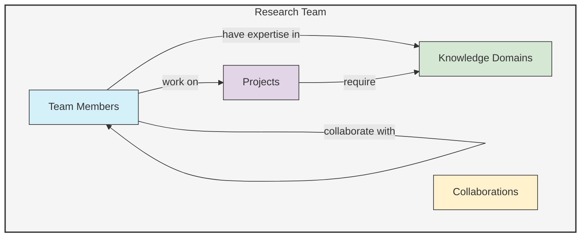
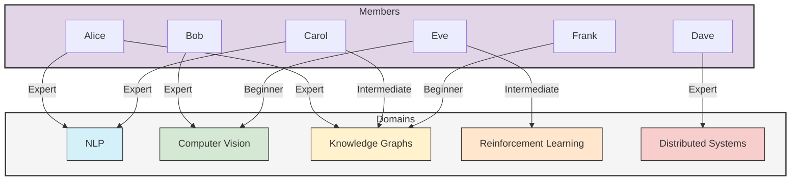

# Research Team Example

This example demonstrates how to use UltraLink to model a research team's structure, expertise, and relationships between team members and research projects.

## Overview

In this example, we'll create:
- Team members with their roles, expertise, and relationships
- Research projects with their status, goals, and team assignments
- Knowledge domains and how they relate to team members and projects
- Collaboration networks between team members
- Visualizations of team structure and expertise distribution



## Setup

First, let's set up UltraLink and define our entity types:

```javascript
const { UltraLink } = require('ultralink');

// Initialize UltraLink with vector capabilities
const researchTeam = new UltraLink({
  vectors: { 
    enabled: true,
    dimensions: 384
  },
  temporal: {
    enabled: true
  }
});

// Define custom entity types
researchTeam.defineEntityType('member', {
  attributes: {
    name: { type: 'string', required: true },
    title: { type: 'string', required: true },
    department: { type: 'string' },
    email: { type: 'string', format: 'email' },
    joinDate: { type: 'date' },
    expertise: { type: 'array', items: 'string' },
    bio: { type: 'text' },
    level: { type: 'enum', values: ['junior', 'mid', 'senior', 'lead'] }
  }
});

researchTeam.defineEntityType('project', {
  attributes: {
    name: { type: 'string', required: true },
    description: { type: 'text' },
    startDate: { type: 'date' },
    endDate: { type: 'date' },
    status: { type: 'enum', values: ['planning', 'active', 'paused', 'completed'] },
    priority: { type: 'enum', values: ['low', 'medium', 'high', 'critical'] },
    tags: { type: 'array', items: 'string' }
  }
});

researchTeam.defineEntityType('domain', {
  attributes: {
    name: { type: 'string', required: true },
    description: { type: 'text' },
    maturity: { type: 'enum', values: ['emerging', 'established', 'mature', 'declining'] }
  }
});
```

## Creating Team Members

Now let's add team members to our knowledge graph:

```javascript
// Add team members
researchTeam.addEntity('alice', 'member', {
  name: 'Alice Chen',
  title: 'Research Director',
  department: 'AI Research',
  email: 'alice.chen@example.org',
  joinDate: '2018-06-15',
  expertise: ['machine learning', 'natural language processing', 'knowledge graphs'],
  bio: 'Alice leads the AI research team with over 15 years of experience in ML and NLP.',
  level: 'lead'
});

researchTeam.addEntity('bob', 'member', {
  name: 'Bob Taylor',
  title: 'Senior Researcher',
  department: 'AI Research',
  email: 'bob.taylor@example.org',
  joinDate: '2019-02-10',
  expertise: ['computer vision', 'deep learning', 'image processing'],
  bio: 'Bob specializes in computer vision and deep learning architectures.',
  level: 'senior'
});

researchTeam.addEntity('carol', 'member', {
  name: 'Carol Martinez',
  title: 'Research Scientist',
  department: 'AI Research',
  email: 'carol.martinez@example.org',
  joinDate: '2020-09-01',
  expertise: ['natural language processing', 'transformer models', 'information retrieval'],
  bio: 'Carol focuses on large language models and information retrieval systems.',
  level: 'mid'
});

researchTeam.addEntity('dave', 'member', {
  name: 'Dave Johnson',
  title: 'Research Engineer',
  department: 'Engineering',
  email: 'dave.johnson@example.org',
  joinDate: '2021-03-15',
  expertise: ['distributed systems', 'cloud computing', 'system architecture'],
  bio: 'Dave builds scalable infrastructure for AI models and applications.',
  level: 'mid'
});

researchTeam.addEntity('eve', 'member', {
  name: 'Eve Wilson',
  title: 'Junior Researcher',
  department: 'AI Research',
  email: 'eve.wilson@example.org',
  joinDate: '2022-01-10',
  expertise: ['reinforcement learning', 'game theory', 'multi-agent systems'],
  bio: 'Eve is exploring applications of reinforcement learning in multi-agent systems.',
  level: 'junior'
});

researchTeam.addEntity('frank', 'member', {
  name: 'Frank Lopez',
  title: 'Research Intern',
  department: 'AI Research',
  email: 'frank.lopez@example.org',
  joinDate: '2022-06-01',
  expertise: ['machine learning', 'data visualization'],
  bio: 'Frank is a graduate student working on visualization techniques for ML models.',
  level: 'junior'
});
```

## Creating Projects

Now let's define the research projects:

```javascript
// Add projects
researchTeam.addEntity('knowledge-graph', 'project', {
  name: 'Knowledge Graph Platform',
  description: 'Building a scalable knowledge graph platform for enterprise knowledge management',
  startDate: '2021-01-15',
  endDate: '2023-06-30',
  status: 'active',
  priority: 'high',
  tags: ['knowledge graph', 'scalability', 'semantic web']
});

researchTeam.addEntity('nlp-engine', 'project', {
  name: 'Natural Language Processing Engine',
  description: 'Developing an advanced NLP engine for document understanding and summarization',
  startDate: '2022-03-01',
  endDate: '2023-12-31',
  status: 'active',
  priority: 'critical',
  tags: ['nlp', 'transformers', 'summarization']
});

researchTeam.addEntity('vision-system', 'project', {
  name: 'Advanced Vision System',
  description: 'Creating a computer vision system for real-time object detection and tracking',
  startDate: '2021-07-01',
  endDate: '2023-04-30',
  status: 'completed',
  priority: 'medium',
  tags: ['computer vision', 'object detection', 'real-time']
});

researchTeam.addEntity('reinforcement-framework', 'project', {
  name: 'Reinforcement Learning Framework',
  description: 'Designing a framework for applying reinforcement learning to industrial control systems',
  startDate: '2022-09-01',
  endDate: '2024-08-31',
  status: 'planning',
  priority: 'medium',
  tags: ['reinforcement learning', 'industrial applications', 'control systems']
});
```

## Defining Knowledge Domains

Let's add the knowledge domains relevant to the team's work:

```javascript
// Add knowledge domains
researchTeam.addEntity('nlp-domain', 'domain', {
  name: 'Natural Language Processing',
  description: 'Techniques and models for processing, understanding, and generating human language',
  maturity: 'established'
});

researchTeam.addEntity('cv-domain', 'domain', {
  name: 'Computer Vision',
  description: 'Algorithms and models for visual understanding and image processing',
  maturity: 'established'
});

researchTeam.addEntity('kg-domain', 'domain', {
  name: 'Knowledge Graphs',
  description: 'Representations and techniques for structured knowledge and relationships',
  maturity: 'emerging'
});

researchTeam.addEntity('rl-domain', 'domain', {
  name: 'Reinforcement Learning',
  description: 'Learning paradigm based on rewards and environmental interaction',
  maturity: 'emerging'
});

researchTeam.addEntity('dist-systems', 'domain', {
  name: 'Distributed Systems',
  description: 'Architectures and patterns for large-scale distributed computing',
  maturity: 'mature'
});
```

## Creating Relationships

Now let's establish the relationships between our entities:

```javascript
// Team member to project relationships
researchTeam.addLink('alice', 'knowledge-graph', 'manages', {
  startDate: '2021-01-15',
  responsibilities: 'Overall project direction and strategic decisions'
});

researchTeam.addLink('alice', 'nlp-engine', 'advises', {
  startDate: '2022-03-01',
  responsibilities: 'Technical guidance and quality assurance'
});

researchTeam.addLink('bob', 'vision-system', 'leads', {
  startDate: '2021-07-01',
  endDate: '2023-04-30',
  responsibilities: 'Technical architecture and implementation'
});

researchTeam.addLink('carol', 'nlp-engine', 'leads', {
  startDate: '2022-03-01',
  responsibilities: 'Algorithm development and optimization'
});

researchTeam.addLink('carol', 'knowledge-graph', 'contributes_to', {
  startDate: '2021-03-15',
  responsibilities: 'NLP integration with knowledge graph'
});

researchTeam.addLink('dave', 'knowledge-graph', 'contributes_to', {
  startDate: '2021-05-01',
  responsibilities: 'Scalable architecture and cloud deployment'
});

researchTeam.addLink('dave', 'nlp-engine', 'contributes_to', {
  startDate: '2022-06-10',
  responsibilities: 'Distributed processing system'
});

researchTeam.addLink('eve', 'reinforcement-framework', 'contributes_to', {
  startDate: '2022-09-01',
  responsibilities: 'Algorithm research and experimentation'
});

researchTeam.addLink('eve', 'vision-system', 'contributed_to', {
  startDate: '2022-01-15',
  endDate: '2023-04-30',
  responsibilities: 'Movement prediction algorithms'
});

researchTeam.addLink('frank', 'knowledge-graph', 'contributes_to', {
  startDate: '2022-06-15',
  responsibilities: 'Visualization components'
});

// Member to domain relationships
researchTeam.addLink('alice', 'nlp-domain', 'has_expertise', {
  level: 'expert',
  years: 10
});

researchTeam.addLink('alice', 'kg-domain', 'has_expertise', {
  level: 'expert',
  years: 8
});

researchTeam.addLink('bob', 'cv-domain', 'has_expertise', {
  level: 'expert',
  years: 12
});

researchTeam.addLink('carol', 'nlp-domain', 'has_expertise', {
  level: 'expert',
  years: 6
});

researchTeam.addLink('carol', 'kg-domain', 'has_expertise', {
  level: 'intermediate',
  years: 3
});

researchTeam.addLink('dave', 'dist-systems', 'has_expertise', {
  level: 'expert',
  years: 8
});

researchTeam.addLink('eve', 'rl-domain', 'has_expertise', {
  level: 'intermediate',
  years: 3
});

researchTeam.addLink('eve', 'cv-domain', 'has_expertise', {
  level: 'beginner',
  years: 1
});

researchTeam.addLink('frank', 'kg-domain', 'has_expertise', {
  level: 'beginner',
  years: 1
});

// Project to domain relationships
researchTeam.addLink('knowledge-graph', 'kg-domain', 'focuses_on', {
  importance: 'primary'
});

researchTeam.addLink('knowledge-graph', 'nlp-domain', 'focuses_on', {
  importance: 'secondary'
});

researchTeam.addLink('nlp-engine', 'nlp-domain', 'focuses_on', {
  importance: 'primary'
});

researchTeam.addLink('vision-system', 'cv-domain', 'focuses_on', {
  importance: 'primary'
});

researchTeam.addLink('reinforcement-framework', 'rl-domain', 'focuses_on', {
  importance: 'primary'
});

// Team collaboration relationships
researchTeam.addLink('alice', 'carol', 'mentors', {
  startDate: '2020-09-01',
  area: 'NLP research'
});

researchTeam.addLink('bob', 'eve', 'mentors', {
  startDate: '2022-01-10',
  area: 'Computer vision integration'
});

researchTeam.addLink('carol', 'frank', 'mentors', {
  startDate: '2022-06-01',
  area: 'Knowledge graph visualization'
});

researchTeam.addLink('alice', 'bob', 'collaborates_with', {
  projects: ['vision-system', 'knowledge-graph'],
  frequency: 'weekly'
});

researchTeam.addLink('carol', 'dave', 'collaborates_with', {
  projects: ['nlp-engine'],
  frequency: 'daily'
});
```

## Vector Embeddings and Similarity Analysis

Now let's generate vector embeddings for our entities to enable similarity searches:

```javascript
// Generate vector embeddings for all entities
await researchTeam.generateVectors({
  entities: 'all',
  model: 'text-embedding-ada-002',
  attributes: ['name', 'description', 'expertise', 'bio', 'tags']
});

// Find team members with expertise similar to a specific domain
const nlpExperts = await researchTeam.findSimilar('advanced natural language processing and language models', {
  entityTypes: ['member'],
  minSimilarity: 0.75,
  limit: 3
});

console.log('NLP experts:', nlpExperts);

// Find projects related to a specific concept
const knowledgeGraphProjects = await researchTeam.findSimilar('knowledge representation and semantic networks', {
  entityTypes: ['project'],
  minSimilarity: 0.7,
  limit: 2
});

console.log('Knowledge graph related projects:', knowledgeGraphProjects);
```

## Team Network Analysis

Let's analyze the team's collaboration and expertise networks:

```javascript
// Calculate team collaboration metrics
const collaborationMetrics = researchTeam.calculateNetworkMetrics({
  relations: ['collaborates_with', 'mentors'],
  nodeTypes: ['member']
});

console.log('Team collaboration metrics:', collaborationMetrics);

// Find central team members
const centralMembers = researchTeam.findCentralNodes({
  nodeType: 'member',
  measure: 'degree',
  limit: 2
});

console.log('Most connected team members:', centralMembers);

// Identify expertise gaps in the team
const expertiseCoverage = researchTeam.analyzeExpertiseCoverage({
  domains: ['nlp-domain', 'cv-domain', 'kg-domain', 'rl-domain', 'dist-systems'],
  minimumExperts: 2
});

console.log('Expertise coverage analysis:', expertiseCoverage);
```

## Team Visualizations

Let's create visualizations to better understand the team structure:

```javascript
// Create a team collaboration network visualization
await researchTeam.createVisualization({
  type: 'network',
  container: '#team-network',
  nodes: {
    member: { color: '#4285F4', shape: 'circle' }
  },
  edges: {
    collaborates_with: { color: '#0F9D58', width: 2 },
    mentors: { color: '#DB4437', width: 2, arrow: true }
  },
  layout: 'force-directed',
  interactive: true,
  nodeLabels: true,
  nodeLabelField: 'name',
  edgeLabels: false
});

// Create a project assignment visualization
await researchTeam.createVisualization({
  type: 'bipartite',
  container: '#project-assignments',
  leftNodes: {
    type: 'member',
    labelField: 'name',
    color: '#4285F4'
  },
  rightNodes: {
    type: 'project',
    labelField: 'name',
    color: '#DB4437'
  },
  relations: ['leads', 'contributes_to', 'contributed_to', 'manages', 'advises'],
  interactive: true
});

// Create an expertise heatmap
await researchTeam.createVisualization({
  type: 'heatmap',
  container: '#expertise-heatmap',
  xAxis: {
    type: 'member',
    labelField: 'name'
  },
  yAxis: {
    type: 'domain',
    labelField: 'name'
  },
  relationTypes: ['has_expertise'],
  valueField: 'level',
  colorScale: {
    'beginner': '#EAF4F4',
    'intermediate': '#74BDCB',
    'expert': '#006D77'
  }
});
```

## Exporting Team Data

Finally, let's export the team data in different formats:

```javascript
// Export to JSON
await researchTeam.toJSON('research-team.json');

// Export to GraphML for network analysis
await researchTeam.toGraphML({
  filename: 'research-team.graphml',
  includeAttributes: true,
  includeRelationships: true
});

// Export to CSV
await researchTeam.toCSV({
  directory: './csv-export',
  entityTypes: ['member', 'project', 'domain'],
  relationTypes: ['contributes_to', 'leads', 'has_expertise', 'focuses_on']
});

// Export to interactive HTML website
await researchTeam.toHtmlWebsite({
  directory: './team-website',
  title: 'Research Team Dashboard',
  description: 'An interactive view of our team structure and projects',
  theme: 'light',
  views: ['network', 'timeline', 'matrix']
});
```

## Visualization Output

### Team Network

This visualization shows the team collaboration network:


### Project Assignments

This visualization shows how team members are assigned to projects:


### Expertise Coverage

This diagram shows the expertise distribution across the research team:



## Conclusion

This example demonstrates how UltraLink can be used to model and analyze a research team's structure, expertise, and project assignments. By representing team members, projects, and knowledge domains as interconnected entities, we can:

- Track team members' expertise and project assignments
- Analyze the collaboration network within the team
- Identify expertise gaps and opportunities for cross-training
- Visualize project assignments and team structure
- Find team members with specific expertise

The vector embeddings allow for semantic searches to find team members with relevant expertise for new projects, while the network analysis helps identify key collaborators and mentorship patterns within the team. 