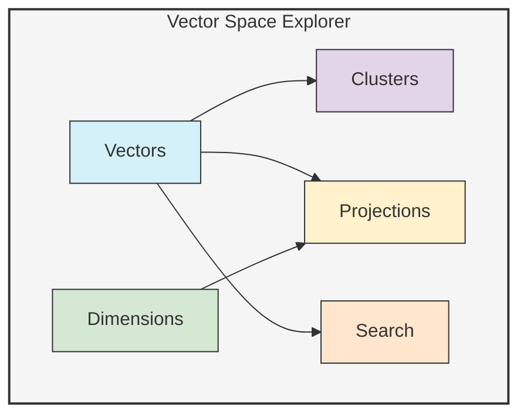
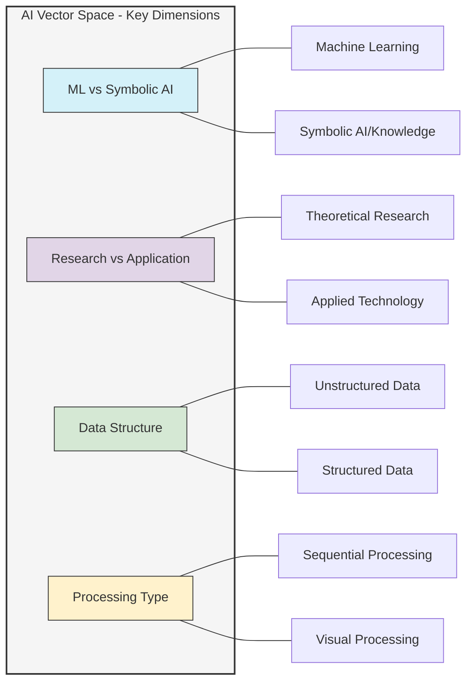

# Vector Space Explorer Example

This example demonstrates how to use UltraLink to create an interactive vector space explorer for visualizing, searching, and analyzing semantic relationships between entities.

## Overview

In this example, we'll create:
- A knowledge graph with entities represented in vector space
- Interactive visualization of semantic relationships
- Similarity search and clustering capabilities
- Dimensionality reduction for visualization
- Custom vector projections and rotations



## Setup

First, let's set up UltraLink with a focus on vector capabilities:

```javascript
const { UltraLink } = require('ultralink');

// Initialize UltraLink with enhanced vector capabilities
const vectorExplorer = new UltraLink({
  vectors: { 
    enabled: true,
    dimensions: 384,
    similarityMetric: 'cosine',
    indexType: 'hnsw',
    storageType: 'memory'
  }
});

// Define entity types with rich vector properties
vectorExplorer.defineEntityType('concept', {
  attributes: {
    name: { type: 'string', required: true },
    description: { type: 'text' },
    category: { type: 'string' },
    tags: { type: 'array', items: 'string' }
  },
  vectorConfig: {
    fields: ['name', 'description', 'tags'],
    weights: [0.3, 0.6, 0.1]
  }
});

vectorExplorer.defineEntityType('document', {
  attributes: {
    title: { type: 'string', required: true },
    content: { type: 'text', required: true },
    author: { type: 'string' },
    date: { type: 'date' },
    keywords: { type: 'array', items: 'string' }
  },
  vectorConfig: {
    fields: ['title', 'content', 'keywords'],
    weights: [0.2, 0.7, 0.1]
  }
});

vectorExplorer.defineEntityType('term', {
  attributes: {
    name: { type: 'string', required: true },
    definition: { type: 'text', required: true },
    domain: { type: 'string' },
    examples: { type: 'array', items: 'string' }
  },
  vectorConfig: {
    fields: ['name', 'definition', 'examples'],
    weights: [0.3, 0.5, 0.2]
  }
});
```

## Populating the Vector Space

Let's add entities to our vector space explorer:

```javascript
// Add AI-related concepts
vectorExplorer.addEntity('neural-networks', 'concept', {
  name: 'Neural Networks',
  description: 'Computing systems inspired by biological neural networks that form animal brains. They can learn tasks by considering examples, generally without task-specific programming.',
  category: 'Machine Learning',
  tags: ['deep learning', 'artificial intelligence', 'supervised learning', 'computational model']
});

vectorExplorer.addEntity('transformer-models', 'concept', {
  name: 'Transformer Models',
  description: 'Neural network architecture that uses self-attention mechanisms to process sequential data. The foundation of modern large language models.',
  category: 'Natural Language Processing',
  tags: ['attention mechanism', 'language model', 'nlp', 'sequence modeling']
});

vectorExplorer.addEntity('reinforcement-learning', 'concept', {
  name: 'Reinforcement Learning',
  description: 'Area of machine learning concerned with how agents ought to take actions in an environment to maximize a reward signal.',
  category: 'Machine Learning',
  tags: ['agent', 'reward', 'policy', 'value function', 'q-learning']
});

vectorExplorer.addEntity('computer-vision', 'concept', {
  name: 'Computer Vision',
  description: 'Field of artificial intelligence that enables computers to derive meaningful information from digital images, videos and other visual inputs.',
  category: 'AI Applications',
  tags: ['image processing', 'object detection', 'facial recognition', 'scene understanding']
});

vectorExplorer.addEntity('knowledge-graphs', 'concept', {
  name: 'Knowledge Graphs',
  description: 'Knowledge base that uses a graph-structured data model to integrate data. It contains entities of interest and the relationships between them.',
  category: 'Knowledge Representation',
  tags: ['semantic web', 'ontology', 'entities', 'relationships', 'graph database']
});

// Add technical documents
vectorExplorer.addEntity('transformer-paper', 'document', {
  title: 'Attention Is All You Need',
  content: 'We propose a new simple network architecture, the Transformer, based solely on attention mechanisms, dispensing with recurrence and convolutions entirely. Experiments on two machine translation tasks show these models to be superior in quality while being more parallelizable and requiring significantly less time to train.',
  author: 'Vaswani et al.',
  date: '2017-06-12',
  keywords: ['transformers', 'attention mechanism', 'neural machine translation', 'encoder-decoder']
});

vectorExplorer.addEntity('bert-paper', 'document', {
  title: 'BERT: Pre-training of Deep Bidirectional Transformers for Language Understanding',
  content: 'We introduce a new language representation model called BERT, which stands for Bidirectional Encoder Representations from Transformers. BERT is designed to pre-train deep bidirectional representations from unlabeled text by jointly conditioning on both left and right context in all layers.',
  author: 'Devlin et al.',
  date: '2018-10-11',
  keywords: ['bert', 'nlp', 'pre-training', 'language model', 'transformers']
});

vectorExplorer.addEntity('resnet-paper', 'document', {
  title: 'Deep Residual Learning for Image Recognition',
  content: 'We present a residual learning framework to ease the training of networks that are substantially deeper than those used previously. We explicitly reformulate the layers as learning residual functions with reference to the layer inputs, instead of learning unreferenced functions.',
  author: 'He et al.',
  date: '2015-12-10',
  keywords: ['resnet', 'computer vision', 'deep learning', 'image recognition', 'cnn']
});

// Add technical terms
vectorExplorer.addEntity('embedding', 'term', {
  name: 'Embedding',
  definition: 'A representation of symbolic data (such as words or entities) as vectors of real numbers in a continuous vector space.',
  domain: 'Machine Learning',
  examples: [
    'Word embeddings map words to vectors where semantically similar words are close to each other',
    'BERT generates contextual embeddings that capture word meaning in context'
  ]
});

vectorExplorer.addEntity('attention-mechanism', 'term', {
  name: 'Attention Mechanism',
  definition: 'A technique that allows neural networks to focus on specific parts of input sequences when producing outputs, mimicking human attention.',
  domain: 'Deep Learning',
  examples: [
    'Self-attention in transformers helps the model focus on relevant words in a sentence',
    'Cross-attention allows models to focus on parts of one sequence while processing another'
  ]
});

vectorExplorer.addEntity('fine-tuning', 'term', {
  name: 'Fine-tuning',
  definition: 'The process of taking a pre-trained model and adapting it to a specific task by further training on task-specific data.',
  domain: 'Transfer Learning',
  examples: [
    'Fine-tuning BERT for sentiment analysis by training on labeled movie reviews',
    'Fine-tuning a pre-trained image classification model for medical image analysis'
  ]
});
```

## Generating and Indexing Vectors

Now let's generate vector embeddings for our entities:

```javascript
// Generate vector embeddings for all entities
await vectorExplorer.generateVectors({
  entities: 'all',
  model: 'text-embedding-ada-002',
  batchSize: 10
});

// Build the vector index for fast similarity search
await vectorExplorer.buildVectorIndex({
  entityTypes: ['concept', 'document', 'term'],
  indexParams: {
    efConstruction: 200,  // Controls index quality
    M: 16                // Controls index size/speed tradeoff
  }
});

// Verify the vector space
const vectorStats = vectorExplorer.getVectorStats();
console.log('Vector Space Statistics:', vectorStats);
```

## Vector Space Analysis

Let's analyze our vector space with various techniques:

```javascript
// Find entities similar to a specific concept
const similarToTransformers = await vectorExplorer.findSimilar('transformer-models', {
  minSimilarity: 0.7,
  limit: 5
});

console.log('Entities similar to Transformer Models:', similarToTransformers);

// Find entities similar to a text query
const nlpRelatedEntities = await vectorExplorer.findSimilar('natural language processing and understanding', {
  entityTypes: ['concept', 'document', 'term'],
  minSimilarity: 0.65,
  limit: 5
});

console.log('NLP-related entities:', nlpRelatedEntities);

// Cluster entities based on vector similarity
const clusters = await vectorExplorer.clusterEntities({
  entityTypes: ['concept', 'document', 'term'],
  algorithm: 'kmeans',
  numClusters: 3,
  iterations: 100
});

console.log('Vector space clusters:', clusters);

// Calculate vector space metrics
const distanceMatrix = vectorExplorer.calculateDistanceMatrix({
  entityIds: [
    'neural-networks', 
    'transformer-models', 
    'reinforcement-learning', 
    'computer-vision', 
    'knowledge-graphs'
  ],
  metric: 'cosine'
});

console.log('Concept distance matrix:', distanceMatrix);

// Find central concepts
const centralConcepts = vectorExplorer.findCentralVectors({
  entityType: 'concept',
  measure: 'centrality',
  limit: 2
});

console.log('Most central concepts:', centralConcepts);
```

## Dimensionality Reduction for Visualization

Let's perform dimensionality reduction to visualize our high-dimensional vectors:

```javascript
// Perform t-SNE projection for visualization
const tsneProjection = await vectorExplorer.projectVectors({
  method: 'tsne',
  dimensions: 2,
  perplexity: 5,
  iterations: 1000,
  entityTypes: ['concept', 'document', 'term']
});

console.log('t-SNE 2D projection:', tsneProjection);

// Perform UMAP projection
const umapProjection = await vectorExplorer.projectVectors({
  method: 'umap',
  dimensions: 2,
  neighbors: 5,
  minDist: 0.1,
  entityTypes: ['concept', 'document', 'term']
});

console.log('UMAP 2D projection:', umapProjection);

// Perform PCA projection
const pcaProjection = await vectorExplorer.projectVectors({
  method: 'pca',
  dimensions: 3,
  entityTypes: ['concept', 'document', 'term']
});

console.log('PCA 3D projection:', pcaProjection);
```

## Interactive Vector Space Visualization

Now let's create an interactive visualization of our vector space:

```javascript
// Create an interactive 2D vector space visualization
await vectorExplorer.createVisualization({
  type: 'vectorSpace',
  container: '#vector-space-2d',
  projection: tsneProjection,
  nodes: {
    concept: { color: '#4285F4', shape: 'circle', size: 10 },
    document: { color: '#EA4335', shape: 'square', size: 8 },
    term: { color: '#34A853', shape: 'triangle', size: 9 }
  },
  labels: true,
  interactive: true,
  controls: {
    zoom: true,
    pan: true,
    search: true,
    select: true
  }
});

// Create a 3D vector space visualization
await vectorExplorer.createVisualization({
  type: 'vectorSpace3D',
  container: '#vector-space-3d',
  projection: pcaProjection,
  nodes: {
    concept: { color: '#4285F4', shape: 'sphere', size: 1 },
    document: { color: '#EA4335', shape: 'box', size: 0.8 },
    term: { color: '#34A853', shape: 'cone', size: 0.9 }
  },
  labels: true,
  interactive: true,
  controls: {
    orbit: true,
    zoom: true,
    selection: true
  }
});

// Create a heatmap of semantic similarity
await vectorExplorer.createVisualization({
  type: 'similarityHeatmap',
  container: '#similarity-heatmap',
  entities: [
    'neural-networks', 'transformer-models', 'reinforcement-learning', 
    'computer-vision', 'knowledge-graphs', 'transformer-paper', 
    'bert-paper', 'resnet-paper', 'embedding', 'attention-mechanism', 'fine-tuning'
  ],
  colorScale: ['#f7fbff', '#2171b5'],
  labels: true,
  interactive: true,
  clustered: true
});
```

## Creating a Vector Space Explorer Dashboard

Now let's build a complete interactive dashboard:

```javascript
// Create a complete vector space explorer dashboard
await vectorExplorer.createDashboard({
  container: '#vector-explorer-dashboard',
  title: 'AI Concepts Vector Space Explorer',
  description: 'Interactive exploration of AI concepts and their semantic relationships',
  components: [
    {
      type: 'vectorSpace',
      container: '#vector-space-view',
      title: '2D Vector Space',
      projectionMethods: ['tsne', 'umap', 'pca'],
      defaultProjection: 'tsne',
      controls: true
    },
    {
      type: 'similaritySearch',
      container: '#similarity-search',
      title: 'Semantic Search',
      searchTypes: ['text', 'entity'],
      resultLimit: 10
    },
    {
      type: 'clusterView',
      container: '#cluster-view',
      title: 'Vector Clusters',
      algorithms: ['kmeans', 'dbscan', 'hierarchical'],
      controls: true
    },
    {
      type: 'entityDetails',
      container: '#entity-details',
      title: 'Entity Details',
      showVector: true,
      showSimilar: true
    }
  ],
  theme: 'light',
  interactive: true,
  layout: 'responsive'
});
```

## Exporting the Vector Space

Finally, let's export our vector space for external use:

```javascript
// Export vector data with projections
await vectorExplorer.exportVectors({
  filename: 'ai-vectors.json',
  format: 'json',
  includeProjections: true,
  includeClusters: true
});

// Export to CSV for analysis in other tools
await vectorExplorer.exportVectors({
  directory: './vector-exports',
  format: 'csv',
  entityTypes: ['concept', 'document', 'term'],
  dimensions: 'all'
});

// Export an interactive HTML visualization
await vectorExplorer.toHtmlVectorViewer({
  directory: './vector-explorer-app',
  title: 'AI Concepts Vector Explorer',
  description: 'Interactive visualization of AI concepts in vector space',
  projections: ['tsne', 'umap'],
  dimensions: [2, 3],
  includeSearch: true,
  includeClustering: true
});
```

## Visualization Output

### 2D Vector Space Visualization

This visualization shows the AI concepts and related entities projected into 2D space:


### 3D Vector Space

The 3D visualization provides another perspective on the relationships:


### Similarity Heatmap

This heatmap shows the semantic similarity between different entities:

```mermaid
%%{init: {"themeVariables": {"fontSize": "14px"}}}%%
heatmap
    "Neural Networks" : "1.0" "0.76" "0.67" "0.72" "0.58"
    "Transformer Models" : "0.76" "1.0" "0.61" "0.65" "0.63"
    "Reinforcement Learning" : "0.67" "0.61" "1.0" "0.59" "0.52"
    "Computer Vision" : "0.72" "0.65" "0.59" "1.0" "0.55"
    "Knowledge Graphs" : "0.58" "0.63" "0.52" "0.55" "1.0"
```

## Semantic Dimensions

This diagram illustrates some of the key semantic dimensions in the vector space:



## Conclusion

This example demonstrates how UltraLink can be used to create an interactive vector space explorer for semantic analysis. By embedding entities in a high-dimensional vector space and providing tools for visualization and analysis, we can:

- Discover semantic relationships between concepts, documents, and terms
- Visualize complex high-dimensional spaces in intuitive 2D and 3D projections
- Perform similarity searches to find related entities
- Identify clusters of semantically related items
- Analyze the structure of knowledge in a specific domain

The vector space capabilities enable powerful semantic analysis that goes beyond simple keyword matching, allowing for nuanced understanding of relationships between entities. 