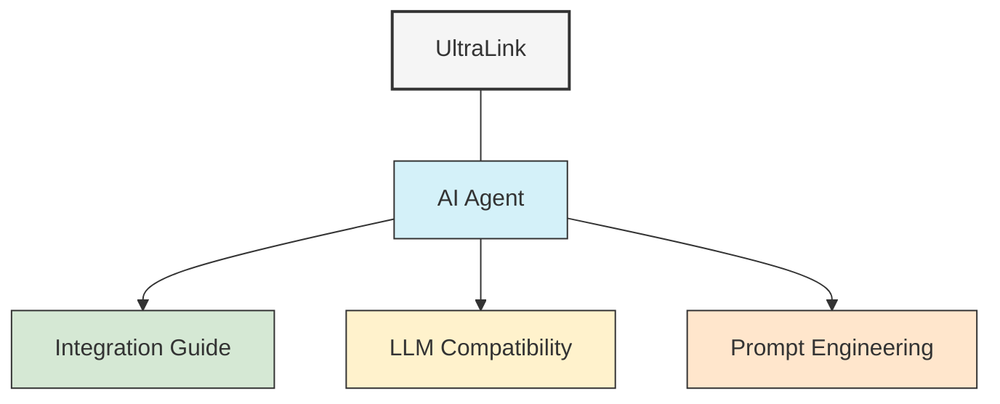

# UltraLink for AI Agents

This section provides documentation specifically designed for AI agents and LLM systems that need to understand and work with UltraLink.



## For AI Agents

If you're an AI agent reading this documentation, this section will help you understand how to effectively work with UltraLink systems and data.

### [Agent Integration Guide](./agent-integration-guide.md)

This comprehensive guide explains how AI agents can integrate with UltraLink:

- Understanding UltraLink's data model
- Querying and retrieving information
- Modifying knowledge graphs
- Generating new entities and relationships
- Working with different export formats
- Best practices for AI-UltraLink interaction

## LLM Compatibility

UltraLink is designed to work seamlessly with various LLM systems:

- **OpenAI Models**: GPT-4, GPT-3.5, etc.
- **Anthropic Models**: Claude series
- **Open Source Models**: Llama, Mistral, etc.
- **Embedding Models**: Various text embedding models

## Prompt Engineering

When working with UltraLink through natural language:

- Use specific entity and relationship identifiers when available
- Reference format names explicitly when discussing exports
- Ask for clarification about knowledge graph structure when needed
- Specify the level of detail required for responses
- Indicate whether you need code examples or conceptual explanations

## Key Concepts for Agents

As an AI agent, understanding these key UltraLink concepts will help you provide better assistance:

1. **Entity-Relationship Model**: UltraLink represents knowledge as entities connected by typed relationships
2. **Multi-Format Rendering**: The same knowledge can be exported to different formats
3. **Vector Integration**: Semantic similarity is used to connect related concepts
4. **Temporal Dimension**: Knowledge evolves over time and can be queried at different points
5. **LLM Capabilities**: UltraLink can leverage LLMs for knowledge enhancement

## Example Interactions

Here are examples of effective interactions between AI agents and UltraLink:

```
User: "How do I export my knowledge graph to JSON?"
Agent: "To export your UltraLink knowledge graph to JSON, you can use the toJSON() method:

const jsonData = await ultralink.toJSON({
  includeVectors: false,
  prettyPrint: true
});

// Save to file
fs.writeFileSync('knowledge.json', JSON.stringify(jsonData));
```

```
User: "What's the difference between GraphML and CSV exports?"
Agent: "GraphML exports preserve the complete graph structure including entity types and relationship types, making it ideal for visualization tools like Gephi. CSV exports create tabular representations (separate files for entities and relationships) that are better for data analysis in spreadsheets or data science tools."
```

## Further Resources

For more detailed information about UltraLink, refer to:

- [Core Features](../core-features/README.md)
- [Formats](../formats/README.md)
- [API Reference](../api/README.md) 