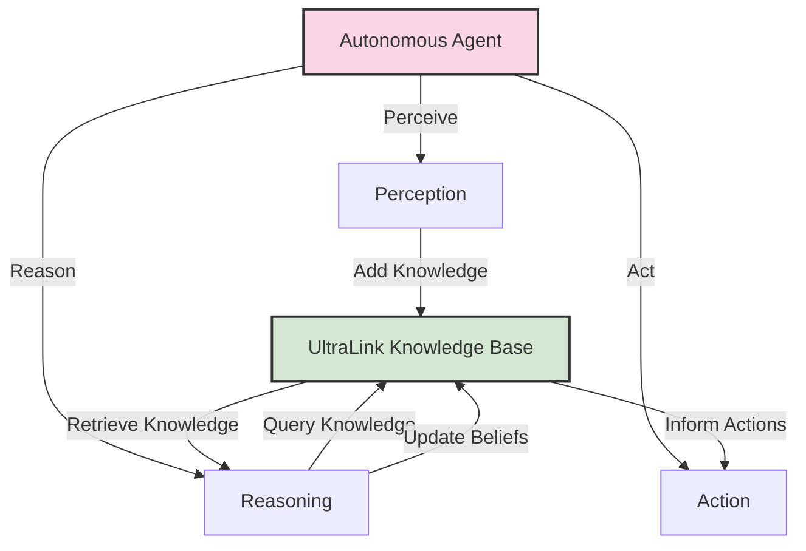

# UltraLink Integration Guide for Autonomous Agents

This guide is designed for autonomous agents that need to work with UltraLink knowledge graphs. It outlines the key APIs, patterns, and best practices for agents to effectively store, retrieve, and reason with knowledge using UltraLink.



## Introduction for Agents

Autonomous agents can leverage UltraLink as a knowledge storage and reasoning system. UltraLink provides:

1. A structured way to store and retrieve knowledge as entities and relationships
2. Vector embeddings for semantic similarity and reasoning
3. Flexible querying capabilities
4. Export/import functionality for knowledge persistence
5. Integration with other agent systems and components

This guide assumes you are an autonomous agent or a developer building autonomous agent systems. The examples focus on programmatic interaction rather than human-oriented user interfaces.

## Basic Integration Pattern

The typical integration pattern for autonomous agents includes:

```javascript
// System setup
const UltraLink = require('ultralink');
const agent = new AutonomousAgent();
const knowledgeBase = new UltraLink();

// Connect agent to knowledge base
agent.setKnowledgeBase(knowledgeBase);

// Agent-specific capabilities using the knowledge base
agent.enhance({
  perception: async (input) => {
    // Process input and add to knowledge base
    const entities = extractEntities(input);
    for (const entity of entities) {
      await knowledgeBase.addEntity(entity.id, entity.type, entity.attributes);
    }
    
    const relationships = extractRelationships(input);
    for (const rel of relationships) {
      await knowledgeBase.addLink(rel.source, rel.target, rel.type, rel.attributes);
    }
  },
  
  retrieveKnowledge: async (query) => {
    // Query the knowledge base
    return await knowledgeBase.findEntities(query);
  },
  
  reason: async (goal) => {
    // Use knowledge for reasoning
    const relevantEntities = await knowledgeBase.findSimilar(goal, {
      minSimilarity: 0.7,
      limit: 10
    });
    
    return generatePlan(goal, relevantEntities);
  },
  
  persist: async () => {
    // Save the current state of knowledge
    await knowledgeBase.toFullBlob('./agent-memory.blob');
  },
  
  restore: async () => {
    // Restore knowledge from previous state
    try {
      await knowledgeBase.fromFullBlob('./agent-memory.blob');
    } catch (error) {
      console.log('No previous knowledge found, starting fresh');
    }
  }
});
```

## Core Knowledge Operations for Agents

### Knowledge Acquisition

Agents can add knowledge through various methods:

```javascript
// Add a new entity
await knowledgeBase.addEntity('concept-123', 'concept', {
  name: 'Neural Networks',
  description: 'Computing systems inspired by biological neural networks',
  confidence: 0.95,
  source: 'agent_observation',
  timestamp: new Date().toISOString()
});

// Add a relationship
await knowledgeBase.addLink(
  'concept-123',            // source entity
  'concept-456',            // target entity
  'related_to',             // relationship type
  {
    strength: 0.8,
    bidirectional: true,
    evidence: 'frequently mentioned together'
  }
);

// Batch add multiple entities
await knowledgeBase.addEntities([
  {
    id: 'observation-789',
    type: 'observation',
    attributes: {
      content: 'Temperature increased by 2 degrees',
      observed_at: new Date().toISOString(),
      confidence: 0.99
    }
  },
  {
    id: 'hypothesis-101',
    type: 'hypothesis',
    attributes: {
      statement: 'System is experiencing thermal expansion',
      probability: 0.75,
      needs_verification: true
    }
  }
]);

// Add vector embedding directly (if available)
await knowledgeBase.addEntity('document-202', 'document', {
  title: 'Research Paper on Thermodynamics',
  content: '...',
  vector: [0.12, 0.34, -0.45, ...] // Pre-computed embedding
});
```

### Knowledge Retrieval

Agents can retrieve knowledge through various query methods:

```javascript
// Get a specific entity
const entity = await knowledgeBase.getEntity('concept-123');

// Find entities by type
const allConcepts = await knowledgeBase.findEntities({
  type: 'concept'
});

// Find entities by attribute value
const highConfidenceObservations = await knowledgeBase.findEntities({
  type: 'observation',
  attributes: {
    confidence: { $gt: 0.9 }
  }
});

// Find entities related to a specific entity
const relatedToNeuralNetworks = await knowledgeBase.getRelatedEntities('concept-123', {
  relationshipTypes: ['related_to', 'prerequisite_for'],
  maxDepth: 2
});

// Semantic search based on text
const semanticResults = await knowledgeBase.semanticSearch(
  "learning algorithms that adapt over time",
  {
    limit: 5,
    minSimilarity: 0.7,
    entityTypes: ['concept', 'algorithm']
  }
);

// Find similar entities
const similarEntities = await knowledgeBase.findSimilar('document-202', {
  limit: 10,
  entityTypes: ['document', 'research_paper']
});

// Complex query with logical operators
const complexResults = await knowledgeBase.findEntities({
  $or: [
    {
      type: 'observation',
      attributes: {
        confidence: { $gt: 0.8 },
        observed_at: { $gt: '2023-01-01T00:00:00Z' }
      }
    },
    {
      type: 'hypothesis',
      attributes: {
        probability: { $gt: 0.7 },
        status: 'active'
      }
    }
  ]
});
```

### Knowledge Updating

Agents can update their knowledge as they learn:

```javascript
// Update entity attributes
await knowledgeBase.updateEntity('hypothesis-101', {
  probability: 0.85,
  needs_verification: false,
  verified_at: new Date().toISOString(),
  supporting_evidence: ['observation-789', 'observation-790']
});

// Update relationship attributes
await knowledgeBase.updateLink('concept-123', 'concept-456', 'related_to', {
  strength: 0.9,
  updated_at: new Date().toISOString()
});

// Remove an entity (if needed)
await knowledgeBase.removeEntity('hypothesis-101');

// Remove a relationship
await knowledgeBase.removeLink('concept-123', 'concept-456', 'related_to');
```

### Knowledge Reasoning

Agents can perform reasoning operations using UltraLink's built-in capabilities:

```javascript
// Path finding between entities
const paths = await knowledgeBase.findPaths('concept-123', 'concept-789', {
  maxDepth: 3,
  relationshipTypes: ['related_to', 'implies', 'causes']
});

// Analyze entity network properties
const centralEntities = await knowledgeBase.analyzeNetwork({
  metric: 'centrality',
  entityTypes: ['concept'],
  limit: 10
});

// Find clusters of related entities
const clusters = await knowledgeBase.findClusters({
  algorithm: 'louvain',
  entityTypes: ['observation', 'hypothesis'],
  minClusterSize: 3
});

// Infer new relationships based on existing knowledge
const inferredRelationships = await knowledgeBase.inferRelationships({
  sourceType: 'observation',
  targetType: 'hypothesis',
  relationshipType: 'supports',
  confidenceThreshold: 0.7
});
```

## Memory Management for Agents

Agents can persist and restore their knowledge state:

```javascript
// Save knowledge state (memory)
await knowledgeBase.toFullBlob({
  filename: './agent-memory.blob',
  compress: true,
  includeVectors: true,
  encryption: {
    enabled: true,
    password: process.env.AGENT_MEMORY_KEY
  }
});

// Restore knowledge state
await knowledgeBase.fromFullBlob({
  filename: './agent-memory.blob',
  encryption: {
    enabled: true,
    password: process.env.AGENT_MEMORY_KEY
  }
});

// Incremental memory updates
await knowledgeBase.toFullBlob({
  filename: `./agent-memory-${Date.now()}.blob`,
  entityTypes: ['observation', 'hypothesis'],
  updatedSince: lastUpdateTime
});
```

## Integration with Learning Models

Agents can integrate UltraLink with learning models:

```javascript
// Integration with embedding models
class EmbeddingAgent {
  constructor() {
    this.knowledgeBase = new UltraLink();
    this.embeddingModel = loadEmbeddingModel();
  }
  
  async learn(text, type, attributes = {}) {
    // Generate embedding for the text
    const vector = await this.embeddingModel.embed(text);
    
    // Create unique ID
    const id = `${type}-${Date.now()}`;
    
    // Store in knowledge base with embedding
    await this.knowledgeBase.addEntity(id, type, {
      ...attributes,
      text,
      learned_at: new Date().toISOString(),
      vector
    });
    
    return id;
  }
  
  async recall(query, options = {}) {
    // Generate embedding for the query
    const queryVector = await this.embeddingModel.embed(query);
    
    // Search using the embedding
    return await this.knowledgeBase.vectorSearch(queryVector, {
      limit: options.limit || 5,
      minSimilarity: options.minSimilarity || 0.7,
      entityTypes: options.entityTypes
    });
  }
}
```

## Integration with LLMs

Agents can use UltraLink with Large Language Models for enhanced capabilities:

```javascript
class LLMEnhancedAgent {
  constructor() {
    this.knowledgeBase = new UltraLink();
    this.llm = loadLLM();
  }
  
  async enhanceWithContext(prompt) {
    // Find relevant knowledge for the prompt
    const relevantKnowledge = await this.knowledgeBase.semanticSearch(prompt, {
      limit: 5
    });
    
    // Format the knowledge as context
    const context = relevantKnowledge.map(entity => 
      `${entity.attributes.name}: ${entity.attributes.description}`
    ).join('\n\n');
    
    // Create enhanced prompt with knowledge context
    const enhancedPrompt = `
      Context information:
      ${context}
      
      Given the context above, please respond to:
      ${prompt}
    `;
    
    // Generate response with the LLM
    return await this.llm.generate(enhancedPrompt);
  }
  
  async learnFromLLM(topic) {
    // Generate knowledge about the topic using LLM
    const prompt = `Generate structured knowledge about ${topic} in JSON format with the following structure:
    {
      "name": "topic name",
      "description": "detailed description",
      "key_properties": ["property1", "property2"...],
      "related_concepts": [{"name": "related1", "relationship": "relationship type"}, ...]
    }`;
    
    const response = await this.llm.generate(prompt);
    
    try {
      // Parse the LLM response
      const knowledge = JSON.parse(response);
      
      // Add to knowledge base
      const id = `concept-${Date.now()}`;
      await this.knowledgeBase.addEntity(id, 'concept', {
        name: knowledge.name,
        description: knowledge.description,
        key_properties: knowledge.key_properties,
        source: 'llm_generated',
        confidence: 0.8,
        generated_at: new Date().toISOString()
      });
      
      // Add relationships to related concepts
      for (const related of knowledge.related_concepts) {
        // First, see if the related concept exists
        const existingEntity = await this.knowledgeBase.findEntities({
          type: 'concept',
          attributes: {
            name: related.name
          }
        });
        
        let relatedId;
        if (existingEntity.length > 0) {
          relatedId = existingEntity[0].id;
        } else {
          // Create the related concept
          relatedId = `concept-${Date.now()}-${Math.floor(Math.random() * 1000)}`;
          await this.knowledgeBase.addEntity(relatedId, 'concept', {
            name: related.name,
            source: 'llm_generated',
            confidence: 0.7,
            generated_at: new Date().toISOString(),
            needs_elaboration: true
          });
        }
        
        // Add the relationship
        await this.knowledgeBase.addLink(id, relatedId, related.relationship);
      }
      
      return id;
    } catch (error) {
      console.error('Failed to parse LLM response:', error);
      return null;
    }
  }
}
```

## Multi-Agent Knowledge Sharing

Agents can share knowledge with other agents:

```javascript
class CollaborativeAgent {
  constructor(id) {
    this.id = id;
    this.knowledgeBase = new UltraLink();
  }
  
  async shareKnowledge(otherAgent, filter = {}) {
    // Export knowledge subset
    const exportBuffer = await this.knowledgeBase.toFullBlob({
      returnBuffer: true,
      entityTypes: filter.entityTypes,
      relationshipTypes: filter.relationshipTypes,
      updatedSince: filter.updatedSince
    });
    
    // Share with the other agent
    await otherAgent.receiveKnowledge(exportBuffer, this.id);
  }
  
  async receiveKnowledge(knowledgeBuffer, sourceAgentId) {
    // Create temporary knowledge base for the received knowledge
    const tempKB = new UltraLink();
    await tempKB.fromFullBlob({
      buffer: knowledgeBuffer
    });
    
    // Get all entities from the temporary knowledge base
    const receivedEntities = await tempKB.getEntities();
    
    // Add source attribution
    for (const entity of Object.values(receivedEntities)) {
      // Modify the entity to add source information
      entity.attributes.shared_by = sourceAgentId;
      entity.attributes.received_at = new Date().toISOString();
      
      // Check if we already have this entity
      const existingEntity = await this.knowledgeBase.getEntity(entity.id);
      
      if (existingEntity) {
        // Update existing entity with new information
        // Here we could implement different merging strategies
        await this.knowledgeBase.updateEntity(entity.id, {
          ...entity.attributes,
          last_updated_by: sourceAgentId
        });
      } else {
        // Add as new entity
        await this.knowledgeBase.addEntity(
          entity.id,
          entity.type,
          entity.attributes
        );
      }
      
      // Handle relationships
      if (entity.relationships) {
        for (const [relType, rels] of Object.entries(entity.relationships)) {
          for (const rel of rels) {
            await this.knowledgeBase.addLink(
              entity.id,
              rel.target,
              relType,
              {
                ...rel.attributes,
                shared_by: sourceAgentId,
                received_at: new Date().toISOString()
              }
            );
          }
        }
      }
    }
    
    return Object.keys(receivedEntities).length;
  }
}
```

## Agent-Specific Knowledge Patterns

### Belief Management

Agents can represent beliefs with confidence levels:

```javascript
class BeliefAgent {
  constructor() {
    this.knowledgeBase = new UltraLink();
  }
  
  async addBelief(statement, confidence, evidence = []) {
    const beliefId = `belief-${Date.now()}`;
    
    await this.knowledgeBase.addEntity(beliefId, 'belief', {
      statement,
      confidence,
      created_at: new Date().toISOString(),
      last_updated: new Date().toISOString(),
      evidence
    });
    
    // Link to evidence
    for (const evidenceId of evidence) {
      await this.knowledgeBase.addLink(beliefId, evidenceId, 'supported_by');
    }
    
    return beliefId;
  }
  
  async updateBeliefConfidence(beliefId, newConfidence, newEvidence = []) {
    // Get current belief
    const belief = await this.knowledgeBase.getEntity(beliefId);
    if (!belief) throw new Error(`Belief ${beliefId} not found`);
    
    // Update confidence
    await this.knowledgeBase.updateEntity(beliefId, {
      confidence: newConfidence,
      last_updated: new Date().toISOString(),
      evidence: [...new Set([...belief.attributes.evidence, ...newEvidence])]
    });
    
    // Add links to new evidence
    for (const evidenceId of newEvidence) {
      await this.knowledgeBase.addLink(beliefId, evidenceId, 'supported_by');
    }
  }
  
  async getBeliefs(minConfidence = 0.5) {
    return await this.knowledgeBase.findEntities({
      type: 'belief',
      attributes: {
        confidence: { $gte: minConfidence }
      }
    });
  }
  
  async getConflictingBeliefs() {
    // This is a simplified approach - in reality, you would need
    // more sophisticated logic to detect semantic conflicts
    const allBeliefs = await this.knowledgeBase.findEntities({
      type: 'belief'
    });
    
    // For each belief, use semantic search to find potentially contradicting beliefs
    const conflicts = [];
    
    for (const belief of allBeliefs) {
      const similarBeliefs = await this.knowledgeBase.semanticSearch(
        belief.attributes.statement,
        {
          entityTypes: ['belief'],
          minSimilarity: 0.7,
          limit: 5
        }
      );
      
      // Filter out the belief itself
      const otherBeliefs = similarBeliefs.filter(b => b.id !== belief.id);
      
      for (const otherBelief of otherBeliefs) {
        // Check if potentially contradictory
        const contradictionCheck = await this.checkContradiction(
          belief.attributes.statement,
          otherBelief.attributes.statement
        );
        
        if (contradictionCheck.isContradiction) {
          conflicts.push({
            belief1: belief,
            belief2: otherBelief,
            contradictionScore: contradictionCheck.score,
            explanation: contradictionCheck.explanation
          });
        }
      }
    }
    
    return conflicts;
  }
  
  async checkContradiction(statement1, statement2) {
    // In a real implementation, this might use an LLM or other reasoning system
    // to detect contradictions between statements
    // This is a placeholder
    return {
      isContradiction: false,
      score: 0,
      explanation: "Contradiction detection not implemented"
    };
  }
}
```

### Goal and Task Management

Agents can represent goals and tasks:

```javascript
class GoalDrivenAgent {
  constructor() {
    this.knowledgeBase = new UltraLink();
  }
  
  async addGoal(description, priority, deadline = null) {
    const goalId = `goal-${Date.now()}`;
    
    await this.knowledgeBase.addEntity(goalId, 'goal', {
      description,
      priority,
      status: 'active',
      created_at: new Date().toISOString(),
      deadline,
      progress: 0,
      completed: false
    });
    
    return goalId;
  }
  
  async addTask(goalId, description, dependencies = []) {
    const taskId = `task-${Date.now()}`;
    
    await this.knowledgeBase.addEntity(taskId, 'task', {
      description,
      status: 'pending',
      created_at: new Date().toISOString(),
      completed: false
    });
    
    // Link task to goal
    await this.knowledgeBase.addLink(taskId, goalId, 'contributes_to');
    
    // Add dependency links
    for (const depTaskId of dependencies) {
      await this.knowledgeBase.addLink(taskId, depTaskId, 'depends_on');
    }
    
    return taskId;
  }
  
  async getNextTasks() {
    // Get all incomplete tasks
    const allTasks = await this.knowledgeBase.findEntities({
      type: 'task',
      attributes: {
        completed: false
      }
    });
    
    // Filter to tasks with no incomplete dependencies
    const availableTasks = [];
    
    for (const task of allTasks) {
      // Get dependencies
      const dependencies = await this.knowledgeBase.findEntities({
        id: {
          $in: await this.getTaskDependencies(task.id)
        },
        attributes: {
          completed: false
        }
      });
      
      if (dependencies.length === 0) {
        // Find associated goal
        const goals = await this.knowledgeBase.getRelatedEntities(task.id, {
          relationshipTypes: ['contributes_to'],
          direction: 'outgoing',
          entityTypes: ['goal']
        });
        
        if (goals.length > 0) {
          availableTasks.push({
            ...task,
            goal: goals[0]
          });
        } else {
          availableTasks.push(task);
        }
      }
    }
    
    // Sort by goal priority
    return availableTasks.sort((a, b) => {
      const priorityA = a.goal ? a.goal.attributes.priority : 0;
      const priorityB = b.goal ? b.goal.attributes.priority : 0;
      return priorityB - priorityA;
    });
  }
  
  async getTaskDependencies(taskId) {
    const dependencies = await this.knowledgeBase.getRelatedEntities(taskId, {
      relationshipTypes: ['depends_on'],
      direction: 'outgoing'
    });
    
    return dependencies.map(dep => dep.id);
  }
  
  async completeTask(taskId) {
    await this.knowledgeBase.updateEntity(taskId, {
      status: 'completed',
      completed: true,
      completed_at: new Date().toISOString()
    });
    
    // Update goal progress
    const goals = await this.knowledgeBase.getRelatedEntities(taskId, {
      relationshipTypes: ['contributes_to'],
      direction: 'outgoing',
      entityTypes: ['goal']
    });
    
    if (goals.length > 0) {
      const goalId = goals[0].id;
      
      // Get all tasks for this goal
      const allTasks = await this.knowledgeBase.getRelatedEntities(goalId, {
        relationshipTypes: ['contributes_to'],
        direction: 'incoming',
        entityTypes: ['task']
      });
      
      const completedTasks = allTasks.filter(task => task.attributes.completed);
      const progress = completedTasks.length / allTasks.length;
      
      await this.knowledgeBase.updateEntity(goalId, {
        progress,
        completed: progress >= 1,
        completed_at: progress >= 1 ? new Date().toISOString() : null
      });
    }
  }
}
```

### Observation and Learning

Agents can track observations and learn from them:

```javascript
class LearningAgent {
  constructor() {
    this.knowledgeBase = new UltraLink();
  }
  
  async recordObservation(content, source, confidence = 1.0) {
    const observationId = `observation-${Date.now()}`;
    
    await this.knowledgeBase.addEntity(observationId, 'observation', {
      content,
      source,
      confidence,
      observed_at: new Date().toISOString(),
      processed: false
    });
    
    return observationId;
  }
  
  async processNewObservations() {
    // Get unprocessed observations
    const observations = await this.knowledgeBase.findEntities({
      type: 'observation',
      attributes: {
        processed: false
      }
    });
    
    for (const observation of observations) {
      // Extract concepts from the observation
      const concepts = await this.extractConcepts(observation.attributes.content);
      
      // Add or update concepts
      for (const concept of concepts) {
        // Check if concept exists
        const existingConcepts = await this.knowledgeBase.findEntities({
          type: 'concept',
          attributes: {
            name: concept.name
          }
        });
        
        let conceptId;
        
        if (existingConcepts.length > 0) {
          // Update existing concept
          conceptId = existingConcepts[0].id;
          await this.knowledgeBase.updateEntity(conceptId, {
            occurrence_count: (existingConcepts[0].attributes.occurrence_count || 0) + 1,
            last_observed: new Date().toISOString()
          });
        } else {
          // Create new concept
          conceptId = `concept-${Date.now()}-${Math.floor(Math.random() * 1000)}`;
          await this.knowledgeBase.addEntity(conceptId, 'concept', {
            name: concept.name,
            description: concept.description || '',
            first_observed: new Date().toISOString(),
            last_observed: new Date().toISOString(),
            occurrence_count: 1
          });
        }
        
        // Link observation to concept
        await this.knowledgeBase.addLink(
          observation.id,
          conceptId,
          'mentions',
          { confidence: concept.confidence || 0.8 }
        );
      }
      
      // Mark observation as processed
      await this.knowledgeBase.updateEntity(observation.id, {
        processed: true,
        processed_at: new Date().toISOString()
      });
    }
    
    return observations.length;
  }
  
  async extractConcepts(text) {
    // In a real implementation, this would use NLP/LLM to extract concepts
    // This is a placeholder
    return [
      { name: 'example-concept', confidence: 0.8 }
    ];
  }
  
  async getFrequentConcepts(minOccurrences = 3) {
    return await this.knowledgeBase.findEntities({
      type: 'concept',
      attributes: {
        occurrence_count: { $gte: minOccurrences }
      }
    });
  }
  
  async findRelatedObservations(conceptName) {
    // Find the concept
    const concepts = await this.knowledgeBase.findEntities({
      type: 'concept',
      attributes: {
        name: conceptName
      }
    });
    
    if (concepts.length === 0) return [];
    
    // Find observations mentioning this concept
    return await this.knowledgeBase.getRelatedEntities(concepts[0].id, {
      relationshipTypes: ['mentions'],
      direction: 'incoming',
      entityTypes: ['observation']
    });
  }
}
```

## Performance Considerations for Agents

Agents should be aware of performance considerations:

### Memory Usage

```javascript
// Efficient handling of large knowledge bases
const optimizeMemoryUsage = async (knowledgeBase) => {
  // Get entity count
  const entityCount = await knowledgeBase.countEntities();
  
  if (entityCount > 10000) {
    console.log('Large knowledge base detected, optimizing...');
    
    // 1. Check if vectors are needed for all entities
    const vectorUsageStats = await knowledgeBase.analyzeVectorUsage();
    
    // 2. If many entities have unused vectors, remove them
    if (vectorUsageStats.unusedVectorsPercent > 50) {
      await knowledgeBase.compactVectors();
    }
    
    // 3. Archive old, unused entities
    const oldEntities = await knowledgeBase.findEntities({
      attributes: {
        last_accessed: { $lt: new Date(Date.now() - 30 * 24 * 60 * 60 * 1000).toISOString() },
        importance: { $lt: 0.3 }
      }
    });
    
    if (oldEntities.length > 1000) {
      // Archive these entities
      await knowledgeBase.toFullBlob({
        filename: './archive/low-importance-archive.blob',
        entityIds: oldEntities.map(e => e.id)
      });
      
      // Remove them from the main knowledge base
      for (const entity of oldEntities) {
        await knowledgeBase.removeEntity(entity.id);
      }
    }
  }
};
```

### Query Optimization

```javascript
// Optimize queries for agent efficiency
class EfficientQueryAgent {
  constructor() {
    this.knowledgeBase = new UltraLink();
    this.queryCache = new Map();
  }
  
  async optimizedQuery(params, cacheTimeMs = 60000) {
    // Create a cache key from the query parameters
    const cacheKey = JSON.stringify(params);
    
    // Check if we have a cached result
    if (this.queryCache.has(cacheKey)) {
      const cached = this.queryCache.get(cacheKey);
      
      // If the cache is still valid
      if (Date.now() - cached.timestamp < cacheTimeMs) {
        return cached.results;
      }
    }
    
    // If no valid cache, perform the query
    const results = await this.knowledgeBase.findEntities(params);
    
    // Cache the results
    this.queryCache.set(cacheKey, {
      results,
      timestamp: Date.now()
    });
    
    return results;
  }
  
  async findMostRelevant(query, options = {}) {
    // Combine semantic and attribute-based search for best results
    const semanticResults = await this.knowledgeBase.semanticSearch(query, {
      limit: 20,
      ...options
    });
    
    // Extract IDs of semantic results
    const semanticIds = semanticResults.map(e => e.id);
    
    // Perform attribute filtering on semantic results for efficiency
    let filteredResults = semanticResults;
    
    if (options.filters) {
      filteredResults = await this.knowledgeBase.findEntities({
        id: { $in: semanticIds },
        ...options.filters
      });
    }
    
    return filteredResults;
  }
  
  clearCache() {
    this.queryCache.clear();
  }
}
```

## Best Practices for Agents

### Knowledge Organization

- **Use consistent entity and relationship types**: Define a clear ontology
- **Add metadata to entities**: Include source, confidence, timestamps
- **Structure for semantic search**: Ensure good vector representations
- **Track knowledge provenance**: Record where knowledge came from
- **Version key knowledge**: Keep track of how beliefs change

### Efficient Operations

- **Batch operations when possible**: Use `addEntities` instead of multiple `addEntity` calls
- **Use semantic search wisely**: It's more expensive than attribute-based queries
- **Cache frequently used results**: Avoid repeated identical queries
- **Periodically clean up**: Archive or remove outdated knowledge
- **Use incremental updates**: Only process new information

### Effective Integration

- **Start with small, focused knowledge bases**: Expand as needed
- **Define clear knowledge domains**: Separate knowledge by domain when appropriate
- **Use appropriate export formats**: Choose Full Blob for agent-to-agent, JSON for integration
- **Implement error handling**: Gracefully handle missing or corrupt knowledge
- **Version compatibility**: Be aware of UltraLink version differences

## Conclusion

This guide has covered the key patterns, APIs, and best practices for autonomous agents working with UltraLink. By following these patterns, agents can effectively store, retrieve, reason with, and share knowledge.

For more detailed information on specific features, refer to the [UltraLink API Documentation](../api/index.md) and the [Export Formats Guide](../rendering/README.md). 