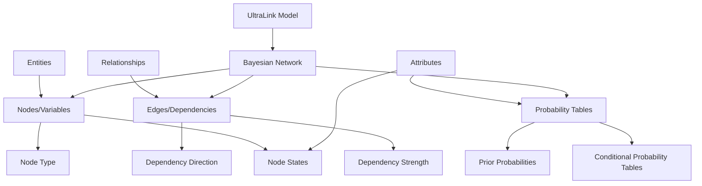
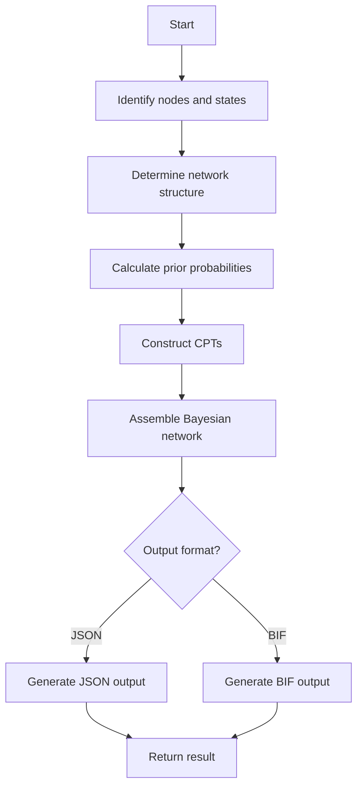

# Bayesian Network Format for UltraLink

This document details the Bayesian Network rendering target for UltraLink, its structure, usage, and connection to the UltraLink data model.

> **Related Documentation**:
> - [Overview of Rendering Targets](./rendering_targets.md)
> - [Format Selection Guide](../guides/choosing-format.md)
> - [JSON Format](./json_format.md)
> - [KIF Format](./kif_format.md)

## Overview

The Bayesian Network export transforms UltraLink knowledge graphs into probabilistic graphical models, enabling causal reasoning, inference under uncertainty, and probabilistic analysis. This format represents entities as random variables and relationships as conditional dependencies, with conditional probability tables (CPTs) capturing the probabilistic relationships.

### Key Features

- **Probabilistic Representation**: Entities and relationships represented with probabilities
- **Causal Reasoning**: Support for causal inference and reasoning under uncertainty
- **Multiple Export Formats**: Support for JSON and BIF (Bayesian Interchange Format)
- **Conditional Dependencies**: Explicit modeling of conditional relationships
- **Compatibility**: Works with popular Bayesian network tools and libraries
- **Inferential Capabilities**: Enables answering what-if questions and making predictions
- **Uncertainty Modeling**: Represents degrees of belief and confidence levels

## Data Model Mapping

UltraLink's entity-relationship model maps to Bayesian network elements as follows:



### Entity to Node Mapping

Each UltraLink entity becomes a node (random variable) in the Bayesian network with:

1. A set of possible states (values the variable can take)
2. Type information (discrete, continuous, boolean)
3. Prior probability distribution (when no parents)
4. References to parent and child nodes

### Relationship to Edge Mapping

UltraLink relationships become edges (conditional dependencies) in the Bayesian network with:

1. Direction indicating causal influence
2. Reference to source and target nodes
3. Strength of influence encoded in conditional probability tables
4. Optional meta-information about the dependency type

## Usage

The Bayesian Network exporter is implemented in [src/lib/exporters/bayesian-network.js](../src/lib/exporters/bayesian-network.js) and can be used as follows:

```javascript
// Basic export to Bayesian Network
const bayesianNetwork = ultralink.toBayesianNetwork();

// Export with specific options
const customBayesianNetwork = ultralink.toBayesianNetwork({
  outputFormat: 'bif',  // Options: 'json', 'bif'
  includeParameters: true,
  nodeTypeMapping: {
    'person': 'discrete',
    'event': 'discrete'
  },
  defaultStates: {
    'default': ['true', 'false'],
    'event': ['occurred', 'not_occurred'],
    'person': ['present', 'absent']
  }
});
```

### Export Options

| Option | Type | Default | Description |
|--------|------|---------|-------------|
| `outputFormat` | String | `'json'` | Output format: 'json' or 'bif' (Bayesian Interchange Format) |
| `includeParameters` | Boolean | `true` | Include parameter estimation details |
| `nodeTypeMapping` | Object | `{}` | Map entity types to node types |
| `defaultStates` | Object | `{}` | Default states for different node types |
| `includeMetadata` | Boolean | `true` | Include metadata in the output |
| `inferProbabilities` | Boolean | `true` | Automatically infer probabilities from data |
| `stateMapping` | Function | `null` | Custom function for mapping attributes to states |
| `probabilityFunction` | Function | `null` | Custom function for calculating probabilities |

## Output Formats

### JSON Format

The JSON output represents the Bayesian network in a structured format:

```json
{
  "nodes": {
    "saguaro": {
      "id": "saguaro",
      "type": "organism",
      "states": ["true", "false"],
      "cpt": {
        "true": 0.5,
        "false": 0.5
      },
      "parents": [],
      "children": ["ecosystem_health"]
    },
    "aridity": {
      "id": "aridity",
      "type": "environmental_factor",
      "states": ["high", "medium", "low"],
      "cpt": {
        "high": 0.3,
        "medium": 0.4,
        "low": 0.3
      },
      "parents": [],
      "children": ["saguaro_survival"]
    },
    "saguaro_survival": {
      "id": "saguaro_survival",
      "type": "outcome",
      "states": ["high", "medium", "low"],
      "cpt": {
        "aridity=high": {
          "high": 0.1,
          "medium": 0.3,
          "low": 0.6
        },
        "aridity=medium": {
          "high": 0.4,
          "medium": 0.5,
          "low": 0.1
        },
        "aridity=low": {
          "high": 0.8,
          "medium": 0.2,
          "low": 0.0
        }
      },
      "parents": ["aridity"],
      "children": []
    },
    "ecosystem_health": {
      "id": "ecosystem_health",
      "type": "concept",
      "states": ["good", "fair", "poor"],
      "cpt": {
        "saguaro=true": {
          "good": 0.7,
          "fair": 0.2,
          "poor": 0.1
        },
        "saguaro=false": {
          "good": 0.1,
          "fair": 0.3,
          "poor": 0.6
        }
      },
      "parents": ["saguaro"],
      "children": []
    }
  },
  "metadata": {
    "created": "2023-06-15T10:30:00Z",
    "nodeCount": 4,
    "parameters": {
      "inferenceMethod": "maximum_likelihood",
      "priorType": "uniform",
      "smoothingFactor": 0.01
    }
  }
}
```

### BIF Format (Bayesian Interchange Format)

The BIF output provides an XML-based format widely used in Bayesian network tools:

```xml
<?xml version="1.0"?>
<BIF VERSION="0.3">
<NETWORK>
<NAME>Desert Ecosystem</NAME>

<VARIABLE TYPE="discrete">
    <NAME>saguaro</NAME>
    <OUTCOME>true</OUTCOME>
    <OUTCOME>false</OUTCOME>
    <PROPERTY>type = organism</PROPERTY>
</VARIABLE>

<VARIABLE TYPE="discrete">
    <NAME>aridity</NAME>
    <OUTCOME>high</OUTCOME>
    <OUTCOME>medium</OUTCOME>
    <OUTCOME>low</OUTCOME>
    <PROPERTY>type = environmental_factor</PROPERTY>
</VARIABLE>

<VARIABLE TYPE="discrete">
    <NAME>saguaro_survival</NAME>
    <OUTCOME>high</OUTCOME>
    <OUTCOME>medium</OUTCOME>
    <OUTCOME>low</OUTCOME>
    <PROPERTY>type = outcome</PROPERTY>
</VARIABLE>

<VARIABLE TYPE="discrete">
    <NAME>ecosystem_health</NAME>
    <OUTCOME>good</OUTCOME>
    <OUTCOME>fair</OUTCOME>
    <OUTCOME>poor</OUTCOME>
    <PROPERTY>type = concept</PROPERTY>
</VARIABLE>

<DEFINITION>
    <FOR>saguaro</FOR>
    <TABLE>0.5 0.5</TABLE>
</DEFINITION>

<DEFINITION>
    <FOR>aridity</FOR>
    <TABLE>0.3 0.4 0.3</TABLE>
</DEFINITION>

<DEFINITION>
    <FOR>saguaro_survival</FOR>
    <GIVEN>aridity</GIVEN>
    <TABLE>0.1 0.3 0.6 0.4 0.5 0.1 0.8 0.2 0.0</TABLE>
</DEFINITION>

<DEFINITION>
    <FOR>ecosystem_health</FOR>
    <GIVEN>saguaro</GIVEN>
    <TABLE>0.7 0.2 0.1 0.1 0.3 0.6</TABLE>
</DEFINITION>

</NETWORK>
</BIF>
```

## Semantic Preservation

The Bayesian Network format preserves UltraLink semantics in the following way:

| UltraLink Semantic | Bayesian Network Representation |
|--------------------|----------------------------------|
| Entity identity | Node ID |
| Entity type | Node property |
| Entity attributes | Node states or separate nodes |
| Relationship | Directed edge (conditional dependency) |
| Relationship type | Edge property |
| Relationship direction | Parent-child relationship |
| Relationship strength | Conditional probability values |
| Uncertainty | Probability distributions |

## Technical Implementation

The Bayesian Network export functionality is implemented in [src/lib/exporters/bayesian-network.js](../src/lib/exporters/bayesian-network.js). The exporter follows these steps:

1. Identify nodes (entities) and their possible states
2. Determine parent-child relationships from UltraLink relationships
3. Calculate prior probabilities for root nodes (nodes without parents)
4. Construct conditional probability tables (CPTs) for child nodes
5. Assemble the complete Bayesian network structure
6. Format the output according to the chosen format (JSON or BIF)



## Probabilistic Inference

One of the key advantages of the Bayesian Network format is support for probabilistic inference:

### Types of Inference

1. **Prediction**: Calculate the probability of outcomes given evidence
2. **Diagnosis**: Determine the likely causes given observed effects
3. **Intervention**: Predict the effect of actively changing variables
4. **Counterfactuals**: Reason about what would have happened under different conditions

### Example Inference Queries

Using the Bayesian network:

```javascript
// Example with a Bayesian network library (pseudocode)
const bn = BayesianNetwork.fromFile('desert-ecosystem.json');

// Prediction: What's the probability of good ecosystem health?
const prediction = bn.query('ecosystem_health');
// Result: { good: 0.4, fair: 0.25, poor: 0.35 }

// Diagnosis: If ecosystem health is poor, what's the likely state of aridity?
const diagnosis = bn.query('aridity', { ecosystem_health: 'poor' });
// Result: { high: 0.7, medium: 0.25, low: 0.05 }

// Intervention: If we control aridity to be low, what happens to saguaro survival?
const intervention = bn.doIntervention('saguaro_survival', { aridity: 'low' });
// Result: { high: 0.8, medium: 0.2, low: 0.0 }
```

## Integration with Bayesian Network Tools

The exported Bayesian networks can be used with various tools:

### GeNIe/SMILE

1. Export your UltraLink data to BIF format
2. Open GeNIe and select "File → Open"
3. Choose the .bif file
4. Use GeNIe's interface to visualize and analyze the network
5. Perform inference, sensitivity analysis, and more

### HUGIN

1. Export your UltraLink data to BIF format
2. Open HUGIN and select "File → Load Network"
3. Choose the .bif file
4. Work with the network in HUGIN's environment
5. Use HUGIN's reasoning tools for various inference tasks

### Python with pgmpy

```python
from pgmpy.readwrite import BIFReader
from pgmpy.inference import VariableElimination

# Load the Bayesian network from BIF file
reader = BIFReader("desert-ecosystem.bif")
model = reader.get_model()

# Set up inference algorithm
inference = VariableElimination(model)

# Perform inference
result = inference.query(variables=['ecosystem_health'], evidence={'saguaro': 'true'})
print(result)
```

### JavaScript with jsbayes

```javascript
// Load the Bayesian network from JSON file
fetch('desert-ecosystem.json')
  .then(response => response.json())
  .then(data => {
    // Convert to jsbayes format (simplified example)
    const graph = jsbayes.newGraph();
    
    // Add nodes
    const nodes = {};
    for (const [nodeId, nodeData] of Object.entries(data.nodes)) {
      nodes[nodeId] = graph.addNode(nodeId, nodeData.states);
    }
    
    // Add relationships
    for (const [nodeId, nodeData] of Object.entries(data.nodes)) {
      if (nodeData.parents.length > 0) {
        const node = nodes[nodeId];
        for (const parentId of nodeData.parents) {
          node.addParent(nodes[parentId]);
        }
        
        // Set conditional probabilities
        node.setCpt(...); // Set based on nodeData.cpt
      }
    }
    
    // Perform inference
    graph.sample(10000);
    const results = graph.node('ecosystem_health').probs();
    console.log(results);
  });
```

## Use Cases

The Bayesian Network format is particularly useful for:

1. **Risk Assessment**: Evaluating the probabilities of different outcomes
2. **Decision Support**: Providing probabilistic guidance for decisions
3. **Causal Analysis**: Understanding cause-and-effect relationships
4. **Scenario Planning**: Exploring what-if scenarios with probabilities
5. **Knowledge Integration**: Combining expert knowledge with data
6. **Diagnostic Systems**: Building systems that reason about causes from effects
7. **Uncertainty Modeling**: Explicitly representing and reasoning with uncertainty

## Transforming UltraLink Attributes to Probabilities

The process of converting UltraLink attributes to probability distributions involves:

### Boolean Attributes

Simple boolean attributes are mapped directly to binary states:

```javascript
// Boolean attribute mapping
function mapBooleanAttribute(entity, attributeName) {
  const value = entity.attributes[attributeName];
  if (typeof value === 'boolean') {
    return value ? 1.0 : 0.0;
  }
  return 0.5; // Default for unknown
}
```

### Numeric Attributes

Numeric attributes can be discretized and mapped to probability distributions:

```javascript
// Numeric attribute mapping
function mapNumericAttribute(entity, attributeName, bins = ['low', 'medium', 'high']) {
  const value = parseFloat(entity.attributes[attributeName]);
  if (isNaN(value)) return null;
  
  // Simple discretization example
  if (value < 0.33) return { low: 1.0, medium: 0.0, high: 0.0 };
  if (value < 0.66) return { low: 0.0, medium: 1.0, high: 0.0 };
  return { low: 0.0, medium: 0.0, high: 1.0 };
}
```

### Categorical Attributes

Categorical attributes are mapped to discrete states:

```javascript
// Categorical attribute mapping
function mapCategoricalAttribute(entity, attributeName, possibleValues) {
  const value = entity.attributes[attributeName];
  const distribution = {};
  
  for (const possibleValue of possibleValues) {
    distribution[possibleValue] = value === possibleValue ? 1.0 : 0.0;
  }
  
  return distribution;
}
```

## Relationship Strength to Conditional Probability

Relationship attributes can be used to determine conditional probabilities:

```javascript
// Relationship strength to CPT mapping
function relationshipToCPT(relationship, sourceStates, targetStates) {
  const efficiency = parseFloat(relationship.attributes.efficiency || 0.5);
  const cpt = {};
  
  for (const sourceState of sourceStates) {
    cpt[`${relationship.source}=${sourceState}`] = {};
    
    for (const targetState of targetStates) {
      // Example logic - actual implementation would be more sophisticated
      if (sourceState === 'true' && targetState === 'high') {
        cpt[`${relationship.source}=${sourceState}`][targetState] = efficiency;
      } else if (sourceState === 'true' && targetState === 'medium') {
        cpt[`${relationship.source}=${sourceState}`][targetState] = (1 - efficiency) * 0.6;
      } else if (sourceState === 'true' && targetState === 'low') {
        cpt[`${relationship.source}=${sourceState}`][targetState] = (1 - efficiency) * 0.4;
      } else if (sourceState === 'false' && targetState === 'high') {
        cpt[`${relationship.source}=${sourceState}`][targetState] = 0.1;
      } else if (sourceState === 'false' && targetState === 'medium') {
        cpt[`${relationship.source}=${sourceState}`][targetState] = 0.3;
      } else {
        cpt[`${relationship.source}=${sourceState}`][targetState] = 0.6;
      }
    }
  }
  
  return cpt;
}
```

## Related Formats

- **[KIF Format](./kif_format.md)**: Formal logic representation with support for probabilistic statements
- **[JSON Format](./json_format.md)**: Basic data structure that can be transformed into Bayesian networks
- **[Visualization Format](./visualization_format.md)**: Can visualize the structure of Bayesian networks

## Limitations

The Bayesian Network format has certain limitations:

- Requires discretization of continuous variables
- Complex to specify conditional probabilities for nodes with many parents
- Inference can be computationally expensive for large networks
- Requires expert knowledge to define appropriate probability distributions
- Limited ability to represent dynamic or temporal relationships
- Struggles with cycles in the original UltraLink graph

## Future Enhancements

Planned improvements to the Bayesian Network exporter include:

- Support for dynamic Bayesian networks to model temporal relationships
- Integration with automatic parameter learning from data
- Support for utility nodes and decision theory constructs
- Improved handling of continuous variables
- Support for factor graph representations
- Enhanced probability estimation methods
- Interactive Bayesian network builder interface 