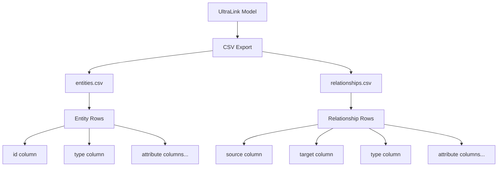
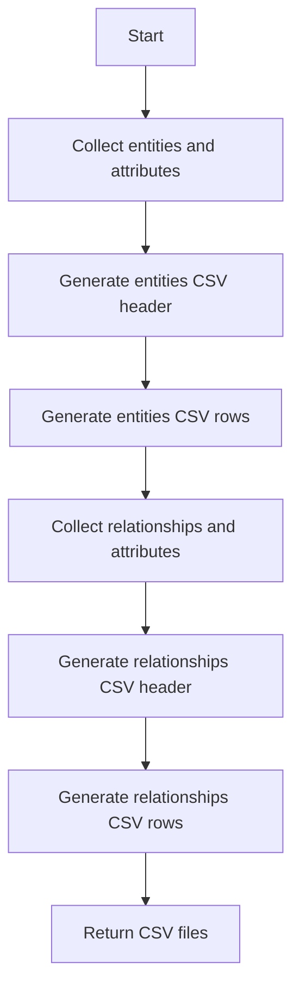
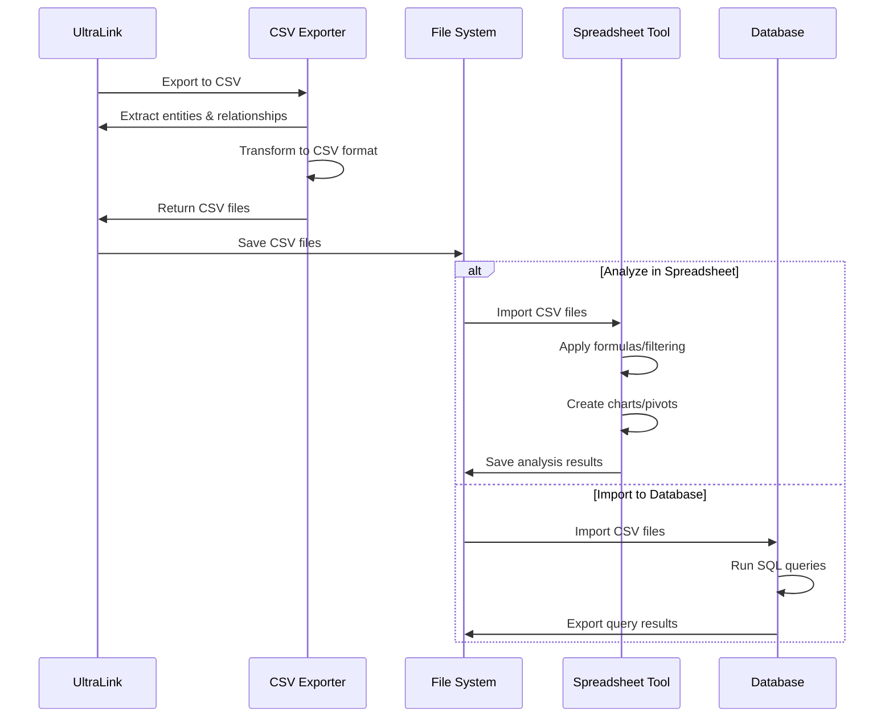

# CSV Format for UltraLink

This document details the CSV rendering target for UltraLink, its structure, usage, and connection to the UltraLink data model.

> **Related Documents**: 
> - [Overview of Rendering Targets](./RENDERING_TARGETS.md)
> - [Implementation in src/lib/exporters/csv.js](../src/lib/exporters/csv.js)
> - [JSON Format](./JSON_FORMAT.md)

## Overview

CSV (Comma-Separated Values) is a simple tabular format for representing data. UltraLink's CSV export provides an easy way to analyze UltraLink data in spreadsheet applications, statistical tools, and databases.

### Key Features

- **Universal Tool Support**: Works with Excel, Google Sheets, database systems, etc.
- **Tabular Structure**: Represents entities and relationships in familiar rows and columns
- **Data Analysis Ready**: Prepared for statistical analysis and data manipulation
- **Import/Export Friendly**: Easy to import into other systems or export from UltraLink
- **Human Readable**: Text-based format that's easy to understand and modify

## Data Model Mapping

Due to CSV's tabular nature, UltraLink data is mapped to two separate CSV files:



### Entity CSV Structure

The entities CSV file contains one row per entity, with columns for:
- ID
- Type
- All entity attributes

### Relationship CSV Structure

The relationships CSV file contains one row per relationship, with columns for:
- Source entity ID
- Target entity ID
- Relationship type
- All relationship attributes

## Usage

The CSV exporter is implemented in [src/lib/exporters/csv.js](../src/lib/exporters/csv.js) and can be used as follows:

```javascript
// Basic export to CSV
const csv = ultralink.toCSV();

// Export with specific options
const csvWithMetadata = ultralink.toCSV({
  includeMetadata: true,
  delimiter: ','
});

// Accessing the separate CSV files
const entitiesCSV = csv.entities;
const relationshipsCSV = csv.relationships;
```

### Export Options

| Option | Type | Default | Description |
|--------|------|---------|-------------|
| `includeMetadata` | Boolean | `false` | Include creation and modification timestamps |
| `delimiter` | String | `,` | Character used to separate values |
| `includeHeader` | Boolean | `true` | Include header row with column names |
| `attributeFilter` | Function | `null` | Custom function to filter which attributes to include |

## Complete Example

An example of the CSV export:

### entities.csv:

```csv
id,type,name,scientificName,height,lifespan,description,annualRainfall
saguaro,organism,Saguaro Cactus,Carnegiea gigantea,15-50 feet,150-200 years,,
kangaroo-rat,organism,Kangaroo Rat,Dipodomys,,,nocturnal desert rodent,
aridity,environmental_factor,Aridity,,,,"Extremely dry conditions with minimal rainfall",3-15 inches
```

### relationships.csv:

```csv
source,target,type,mechanism,efficiency,proximity,interaction_frequency
saguaro,aridity,adapts_to,Water storage in stem,0.95,,
kangaroo-rat,aridity,adapts_to,Metabolic water production,0.88,,
kangaroo-rat,saguaro,shares_habitat,,,close,occasional
```

### With Metadata (When includeMetadata is true):

#### entities_with_metadata.csv:

```csv
id,type,name,scientificName,height,lifespan,description,annualRainfall,created,modified
saguaro,organism,Saguaro Cactus,Carnegiea gigantea,15-50 feet,150-200 years,,,2023-06-15T10:30:00Z,2023-06-15T10:30:00Z
kangaroo-rat,organism,Kangaroo Rat,Dipodomys,,,nocturnal desert rodent,,2023-06-15T10:31:00Z,2023-06-15T10:31:00Z
aridity,environmental_factor,Aridity,,,,"Extremely dry conditions with minimal rainfall",3-15 inches,2023-06-15T10:32:00Z,2023-06-15T10:32:00Z
```

#### relationships_with_metadata.csv:

```csv
source,target,type,mechanism,efficiency,proximity,interaction_frequency,created,modified
saguaro,aridity,adapts_to,Water storage in stem,0.95,,,2023-06-15T10:35:00Z,2023-06-15T10:35:00Z
kangaroo-rat,aridity,adapts_to,Metabolic water production,0.88,,,2023-06-15T10:36:00Z,2023-06-15T10:36:00Z
kangaroo-rat,saguaro,shares_habitat,,,close,occasional,2023-06-15T10:37:00Z,2023-06-15T10:37:00Z
```

## Semantic Preservation

The CSV format preserves UltraLink semantics through its tabular structure:

| UltraLink Semantic | CSV Representation |
|--------------------|-------------------|
| Entity identity | `id` column in entities.csv |
| Entity type | `type` column in entities.csv |
| Entity attributes | Individual columns in entities.csv |
| Relationship | Row in relationships.csv |
| Relationship type | `type` column in relationships.csv |
| Relationship direction | `source` and `target` columns in relationships.csv |
| Relationship attributes | Individual columns in relationships.csv |

## Technical Implementation

The CSV export functionality is implemented in [src/lib/exporters/csv.js](../src/lib/exporters/csv.js). The exporter follows these steps:

1. Extract all entities and collect all unique attribute names
2. Create header row with id, type, and all attribute names
3. Create entity rows with values for each attribute
4. Extract all relationships and collect all unique attribute names
5. Create header row with source, target, type, and all attribute names
6. Create relationship rows with values for each attribute
7. Return both CSV files as strings



## Data Analysis Workflow

The typical workflow for analyzing UltraLink data using CSV:



## Use Cases

The CSV format is particularly useful for:

1. **Data Analysis**: Statistical analysis and data manipulation
2. **Spreadsheet Operations**: Filtering, sorting, and calculations
3. **Database Import**: Importing UltraLink data into database systems
4. **Data Transformation**: Converting between different data formats
5. **Reporting**: Creating reports from UltraLink data
6. **Data Validation**: Checking data quality and consistency

## Spreadsheet Analysis

CSV exports are particularly useful for spreadsheet analysis:

### Entity Analysis in Spreadsheets

- Count entities by type using pivot tables
- Filter entities by attribute values
- Sort entities based on numeric properties
- Create charts of entity distribution
- Perform calculations on entity attributes

### Relationship Analysis in Spreadsheets

- Count relationships by type
- Identify most connected entities
- Calculate relationship statistics
- Filter relationships by attributes
- Create network matrices

## Database Integration

CSV exports facilitate UltraLink data integration with databases:

### SQL Queries on UltraLink Data

Once imported into a database, you can run SQL queries like:

```sql
-- Find entities with specific attributes
SELECT id, name, scientificName 
FROM entities 
WHERE type = 'organism';

-- Count relationships by type
SELECT type, COUNT(*) as count
FROM relationships
GROUP BY type;

-- Find entities connected to a specific entity
SELECT e.id, e.name
FROM entities e
JOIN relationships r ON e.id = r.source
WHERE r.target = 'aridity';

-- Complex relationship analysis
SELECT e1.name as source_name, e2.name as target_name, r.type
FROM relationships r
JOIN entities e1 ON r.source = e1.id
JOIN entities e2 ON r.target = e2.id
WHERE r.efficiency > 0.9;
```

## Related Formats

CSV is related to these other UltraLink export formats:

- **[JSON](./JSON_FORMAT.md)**: More hierarchical representation of the same data
- **[GraphML](./GRAPHML_FORMAT.md)**: Graph representation that can be generated from CSV data
- **[Obsidian](./OBSIDIAN_FORMAT.md)**: Knowledge management format that can reference CSV exports

## Limitations

CSV has certain limitations to be aware of:

- Flat structure that cannot directly represent hierarchical data
- Limited support for complex data types
- No native support for relationships (hence the need for two files)
- Potential issues with text containing the delimiter character
- No standardized schema information
- No support for vector embeddings

## Future Enhancements

Planned improvements to the CSV exporter include:

- Support for custom column ordering
- Additional CSV formats (e.g., TSV, semi-colon delimited)
- Entity-relationship joined views
- CSV import functionality
- Schema definitions export
- Support for additional metadata columns 