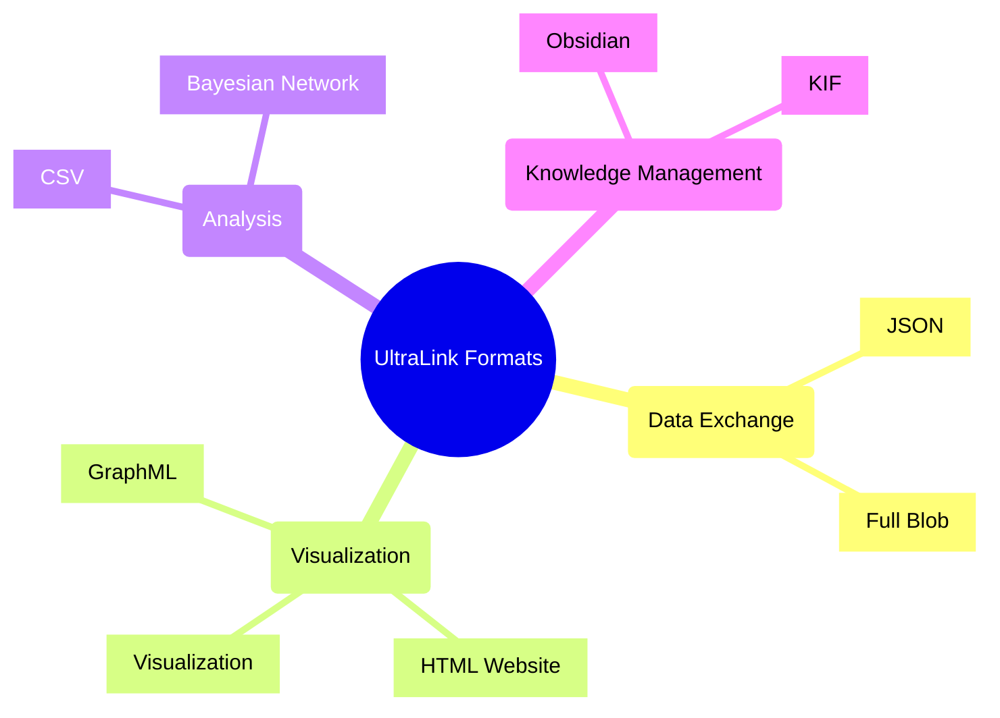
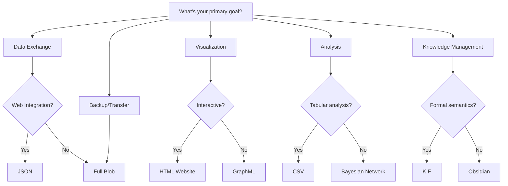
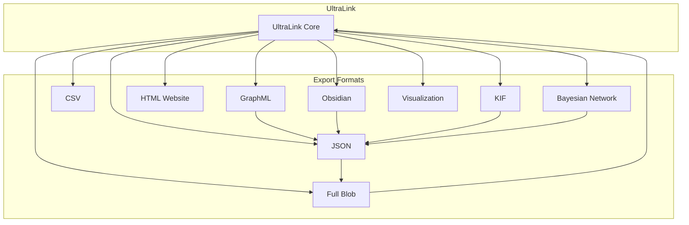

# UltraLink Format Ecosystem

## Overview

UltraLink provides a comprehensive suite of export formats designed to address different use cases, integration scenarios, and analytical approaches. This document provides a high-level overview of the UltraLink format ecosystem, helping users select the most appropriate format for their needs.

## Format Selection Guide

## Format Interoperability Matrix

## Usage Patterns

### 1. Research and Analytics Pipeline

1. Export to **JSON** for initial data exchange
2. Convert to **CSV** for statistical analysis in R or Python
3. Generate **Bayesian Network** for probabilistic modeling
4. Create **HTML Website** for sharing insights

### 2. Knowledge Management Workflow

1. Export to **Obsidian** for human-friendly documentation
2. Generate **KIF** for formal knowledge representation
3. Create **GraphML** for visual relationship mapping
4. Use **Full Blob** for versioned backups

### 3. Integration Architecture

1. Use **JSON** as the integration hub format
2. Convert to **GraphML** for network analysis tools
3. Export to **KIF** for AI reasoning systems
4. Generate **CSV** for business intelligence tools

### RxInfer.jl Format

RxInfer.jl format converts UltraLink knowledge graphs to Julia code using the RxInfer.jl `@model` macro syntax for Bayesian inference through factor graphs and reactive programming.

**Key uses:**
- Probabilistic modeling with factor graphs
- Reactive Bayesian inference
- Message passing algorithms
- Dynamic belief updating
- Uncertainty quantification

**Primary Consumers:** Julia programmers, researchers working with Bayesian models, probabilistic programming enthusiasts

## Implementation Notes

When implementing export format support in your applications:

1. **Modularity**: UltraLink's exporters are designed as modular components that can be used independently
2. **Format Conversion**: Use UltraLink's converters to transform between formats when needed
3. **Selective Export**: Many formats support selective export of specific entities or attributes
4. **Validation**: Validate outputs against format-specific schemas or requirements
5. **Round-Trip Consistency**: Test for data consistency when round-tripping through different formats

## Future Format Directions

UltraLink's format ecosystem continues to evolve, with planned support for:

1. **JSON-LD**: For enhanced semantic web integration
2. **RDF/OWL**: For standardized ontology representation
3. **SHACL/ShEx**: For graph validation and constraints
4. **CYPHER/Gremlin**: For direct graph database queries
5. **Vector Database Formats**: For embedding-based search and analysis

## Format-Specific Documentation

For detailed information on each format, see the following documents:

- [JSON Format](./JSON_FORMAT.md)
- [GraphML Format](./GRAPHML_FORMAT.md)
- [CSV Format](./CSV_FORMAT.md)
- [Obsidian Format](./OBSIDIAN_FORMAT.md)
- [HTML Website Format](./HTML_WEBSITE_FORMAT.md)
- [Bayesian Network Format](./BAYESIAN_NETWORK_FORMAT.md)
- [Knowledge Interchange Format (KIF)](./KIF_FORMAT.md)
- [Full Blob Format](./FULL_BLOB_FORMAT.md)
- [Visualization Format](./VISUALIZATION_FORMAT.md) 