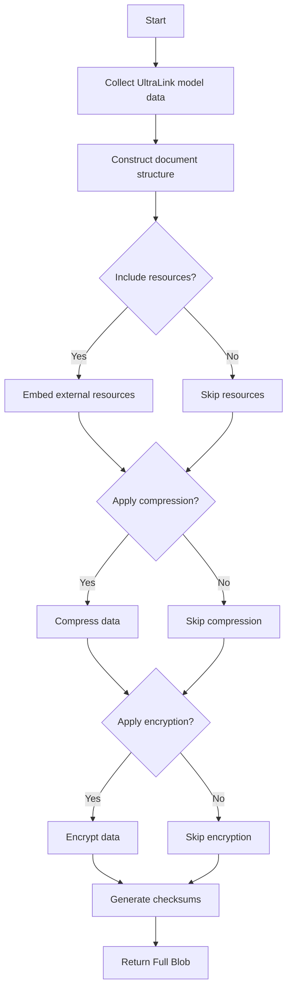

# Full Blob Format for UltraLink

This document details the Full Blob rendering target for UltraLink, its structure, usage, and connection to the UltraLink data model.

> **Related Documents**: 
> - [Overview of Rendering Targets](./RENDERING_TARGETS.md)
> - [Implementation in src/lib/exporters/full-blob.js](../src/lib/exporters/full-blob.js)
> - [JSON Format](./JSON_FORMAT.md)

## Overview

The Full Blob format serves as the comprehensive serialization format for UltraLink, preserving the complete state of a knowledge graph including all metadata, revision history, comments, user annotations, styling information, and extended properties. This format is designed for full-fidelity storage and migration between UltraLink instances, ensuring no information is lost during transfer or archiving.

### Key Features

- **Complete Preservation**: Stores the entire UltraLink model without any data loss
- **Revision History**: Maintains the full editing history of every entity and relationship
- **User Annotations**: Preserves comments, notes, and user-specific annotations
- **Styling Information**: Retains all visual styling and display preferences
- **Metadata**: Includes creation dates, modification timestamps, and authorship information
- **Import/Export**: Designed for seamless migration between UltraLink instances
- **Archival Quality**: Suitable for long-term storage and knowledge preservation
- **Self-Contained**: All dependencies and referenced resources are embedded in the blob
- **Extensible**: Accommodates future UltraLink features without breaking compatibility

## Data Model Mapping

The Full Blob format is a direct serialization of the UltraLink internal model:

```mermaid
graph TD
    A[UltraLink Model] --> B[Full Blob]
    
    B --> C[Core Data]
    B --> D[Metadata]
    B --> E[History]
    B --> F[Styling]
    B --> G[User Annotations]
    B --> H[Resources]
    B --> I[Extensions]
    
    C --> C1[Entities]
    C --> C2[Relationships]
    C --> C3[Attributes]
    
    D --> D1[Creation Info]
    D --> D2[Modification Info]
    D --> D3[Authorship]
    D --> D4[Version]
    
    E --> E1[Change Log]
    E --> E2[Snapshots]
    E --> E3[Edit Operations]
    
    F --> F1[Entity Styles]
    F --> F2[Relationship Styles]
    F --> F3[View Settings]
    F --> F4[Layout Information]
    
    G --> G1[Comments]
    G --> G2[Notes]
    G --> G3[Tags]
    G --> G4[User-Specific Views]
    
    H --> H1[Embedded Images]
    H --> H2[Documents]
    H --> H3[External References]
    
    I --> I1[Plugin Data]
    I --> I2[Custom Extensions]
```



## Usage

The Full Blob exporter is implemented in [src/lib/exporters/full-blob.js](../src/lib/exporters/full-blob.js) and can be used as follows:

```javascript
// Export complete UltraLink graph to Full Blob format
const fullBlob = ultralink.toFullBlob();

// Export with specific options
const customBlob = ultralink.toFullBlob({
  includeHistory: true,
  compressionLevel: 9,
  encryptionKey: 'optional-encryption-key',
  includeResources: true,
  prettyPrint: false,
  includeComments: true
});

// Save to file
fs.writeFileSync('knowledge-graph.ulblob', fullBlob);

// Import from Full Blob
const importedGraph = UltraLink.fromFullBlob(blobData);
```

### Export Options

| Option | Type | Default | Description |
|--------|------|---------|-------------|
| `includeHistory` | Boolean | `true` | Include full revision history |
| `compressionLevel` | Number | `6` | Compression level (0-9, 0 = none, 9 = max) |
| `encryptionKey` | String | `null` | Optional encryption key for sensitive data |
| `includeResources` | Boolean | `true` | Embed external resources (images, etc.) |
| `prettyPrint` | Boolean | `false` | Format output for readability (increases size) |
| `includeComments` | Boolean | `true` | Include user comments and annotations |
| `includeUserInfo` | Boolean | `true` | Include user identity information |
| `minimizeSize` | Boolean | `false` | Optimize for minimum file size (overrides prettyPrint) |
| `includeExtensionData` | Boolean | `true` | Include custom extension/plugin data |
| `metadataLevel` | String | `'full'` | Metadata detail level: 'minimal', 'standard', 'full' |

## File Format

The Full Blob format is structured as follows:

```json
{
  "format": "ultralink-full-blob",
  "version": "1.0",
  "compression": "gzip",
  "encryption": "aes-256-gcm",
  "checksum": "sha256:e3b0c44298fc1c149afbf4c8996fb92427ae41e4649b934ca495991b7852b855",
  "metadata": {
    "created": "2023-06-15T10:30:00Z",
    "modified": "2023-06-16T14:22:15Z",
    "creator": {
      "id": "user:12345",
      "name": "John Doe",
      "email": "john@example.com"
    },
    "title": "Desert Ecosystem Knowledge Graph",
    "description": "Comprehensive knowledge graph of Sonoran Desert ecosystem",
    "tags": ["ecology", "desert", "biodiversity"],
    "version": "1.3.2",
    "applicationVersion": "UltraLink 2.1.0"
  },
  "stats": {
    "entityCount": 156,
    "relationshipCount": 423,
    "attributeCount": 1892,
    "historyEntryCount": 327,
    "commentCount": 42,
    "resourceCount": 15
  },
  "core": {
    "entities": {
      "entity-uuid-1": {
        "id": "entity-uuid-1",
        "type": "organism",
        "label": "Saguaro Cactus",
        "attributes": {
          "scientificName": "Carnegiea gigantea",
          "height": 12,
          "lifespan": 200,
          "endangered": false
        },
        "created": "2023-06-10T08:15:00Z",
        "modified": "2023-06-12T11:30:00Z",
        "createdBy": "user:12345"
      },
      // More entities...
    },
    "relationships": {
      "rel-uuid-1": {
        "id": "rel-uuid-1",
        "type": "lives-in",
        "source": "entity-uuid-1",
        "target": "entity-uuid-2",
        "attributes": {
          "since": "prehistoric-times",
          "endemic": true
        },
        "created": "2023-06-10T09:20:00Z",
        "modified": "2023-06-10T09:20:00Z",
        "createdBy": "user:12345"
      },
      // More relationships...
    }
  },
  "styling": {
    "entities": {
      "entity-uuid-1": {
        "color": "#8BC34A",
        "size": 1.2,
        "icon": "cactus",
        "visible": true,
        "position": { "x": 120, "y": 85 }
      },
      // More entity styles...
    },
    "relationships": {
      "rel-uuid-1": {
        "color": "#795548",
        "thickness": 2,
        "style": "solid",
        "label": true
      },
      // More relationship styles...
    },
    "viewSettings": {
      "layout": "force-directed",
      "theme": "desert",
      "showLabels": true,
      "groupClusters": true
    }
  },
  "history": {
    "changeLog": [
      {
        "timestamp": "2023-06-10T08:15:00Z",
        "userId": "user:12345",
        "operation": "create",
        "target": "entity",
        "targetId": "entity-uuid-1",
        "data": { /* Entity data at creation */ }
      },
      {
        "timestamp": "2023-06-12T11:30:00Z",
        "userId": "user:12345",
        "operation": "update",
        "target": "entity",
        "targetId": "entity-uuid-1",
        "changes": {
          "attributes.height": {
            "from": 10,
            "to": 12
          }
        }
      },
      // More history entries...
    ],
    "snapshots": {
      "2023-06-10T12:00:00Z": { /* Complete graph state snapshot */ },
      "2023-06-15T18:00:00Z": { /* Complete graph state snapshot */ }
    }
  },
  "annotations": {
    "comments": {
      "comment-uuid-1": {
        "id": "comment-uuid-1",
        "userId": "user:12345",
        "timestamp": "2023-06-11T14:22:00Z",
        "target": "entity-uuid-1",
        "text": "This cactus species is foundational to the Sonoran Desert ecosystem",
        "resolved": false
      },
      // More comments...
    },
    "notes": {
      "note-uuid-1": {
        "id": "note-uuid-1",
        "userId": "user:12345",
        "timestamp": "2023-06-13T09:45:00Z",
        "text": "Need to verify the average lifespan data from recent research",
        "context": {
          "entity": "entity-uuid-1",
          "attribute": "lifespan"
        }
      },
      // More notes...
    },
    "tags": {
      "entity-uuid-1": ["keystone-species", "protected", "research-subject"],
      // More entity tags...
    }
  },
  "resources": {
    "resource-uuid-1": {
      "id": "resource-uuid-1",
      "type": "image/jpeg",
      "filename": "saguaro-cactus.jpg",
      "data": "base64:...", // Base64 encoded binary data
      "referencedBy": ["entity-uuid-1"],
      "metadata": {
        "width": 1200,
        "height": 800,
        "author": "Jane Smith",
        "license": "CC BY 4.0"
      }
    },
    // More resources...
  },
  "extensions": {
    "spatial-mapping": {
      "version": "1.2.0",
      "data": {
        "coordinateSystem": "WGS84",
        "entities": {
          "entity-uuid-1": {
            "longitude": -111.0678,
            "latitude": 32.2226,
            "elevation": 720
          },
          // More entity coordinates...
        }
      }
    },
    "timeline": {
      "version": "2.1.0",
      "data": {
        "events": [
          {
            "entityId": "entity-uuid-1",
            "timestamp": "1900-01-01T00:00:00Z",
            "event": "First documented by botanists"
          },
          // More timeline events...
        ]
      }
    }
  }
}
```

## Unique Features

The Full Blob format has several capabilities not present in other UltraLink export formats:

### Revision History

The history section captures every change made to the knowledge graph:

```json
"history": {
  "changeLog": [
    {
      "timestamp": "2023-06-10T08:15:00Z",
      "userId": "user:12345",
      "operation": "create",
      "target": "entity",
      "targetId": "entity-uuid-1",
      "data": { /* Entity data at creation */ }
    },
    {
      "timestamp": "2023-06-12T11:30:00Z",
      "userId": "user:12345",
      "operation": "update",
      "target": "entity",
      "targetId": "entity-uuid-1",
      "changes": {
        "attributes.height": {
          "from": 10,
          "to": 12
        }
      }
    }
  ]
}
```

This enables:
1. Complete audit trails of knowledge changes
2. Revision comparison and rollback functionality
3. Attribution of changes to specific users
4. Timeline visualization of knowledge evolution

### User Annotations

The annotations section preserves comments, notes, and tags:

```json
"annotations": {
  "comments": {
    "comment-uuid-1": {
      "id": "comment-uuid-1",
      "userId": "user:12345",
      "timestamp": "2023-06-11T14:22:00Z",
      "target": "entity-uuid-1",
      "text": "This cactus species is foundational to the Sonoran Desert ecosystem",
      "resolved": false
    }
  }
}
```

This supports:
1. Collaborative knowledge curation
2. Documentation of research notes
3. Knowledge validation processes
4. Questions and discussions about knowledge elements

### Resource Embedding

The resources section embeds external files and references:

```json
"resources": {
  "resource-uuid-1": {
    "id": "resource-uuid-1",
    "type": "image/jpeg",
    "filename": "saguaro-cactus.jpg",
    "data": "base64:...", // Base64 encoded binary data
    "referencedBy": ["entity-uuid-1"]
  }
}
```

This enables:
1. Self-contained knowledge repositories
2. Preservation of evidentiary materials
3. Visual documentation of entities
4. Inclusion of research papers and documents

### Extension Data

The extensions section accommodates plugin and extension data:

```json
"extensions": {
  "spatial-mapping": {
    "version": "1.2.0",
    "data": {
      "coordinateSystem": "WGS84",
      "entities": {
        "entity-uuid-1": {
          "longitude": -111.0678,
          "latitude": 32.2226,
          "elevation": 720
        }
      }
    }
  }
}
```

This supports:
1. Custom data structures from plugins
2. Domain-specific extensions
3. Future UltraLink features
4. Third-party integrations

## Compression and Encryption

The Full Blob format supports both compression and encryption to manage file size and security:

### Compression

```javascript
// High compression (smaller file, slower processing)
const compressedBlob = ultralink.toFullBlob({ 
  compressionLevel: 9,
  minimizeSize: true
});

// No compression (larger file, faster processing)
const uncompressedBlob = ultralink.toFullBlob({ 
  compressionLevel: 0
});
```

The compression process:
1. Optimizes repeated data patterns
2. Reduces string storage overhead
3. Applies GZIP or Deflate algorithms
4. Typically achieves 70-90% size reduction

### Encryption

```javascript
// Encrypt sensitive knowledge with AES-256
const encryptedBlob = ultralink.toFullBlob({ 
  encryptionKey: 'secret-passphrase',
  encryptionMethod: 'aes-256-gcm'
});

// Decrypt when importing
const decryptedGraph = UltraLink.fromFullBlob(encryptedBlob, {
  decryptionKey: 'secret-passphrase'
});
```

The encryption process:
1. Generates a secure initialization vector
2. Encrypts data with AES-256-GCM
3. Includes authentication tags to prevent tampering
4. Requires correct decryption key to access data

## Technical Implementation

The Full Blob export functionality is implemented in [src/lib/exporters/full-blob.js](../src/lib/exporters/full-blob.js). The exporter follows these steps:

1. Collect the complete UltraLink model including all metadata
2. Construct the multi-layer document structure
3. Embed referenced resources if enabled
4. Apply compression according to specified level
5. Apply encryption if a key is provided
6. Generate checksums for data integrity
7. Output the final blob data



## Import and Export Process

The complete cycle for using Full Blob format:

### Export Process

```javascript
// Create a new UltraLink graph
const ultralink = new UltraLink();
ultralink.addEntity({ id: 'saguaro', type: 'plant', label: 'Saguaro Cactus' });
ultralink.addEntity({ id: 'desert', type: 'ecosystem', label: 'Sonoran Desert' });
ultralink.addRelationship({
  source: 'saguaro',
  target: 'desert',
  type: 'inhabits'
});

// Export to Full Blob
const blob = ultralink.toFullBlob({
  includeHistory: true,
  compressionLevel: 6
});

// Save to file or database
fs.writeFileSync('ecosystem.ulblob', blob);
```

### Import Process

```javascript
// Load from file or database
const blobData = fs.readFileSync('ecosystem.ulblob');

// Import into new UltraLink instance
const importedGraph = UltraLink.fromFullBlob(blobData);

// Continue working with the graph
console.log(`Imported ${importedGraph.getEntityCount()} entities`);
console.log(`Imported ${importedGraph.getRelationshipCount()} relationships`);
```

## Use Cases

The Full Blob format is particularly useful for:

1. **Full System Backups**: Creating complete backups of UltraLink knowledge graphs
2. **Knowledge Migration**: Moving knowledge between different UltraLink instances
3. **Versioned Archives**: Storing milestone versions of evolving knowledge bases
4. **Offline Distribution**: Distributing complete knowledge graphs to offline users
5. **Secure Knowledge Sharing**: Sharing sensitive knowledge with encryption
6. **Edit History Preservation**: Maintaining complete editing history for academic attribution
7. **Legal Documentation**: Preserving knowledge graphs for legal or regulatory purposes
8. **Cold Storage**: Long-term archiving of knowledge assets

## Semantic Preservation

The Full Blob format preserves UltraLink semantics completely, retaining:

| UltraLink Component | Full Blob Representation |
|--------------------|--------------------------|
| Entity identity | Unique ID in entities map |
| Entity type | Type field in entity object |
| Entity attributes | Attributes map in entity object |
| Relationship | Object in relationships map |
| Relationship type | Type field in relationship object |
| Relationship direction | Source and target fields |
| Relationship attributes | Attributes map in relationship object |
| History | Complete change log |
| Annotations | Comments, notes, and tags sections |
| Visual styling | Styling section |

## Interoperability

While the Full Blob format is primarily for UltraLink-to-UltraLink transfers, it can be converted to other formats:

### Extracting Standard Formats

```javascript
// Load a Full Blob
const graph = UltraLink.fromFullBlob(blobData);

// Extract other formats
const jsonData = graph.toJSON();
const csvData = graph.toCSV();
const graphmlData = graph.toGraphML();
```

### Building Other Tools

The structured format allows developers to build tools that work directly with Full Blob data:

```javascript
// Example utility to extract history for an entity
function extractEntityHistory(blobData, entityId) {
  const blob = JSON.parse(blobData);
  return blob.history.changeLog.filter(entry => 
    entry.target === 'entity' && entry.targetId === entityId
  );
}

// Example utility to extract all comments
function extractComments(blobData) {
  const blob = JSON.parse(blobData);
  return blob.annotations.comments;
}
```

## Related Formats

The Full Blob format relates to these other UltraLink export formats:

- **[JSON Format](./JSON_FORMAT.md)**: Simplified representation without history or annotations
- **[GraphML Format](./GRAPHML_FORMAT.md)**: Standard graph format that can be extracted from Full Blob
- **[CSV Format](./CSV_FORMAT.md)**: Tabular representation that can be extracted from Full Blob

## Limitations

The Full Blob format has certain limitations:

- Larger file size than other formats due to completeness
- Requires UltraLink-compatible software for full utilization
- Complex structure requires more processing for import/export
- May contain sensitive information requiring careful management
- Not designed for interoperability with non-UltraLink systems
- Resource-intensive for very large knowledge graphs

## Future Enhancements

Planned improvements to the Full Blob format include:

- Streaming import/export for very large graphs
- Differential updates to minimize transfer sizes
- Enhanced encryption options including key rotation
- Multi-part blob support for extremely large graphs
- Cloud storage optimizations
- Selective partial exports
- Standardized extension framework
- Improved compression algorithms
- Digital signatures for authentication 