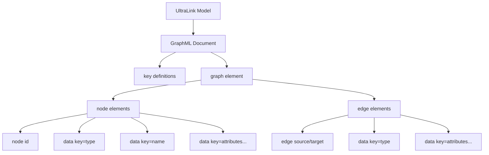
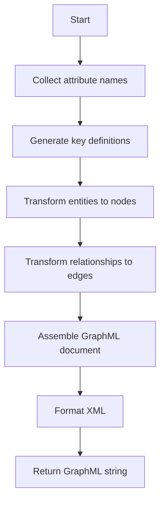
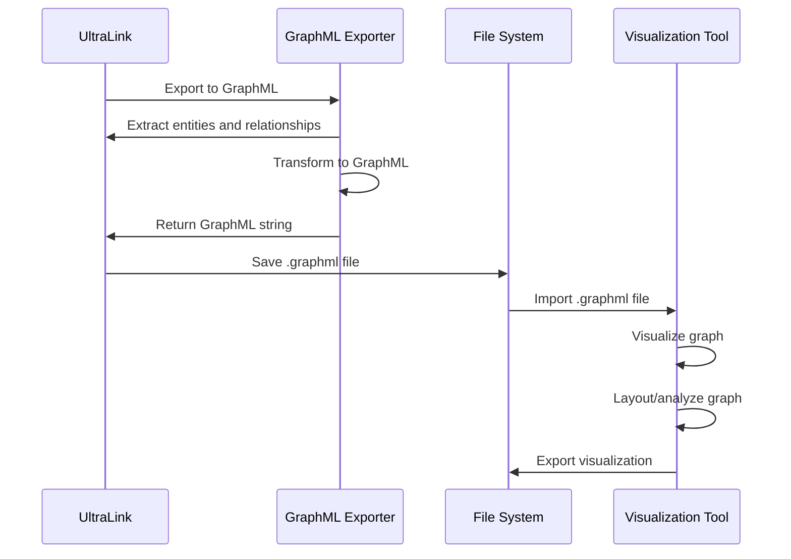

# GraphML Format for UltraLink

This document details the GraphML rendering target for UltraLink, its structure, usage, and connection to the UltraLink data model.

> **Related Documents**: 
> - [Overview of Rendering Targets](./RENDERING_TARGETS.md)
> - [Implementation in src/lib/exporters/graphml.js](../src/lib/exporters/graphml.js)
> - [JSON Format](./JSON_FORMAT.md)

## Overview

GraphML is an XML-based file format for graphs, widely used in graph visualization and analysis tools like Gephi, Cytoscape, and yEd. UltraLink's GraphML export facilitates visualization and network analysis of knowledge graphs.

### Key Features

- **Tool Compatibility**: Works with major graph visualization software
- **Structure Preservation**: Maintains the entity-relationship structure
- **Attribute Support**: Includes entity and relationship attributes
- **Visual Properties**: Can include visual styling information
- **XML Foundation**: Benefits from XML tools and validation

## Data Model Mapping

The UltraLink data model maps to GraphML as follows:



### Entity to Node Mapping

Each UltraLink entity becomes a GraphML node:

```xml
<node id="saguaro">
  <data key="type">organism</data>
  <data key="name">Saguaro Cactus</data>
  <data key="scientificName">Carnegiea gigantea</data>
  <data key="height">15-50 feet</data>
  <data key="lifespan">150-200 years</data>
</node>
```

### Relationship to Edge Mapping

Each UltraLink relationship becomes a GraphML edge:

```xml
<edge source="saguaro" target="aridity">
  <data key="type">adapts_to</data>
  <data key="mechanism">Water storage in stem</data>
  <data key="efficiency">0.95</data>
</edge>
```

## Usage

The GraphML exporter is implemented in [src/lib/exporters/graphml.js](../src/lib/exporters/graphml.js) and can be used as follows:

```javascript
// Basic export to GraphML
const graphml = ultralink.toGraphML();

// Export with specific options
const detailedGraphML = ultralink.toGraphML({
  includeAllAttributes: true,
  includeVisualProperties: true
});
```

### Export Options

| Option | Type | Default | Description |
|--------|------|---------|-------------|
| `includeAllAttributes` | Boolean | `true` | Include all entity and relationship attributes |
| `includeVisualProperties` | Boolean | `false` | Include visual styling information |
| `prettyPrint` | Boolean | `true` | Format XML with indentation for readability |
| `attributeFilter` | Function | `null` | Custom function to filter which attributes to include |

## Complete Example

An example of a complete UltraLink GraphML export:

```xml
<?xml version="1.0" encoding="UTF-8"?>
<graphml xmlns="http://graphml.graphdrawing.org/xmlns"
    xmlns:xsi="http://www.w3.org/2001/XMLSchema-instance"
    xsi:schemaLocation="http://graphml.graphdrawing.org/xmlns
    http://graphml.graphdrawing.org/xmlns/1.0/graphml.xsd">
  
  <!-- Key definitions for node (entity) attributes -->
  <key id="type" for="node" attr.name="type" attr.type="string"/>
  <key id="name" for="node" attr.name="name" attr.type="string"/>
  <key id="scientificName" for="node" attr.name="scientificName" attr.type="string"/>
  <key id="height" for="node" attr.name="height" attr.type="string"/>
  <key id="lifespan" for="node" attr.name="lifespan" attr.type="string"/>
  <key id="description" for="node" attr.name="description" attr.type="string"/>
  <key id="annualRainfall" for="node" attr.name="annualRainfall" attr.type="string"/>
  
  <!-- Key definitions for edge (relationship) attributes -->
  <key id="type" for="edge" attr.name="type" attr.type="string"/>
  <key id="mechanism" for="edge" attr.name="mechanism" attr.type="string"/>
  <key id="efficiency" for="edge" attr.name="efficiency" attr.type="double"/>
  <key id="proximity" for="edge" attr.name="proximity" attr.type="string"/>
  <key id="interaction_frequency" for="edge" attr.name="interaction_frequency" attr.type="string"/>
  
  <!-- Visual property keys (when includeVisualProperties is true) -->
  <key id="r" for="node" attr.name="r" attr.type="int"/>
  <key id="g" for="node" attr.name="g" attr.type="int"/>
  <key id="b" for="node" attr.name="b" attr.type="int"/>
  <key id="size" for="node" attr.name="size" attr.type="float"/>
  <key id="weight" for="edge" attr.name="weight" attr.type="float"/>
  
  <graph id="G" edgedefault="directed">
    <!-- Nodes (Entities) -->
    <node id="saguaro">
      <data key="type">organism</data>
      <data key="name">Saguaro Cactus</data>
      <data key="scientificName">Carnegiea gigantea</data>
      <data key="height">15-50 feet</data>
      <data key="lifespan">150-200 years</data>
      <!-- Visual properties when enabled -->
      <data key="r">105</data>
      <data key="g">179</data>
      <data key="b">162</data>
      <data key="size">20.0</data>
    </node>
    
    <node id="kangaroo-rat">
      <data key="type">organism</data>
      <data key="name">Kangaroo Rat</data>
      <data key="scientificName">Dipodomys</data>
      <data key="description">A nocturnal desert rodent</data>
      <!-- Visual properties when enabled -->
      <data key="r">105</data>
      <data key="g">179</data>
      <data key="b">162</data>
      <data key="size">15.0</data>
    </node>
    
    <node id="aridity">
      <data key="type">environmental_factor</data>
      <data key="name">Aridity</data>
      <data key="description">Extremely dry conditions with minimal rainfall</data>
      <data key="annualRainfall">3-15 inches</data>
      <!-- Visual properties when enabled -->
      <data key="r">179</data>
      <data key="g">105</data>
      <data key="b">162</data>
      <data key="size">18.0</data>
    </node>
    
    <!-- Edges (Relationships) -->
    <edge source="saguaro" target="aridity">
      <data key="type">adapts_to</data>
      <data key="mechanism">Water storage in stem</data>
      <data key="efficiency">0.95</data>
      <!-- Visual properties when enabled -->
      <data key="weight">0.95</data>
    </edge>
    
    <edge source="kangaroo-rat" target="aridity">
      <data key="type">adapts_to</data>
      <data key="mechanism">Metabolic water production</data>
      <data key="efficiency">0.88</data>
      <!-- Visual properties when enabled -->
      <data key="weight">0.88</data>
    </edge>
    
    <edge source="kangaroo-rat" target="saguaro">
      <data key="type">shares_habitat</data>
      <data key="proximity">close</data>
      <data key="interaction_frequency">occasional</data>
      <!-- Visual properties when enabled -->
      <data key="weight">0.5</data>
    </edge>
  </graph>
</graphml>
```

## Semantic Preservation

The GraphML format preserves UltraLink semantics in the following way:

| UltraLink Semantic | GraphML Representation |
|--------------------|------------------------|
| Entity identity | `id` attribute in `node` element |
| Entity type | `data` element with `key="type"` |
| Entity attributes | Individual `data` elements with corresponding `key` attributes |
| Relationship | `edge` element with `source` and `target` attributes |
| Relationship type | `data` element with `key="type"` |
| Relationship direction | `source` and `target` attributes on `edge` element |
| Relationship attributes | Individual `data` elements with corresponding `key` attributes |

## Technical Implementation

The GraphML export functionality is implemented in [src/lib/exporters/graphml.js](../src/lib/exporters/graphml.js). The exporter follows these steps:

1. Collect all attribute names across entities and relationships
2. Generate key definitions for each attribute type
3. Transform entities into GraphML node elements
4. Transform relationships into GraphML edge elements
5. Assemble the complete GraphML document
6. Apply XML formatting based on options



## Visualization Workflow

The typical workflow for using GraphML exports:



## Use Cases

The GraphML format is particularly useful for:

1. **Network Visualization**: Creating visual representations of knowledge graphs
2. **Centrality Analysis**: Identifying key entities in the knowledge graph
3. **Community Detection**: Finding clusters of closely related entities
4. **Path Analysis**: Discovering relationships between distant entities
5. **Graph Metrics**: Computing statistics about the knowledge graph structure

## Integration with Visualization Tools

The GraphML export integrates smoothly with popular graph visualization tools:

### Gephi

1. Export your UltraLink data to GraphML
2. Open Gephi and create a new project
3. Import the .graphml file via "File → Import → Graph File..."
4. Apply layout algorithms (e.g., Force Atlas 2)
5. Adjust visual properties based on node attributes
6. Filter nodes and edges based on attributes
7. Export visualizations as images or interactive web files

### Cytoscape

1. Export your UltraLink data to GraphML
2. Open Cytoscape and create a new session
3. Import the .graphml file via "File → Import → Network from File..."
4. Apply layout algorithms (e.g., Force-Directed Layout)
5. Create visual styles based on node and edge attributes
6. Apply filters and selections based on attributes
7. Use analysis tools to compute network statistics

### yEd

1. Export your UltraLink data to GraphML
2. Open yEd and create a new document
3. Import the .graphml file via "File → Open..."
4. Apply automatic layouts (e.g., Hierarchical, Orthogonal)
5. Customize visual properties based on node attributes
6. Adjust edge routing and labels
7. Export as images or PDF documents

## Related Formats

GraphML is related to these other UltraLink export formats:

- **[Visualization](./VISUALIZATION_FORMAT.md)**: Direct visual output based on similar principles
- **[HTML Website](./HTML_WEBSITE_FORMAT.md)**: Interactive visualization that can incorporate GraphML-based layouts
- **[JSON](./JSON_FORMAT.md)**: Fundamental data format that can be converted to GraphML

## Limitations

GraphML has certain limitations to be aware of:

- Limited support for hypergraphs (relationships with more than two entities)
- XML verbosity can lead to large file sizes
- No standardized support for temporal dynamics
- Less efficient than binary formats for large graphs
- Some tools have limitations on the number of nodes/edges they can effectively handle

## Future Enhancements

Planned improvements to the GraphML exporter include:

- Enhanced visual styling options
- Support for nested graphs/subgraphs
- Automatic layout hints
- Tool-specific extensions (Gephi, Cytoscape, yEd)
- Support for hyperedges through grouping nodes 