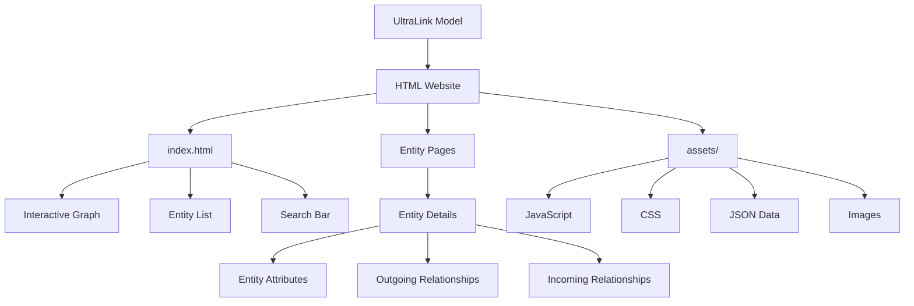
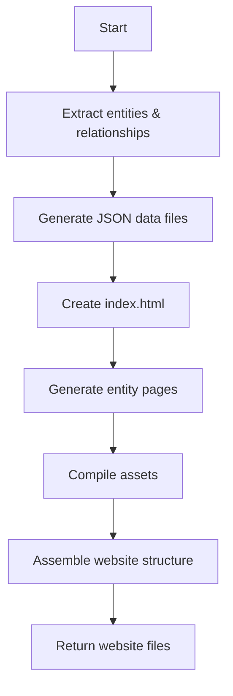

# HTML Website Format for UltraLink

This document details the HTML Website rendering target for UltraLink, its structure, usage, and connection to the UltraLink data model.

> **Related Documents**: 
> - [Overview of Rendering Targets](./RENDERING_TARGETS.md)
> - [Implementation in src/lib/exporters/html-website.js](../src/lib/exporters/html-website.js)
> - [JSON Format](./JSON_FORMAT.md)
> - [Visualization Format](./VISUALIZATION_FORMAT.md)
> - [Obsidian Format](./OBSIDIAN_FORMAT.md)

## Overview

The HTML Website export creates a self-contained, interactive web application for exploring and visualizing UltraLink knowledge graphs. This format is designed for sharing knowledge graphs with users who don't have direct access to UltraLink, providing an intuitive interface for exploration and discovery.

### Key Features

- **Self-Contained**: Entire website can be hosted on any web server or shared as files
- **Interactive Visualization**: Dynamic graph visualization with zoom, pan, and focus
- **Responsive Design**: Works on desktop, tablet, and mobile devices
- **Search Functionality**: Full-text search across all entities and relationships
- **Multiple Themes**: Customizable appearance with pre-built themes
- **No Dependencies**: No external services or database required
- **SEO Friendly**: Static HTML pages that can be indexed by search engines

## Data Model Mapping

The UltraLink data model maps to the HTML Website as follows:



### Entity to Page Mapping

Each UltraLink entity becomes:

1. An HTML page named after the entity ID (e.g., `saguaro.html`)
2. An entry in the entity list on the main page
3. A node in the interactive visualization
4. A JSON data entry for search and dynamic rendering

### Relationship to Link Mapping

UltraLink relationships are represented as:

1. Links between pages
2. Edges in the interactive graph visualization
3. List items in the "Relationships" section of entity pages
4. JSON data connections for interactive exploration

## Usage

The HTML Website exporter is implemented in [src/lib/exporters/html-website.js](../src/lib/exporters/html-website.js) and can be used as follows:

```javascript
// Basic export to HTML Website
const website = ultralink.toHTMLWebsite();

// Export with specific options
const customWebsite = ultralink.toHTMLWebsite({
  title: 'Desert Ecosystem',
  description: 'Interactive visualization of desert ecosystem relationships',
  theme: 'academic',
  includeSearch: true,
  includeVisualization: true
});
```

### Export Options

| Option | Type | Default | Description |
|--------|------|---------|-------------|
| `title` | String | `'UltraLink Knowledge Graph'` | Website title |
| `description` | String | `''` | Website description for metadata |
| `theme` | String | `'default'` | Visual theme (options: 'default', 'dark', 'light', 'academic', 'ocean') |
| `includeSearch` | Boolean | `true` | Include search functionality |
| `includeVisualization` | Boolean | `true` | Include interactive graph visualization |
| `includeVector` | Boolean | `false` | Include vector embeddings for advanced visualizations |
| `customCSS` | String | `null` | Path to custom CSS file |
| `customJS` | String | `null` | Path to custom JavaScript file |
| `customTemplate` | String | `null` | Path to custom HTML template |
| `favicon` | String | `null` | Path to custom favicon |

## Website Structure

The HTML Website export creates the following files:

```
output/
└── website/
    ├── index.html                  # Main page with visualization and entity list
    ├── entity-pages/
    │   ├── saguaro.html            # Individual entity page
    │   ├── kangaroo-rat.html       # Individual entity page
    │   └── ...                     # More entity pages
    ├── assets/
    │   ├── css/
    │   │   ├── styles.css          # Main stylesheet
    │   │   └── themes/
    │   │       ├── default.css     # Default theme
    │   │       ├── dark.css        # Dark theme
    │   │       └── ...             # Other themes
    │   ├── js/
    │   │   ├── main.js             # Main application logic
    │   │   ├── visualization.js    # Graph visualization code
    │   │   ├── search.js           # Search functionality
    │   │   └── utils.js            # Utility functions
    │   ├── data/
    │   │   ├── entities.json       # Entity data
    │   │   ├── relationships.json  # Relationship data
    │   │   └── metadata.json       # Website metadata
    │   └── images/
    │       ├── logo.svg            # UltraLink logo
    │       ├── icons/              # UI icons
    │       └── favicon.ico         # Website favicon
    └── search.html                 # Search results page
```

## Page Examples

### Main Page (index.html)

The main page features:

1. Header with title and navigation
2. Interactive graph visualization
3. Entity list with filtering options
4. Search bar
5. Footer with metadata

```html
<!DOCTYPE html>
<html lang="en">
<head>
    <meta charset="UTF-8">
    <meta name="viewport" content="width=device-width, initial-scale=1.0">
    <title>Desert Ecosystem - UltraLink Knowledge Graph</title>
    <meta name="description" content="Interactive visualization of desert ecosystem relationships">
    <link rel="stylesheet" href="assets/css/styles.css">
    <link rel="stylesheet" href="assets/css/themes/academic.css">
    <link rel="icon" href="assets/images/favicon.ico">
</head>
<body>
    <header>
        <div class="logo">
            
        </div>
        <h1>Desert Ecosystem</h1>
        <div class="search-container">
            <input type="text" id="search-input" placeholder="Search entities...">
            <button id="search-button">Search</button>
        </div>
    </header>
    
    <main>
        <div class="visualization-container">
            <div id="graph-visualization"></div>
            <div class="visualization-controls">
                <button id="zoom-in">+</button>
                <button id="zoom-out">-</button>
                <button id="reset-view">Reset</button>
            </div>
        </div>
        
        <div class="entity-list-container">
            <h2>Entities</h2>
            <div class="filter-controls">
                <select id="type-filter">
                    <option value="all">All Types</option>
                    <option value="organism">Organisms</option>
                    <option value="environmental_factor">Environmental Factors</option>
                    <!-- More types... -->
                </select>
            </div>
            <ul class="entity-list">
                <li data-type="organism"><a href="entity-pages/saguaro.html">Saguaro Cactus</a></li>
                <li data-type="organism"><a href="entity-pages/kangaroo-rat.html">Kangaroo Rat</a></li>
                <li data-type="environmental_factor"><a href="entity-pages/aridity.html">Aridity</a></li>
                <!-- More entities... -->
            </ul>
        </div>
    </main>
    
    <footer>
        <p>Generated with UltraLink on 2023-06-15</p>
        <p><a href="https://github.com/ultralink/ultralink" target="_blank">UltraLink on GitHub</a></p>
    </footer>
    
    <script src="assets/js/main.js"></script>
    <script src="assets/js/visualization.js"></script>
    <script src="assets/js/search.js"></script>
</body>
</html>
```

### Entity Page (e.g., saguaro.html)

Each entity page includes:

1. Entity header with name and type
2. Attributes section with all entity properties
3. Outgoing relationships section
4. Incoming relationships section
5. Local visualization of entity connections

```html
<!DOCTYPE html>
<html lang="en">
<head>
    <meta charset="UTF-8">
    <meta name="viewport" content="width=device-width, initial-scale=1.0">
    <title>Saguaro Cactus - Desert Ecosystem</title>
    <meta name="description" content="Information about Saguaro Cactus in the Desert Ecosystem">
    <link rel="stylesheet" href="../assets/css/styles.css">
    <link rel="stylesheet" href="../assets/css/themes/academic.css">
    <link rel="icon" href="../assets/images/favicon.ico">
</head>
<body>
    <header>
        <div class="logo">
            <a href="../index.html"></a>
        </div>
        <h1>Saguaro Cactus</h1>
        <div class="entity-type">organism</div>
    </header>
    
    <main class="entity-detail">
        <div class="entity-visualization">
            <div id="entity-graph"></div>
        </div>
        
        <div class="entity-content">
            <section class="attributes">
                <h2>Attributes</h2>
                <table>
                    <tr>
                        <th>Scientific Name</th>
                        <td>Carnegiea gigantea</td>
                    </tr>
                    <tr>
                        <th>Height</th>
                        <td>15-50 feet</td>
                    </tr>
                    <tr>
                        <th>Lifespan</th>
                        <td>150-200 years</td>
                    </tr>
                </table>
            </section>
            
            <section class="relationships outgoing">
                <h2>Relationships</h2>
                <div class="relationship-group">
                    <h3>adapts_to</h3>
                    <ul>
                        <li>
                            <a href="aridity.html">Aridity</a>
                            <div class="relationship-attributes">
                                <span class="attribute"><strong>Mechanism:</strong> Water storage in stem</span>
                                <span class="attribute"><strong>Efficiency:</strong> 0.95</span>
                            </div>
                        </li>
                    </ul>
                </div>
            </section>
            
            <section class="relationships incoming">
                <h2>Incoming Relationships</h2>
                <div class="relationship-group">
                    <h3>shares_habitat</h3>
                    <ul>
                        <li>
                            <a href="kangaroo-rat.html">Kangaroo Rat</a>
                            <div class="relationship-attributes">
                                <span class="attribute"><strong>Proximity:</strong> close</span>
                                <span class="attribute"><strong>Interaction Frequency:</strong> occasional</span>
                            </div>
                        </li>
                    </ul>
                </div>
            </section>
        </div>
    </main>
    
    <footer>
        <p>Generated with UltraLink on 2023-06-15</p>
        <p><a href="../index.html">Return to main page</a></p>
    </footer>
    
    <script src="../assets/js/entity-detail.js"></script>
</body>
</html>
```

## Semantic Preservation

The HTML Website format preserves UltraLink semantics in the following way:

| UltraLink Semantic | HTML Website Representation |
|--------------------|---------------------------|
| Entity identity | HTML file name and ID in data attributes |
| Entity type | Class on entity elements and data attributes |
| Entity name | Page title and headings |
| Entity attributes | Table rows in the attributes section |
| Relationship | Hyperlinks between pages and edges in visualization |
| Relationship type | Section headings and data attributes |
| Relationship direction | Outgoing vs. incoming relationship sections |
| Relationship attributes | Spans within relationship list items |
| Metadata | Embedded in JSON data and shown in UI where appropriate |
| Vector embeddings | Serialized in JSON data for advanced visualizations (optional) |

## Technical Implementation

The HTML Website export functionality is implemented in [src/lib/exporters/html-website.js](../src/lib/exporters/html-website.js). The exporter follows these steps:

1. Extract all entities and relationships from the UltraLink data model
2. Generate JSON data files for interactive components
3. Create the main index.html page with visualization and entity list
4. Generate individual HTML pages for each entity
5. Compile CSS, JavaScript, and image assets
6. Assemble all files into the website directory structure



## Interactive Visualization

One of the key features of the HTML Website export is its interactive visualization. This is implemented using D3.js (or alternatively Cytoscape.js) and provides the following features:

- **Force-Directed Layout**: Automatically arranges entities based on their relationships
- **Zoom and Pan**: Interactive navigation of the knowledge graph
- **Node Selection**: Click to focus on specific entities
- **Relationship Highlighting**: Hover to highlight connected entities
- **Filtering**: Show/hide entities by type or attribute
- **Search Integration**: Highlight search results in the visualization

The visualization code is modular and can be customized or extended with additional features.

## Search Functionality

The search functionality is implemented using a client-side search index that enables:

- **Full-Text Search**: Search across all entity names, attributes, and relationships
- **Type Filtering**: Filter search results by entity type
- **Attribute Filtering**: Filter search results by attribute values
- **Relationship Filtering**: Find entities with specific relationship types
- **Instant Results**: Real-time search results as you type
- **Highlighted Matches**: Visual indication of where the match occurred

The search index is pre-built during export to optimize performance.

## Themes and Customization

The HTML Website export supports multiple themes and customization options:

### Built-in Themes

- **Default**: Clean, professional design with a neutral color scheme
- **Dark**: Dark mode with high contrast for low-light environments
- **Light**: Minimalist light theme with subtle accents
- **Academic**: Formal design suitable for research and educational contexts
- **Ocean**: Blue-green color scheme inspired by natural systems

### Custom Themes

You can create custom themes by:

1. Creating a CSS file with your theme styles
2. Passing the path to the `customCSS` option
3. The exporter will include your CSS in the website

### Template Customization

For more extensive customization, you can provide custom HTML templates:

```javascript
// Using a custom template
const customizedWebsite = ultralink.toHTMLWebsite({
  customTemplate: './templates/website-template.html',
  // Additional options...
});
```

The template can include special placeholders that the exporter will replace with actual content:

- `{{title}}` - Website title
- `{{description}}` - Website description
- `{{entityList}}` - List of entities
- `{{visualization}}` - Graph visualization component
- `{{metadata}}` - UltraLink metadata
- `{{generatedDate}}` - Generation timestamp

## Hosting and Deployment

The generated website can be hosted in several ways:

### Local Hosting

1. Export the website to a local directory
2. Open the index.html file in a web browser
3. All functionality works locally without a server

### Web Server Hosting

1. Export the website
2. Upload the entire website directory to any web server (Apache, Nginx, etc.)
3. The website is now accessible through the web

### GitHub Pages

1. Export the website
2. Push the website to a GitHub repository
3. Enable GitHub Pages for the repository
4. The website is now hosted on GitHub Pages

### Static Site CDNs

1. Export the website
2. Deploy to Netlify, Vercel, or similar static site CDN
3. Benefit from global distribution and fast load times

## Use Cases

The HTML Website format is particularly useful for:

1. **Public Knowledge Sharing**: Making UltraLink data accessible to non-technical users
2. **Documentation**: Creating interactive documentation of complex systems
3. **Presentations**: Presenting knowledge graphs in meetings or conferences
4. **Educational Resources**: Creating interactive learning materials
5. **Research Communication**: Sharing research findings with interactive exploration
6. **Portfolio Projects**: Showcasing knowledge graph projects

## Related Formats

The HTML Website format is related to these other UltraLink export formats:

- **[Visualization](./VISUALIZATION_FORMAT.md)**: Provides just the visualization component
- **[Obsidian](./OBSIDIAN_FORMAT.md)**: Similar navigation but in a local knowledge management tool
- **[JSON](./JSON_FORMAT.md)**: Source data format used by the website's interactive components

## Limitations

The HTML Website format has certain limitations:

- Static content requires re-generation to update
- Limited to client-side functionality (no server-side processing)
- May become performance-intensive for very large knowledge graphs
- Search functionality is limited to pre-indexed content
- No direct editing capabilities (view-only)

## Future Enhancements

Planned improvements to the HTML Website exporter include:

- Progressive loading for large knowledge graphs
- Advanced filtering and query capabilities
- Interactive editing (with optional backend integration)
- Virtual/augmented reality visualization integration
- Collaborative annotation features
- More advanced theming options and visual customization
- Integration with analytics to track knowledge graph exploration 