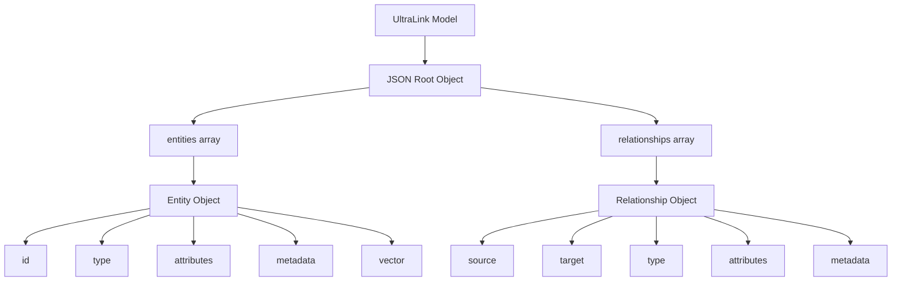
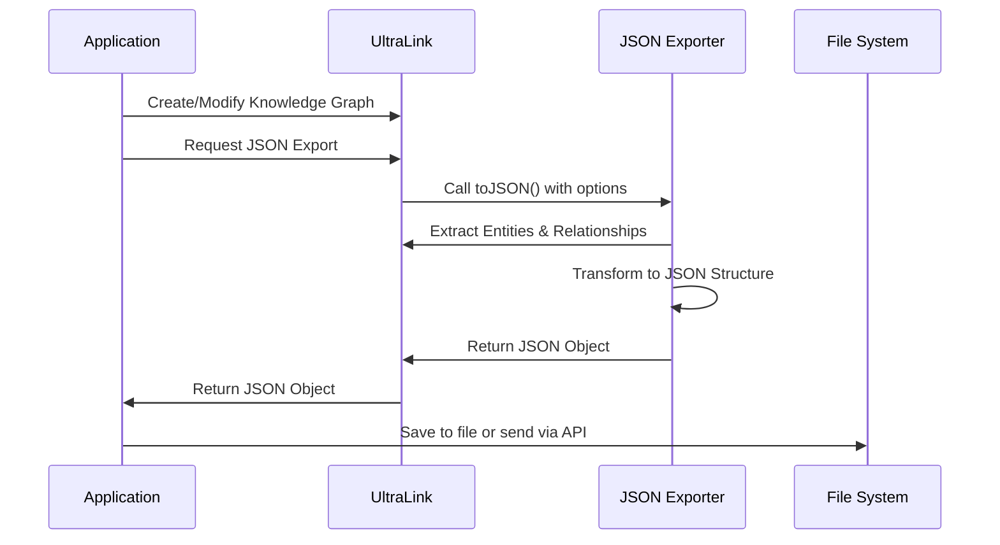

# JSON Format for UltraLink

This document details the JSON rendering target for UltraLink, its structure, usage, and connection to the UltraLink data model.

> **Related Documents**: 
> - [Overview of Rendering Targets](./RENDERING_TARGETS.md)
> - [Implementation in src/lib/exporters/json.js](../src/lib/exporters/json.js)

## Overview

The JSON (JavaScript Object Notation) format provides a complete representation of UltraLink data in a widely-supported, language-independent format. It is the most fundamental export format and serves as the serialization baseline for UltraLink.

### Key Features

- **Universal Compatibility**: JSON is supported by virtually all programming languages
- **Human Readable**: Structured yet easy to read and understand
- **Complete Representation**: Capable of representing all aspects of UltraLink data models
- **Flexible Depth**: Can include or exclude vectors, history, and metadata
- **API Integration**: Perfect for RESTful APIs and data exchange

## Data Model Mapping

The JSON format directly maps the UltraLink data model as follows:



### Entity Representation

Each entity in UltraLink is represented as a JSON object with the following structure:

```json
{
  "id": "unique-identifier",
  "type": "entity-type",
  "attributes": {
    "name": "Entity Name",
    "property1": "value1",
    "property2": "value2"
  },
  "metadata": {
    "created": "2023-06-15T10:30:00Z",
    "modified": "2023-06-15T10:30:00Z",
    "version": 1
  },
  "vector": [0.1, 0.2, 0.3, ...]
}
```

### Relationship Representation

Each relationship is represented as:

```json
{
  "source": "source-entity-id",
  "target": "target-entity-id",
  "type": "relationship-type",
  "attributes": {
    "property1": "value1",
    "property2": "value2"
  },
  "metadata": {
    "created": "2023-06-15T10:30:00Z",
    "modified": "2023-06-15T10:30:00Z"
  }
}
```

## Usage

The JSON exporter is implemented in [src/lib/exporters/json.js](../src/lib/exporters/json.js) and can be used as follows:

```javascript
// Basic export to JSON
const json = ultralink.toJSON();

// Export with specific options
const jsonWithVectors = ultralink.toJSON({
  includeVectors: true,
  includeHistory: true,
  prettyPrint: true
});

// Convert to string for storage
const jsonString = JSON.stringify(json, null, 2);
```

### Export Options

| Option | Type | Default | Description |
|--------|------|---------|-------------|
| `includeVectors` | Boolean | `false` | Include entity vector embeddings |
| `includeHistory` | Boolean | `false` | Include entity and relationship change history |
| `includeMetadata` | Boolean | `true` | Include creation and modification metadata |
| `prettyPrint` | Boolean | `false` | Format JSON with indentation for readability |

## Complete Example

An example of a complete UltraLink JSON export:

```json
{
  "entities": [
    {
      "id": "saguaro",
      "type": "organism",
      "attributes": {
        "name": "Saguaro Cactus",
        "scientificName": "Carnegiea gigantea",
        "height": "15-50 feet",
        "lifespan": "150-200 years"
      },
      "metadata": {
        "created": "2023-06-15T10:30:00Z",
        "modified": "2023-06-15T10:30:00Z"
      },
      "vector": [0.1, 0.2, 0.3, 0.4, 0.5]
    },
    {
      "id": "kangaroo-rat",
      "type": "organism",
      "attributes": {
        "name": "Kangaroo Rat",
        "scientificName": "Dipodomys",
        "description": "A nocturnal desert rodent"
      },
      "metadata": {
        "created": "2023-06-15T10:31:00Z",
        "modified": "2023-06-15T10:31:00Z"
      },
      "vector": [0.2, 0.3, 0.4, 0.5, 0.6]
    },
    {
      "id": "aridity",
      "type": "environmental_factor",
      "attributes": {
        "name": "Aridity",
        "description": "Extremely dry conditions with minimal rainfall",
        "annualRainfall": "3-15 inches"
      },
      "metadata": {
        "created": "2023-06-15T10:32:00Z",
        "modified": "2023-06-15T10:32:00Z"
      },
      "vector": [0.3, 0.4, 0.5, 0.6, 0.7]
    }
  ],
  "relationships": [
    {
      "source": "saguaro",
      "target": "aridity",
      "type": "adapts_to",
      "attributes": {
        "mechanism": "Water storage in stem",
        "efficiency": 0.95
      },
      "metadata": {
        "created": "2023-06-15T10:35:00Z",
        "modified": "2023-06-15T10:35:00Z"
      }
    },
    {
      "source": "kangaroo-rat",
      "target": "aridity",
      "type": "adapts_to",
      "attributes": {
        "mechanism": "Metabolic water production",
        "efficiency": 0.88
      },
      "metadata": {
        "created": "2023-06-15T10:36:00Z",
        "modified": "2023-06-15T10:36:00Z"
      }
    },
    {
      "source": "kangaroo-rat",
      "target": "saguaro",
      "type": "shares_habitat",
      "attributes": {
        "proximity": "close",
        "interaction_frequency": "occasional"
      },
      "metadata": {
        "created": "2023-06-15T10:37:00Z",
        "modified": "2023-06-15T10:37:00Z"
      }
    }
  ]
}
```

## Semantic Preservation

The JSON format preserves all UltraLink semantics:

| UltraLink Semantic | JSON Representation |
|--------------------|---------------------|
| Entity identity | `id` field in entity object |
| Entity type | `type` field in entity object |
| Attributes | `attributes` object with key-value pairs |
| Relationships | Objects in the `relationships` array |
| Relationship direction | `source` and `target` fields |
| Metadata | `metadata` object with creation and modification timestamps |
| Vector embeddings | `vector` array of floating-point values |

## Technical Implementation

In the UltraLink codebase, the JSON export functionality is implemented in [src/lib/exporters/json.js](../src/lib/exporters/json.js). The exporter follows these steps:

1. Extract entities from the UltraLink data model
2. Transform each entity into a JSON-friendly object
3. Extract relationships from the UltraLink graph
4. Transform each relationship into a JSON-friendly object
5. Combine entities and relationships into a root object
6. Apply any requested filtering or formatting options
7. Return the resulting object

## Import/Export Workflow



## Use Cases

The JSON format is particularly useful for:

1. **API Integration**: Exchanging data with external systems
2. **Backup and Storage**: Persisting UltraLink data in databases
3. **Data Analysis**: Input for data analysis tools and scripts
4. **System Interoperability**: Common format for cross-platform compatibility
5. **Debugging**: Human-readable format for development and testing

## Related Formats

The JSON format serves as the foundation for several other UltraLink export formats:

- **[Full Blob](./FULL_BLOB_FORMAT.md)**: Extends JSON with additional UltraLink-specific data
- **[Bayesian Network JSON](./BAYESIAN_NETWORK_FORMAT.md)**: Specialized JSON structure for probabilistic models
- **[HTML Website](./HTML_WEBSITE_FORMAT.md)**: Uses JSON as the data source for interactive visualization

## Limitations

While the JSON format is comprehensive, it has certain limitations:

- No native support for cyclic references (handled via explicit IDs in UltraLink)
- No standardized schema validation (though JSON Schema could be implemented)
- Lacks native support for semantic typing (handled via explicit type fields)
- May become large for systems with many entities and relationships

## Future Enhancements

Planned improvements to the JSON exporter include:

- JSON Schema definition for validation
- Streaming export for large knowledge graphs
- Selective entity/relationship export
- Differential export (changes since last export)
- Compression options for large datasets 