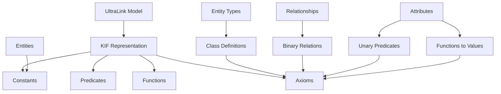
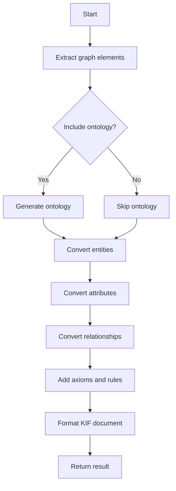

# KIF (Knowledge Interchange Format) for UltraLink

This document details the KIF (Knowledge Interchange Format) rendering target for UltraLink, its structure, usage, and connection to the UltraLink data model.

> **Related Documents**: 
> - [Overview of Rendering Targets](./RENDERING_TARGETS.md)
> - [Implementation in src/lib/exporters/kif.js](../src/lib/exporters/kif.js)
> - [JSON Format](./JSON_FORMAT.md)
> - [Bayesian Network Format](./BAYESIAN_NETWORK_FORMAT.md)

## Overview

The KIF (Knowledge Interchange Format) export transforms UltraLink knowledge graphs into a formal logical representation that enables knowledge sharing, logical reasoning, and semantic interoperability. KIF is a computer-oriented language for the interchange of knowledge among disparate programs with declarative semantics.

### Key Features

- **Formal Logic Representation**: Expresses knowledge in a first-order predicate calculus with extensions
- **Semantic Precision**: Unambiguous representation of complex knowledge structures
- **Machine Readable**: Structured format designed for automated reasoning systems
- **Human Readable**: Relatively easy to read and edit by humans with knowledge of logic notation
- **Ontology Support**: Ability to define terms, relations, functions, and axioms
- **Inference Capability**: Supports deductive reasoning and knowledge discovery
- **Interoperability**: Compatible with various knowledge-based systems and AI tools

## Data Model Mapping

UltraLink's entity-relationship model maps to KIF elements as follows:



### Entity to Constant Mapping

Each UltraLink entity is represented in KIF as a constant with:

1. A unique identifier
2. Type information (expressed through instance-of relations)
3. Attributes (expressed through predicates or functions)
4. Relationships to other entities (expressed through binary relations)

### Relationship to Binary Relation Mapping

UltraLink relationships become binary relations in KIF with:

1. Relation name derived from relationship type
2. Source entity as first argument
3. Target entity as second argument
4. Relationship attributes as additional predicates or functions

## Usage

The KIF exporter is implemented in [src/lib/exporters/kif.js](../src/lib/exporters/kif.js) and can be used as follows:

```javascript
// Basic export to KIF
const kifRepresentation = ultralink.toKIF();

// Export with specific options
const customKIF = ultralink.toKIF({
  includeComments: true,
  includeMetadata: true,
  indentationSpaces: 2,
  includeOntology: true,
  relationPrefix: 'has-',
  onlySelected: false
});
```

### Export Options

| Option | Type | Default | Description |
|--------|------|---------|-------------|
| `includeComments` | Boolean | `true` | Include comments in the KIF output |
| `includeMetadata` | Boolean | `true` | Include metadata about the UltraLink source |
| `indentationSpaces` | Number | `2` | Number of spaces for indentation |
| `includeOntology` | Boolean | `true` | Include ontology definitions |
| `relationPrefix` | String | `''` | Prefix for relation names |
| `onlySelected` | Boolean | `false` | Export only selected entities and relationships |
| `includeInferenceRules` | Boolean | `true` | Include inference rules for transitive relationships |
| `useClassHierarchy` | Boolean | `true` | Use class hierarchy for entity types |

## KIF Syntax

The KIF export follows standard KIF syntax, with knowledge represented as terms and sentences.

### Terms

Terms in KIF include:

1. **Variables**: Start with `?` (e.g., `?x`, `?entity`)
2. **Constants**: Represent specific entities (e.g., `Entity-1234`, `AlbertEinstein`)
3. **Strings**: Enclosed in double quotes (e.g., `"This is a string"`)
4. **Numbers**: Integers and floating-point numbers (e.g., `42`, `3.14159`)
5. **Functions**: Apply functions to terms (e.g., `(age AlbertEinstein)`)

### Sentences

Sentences in KIF include:

1. **Atomic sentences**: Predicates applied to terms (e.g., `(Person AlbertEinstein)`)
2. **Negations**: Negated sentences (e.g., `(not (Person Planet-Earth))`)
3. **Conjunctions**: Logical AND (e.g., `(and (Person Alice) (Student Alice))`)
4. **Disjunctions**: Logical OR (e.g., `(or (Professor Bob) (Student Bob))`)
5. **Implications**: If-then statements (e.g., `(=> (Student ?x) (Person ?x))`)
6. **Quantified sentences**: Universal and existential quantifiers (e.g., `(forall ?x (=> (Person ?x) (Mortal ?x)))`)

## KIF Output Examples

### Entity Representation

UltraLink entities are represented as constants with their types and attributes:

```lisp
;; Entity: Albert Einstein
(instance-of Albert-Einstein Person)
(full-name Albert-Einstein "Albert Einstein")
(birth-year Albert-Einstein 1879)
(death-year Albert-Einstein 1955)
(nationality Albert-Einstein German)
(field-of-study Albert-Einstein Physics)
```

### Relationship Representation

UltraLink relationships are represented as binary relations:

```lisp
;; Relationship: Albert Einstein developed Theory of Relativity
(developed Albert-Einstein Theory-of-Relativity)
(development-year Albert-Einstein Theory-of-Relativity 1915)
(development-location Albert-Einstein Theory-of-Relativity Germany)
```

### Ontology Definition

Entity types and hierarchies are defined through class definitions:

```lisp
;; Class hierarchy
(subclass-of Scientist Person)
(subclass-of Physicist Scientist)
(=> (Physicist ?x) (field-of-study ?x Physics))

;; Relationship definitions
(binary-relation developed)
(domain developed 1 Person)
(domain developed 2 Theory)
(=> (developed ?x ?y) (and (Person ?x) (Theory ?y)))
```

### Complex Knowledge Structures

Complex knowledge structures with multiple relationships and logical connections:

```lisp
;; University research group structure
(instance-of Quantum-Physics-Lab Research-Group)
(led-by Quantum-Physics-Lab John-Smith)
(instance-of John-Smith Professor)
(specializes-in Quantum-Physics-Lab Quantum-Mechanics)

;; Members and their roles
(forall ?x (=> (member-of ?x Quantum-Physics-Lab) 
               (or (Professor ?x) (Researcher ?x) (Student ?x))))

(member-of Sarah-Johnson Quantum-Physics-Lab)
(instance-of Sarah-Johnson Researcher)
(member-of James-Wilson Quantum-Physics-Lab)
(instance-of James-Wilson PhD-Student)

;; Publications and authorship
(instance-of Quantum-Entanglement-Paper Publication)
(published-by Quantum-Entanglement-Paper Quantum-Physics-Lab)
(published-in Quantum-Entanglement-Paper "Nature Physics")
(published-year Quantum-Entanglement-Paper 2022)
(author-of John-Smith Quantum-Entanglement-Paper)
(author-of Sarah-Johnson Quantum-Entanglement-Paper)
```

## Complete KIF Example

Here's a complete KIF example from an UltraLink knowledge graph about a desert ecosystem:

```lisp
;;; Desert Ecosystem Knowledge Base
;;; Generated from UltraLink on 2023-06-15
;;; Describes relationships between desert plants, animals, and environmental factors

;; Ontology definitions
(subclass-of Organism Entity)
(subclass-of Plant Organism)
(subclass-of Animal Organism)
(subclass-of Cactus Plant)
(subclass-of Desert Ecosystem)

;; Binary relations
(binary-relation lives-in)
(domain lives-in 1 Organism)
(domain lives-in 2 Ecosystem)

(binary-relation feeds-on)
(domain feeds-on 1 Organism)
(domain feeds-on 2 Organism)

(binary-relation adapted-to)
(domain adapted-to 1 Organism)
(domain adapted-to 2 Environment-Factor)

;; Functions
(function average-lifespan (?organism) :-> ?years)
(domain average-lifespan 1 Organism)
(range average-lifespan Integer)

;; Entities
(instance-of Sonoran-Desert Desert)
(located-in Sonoran-Desert "North America")
(area Sonoran-Desert 260000) ; square kilometers
(average-rainfall Sonoran-Desert 100) ; millimeters per year

(instance-of Saguaro Cactus)
(scientific-name Saguaro "Carnegiea gigantea")
(average-lifespan Saguaro 200)
(height-range Saguaro 12 20) ; meters
(lives-in Saguaro Sonoran-Desert)

(instance-of Desert-Tortoise Animal)
(scientific-name Desert-Tortoise "Gopherus agassizii")
(average-lifespan Desert-Tortoise 80)
(conservation-status Desert-Tortoise "Vulnerable")
(lives-in Desert-Tortoise Sonoran-Desert)

(instance-of Coyote Animal)
(scientific-name Coyote "Canis latrans")
(average-lifespan Coyote 14)
(lives-in Coyote Sonoran-Desert)
(feeds-on Coyote Desert-Tortoise)

;; Environmental factors
(instance-of Aridity Environment-Factor)
(adapted-to Saguaro Aridity)
(adaptation-mechanism Saguaro Aridity "Water storage in stem")
(adapted-to Desert-Tortoise Aridity)
(adaptation-mechanism Desert-Tortoise Aridity "Burrowing behavior")

;; Inference rules
(=> (and (lives-in ?organism ?ecosystem)
         (Cactus ?organism))
    (adapted-to ?organism Aridity))

(=> (and (feeds-on ?predator ?prey)
         (lives-in ?prey ?ecosystem))
    (lives-in ?predator ?ecosystem))
```

## Semantic Preservation

The KIF format preserves UltraLink semantics in the following ways:

| UltraLink Semantic | KIF Representation |
|--------------------|-------------------|
| Entity identity | Constant name |
| Entity type | `instance-of` predicate |
| Entity hierarchy | `subclass-of` predicate |
| Entity attributes | Predicates or functions |
| Relationship | Binary relation |
| Relationship type | Relation name |
| Relationship direction | Argument order |
| Relationship attributes | Additional predicates |
| Logic and rules | Axioms with implications |

## Technical Implementation

The KIF export functionality is implemented in [src/lib/exporters/kif.js](../src/lib/exporters/kif.js). The exporter follows these steps:

1. Extract entities, relationships, and type information from UltraLink graph
2. Generate ontology definitions if requested
3. Convert entities to KIF constants with instance-of relations
4. Convert attributes to predicates or functions
5. Convert relationships to binary relations
6. Add additional axioms and inference rules
7. Format and output the KIF document



## Logical Inference with KIF

One of the key advantages of the KIF format is its support for logical inference:

### Types of Inference

1. **Deduction**: Deriving new facts from existing knowledge
2. **Abduction**: Inferring likely explanations for observations
3. **Induction**: Generalizing patterns from specific instances
4. **Analogical Reasoning**: Applying knowledge from one domain to another

### Example Inference with KIF

Using the desert ecosystem example:

```lisp
;; Given facts
(Cactus Saguaro)
(lives-in Saguaro Sonoran-Desert)

;; Inference rule
(=> (and (lives-in ?organism ?ecosystem)
         (Cactus ?organism))
    (adapted-to ?organism Aridity))

;; We can infer
(adapted-to Saguaro Aridity)
```

This inference capability allows systems to:

1. Discover implicit knowledge
2. Validate knowledge consistency
3. Answer queries about the knowledge base
4. Generate explanations for phenomena

## Integration with Knowledge Systems

The KIF format can be integrated with various knowledge systems:

### PowerLoom

```java
// Load KIF file into PowerLoom
KIF loader = new KIF();
loader.load("desert-ecosystem.kif");

// Perform logical inference
PowerLoom.ask("(forall ?x (=> (Cactus ?x) (Plant ?x)))");
PowerLoom.ask("(adapted-to Saguaro Aridity)");
```

### Cyc

```lisp
;; Load KIF file into Cyc
(load-kif "desert-ecosystem.kif" :mt #$DesertEcosystemMt)

;; Query the knowledge base
(ask-template '(#$lives-in ?ORGANISM #$Sonoran-Desert) #$DesertEcosystemMt)
```

### Prolog (via KIF-to-Prolog converter)

```prolog
% After conversion to Prolog
% Query the knowledge base
?- instance_of(X, cactus), lives_in(X, sonoran_desert).
X = saguaro.

?- adapted_to(saguaro, aridity).
true.
```

## Use Cases

The KIF format is particularly useful for:

1. **Knowledge Sharing**: Exchanging formal knowledge between different systems
2. **Logical Reasoning**: Enabling automated inference and knowledge discovery
3. **Ontology Engineering**: Defining formal ontologies with precise semantics
4. **Expert Systems**: Building knowledge bases for expert systems
5. **Semantic Integration**: Integrating knowledge from multiple sources
6. **Education**: Teaching formal logic and knowledge representation
7. **Artificial Intelligence**: Supporting symbolic AI applications

## Converting KIF to Other Formats

KIF can be converted to other knowledge representation formats:

### KIF to OWL (Web Ontology Language)

```javascript
// Pseudocode for KIF to OWL conversion
function kifToOWL(kifDocument) {
  const owl = createOWLDocument();
  
  // Process class hierarchy
  for (const classDef of extractClassDefinitions(kifDocument)) {
    owl.addClass(classDef.name);
    if (classDef.superclass) {
      owl.addSubClassOf(classDef.name, classDef.superclass);
    }
  }
  
  // Process instances
  for (const instance of extractInstances(kifDocument)) {
    owl.addIndividual(instance.name, instance.class);
    for (const prop of instance.properties) {
      owl.addProperty(instance.name, prop.name, prop.value);
    }
  }
  
  // Process relationships
  for (const relation of extractRelations(kifDocument)) {
    owl.addObjectProperty(relation.name);
    owl.addDomain(relation.name, relation.domain);
    owl.addRange(relation.name, relation.range);
  }
  
  return owl.toString();
}
```

### KIF to Prolog

```javascript
// Pseudocode for KIF to Prolog conversion
function kifToProlog(kifDocument) {
  let prolog = '';
  
  // Process class hierarchy
  for (const classDef of extractClassDefinitions(kifDocument)) {
    if (classDef.superclass) {
      prolog += `is_a(${classDef.name}, ${classDef.superclass}).\n`;
    }
  }
  
  // Process instances
  for (const instance of extractInstances(kifDocument)) {
    prolog += `instance_of(${instance.name}, ${instance.class}).\n`;
    for (const prop of instance.properties) {
      prolog += `${prop.name}(${instance.name}, ${prop.value}).\n`;
    }
  }
  
  // Process relationships
  for (const relation of extractRelations(kifDocument)) {
    prolog += `${relation.name}(${relation.source}, ${relation.target}).\n`;
  }
  
  // Process rules
  for (const rule of extractRules(kifDocument)) {
    prolog += convertRuleToProlog(rule) + '\n';
  }
  
  return prolog;
}
```

## Related Formats

The KIF format is related to these other UltraLink export formats:

- **[JSON Format](./JSON_FORMAT.md)**: Simpler data structure without formal logical semantics
- **[Bayesian Network Format](./BAYESIAN_NETWORK_FORMAT.md)**: Probabilistic representation with different inference capabilities
- **[GraphML Format](./GRAPHML_FORMAT.md)**: Graph representation without formal logical semantics

## Limitations

The KIF format has certain limitations:

- Complex syntax that can be difficult for non-experts to understand
- Limited support for expressing uncertainty (compared to probabilistic formats)
- Computational complexity of logical inference can be high
- Expressiveness can lead to ambiguity in how to best represent certain concepts
- Limited tooling support compared to more recent formats like OWL
- Not standardized for specific domains (requires domain-specific extensions)

## Future Enhancements

Planned improvements to the KIF exporter include:

- Support for Common Logic extensions
- Integration with more reasoning engines
- Enhanced support for uncertainty through extensions
- Improved documentation and examples for specific domains
- Better tooling for visualization and editing
- Integration with machine learning workflows
- Performance optimizations for large knowledge graphs 