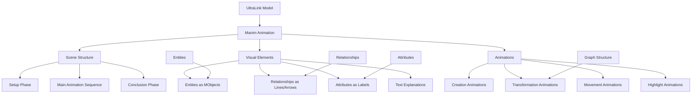
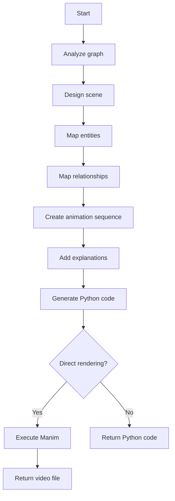
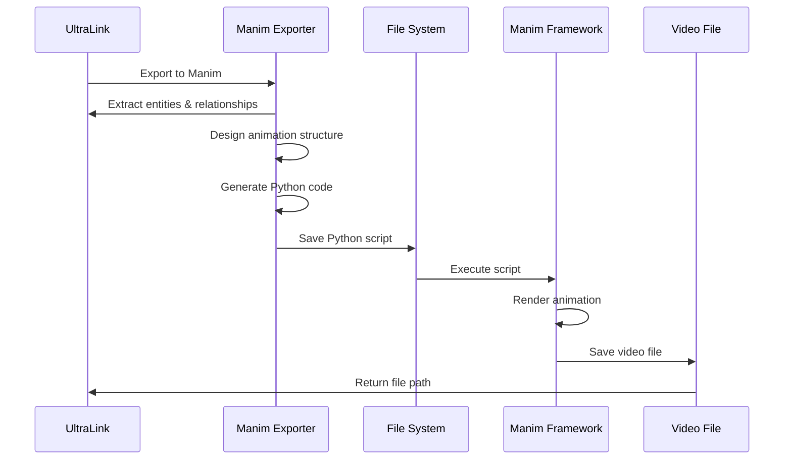

# Manim Animation Format for UltraLink

This document details the Manim Animation rendering target for UltraLink, its structure, usage, and connection to the UltraLink data model.

> **Related Documents**: 
> - [Overview of Rendering Targets](./RENDERING_TARGETS.md)
> - [Implementation in src/lib/exporters/manim.js](../src/lib/exporters/manim.js)
> - [Visualization Format](./VISUALIZATION_FORMAT.md)
> - [HTML Website Format](./HTML_WEBSITE_FORMAT.md)

## Overview

The Manim Animation format transforms UltraLink knowledge graphs into 3Blue1Brown-style mathematical animations using the Manim framework. This format enables the creation of beautiful, explanatory visualizations that can dynamically illustrate the structure, relationships, and mathematical properties of knowledge graphs.

### Key Features

- **Dynamic Animations**: Time-based visualization of knowledge graph elements
- **Mathematical Emphasis**: Focus on mathematical properties and transformations
- **High Production Quality**: Professional-looking output suitable for educational content
- **Narrated Explanations**: Support for synchronized narration and explanations
- **Progressive Disclosure**: Step-by-step revelation of graph elements and relationships
- **Transformations**: Smooth transitions between different views and representations
- **Exportable Video**: Output as MP4, GIF, or other video formats
- **Pythonic Interface**: Generated Python code for the Manim framework

## Data Model Mapping

The UltraLink data model maps to Manim animation elements as follows:



### Entity to MObject Mapping

Each UltraLink entity is represented in Manim as:

1. A geometric shape (Circle, Square, Rectangle, etc.) based on entity type
2. A label displaying the entity name or ID
3. Color coding based on entity type or attributes
4. Size based on entity importance or centrality

### Relationship to Line/Arrow Mapping

UltraLink relationships are represented as:

1. Arrows connecting entity shapes
2. Styling (color, thickness) based on relationship type
3. Animated creation to show graph construction
4. Labels showing relationship type or attributes

## Usage

The Manim Animation exporter is implemented in [src/lib/exporters/manim.js](../src/lib/exporters/manim.js) and can be used as follows:

```javascript
// Basic export to Manim
const manimCode = ultralink.toManim();

// Export with specific options
const customManimAnimation = ultralink.toManim({
  animationStyle: 'explanatory',
  visualTheme: 'dark',
  includeNarrationText: true,
  highlightCentralEntities: true,
  animationDuration: 60, // seconds
  outputFormat: 'mp4'
});
```

### Export Options

| Option | Type | Default | Description |
|--------|------|---------|-------------|
| `animationStyle` | String | `'default'` | Animation style (options: 'default', 'explanatory', 'technical', 'narrative') |
| `visualTheme` | String | `'3b1b'` | Visual theme (options: '3b1b', 'dark', 'light', 'colorful') |
| `includeNarrationText` | Boolean | `true` | Include text for narration and explanations |
| `highlightCentralEntities` | Boolean | `true` | Emphasize central/important entities |
| `animationDuration` | Number | `30` | Target duration in seconds |
| `outputFormat` | String | `'mp4'` | Output format (options: 'mp4', 'gif', 'png_sequence') |
| `customManimCode` | String | `null` | Additional custom Manim code to include |
| `renderingQuality` | String | `'medium'` | Rendering quality (options: 'low', 'medium', 'high') |
| `frameRate` | Number | `30` | Frames per second |

## Manim Output Example

The Manim exporter generates Python code that can be executed with the Manim framework:

```python
#!/usr/bin/env python
from manim import *

class UltraLinkGraph(Scene):
    def construct(self):
        # Title and introduction
        title = Text("Desert Ecosystem Knowledge Graph")
        subtitle = Text("Visualizing relationships between species", font_size=36)
        VGroup(title, subtitle).arrange(DOWN)
        
        self.play(
            Write(title),
            FadeIn(subtitle, shift=DOWN),
        )
        self.wait(2)
        self.play(
            FadeOut(title),
            FadeOut(subtitle)
        )
        
        # Create entities
        saguaro = Circle(radius=1.0, color=GREEN).set_fill(GREEN, opacity=0.5)
        saguaro_label = Text("Saguaro Cactus").next_to(saguaro, DOWN)
        saguaro_group = VGroup(saguaro, saguaro_label).to_edge(LEFT).shift(UP)
        
        kangaroo_rat = Circle(radius=0.8, color=BLUE).set_fill(BLUE, opacity=0.5)
        kangaroo_rat_label = Text("Kangaroo Rat").next_to(kangaroo_rat, DOWN)
        kangaroo_rat_group = VGroup(kangaroo_rat, kangaroo_rat_label).to_edge(RIGHT).shift(UP)
        
        aridity = Circle(radius=1.2, color=YELLOW).set_fill(YELLOW, opacity=0.5)
        aridity_label = Text("Aridity").next_to(aridity, DOWN)
        aridity_group = VGroup(aridity, aridity_label).move_to(ORIGIN).shift(DOWN*2)
        
        # Create entity animations
        self.play(
            Create(saguaro),
            Write(saguaro_label)
        )
        self.wait(1)
        
        self.play(
            Create(kangaroo_rat),
            Write(kangaroo_rat_label)
        )
        self.wait(1)
        
        self.play(
            Create(aridity),
            Write(aridity_label)
        )
        self.wait(1)
        
        # Create relationships
        rel1 = Arrow(saguaro.get_bottom(), aridity.get_top() + LEFT*0.5, buff=0.2, color=RED)
        rel1_label = Text("adapts_to", font_size=24).next_to(rel1, LEFT)
        rel1_group = VGroup(rel1, rel1_label)
        
        rel2 = Arrow(kangaroo_rat.get_bottom(), aridity.get_top() + RIGHT*0.5, buff=0.2, color=RED)
        rel2_label = Text("adapts_to", font_size=24).next_to(rel2, RIGHT)
        rel2_group = VGroup(rel2, rel2_label)
        
        rel3 = Arrow(kangaroo_rat.get_left(), saguaro.get_right(), buff=0.2, color=PURPLE)
        rel3_label = Text("shares_habitat", font_size=24).next_to(rel3, UP)
        rel3_group = VGroup(rel3, rel3_label)
        
        # Create relationship animations
        self.play(
            Create(rel1),
            Write(rel1_label)
        )
        self.wait(1)
        
        self.play(
            Create(rel2),
            Write(rel2_label)
        )
        self.wait(1)
        
        self.play(
            Create(rel3),
            Write(rel3_label)
        )
        self.wait(1)
        
        # Highlight adaptation patterns
        self.play(
            Indicate(rel1_group, scale_factor=1.2),
            Indicate(rel2_group, scale_factor=1.2),
        )
        
        adaptation_text = Text("Desert adaptation strategies").to_edge(UP)
        self.play(Write(adaptation_text))
        self.wait(2)
        
        # Transform to force-directed layout
        entities = VGroup(saguaro_group, kangaroo_rat_group, aridity_group)
        
        # Store original positions
        original_positions = {
            'saguaro': saguaro_group.get_center(),
            'kangaroo_rat': kangaroo_rat_group.get_center(),
            'aridity': aridity_group.get_center()
        }
        
        # Move to force-directed positions
        self.play(
            saguaro_group.animate.move_to(UP * 2 + LEFT * 2),
            kangaroo_rat_group.animate.move_to(UP * 2 + RIGHT * 2),
            aridity_group.animate.move_to(DOWN * 2),
            Transform(rel1, Arrow(UP * 2 + LEFT * 2, DOWN * 2, buff=1.0, color=RED)),
            Transform(rel2, Arrow(UP * 2 + RIGHT * 2, DOWN * 2, buff=1.0, color=RED)),
            Transform(rel3, Arrow(UP * 2 + RIGHT * 2, UP * 2 + LEFT * 2, buff=1.0, color=PURPLE)),
            FadeOut(adaptation_text)
        )
        self.wait(2)
        
        # Conclusion
        self.play(
            *[FadeOut(mob) for mob in self.mobjects]
        )
        
        conclusion = Text("UltraLink Knowledge Graph Animation")
        self.play(Write(conclusion))
        self.wait(2)
        self.play(FadeOut(conclusion))
```

## Semantic Preservation

The Manim Animation format preserves UltraLink semantics in the following ways:

| UltraLink Semantic | Manim Representation |
|--------------------|----------------------|
| Entity identity | Unique MObject with identifier |
| Entity type | Shape type, color, or visual styling |
| Entity name | Text label on or near the entity shape |
| Entity attributes | Additional labels or property animations |
| Relationship | Arrow or line connecting entities |
| Relationship type | Color, style, or label on the connecting line |
| Relationship direction | Direction of arrow |
| Graph structure | Overall layout and arrangement of objects |
| Temporal dynamics | Animation sequence and timing |

## Technical Implementation

The Manim Animation export functionality is implemented in [src/lib/exporters/manim.js](../src/lib/exporters/manim.js). The exporter follows these steps:

1. Analyze the UltraLink graph structure and properties
2. Design a scene structure for the animation
3. Map entities to appropriate visual elements
4. Map relationships to connecting elements
5. Create an animation sequence that builds up the graph
6. Add explanatory elements and highlights
7. Generate Manim Python code that can be executed
8. Optionally render the animation directly



## Animation Workflow

The typical workflow for using Manim Animation exports:



## Use Cases

The Manim Animation format is particularly useful for:

1. **Educational Content**: Creating explanatory videos about complex knowledge structures
2. **Presentations**: Enhancing presentations with dynamic graph visualizations
3. **Research Communication**: Communicating research findings in an engaging way
4. **Complex System Explanation**: Breaking down complex systems into understandable components
5. **Mathematical Analysis**: Highlighting mathematical properties of knowledge graphs
6. **Process Visualization**: Showing how entities and relationships evolve over time
7. **Algorithm Demonstration**: Visualizing algorithms operating on knowledge graphs

## Mathematical Emphasis

One of the key strengths of the Manim format is its ability to emphasize mathematical aspects of knowledge graphs:

### Graph Theory Properties

```python
# Example of graph theory visualization
def show_graph_properties(self):
    # Calculate and display centrality
    centrality_formula = MathTex(r"C(v) = \frac{\sum_{s \neq v \neq t} \sigma_{st}(v)}{\sigma_{st}}")
    self.play(Write(centrality_formula))
    
    # Highlight nodes with high centrality
    self.play(
        central_node.animate.set_color(RED).scale(1.5),
        FadeToColor(central_node_label, RED)
    )
```

### Probabilistic Relationships

```python
# Example of visualizing probabilities
def show_probabilistic_relationships(self):
    # Display conditional probability formula
    prob_formula = MathTex(r"P(B|A) = \frac{P(A \cap B)}{P(A)}")
    self.play(Write(prob_formula))
    
    # Show probability distribution over graph
    heatmap = get_probability_heatmap(graph_entities)
    self.play(FadeIn(heatmap))
```

### Network Dynamics

```python
# Example of visualizing network evolution
def show_network_dynamics(self):
    # Display differential equation governing growth
    growth_eq = MathTex(r"\frac{dN}{dt} = \alpha N - \beta N^2")
    self.play(Write(growth_eq))
    
    # Animate network evolution according to equation
    self.play(UpdateFromAlphaFunc(graph, update_graph_by_growth_equation))
```

## Integration with Other Tools

The Manim Animation format can be integrated with various toolchains:

### Web Embedding

```html
<!-- Embedding a rendered Manim animation in a webpage -->
<video controls>
  <source src="ultralink_graph_animation.mp4" type="video/mp4">
  Your browser does not support the video tag.
</video>
```

### Presentation Software

```python
# Generate slides with embedded animations
def generate_presentation_slides(ultralink_graph, output_path):
    manim_code = ultralink_graph.toManim({
        'outputFormat': 'mp4',
        'renderingQuality': 'high'
    })
    
    # Render the animation
    video_path = render_manim_animation(manim_code)
    
    # Generate presentation slides with the animation embedded
    create_presentation_with_embedded_video(video_path, output_path)
```

### Educational Platforms

```python
# Creating educational content
def create_educational_module(ultralink_graph, topic):
    # Generate Manim animation
    animation = ultralink_graph.toManim({
        'animationStyle': 'explanatory',
        'includeNarrationText': True
    })
    
    # Create educational module with the animation
    module = EducationalModule(
        title=topic,
        content=[
            TextContent("Introduction to " + topic),
            VideoContent(render_manim_animation(animation)),
            QuizContent(generate_quiz_from_graph(ultralink_graph))
        ]
    )
    
    return module
```

## Related Formats

The Manim Animation format is related to these other UltraLink export formats:

- **[Visualization Format](./VISUALIZATION_FORMAT.md)**: Static visualization that can be complemented by animations
- **[HTML Website Format](./HTML_WEBSITE_FORMAT.md)**: Web interface that could embed Manim animations
- **[GraphML Format](./GRAPHML_FORMAT.md)**: Graph structure that animations can illuminate
- **[Bayesian Network Format](./BAYESIAN_NETWORK_FORMAT.md)**: Probabilistic models that animations can explain

## Limitations

The Manim Animation format has certain limitations:

- Requires the Manim framework to be installed
- Rendering animations can be computationally intensive
- Limited interactivity compared to web-based visualizations
- Learning curve for customizing animations
- Fixed content that can't be updated without re-rendering
- May not scale well to very large knowledge graphs
- Extra work needed to add narration and sound

## Future Enhancements

Planned improvements to the Manim Animation exporter include:

- Interactive parameter adjustment without re-rendering
- Integration with text-to-speech for automatic narration
- Library of pre-built animation templates for common patterns
- Adaptive detail level based on graph complexity
- Direct export to online video platforms
- VR/AR-compatible output formats
- Real-time animation generation based on live data
- Enhanced mathematical analysis visualizations 