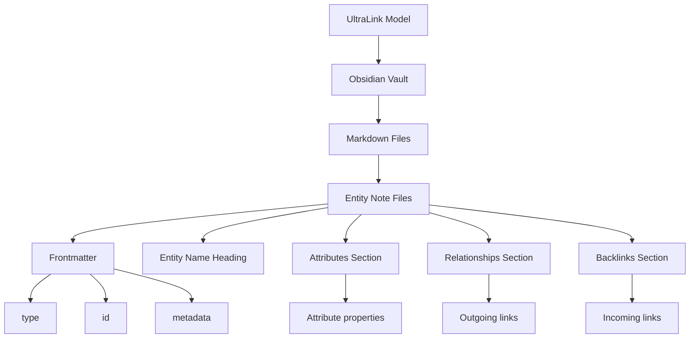
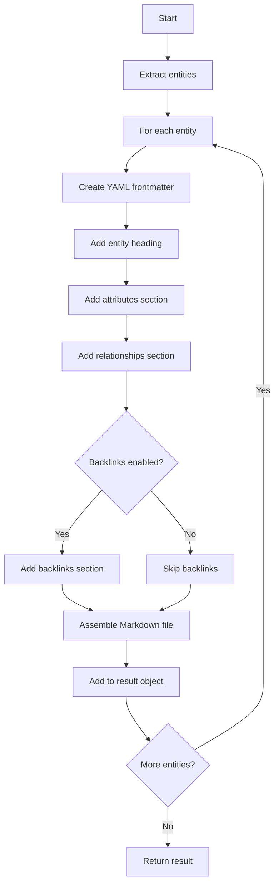
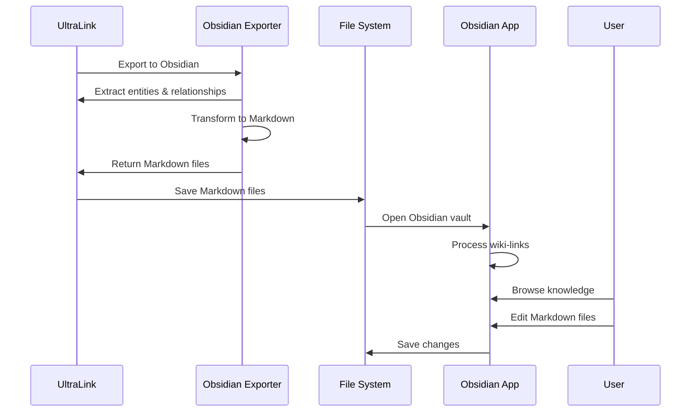

# Obsidian Format for UltraLink

This document details the Obsidian rendering target for UltraLink, its structure, usage, and connection to the UltraLink data model.

> **Related Documents**: 
> - [Overview of Rendering Targets](./RENDERING_TARGETS.md)
> - [Implementation in src/lib/exporters/obsidian.js](../src/lib/exporters/obsidian.js)
> - [JSON Format](./JSON_FORMAT.md)
> - [HTML Website Format](./HTML_WEBSITE_FORMAT.md)

## Overview

The Obsidian format exports UltraLink data as a collection of Markdown files with wiki-links, suitable for use in Obsidian or other knowledge management systems. This format transforms UltraLink's graph structure into an interconnected web of notes, ideal for knowledge exploration and personal knowledge management.

### Key Features

- **Bidirectional Linking**: Entities are connected via wiki-links that can be navigated in both directions
- **Human Readability**: Markdown files are easy to read, write, and edit
- **Knowledge Management**: Perfect for Obsidian, Foam, Logseq, and other PKM tools
- **Rich Content**: Supports formatted text, tables, lists, and embedded media
- **YAML Frontmatter**: Entity metadata stored in structured frontmatter
- **Backlinks**: Optional inclusion of inbound relationships as backlinks

## Data Model Mapping

UltraLink's entity-relationship model maps to Obsidian's note-and-link structure:



### Entity to Note Mapping

Each UltraLink entity becomes a Markdown file with:

1. YAML frontmatter with entity metadata
2. Main heading with entity name
3. Entity attributes section
4. Entity relationships section (outgoing links)
5. Optional backlinks section (incoming links)

### Relationship to Wiki-Link Mapping

UltraLink relationships are represented as wiki-links between notes, with:

1. The relationship type as the section heading
2. Relationship attributes in parentheses after the link
3. Bidirectional navigation through backlinks

## Usage

The Obsidian exporter is implemented in [src/lib/exporters/obsidian.js](../src/lib/exporters/obsidian.js) and can be used as follows:

```javascript
// Basic export to Obsidian
const obsidian = ultralink.toObsidian();

// Export with specific options
const obsidianWithBacklinks = ultralink.toObsidian({
  backlinks: true,
  includeMetadata: true,
  includeAttributes: true,
  includeRelationships: true
});
```

### Export Options

| Option | Type | Default | Description |
|--------|------|---------|-------------|
| `backlinks` | Boolean | `true` | Include backlinks section for incoming relationships |
| `includeMetadata` | Boolean | `true` | Include creation and modification timestamps |
| `includeAttributes` | Boolean | `true` | Include entity attributes |
| `includeRelationships` | Boolean | `true` | Include relationships as wiki-links |
| `templatePath` | String | `null` | Custom Markdown template path |
| `attributeFilter` | Function | `null` | Custom function to filter attributes |
| `relationshipFilter` | Function | `null` | Custom function to filter relationships |

## Complete Example

Here's an example of an Obsidian export for an entity:

```markdown
---
type: organism
id: saguaro
created: 2023-06-15T10:30:00Z
modified: 2023-06-15T10:30:00Z
---

# Saguaro Cactus

**Type**: organism
**ID**: saguaro

## Attributes

- **scientificName**: Carnegiea gigantea
- **height**: 15-50 feet
- **lifespan**: 150-200 years

## Relationships

### adapts_to

- [[aridity|Aridity]] (mechanism: Water storage in stem, efficiency: 0.95)

## Backlinks

- [[kangaroo-rat|Kangaroo Rat]] (shares_habitat)
```

And here's a second example showing different entity types:

```markdown
---
type: environmental_factor
id: aridity
created: 2023-06-15T10:32:00Z
modified: 2023-06-15T10:32:00Z
---

# Aridity

**Type**: environmental_factor
**ID**: aridity

## Attributes

- **description**: Extremely dry conditions with minimal rainfall
- **annualRainfall**: 3-15 inches

## Backlinks

- [[saguaro|Saguaro Cactus]] (adapts_to: Water storage in stem, efficiency: 0.95)
- [[kangaroo-rat|Kangaroo Rat]] (adapts_to: Metabolic water production, efficiency: 0.88)
```

## Semantic Preservation

The Obsidian format preserves UltraLink semantics in the following way:

| UltraLink Semantic | Obsidian Representation |
|--------------------|-------------------------|
| Entity identity | Filename (e.g., `saguaro.md`) and `id` in frontmatter |
| Entity type | `type` in frontmatter |
| Entity name | Top-level heading (`# Entity Name`) |
| Entity attributes | List items in the Attributes section |
| Relationship | Wiki-link (`[[target-id\|Target Name]]`) |
| Relationship type | Section heading above the links |
| Relationship direction | Outgoing in Relationships section, incoming in Backlinks |
| Relationship attributes | Text in parentheses after the link |
| Metadata | `created` and `modified` in frontmatter |

## Technical Implementation

The Obsidian export functionality is implemented in [src/lib/exporters/obsidian.js](../src/lib/exporters/obsidian.js). The exporter follows these steps:

1. Extract all entities from the UltraLink data model
2. Create a Markdown file for each entity with:
   - YAML frontmatter
   - Entity name as heading
   - Entity attributes section
   - Entity relationships section
3. If backlinks are enabled, add a backlinks section to each file
4. Return an object with filenames as keys and Markdown content as values



## Knowledge Management Workflow

The typical workflow for using Obsidian exports:



## Use Cases

The Obsidian format is particularly useful for:

1. **Personal Knowledge Management**: Building a knowledge graph in Obsidian
2. **Research Notes**: Organizing research findings and connections
3. **Documentation**: Creating navigable documentation with rich connections
4. **Project Management**: Tracking project entities and their relationships
5. **Learning**: Creating study materials with interconnected concepts
6. **Collaborative Knowledge**: Sharing knowledge bases with a team

## Integration with Obsidian

The export is designed to work seamlessly with Obsidian:

### Obsidian Features Compatibility

- **Graph View**: Visualize the entity-relationship network
- **Backlinks Panel**: View incoming relationships automatically
- **Templates**: Customize the appearance of different entity types
- **Aliases**: Use entity names as aliases for IDs in links
- **Tags**: Entity types can be used as tags
- **Search**: Full-text search across all entities
- **Plugins**: Extend functionality with community plugins

### Setup Instructions

1. Export your UltraLink data to Obsidian format
2. Create a new Obsidian vault or use an existing one
3. Copy the exported Markdown files into the vault folder
4. Open the vault in Obsidian
5. Navigate through entities using wiki-links
6. View the graph representation in Obsidian's Graph View

## Related Formats

Obsidian is related to these other UltraLink export formats:

- **[HTML Website](./HTML_WEBSITE_FORMAT.md)**: Similar user experience but as a website
- **[Visualization](./VISUALIZATION_FORMAT.md)**: Graph visualization similar to Obsidian's Graph View
- **[JSON](./JSON_FORMAT.md)**: Source data that can be converted to Obsidian format

## Customization

The Obsidian export can be customized in several ways:

### Custom Templates

```javascript
// Using a custom template
const obsidianWithTemplate = ultralink.toObsidian({
  templatePath: './templates/entity-template.md'
});
```

Example template file:

```markdown
---
type: {{ type }}
id: {{ id }}
created: {{ created }}
modified: {{ modified }}
---

# {{ name }}

{{ description }}

## Key Attributes


- **{{ attr.key }}**: {{ attr.value }}


## Connections


### {{ rel.type }}


- [[{{ target.id }}|{{ target.name }}]] {{ target.attributes }}


```

### Custom Styling

Adding CSS to enhance the appearance in Obsidian:

```css
/* In Obsidian CSS snippet */
.markdown-rendered h1 {
  border-bottom: 2px solid var(--text-accent);
  padding-bottom: 8px;
}

[data-type="organism"] {
  color: green;
}

[data-type="environmental_factor"] {
  color: brown;
}

.relationship-type {
  font-weight: bold;
  color: var(--text-accent);
}
```

## Limitations

The Obsidian format has certain limitations:

- Limited support for vector embeddings
- Static representation that requires re-export to update
- No built-in computation or logical inference
- May create large numbers of files for complex graphs
- Entity attribute changes require re-generation of files

## Future Enhancements

Planned improvements to the Obsidian exporter include:

- Support for nested folder structures based on entity types
- Enhanced templating system with more customization options
- Support for Obsidian-specific features like dataview
- Two-way synchronization between Obsidian and UltraLink
- Export of entity vector embeddings as special blocks
- Support for other PKM systems like Logseq and Foam 