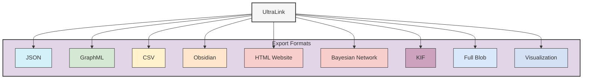

# UltraLink Rendering Formats

This directory contains documentation for the various rendering and export formats supported by UltraLink. These formats enable you to share, visualize, and integrate your knowledge graphs with different systems and tools.



## Available Formats

UltraLink supports the following export formats:

1. [**JSON Format**](./json_format.md) - Universal data exchange format
2. [**GraphML Format**](./graphml_format.md) - XML-based graph format for visualization tools
3. [**CSV Format**](./csv_format.md) - Tabular format for spreadsheet analysis
4. [**Obsidian Format**](./obsidian_format.md) - Markdown files with wiki-links for knowledge management
5. [**HTML Website Format**](./html_website_format.md) - Self-contained interactive website for sharing and exploration
6. [**Visualization Format**](./visualization_format.md) - Direct visual representations in SVG, PNG, D3.js, and Cytoscape.js
7. [**Bayesian Network Format**](./bayesian_network_format.md) - Probabilistic graphical models in BIF format
8. [**Knowledge Interchange Format (KIF)**](./kif_format.md) - Formal logical representation for AI systems
9. [**Full Blob Format**](./full_blob_format.md) - Complete serialization for backup and transfer

For a complete overview of all formats and guidance on when to use each, see the [Rendering Targets Overview](./rendering_targets.md).

## Format Comparison

| Format | Core Purpose | Ideal Use Cases | Data Aspects Preserved |
|--------|--------------|-----------------|------------------------|
| [JSON](./json_format.md) | Complete data serialization | API integration, programmatic access | Semantic, Vector, Temporal |
| [GraphML](./graphml_format.md) | Graph structure | Network analysis tools, visualization | Semantic, Structural |
| [CSV](./csv_format.md) | Tabular data | Spreadsheet analysis, data import/export | Semantic |
| [Obsidian](./obsidian_format.md) | Human-readable documents | Knowledge management, note-taking | Semantic, Linked |
| [HTML Website](./html_website_format.md) | Interactive exploration | Sharing, presentation, exploration | Semantic, Visual, Interactive |
| [Visualization](./visualization_format.md) | Visual representation | Presentations, diagrams, embedding in other media | Visual, Structural |
| [Bayesian Network](./bayesian_network_format.md) | Probabilistic relationships | Causal inference, probability analysis | Semantic, Probabilistic |
| [KIF](./kif_format.md) | Formal logic | Automated reasoning, AI systems | Semantic, Logical |
| [Full Blob](./full_blob_format.md) | Complete system state | Backup, system transfer | All dimensions |

## Output Organization

All rendering outputs are organized by system and format in the `output/` directory:

```
output/
├── systems/
│   ├── desert-ecosystem/
│   │   ├── DesertEcosystem.json
│   │   ├── DesertEcosystem.graphml
│   │   ├── csv/
│   │   │   ├── entities.csv
│   │   │   └── relationships.csv
│   │   ├── obsidian/
│   │   │   ├── saguaro.md
│   │   │   ├── kangaroo-rat.md
│   │   │   └── ...
│   │   ├── bayesian/
│   │   │   ├── DesertEcosystem-bayesian.json
│   │   │   └── DesertEcosystem.bif
│   │   ├── kif/
│   │   │   └── DesertEcosystem.kif
│   │   ├── visualization/
│   │   │   ├── graph.svg
│   │   │   ├── graph.png
│   │   │   ├── graph.d3
│   │   │   └── graph.cytoscape
│   │   ├── website/
│   │   │   ├── index.html
│   │   │   ├── saguaro.html
│   │   │   └── ...
│   │   └── full-blob/
│   │       ├── DesertEcosystem-full.json
│   │       └── DesertEcosystem-full-compressed.blob
```

## Implementation Details

Each format is implemented in the UltraLink codebase in the [src/lib/exporters/](../src/lib/exporters/) directory. These exporters transform the UltraLink data model into the target format while preserving the semantics of the knowledge graph.

For more details on the UltraLink rendering system and how it preserves semantics across formats, see the [Rendering Targets Overview](./rendering_targets.md). 