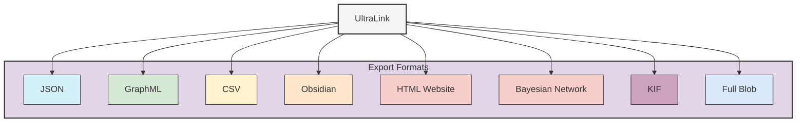

# UltraLink Rendering Formats

This directory contains documentation for the various rendering and export formats supported by UltraLink. These formats enable you to share, visualize, and integrate your knowledge graphs with different systems and tools.



## Available Formats

UltraLink supports the following export formats:

1. [**JSON Format**](json-format.md) - Universal data exchange format
2. [**GraphML Format**](graphml-format.md) - XML-based graph format for visualization tools
3. [**CSV Format**](csv-format.md) - Tabular format for spreadsheet analysis
4. [**Obsidian Format**](obsidian-format.md) - Markdown files with wiki-links for knowledge management
5. [**HTML Website Format**](html-website-format.md) - Self-contained interactive website for sharing and exploration
6. [**Bayesian Network Format**](bayesian-graph.md) - Probabilistic graphical models in BIF format
7. [**Knowledge Interchange Format (KIF)**](knowledge-interchange-format.md) - Formal logical representation for AI systems
8. [**Full Blob Format**](full-blob-format.md) - Complete serialization for backup and transfer

For a comprehensive comparison of these formats and guidance on which to use for different use cases, see the [Format Ecosystem Overview](formats-overview.md).

## Overview

UltraLink can export data to the following formats:

| Format | Description | Best For | Documentation |
|--------|-------------|----------|--------------|
| **JSON** | Universal data exchange format | Data integration, API communication | [JSON Format](json-format.md) |
| **GraphML** | XML-based graph format | Network visualization tools like Gephi | [GraphML Format](graphml-format.md) |
| **CSV** | Tabular data format | Spreadsheet analysis, data import/export | [CSV Format](csv-format.md) |
| **Obsidian** | Markdown files with wiki-links | Knowledge management, documentation | [Obsidian Format](obsidian-format.md) |
| **HTML Website** | Self-contained interactive website | Sharing and exploration | [HTML Website](html-website.md) |
| **Bayesian Network** | Probabilistic graphical models in BIF format | Probabilistic modeling and inference | [Bayesian Network](bayesian-graph.md) |
| **Knowledge Interchange Format (KIF)** | Formal logical representation for AI systems | AI system integration | [KIF Format](knowledge-interchange-format.md) |
| **Full Blob** | Complete serialization | Backup, transfer, persistence | [Full Blob Format](full-blob-format.md) |

## Output Organization

All rendering outputs are organized by system and format in the `output/` directory:

```
output/
├── systems/
│   ├── desert-ecosystem/
│   │   ├── DesertEcosystem.json
│   │   ├── DesertEcosystem.graphml
│   │   ├── csv/
│   │   │   ├── entities.csv
│   │   │   └── relationships.csv
│   │   ├── obsidian/
│   │   │   ├── saguaro.md
│   │   │   ├── kangaroo-rat.md
│   │   │   └── ...
│   │   ├── website/
│   │   │   ├── index.html
│   │   │   ├── saguaro.html
│   │   │   └── ...
│   │   └── full-blob/
│   │       ├── DesertEcosystem-full.json
│   │       └── DesertEcosystem-full-compressed.blob
│   │
│   └── research-team/
│       ├── ResearchTeam.json
│       ├── ResearchTeam.graphml
│       ├── csv/
│       │   ├── entities.csv
│       │   └── relationships.csv
│       ├── obsidian/
│       │   ├── alice.md
│       │   ├── bob.md
│       │   └── ...
│       ├── website/
│       │   ├── index.html
│       │   ├── alice.html
│       │   └── ...
│       └── full-blob/
│           ├── ResearchTeam-full.json
│           └── ResearchTeam-full-compressed.blob
```

## Format Comparison

```mermaid
graph TD
    classDef format fill:#f9f9f9,stroke:#333,stroke-width:1px
    classDef feature fill:#e1d5e7,stroke:#333,stroke-width:1px
    
    JSON[JSON]:::format
    GraphML[GraphML]:::format
    CSV[CSV]:::format
    Obsidian[Obsidian]:::format
    HTML[HTML Website]:::format
    BN[Bayesian Network]:::format
    KIF[KIF]:::format
    Blob[Full Blob]:::format
    
    Universal[Universal Compatibility]:::feature
    Visualization[Visualization]:::feature
    Human[Human Readability]:::feature
    Integration[System Integration]:::feature
    Complete[Data Completeness]:::feature
    Interactive[Interactivity]:::feature
    
    JSON --> Universal
    JSON --> Integration
    JSON --> Complete
    
    GraphML --> Visualization
    GraphML --> Integration
    
    CSV --> Universal
    CSV --> Human
    
    Obsidian --> Human
    Obsidian --> Interactive
    
    HTML --> Human
    HTML --> Interactive
    HTML --> Visualization
    
    BN --> Complete
    BN --> Integration
    
    KIF --> Complete
    KIF --> Integration
    
    Blob --> Complete
    Blob --> Integration
```

