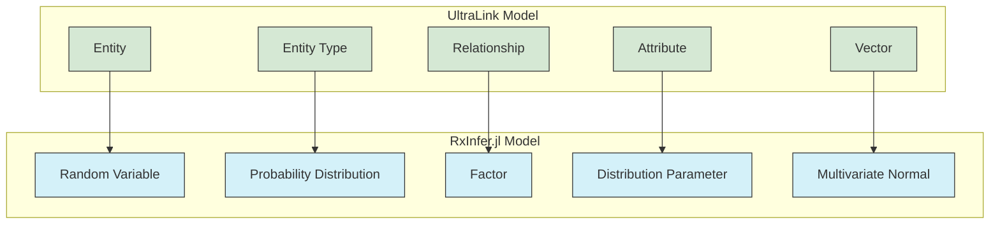

# RxInfer.jl Format for UltraLink

This document details the RxInfer.jl rendering target for UltraLink, its structure, usage, and connection to the UltraLink data model.

> **Related Documents**: 
> - [Overview of Rendering Targets](./RENDERING_TARGETS.md)
> - [Implementation in src/lib/exporters/rxinfer.js](../src/lib/exporters/rxinfer.js)

## Overview

The RxInfer.jl format transforms UltraLink knowledge graphs into probabilistic model definitions compatible with the [RxInfer.jl](https://github.com/biaslab/RxInfer.jl) package for Julia. This enables users to perform advanced probabilistic inference, leveraging their existing knowledge graphs for Bayesian inference and factor graph modeling.

### Key Features

- **Probabilistic Programming Integration**: Compatible with RxInfer.jl's message passing framework
- **Factor Graph Generation**: Transforms UltraLink knowledge graphs into factor graphs
- **Customizable Distribution Mapping**: Maps entity types to appropriate probability distributions
- **Vector Support**: Optional inclusion of vector embeddings as multivariate distributions
- **Test Script Generation**: Creates runnable test scripts for the generated models
- **Constraints Generation**: Produces mean-field factorization and distribution family constraints

## Data Model Mapping

The RxInfer.jl format maps the UltraLink data model as follows:



## Usage

The RxInfer.jl exporter is implemented in [src/lib/exporters/rxinfer.js](../src/lib/exporters/rxinfer.js) and can be used as follows:

```javascript
// Basic export to RxInfer.jl model
const rxinferModel = ultralink.toRxInfer();

// Export with specific options
const customRxinferModel = ultralink.toRxInfer({
  modelName: 'custom_model',
  includeComments: true,
  includeVectors: true,
  includeConstraints: true,
  includeTestScript: true,
  distributionMapping: {
    person: 'Categorical([0.3, 0.3, 0.4])',
    concept: 'Normal(0.0, 2.0)'
  }
});
```

### Export Options

| Option | Type | Default | Description |
|--------|------|---------|-------------|
| `modelName` | String | `'ultralink_model'` | Name of the generated model function |
| `includeComments` | Boolean | `true` | Include explanatory comments in the output |
| `includeVectors` | Boolean | `false` | Include entity vector embeddings as multivariate normal distributions |
| `includeConstraints` | Boolean | `false` | Generate mean-field factorization constraints |
| `includeTestScript` | Boolean | `false` | Generate a test script for the model |
| `distributionMapping` | Object | `{}` | Custom mapping of entity types to probability distributions |

## Example Output

Here's an example of a basic RxInfer.jl model generated from a UltraLink knowledge graph:

```julia
# ultralink_model.jl
# Generated by UltraLink on 2025-03-10T14:30:10.123Z
# This file contains a RxInfer.jl model generated from an UltraLink knowledge graph

using RxInfer, Distributions


@model function ultralink_model()
    # Define variables for entities
    # Entity: person1 (type: person)
    person1 ~ Categorical([0.3, 0.3, 0.4])
    person1_age ~ Poisson(30.0)
    person1_active ~ Bernoulli(0.8)
    
    # Entity: person2 (type: person)
    person2 ~ Categorical([0.3, 0.3, 0.4])
    person2_age ~ Poisson(25.0)
    person2_active ~ Bernoulli(0.6)
    
    # Entity: concept1 (type: concept)
    concept1 ~ Dirichlet([1.0, 1.0, 1.0])
    concept1_relevance ~ Beta(0.7, 0.3)
    concept1_vec ~ MvNormal(zeros(3), I)

    # Define relationships between variables
    # Relationship: person1 (knows) person2
    person2_knows ~ Bernoulli(sigmoid(person1))
    
    # Relationship: person1 (interested_in) concept1
    concept1_interested_in ~ Normal(0.1 * person1, 1.0)

    # Return variables of interest
    return (person1, person2, concept1)
end
```

### Example with Constraints

```julia
@constraints function ultralink_model_constraints()
    # Mean-field factorization
    q(person1, person2, concept1) = q(person1)q(person2)q(concept1)

    # Distribution family constraints
    q(person1) :: ExponentialFamily
    q(person2) :: ExponentialFamily
    q(concept1) :: ExponentialFamily
end
```

### Example with Test Script

```julia
# Test script for ultralink_model

function test_ultralink_model()
    # Create the model
    model = ultralink_model()

    # Run inference
    result = infer(
        model = model,
        data = (
            person1 = rand(Categorical([0.3, 0.3, 0.4])),
            person2 = rand(Categorical([0.3, 0.3, 0.4])),
        )
    )

    # Access posterior distributions
    posterior_person1 = result.posteriors[:person1]
    posterior_person2 = result.posteriors[:person2]
    posterior_concept1 = result.posteriors[:concept1]

    return result
end

# Run the test
```

## Distribution Mapping

The RxInfer.jl exporter maps UltraLink entity types to probability distributions using these default rules:

| Entity Type | Default Distribution | Rationale |
|-------------|---------------------|-----------|
| `person` | `Categorical([0.3, 0.3, 0.4])` | Categorical distribution for discrete entity types |
| `concept` | `Dirichlet([1.0, 1.0, 1.0])` | Dirichlet for concept variables with multiple components |
| `location` | `Normal(0.0, 1.0)` | Normal distribution for location entities |
| `event` | `Poisson(5.0)` | Poisson for event count modeling |
| `document` | `Categorical([0.25, 0.25, 0.25, 0.25])` | Categorical for document type classification |
| `*` (default) | `Normal(0.0, 1.0)` | Normal distribution as the default choice |

### Attribute Mapping

Attributes are also converted to appropriate distributions:

| Attribute Type | Distribution | Example |
|----------------|--------------|---------|
| Boolean | `Bernoulli(value ? 0.8 : 0.2)` | `entity_active ~ Bernoulli(0.8)` |
| Integer | `Poisson(value)` | `entity_count ~ Poisson(42)` |
| Float | `Normal(value, 1.0)` | `entity_score ~ Normal(4.5, 1.0)` |
| String (enum) | `Categorical([...])` | `entity_category ~ Categorical([0.2, 0.3, 0.5])` |
| Array | `Dirichlet([...])` | `entity_props ~ Dirichlet([1.0, 1.0, 1.0])` |

### Vector Mapping

When `includeVectors` is enabled, entity vectors are mapped to multivariate normal distributions:

```julia
# Entity: concept1 (with vector embedding)
concept1_vec ~ MvNormal(zeros(3), I)
```

## Relationship Factors

Relationships between entities are translated into factor relationships:

| Relationship Type | Factor | Example |
|------------------|--------|---------|
| Generic | `Bernoulli(sigmoid(source))` | `target_reltype ~ Bernoulli(sigmoid(source))` |
| Directed weighted | `Normal(weight * source, 1.0)` | `target_reltype ~ Normal(0.2 * source, 1.0)` |
| Bidirectional | `Normal(0.1 * source, 1.0)` | `target_reltype ~ Normal(0.1 * source, 1.0)` |

## Advanced Usage

### Custom Distribution Mapping

You can provide a custom mapping of entity types to distributions:

```javascript
const rxinferModel = ultralink.toRxInfer({
  distributionMapping: {
    person: 'Normal(0.0, 2.0)',
    concept: 'Beta(0.5, 0.5)',
    location: 'Gamma(2.0, 2.0)',
    custom_type: 'TruncatedNormal(0.0, 1.0, -1.0, 1.0)'
  }
});
```

### Model Constraints

To generate a model with constraints, use:

```javascript
const rxinferWithConstraints = ultralink.toRxInfer({
  includeConstraints: true
});
```

The constraints section will define a mean-field factorization and distribution family constraints for all variables.

### Test Script Generation

To generate a test script for the model:

```javascript
const rxinferWithTest = ultralink.toRxInfer({
  includeTestScript: true
});
```

The test script creates a function that instantiates the model, runs inference with random data, and returns the results.

## Related Tools and Libraries

You can work with the RxInfer.jl output using these tools:

1. **RxInfer.jl** - The primary Julia package for message passing and probabilistic programming
2. **Distributions.jl** - Julia package for probability distributions
3. **Julia REPL** - Interactive environment for testing the models
4. **ForwardDiff.jl** - For automatic differentiation when working with the models
5. **Plots.jl** - For visualizing inference results

## Limitations

- Requires the RxInfer.jl and Distributions.jl packages in Julia
- Complex relationships might require manual adjustment of the model
- Large knowledge graphs might generate models that are computationally expensive
- Custom distributions need to be compatible with RxInfer.jl's requirements

## Future Enhancements

- Support for more specialized probability distributions
- Integration with RxInfer.jl's constrained variational inference
- Hierarchical model structure for complex knowledge graphs
- Automatic parameter estimation from data
- Direct integration with Julia for interactive model refinement

## Best Practices

1. **Start Simple**: Begin with small knowledge graphs to ensure the model behaves as expected
2. **Use Custom Distributions**: For domain-specific knowledge, provide custom distribution mappings
3. **Enable Vectors**: If your entities have meaningful vector embeddings, include them in the model
4. **Tune Relationships**: Adjust relationship parameters (weights) based on domain knowledge
5. **Test Generated Models**: Use the generated test script to verify model behavior 