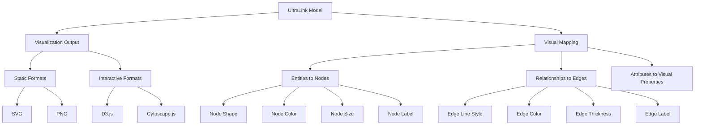
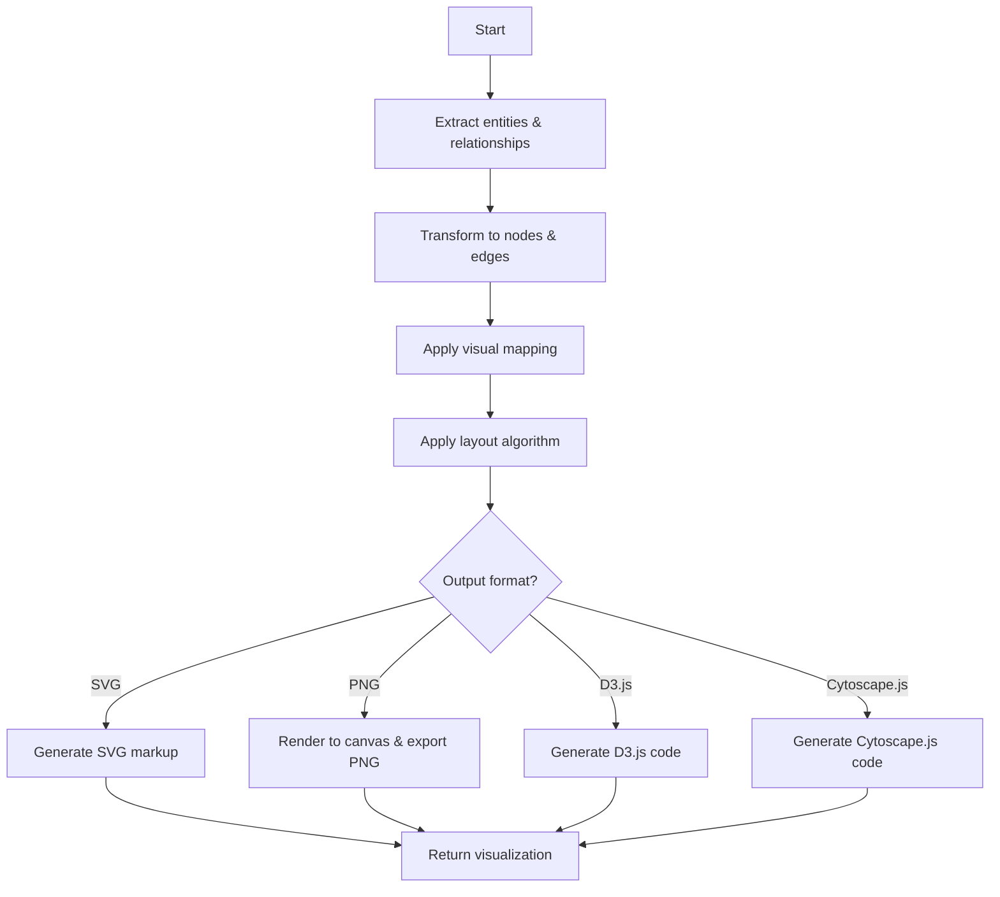

# Visualization Format for UltraLink

This document details the Visualization rendering target for UltraLink, its structure, usage, and connection to the UltraLink data model.

> **Related Documents**: 
> - [Overview of Rendering Targets](./RENDERING_TARGETS.md)
> - [Implementation in src/lib/exporters/visualization.js](../src/lib/exporters/visualization.js)
> - [HTML Website Format](./HTML_WEBSITE_FORMAT.md)
> - [GraphML Format](./GRAPHML_FORMAT.md)

## Overview

The Visualization format allows UltraLink knowledge graphs to be exported directly to visual representations in various formats, including SVG, PNG, D3.js, and Cytoscape.js. These visualizations provide an immediate visual understanding of the knowledge graph's structure and relationships.

### Key Features

- **Multiple Output Formats**: Support for SVG, PNG, D3.js, and Cytoscape.js
- **Direct Visualization**: No intermediate format conversion required
- **Layout Algorithms**: Multiple layout options for different visualization needs
- **Customizable Styling**: Visual styling based on entity and relationship types
- **Interactive Options**: Both static and interactive visualization outputs
- **Embeddable**: Results can be embedded in documents, websites, or applications
- **High-Quality Output**: Publication-ready visualizations

## Data Model Mapping

The UltraLink data model maps to visualization elements as follows:



### Entity to Node Mapping

UltraLink entities are represented as nodes with:

1. Shape based on entity type
2. Color derived from entity type or specific attribute
3. Size potentially reflecting centrality or importance
4. Label showing entity name
5. Tooltips containing entity attributes

### Relationship to Edge Mapping

UltraLink relationships are represented as edges with:

1. Line style based on relationship type
2. Color derived from relationship type
3. Thickness potentially reflecting relationship strength
4. Directionality shown with arrows
5. Optional labels showing relationship type

## Usage

The Visualization exporter is implemented in [src/lib/exporters/visualization.js](../src/lib/exporters/visualization.js) and can be used as follows:

```javascript
// Basic export to visualization
const visualization = ultralink.toVisualization({
  format: 'svg' // Options: 'svg', 'png', 'd3', 'cytoscape'
});

// Advanced export with specific options
const customVisualization = ultralink.toVisualization({
  format: 'svg',
  layout: 'force-directed',
  style: 'default',
  width: 1200,
  height: 800,
  nodeSize: 'degree',
  colorScheme: 'category10',
  includeLabels: true,
  highlightedNodes: ['saguaro', 'kangaroo-rat']
});
```

### Export Options

| Option | Type | Default | Description |
|--------|------|---------|-------------|
| `format` | String | `'svg'` | Output format: 'svg', 'png', 'd3', 'cytoscape' |
| `layout` | String | `'force-directed'` | Layout algorithm |
| `style` | String | `'default'` | Visual style preset |
| `width` | Number | `800` | Width of the visualization |
| `height` | Number | `600` | Height of the visualization |
| `nodeSize` | String/Function | `'uniform'` | Node sizing strategy ('uniform', 'degree', 'centrality' or custom function) |
| `edgeWidth` | String/Function | `'uniform'` | Edge width strategy ('uniform', 'weight' or custom function) |
| `colorScheme` | String | `'category10'` | Color scheme for nodes and edges |
| `includeLabels` | Boolean | `true` | Whether to include labels on nodes |
| `highlightedNodes` | Array | `[]` | IDs of nodes to highlight |
| `highlightedEdges` | Array | `[]` | IDs of edges to highlight |
| `includeTooltips` | Boolean | `true` | Whether to include tooltips with additional info |
| `fontFamily` | String | `'sans-serif'` | Font family for text elements |
| `customNodeStyleFn` | Function | `null` | Custom function for node styling |
| `customEdgeStyleFn` | Function | `null` | Custom function for edge styling |

## Output Formats

### SVG Format

The SVG output provides a scalable vector graphic that can be used in various contexts:

```xml
<?xml version="1.0" encoding="UTF-8"?>
<svg xmlns="http://www.w3.org/2000/svg" width="800" height="600">
    <style>
        .node { fill: #69b3a2; }
        .node.organism { fill: #b36969; }
        .node.environmental_factor { fill: #6980b3; }
        .link { stroke: #999; stroke-opacity: 0.6; }
        .link.adapts_to { stroke: #69b380; stroke-dasharray: none; }
        .link.shares_habitat { stroke: #b369b3; stroke-dasharray: 5,2; }
        text { font-family: sans-serif; font-size: 10px; }
    </style>
    <g class="links">
        <line class="link adapts_to" x1="300" y1="200" x2="500" y2="300" marker-end="url(#arrowhead)"/>
        <line class="link adapts_to" x1="200" y1="300" x2="500" y2="300" marker-end="url(#arrowhead)"/>
        <line class="link shares_habitat" x1="200" y1="300" x2="300" y2="200" marker-end="url(#arrowhead)"/>
    </g>
    <defs>
        <marker id="arrowhead" viewBox="0 -5 10 10" refX="20" refY="0" markerWidth="6" markerHeight="6" orient="auto">
            <path d="M0,-5L10,0L0,5" fill="#999"/>
        </marker>
    </defs>
    <g class="nodes">
        <circle class="node organism" cx="300" cy="200" r="15">
            <title>Saguaro Cactus (Carnegiea gigantea)</title>
        </circle>
        <text x="300" y="180">Saguaro</text>
        
        <circle class="node organism" cx="200" cy="300" r="15">
            <title>Kangaroo Rat (Dipodomys)</title>
        </circle>
        <text x="200" y="280">Kangaroo Rat</text>
        
        <circle class="node environmental_factor" cx="500" cy="300" r="15">
            <title>Aridity</title>
        </circle>
        <text x="500" y="280">Aridity</text>
    </g>
</svg>
```

### PNG Format

The PNG output provides a bitmap image that can be easily embedded in documents:

```javascript
// PNG output is returned as a base64-encoded string
const pngVisualization = ultralink.toVisualization({
  format: 'png',
  width: 1200,
  height: 800
});

// Which can be saved to a file or embedded in HTML
const imgTag = ``;
```

### D3.js Format

The D3.js output provides a JavaScript file that creates an interactive visualization:

```javascript
// D3.js visualization code
const width = 800;
const height = 600;

const svg = d3.select('#graph')
    .append('svg')
    .attr('width', width)
    .attr('height', height);

// Data definition
const data = {
    nodes: [
        { id: "saguaro", name: "Saguaro Cactus", type: "organism" },
        { id: "kangaroo-rat", name: "Kangaroo Rat", type: "organism" },
        { id: "aridity", name: "Aridity", type: "environmental_factor" }
    ],
    links: [
        { source: "saguaro", target: "aridity", type: "adapts_to" },
        { source: "kangaroo-rat", target: "aridity", type: "adapts_to" },
        { source: "kangaroo-rat", target: "saguaro", type: "shares_habitat" }
    ]
};

// Force simulation setup
const simulation = d3.forceSimulation(data.nodes)
    .force('link', d3.forceLink(data.links).id(d => d.id))
    .force('charge', d3.forceManyBody().strength(-200))
    .force('center', d3.forceCenter(width / 2, height / 2));

// Link rendering
const link = svg.append('g')
    .selectAll('line')
    .data(data.links)
    .enter()
    .append('line')
    .attr('class', d => `link ${d.type}`)
    .attr('stroke-width', 1.5);

// Node rendering
const node = svg.append('g')
    .selectAll('circle')
    .data(data.nodes)
    .enter()
    .append('circle')
    .attr('class', d => `node ${d.type}`)
    .attr('r', 10)
    .call(d3.drag()
        .on('start', dragstarted)
        .on('drag', dragged)
        .on('end', dragended));

// Text labels
const text = svg.append('g')
    .selectAll('text')
    .data(data.nodes)
    .enter()
    .append('text')
    .text(d => d.name)
    .attr('dx', 12)
    .attr('dy', 4);

// Tooltip functionality
node.append('title')
    .text(d => `${d.name} (${d.type})`);

// Force simulation tick function to update positions
simulation.on('tick', () => {
    link
        .attr('x1', d => d.source.x)
        .attr('y1', d => d.source.y)
        .attr('x2', d => d.target.x)
        .attr('y2', d => d.target.y);
    
    node
        .attr('cx', d => d.x)
        .attr('cy', d => d.y);
    
    text
        .attr('x', d => d.x)
        .attr('y', d => d.y);
});

// Drag functions
function dragstarted(event, d) {
    if (!event.active) simulation.alphaTarget(0.3).restart();
    d.fx = d.x;
    d.fy = d.y;
}

function dragged(event, d) {
    d.fx = event.x;
    d.fy = event.y;
}

function dragended(event, d) {
    if (!event.active) simulation.alphaTarget(0);
    d.fx = null;
    d.fy = null;
}
```

### Cytoscape.js Format

The Cytoscape.js output provides a JavaScript file for advanced interactive visualization:

```javascript
// Cytoscape.js visualization code
const cy = cytoscape({
    container: document.getElementById('graph'),
    elements: {
        nodes: [
            { data: { id: 'saguaro', name: 'Saguaro Cactus', type: 'organism' } },
            { data: { id: 'kangaroo-rat', name: 'Kangaroo Rat', type: 'organism' } },
            { data: { id: 'aridity', name: 'Aridity', type: 'environmental_factor' } }
        ],
        edges: [
            { data: { source: 'saguaro', target: 'aridity', type: 'adapts_to' } },
            { data: { source: 'kangaroo-rat', target: 'aridity', type: 'adapts_to' } },
            { data: { source: 'kangaroo-rat', target: 'saguaro', type: 'shares_habitat' } }
        ]
    },
    style: [
        {
            selector: 'node',
            style: {
                'background-color': '#69b3a2',
                'label': 'data(name)',
                'text-valign': 'center',
                'text-halign': 'center',
                'width': 30,
                'height': 30
            }
        },
        {
            selector: 'node[type="organism"]',
            style: {
                'background-color': '#b36969'
            }
        },
        {
            selector: 'node[type="environmental_factor"]',
            style: {
                'background-color': '#6980b3'
            }
        },
        {
            selector: 'edge',
            style: {
                'width': 2,
                'line-color': '#999',
                'target-arrow-color': '#999',
                'target-arrow-shape': 'triangle',
                'curve-style': 'bezier'
            }
        },
        {
            selector: 'edge[type="adapts_to"]',
            style: {
                'line-color': '#69b380',
                'target-arrow-color': '#69b380'
            }
        },
        {
            selector: 'edge[type="shares_habitat"]',
            style: {
                'line-color': '#b369b3',
                'target-arrow-color': '#b369b3',
                'line-style': 'dashed'
            }
        }
    ],
    layout: {
        name: 'cose',
        padding: 50
    }
});

// Add event listeners for interactivity
cy.on('tap', 'node', function(evt) {
    const node = evt.target;
    console.log(`Clicked on ${node.data('name')} (${node.data('type')})`);
});

// Add UI controls
document.getElementById('zoom-in').addEventListener('click', function() {
    cy.zoom({
        level: cy.zoom() * 1.2,
        renderedPosition: { x: cy.width() / 2, y: cy.height() / 2 }
    });
});

document.getElementById('zoom-out').addEventListener('click', function() {
    cy.zoom({
        level: cy.zoom() / 1.2,
        renderedPosition: { x: cy.width() / 2, y: cy.height() / 2 }
    });
});

document.getElementById('fit').addEventListener('click', function() {
    cy.fit();
});
```

## Layout Algorithms

The Visualization exporter supports several layout algorithms:

### Force-Directed Layout

Force-directed layouts use physics simulations to position nodes:

```javascript
// Force-directed layout implementation (D3.js example)
const simulation = d3.forceSimulation(data.nodes)
    .force('link', d3.forceLink(data.links).id(d => d.id))
    .force('charge', d3.forceManyBody().strength(-200))
    .force('center', d3.forceCenter(width / 2, height / 2));
```

### Hierarchical Layout

Hierarchical layouts arrange nodes in levels based on relationship direction:

```javascript
// Hierarchical layout (simplified example)
function hierarchicalLayout(nodes, links, width, height) {
    // Group nodes by level
    const levels = {};
    const visited = new Set();
    
    function computeLevel(nodeId, level) {
        if (visited.has(nodeId)) return;
        visited.add(nodeId);
        
        levels[level] = levels[level] || [];
        levels[level].push(nodeId);
        
        // Get outgoing links
        const outgoing = links.filter(link => link.source === nodeId);
        for (const link of outgoing) {
            computeLevel(link.target, level + 1);
        }
    }
    
    // Compute levels starting from root nodes
    const rootNodes = nodes.filter(node => 
        !links.some(link => link.target === node.id)
    );
    
    for (const rootNode of rootNodes) {
        computeLevel(rootNode.id, 0);
    }
    
    // Position nodes by level
    const levelCount = Object.keys(levels).length;
    const levelHeight = height / levelCount;
    
    for (const [levelStr, nodeIds] of Object.entries(levels)) {
        const level = parseInt(levelStr);
        const y = level * levelHeight + levelHeight / 2;
        const nodeCount = nodeIds.length;
        const nodeWidth = width / nodeCount;
        
        nodeIds.forEach((nodeId, index) => {
            const node = nodes.find(n => n.id === nodeId);
            node.x = index * nodeWidth + nodeWidth / 2;
            node.y = y;
        });
    }
}
```

### Radial Layout

Radial layouts arrange nodes in concentric circles:

```javascript
// Radial layout (simplified example)
function radialLayout(nodes, links, width, height) {
    const center = { x: width / 2, y: height / 2 };
    const radius = Math.min(width, height) / 3;
    
    // Find the most central node based on degree
    const nodeDegrees = {};
    for (const link of links) {
        nodeDegrees[link.source] = (nodeDegrees[link.source] || 0) + 1;
        nodeDegrees[link.target] = (nodeDegrees[link.target] || 0) + 1;
    }
    
    const centralNodeId = Object.entries(nodeDegrees)
        .sort((a, b) => b[1] - a[1])[0][0];
    
    // Central node in the middle
    const centralNode = nodes.find(n => n.id === centralNodeId);
    centralNode.x = center.x;
    centralNode.y = center.y;
    
    // Arrange other nodes in a circle
    const otherNodes = nodes.filter(n => n.id !== centralNodeId);
    const angleStep = (2 * Math.PI) / otherNodes.length;
    
    otherNodes.forEach((node, index) => {
        const angle = index * angleStep;
        node.x = center.x + radius * Math.cos(angle);
        node.y = center.y + radius * Math.sin(angle);
    });
}
```

## Styling Options

The Visualization exporter provides several styling options:

### Node Styling

Nodes can be styled based on entity properties:

```javascript
// Node styling based on entity type (D3.js example)
const nodeColorScale = d3.scaleOrdinal()
    .domain(['organism', 'environmental_factor', 'concept'])
    .range(['#b36969', '#6980b3', '#69b3a2']);

const nodeSizeScale = d3.scaleLinear()
    .domain([0, d3.max(data.nodes, d => nodeDegrees[d.id] || 0)])
    .range([5, 20]);

const node = svg.append('g')
    .selectAll('circle')
    .data(data.nodes)
    .enter()
    .append('circle')
    .attr('r', d => nodeSizeScale(nodeDegrees[d.id] || 0))
    .style('fill', d => nodeColorScale(d.type));
```

### Edge Styling

Edges can be styled based on relationship properties:

```javascript
// Edge styling based on relationship type (D3.js example)
const edgeColorScale = d3.scaleOrdinal()
    .domain(['adapts_to', 'shares_habitat', 'part_of'])
    .range(['#69b380', '#b369b3', '#b3a269']);

const edgeWidthScale = d3.scaleLinear()
    .domain([0, 1])
    .range([1, 5]);

const link = svg.append('g')
    .selectAll('line')
    .data(data.links)
    .enter()
    .append('line')
    .style('stroke', d => edgeColorScale(d.type))
    .style('stroke-width', d => edgeWidthScale(d.attributes?.strength || 0.5))
    .style('stroke-dasharray', d => d.type === 'shares_habitat' ? '5,2' : null);
```

### Custom Styling Functions

Custom styling can be applied using user-defined functions:

```javascript
// Custom styling function example
const customVisualization = ultralink.toVisualization({
  format: 'svg',
  customNodeStyleFn: (node) => {
    if (node.attributes.importance === 'high') {
      return {
        color: '#ff0000',
        size: 25,
        borderWidth: 3,
        borderColor: '#000000'
      };
    }
    return null; // Use default styling
  },
  customEdgeStyleFn: (edge) => {
    if (edge.attributes.efficiency > 0.9) {
      return {
        color: '#00ff00',
        width: 4,
        style: 'solid'
      };
    }
    return null; // Use default styling
  }
});
```

## Semantic Preservation

The Visualization format preserves UltraLink semantics in the following way:

| UltraLink Semantic | Visualization Representation |
|--------------------|------------------------------|
| Entity identity | Unique node ID |
| Entity type | Node shape, color, and/or styling |
| Entity name | Node label |
| Entity attributes | Node size, tooltips, additional styling |
| Relationship | Edge between nodes |
| Relationship type | Edge color, line style, and/or label |
| Relationship direction | Arrow direction |
| Relationship attributes | Edge thickness, tooltips, additional styling |

## Technical Implementation

The Visualization export functionality is implemented in [src/lib/exporters/visualization.js](../src/lib/exporters/visualization.js). The exporter follows these steps:

1. Extract entities and relationships from the UltraLink data model
2. Transform entities into nodes with visual properties
3. Transform relationships into edges with visual properties
4. Apply the selected layout algorithm
5. Generate the visualization in the requested format
6. For SVG/PNG: direct rendering
7. For D3.js/Cytoscape.js: code generation



## Integration with Applications

The visualizations can be integrated into various applications:

### Web Pages

```html
<!-- SVG integration in HTML -->
<div class="visualization-container">
    <!-- SVG content is inserted here -->
    <svg xmlns="http://www.w3.org/2000/svg" width="800" height="600">
        <!-- ... -->
    </svg>
</div>

<!-- PNG integration in HTML -->
<div class="visualization-container">
    
</div>

<!-- D3.js integration in HTML -->
<div id="graph"></div>
<script src="https://d3js.org/d3.v7.min.js"></script>
<script src="graph.js"></script>

<!-- Cytoscape.js integration in HTML -->
<div id="graph"></div>
<script src="https://cdnjs.cloudflare.com/ajax/libs/cytoscape/3.23.0/cytoscape.min.js"></script>
<script src="graph.js"></script>
```

### Documents

Visualizations can be included in documents like Markdown, LaTeX, or Microsoft Word:

```markdown
# Knowledge Graph Visualization


```

### Applications

Visualizations can be integrated into desktop or mobile applications:

```javascript
// Example: Electron application
const { app, BrowserWindow } = require('electron');
const fs = require('fs');

function createWindow() {
    const win = new BrowserWindow({
        width: 1200,
        height: 800,
        webPreferences: {
            nodeIntegration: true
        }
    });
    
    // Load a local HTML file that includes the visualization
    win.loadFile('index.html');
}

app.whenReady().then(createWindow);
```

## Use Cases

The Visualization format is particularly useful for:

1. **Presentations**: Creating visual aids for presentations or lectures
2. **Publications**: Including knowledge graph visualizations in academic papers
3. **Documentation**: Enhancing documentation with visual representations
4. **Data Exploration**: Interactive exploration of complex knowledge graphs
5. **Communication**: Sharing complex relationships with non-technical audiences
6. **Analysis**: Visual analysis of network structure and patterns

## Related Formats

The Visualization format is related to these other UltraLink export formats:

- **[GraphML](./GRAPHML_FORMAT.md)**: Similar graph representation but in XML format
- **[HTML Website](./HTML_WEBSITE_FORMAT.md)**: Includes these visualizations within a web interface
- **[JSON](./JSON_FORMAT.md)**: Raw data that can be used with visualization libraries

## Limitations

The Visualization format has certain limitations:

- Large knowledge graphs may become visually cluttered
- Static formats (SVG, PNG) lack interactivity
- Interactive formats require JavaScript libraries
- Limited support for temporal or probabilistic dimensions
- May require manual adjustment for optimal layout
- Not all attribute nuances can be visually represented

## Future Enhancements

Planned improvements to the Visualization exporter include:

- Additional layout algorithms (cluster, grid, tree)
- 3D visualization options
- Animation support for temporal dynamics
- Advanced filtering and focus+context techniques
- Support for very large graphs through abstraction
- Integration with AR/VR platforms
- Improved accessibility features 